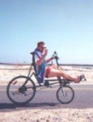

 

# The Frame for the Future  
  
|   
  
  * Wheel base 40"
  * Seat height 25"
  * Crank height 21"
  * Front wheel 16"
  * Rear Wheel 26"
  * Weight 30 lb.
  
This machine has over two thousand Boston city miles on it (and a few on the coast : ) Designed by Doug and constructed by Bill Darby. Not yet available in stores.  
  
## Long term goals

  * Target people at health clubs who already expressed a preference for the Comfort Cruiser riding position.
  * License patent to a large scale bicycle manufacturer, becoming the first entry into the national retail bicycle market (12 million units per year).
  * Continue research in making bicycles a viable choice in personal transpiration. 

