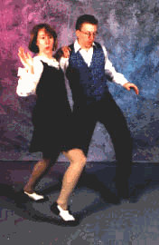
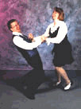
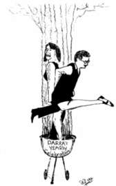
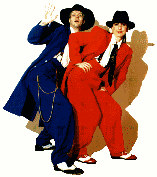

 

# Lindy Hop

A joyous partner dance developed in New York City in the 1930's  
  
|  |  | 
| -- | -- |
|  | [Tony &amp; Aurelie Tye](http://www.HopToTheBeat.com/) |  

  
Darra, my extra-special dance partner, strutting, as she does so well!
  
Tony and Aurelie Tye, my dance teachers/cool friends.  

## Swing dancing theory

I have been doing swing dancing, or more specifically, the Lindy Hop, since the
mid-1990s.  I like to say there are three kinds of dancing.  The Lindy Hop is
playful sexuality.  West Coast Swing is propositional sexuality.  Salsa they
just do it on the floor.  Here is a video I made, titled "Swing Dancing Theory"
(24 minutes).

<iframe width="420" height="315"
src="https://www.youtube.com/embed/fQRLYfI1CDM" frameborder="0"
allowfullscreen></iframe>
  
  
  
