Bet Against Luboš

I spent years being an active reader and sometime participant in the moderated
newsgroup sci.physics.research. In the early days of the text-heavy  Internet,
there were newsgroups on all kinds of subjects that would allow people to
exchange emails about the topic at hand. When information had to go through a
dial-up modem, text was the road to take.

The unmoderated newsgroup sci.physics was a soapbox for crank physicists. One
guy loved to write "TIME IS MASS". While amusing, it was not worthy of much
time or mass.

The most important feature of SPR as it was sometimes called was that Prof.Luboš
John Baez and a few of his friends posted there regularly. Baez loved to teach,
often at great length. There was a farmer from England who called himself "Oz"
that Baez spent a big effort trying to teach some quite obscure mathematical
physics concepts. The battles between Oz and the Wizard were fun and
informative to read. I would toss in my own two cents once in a while. Much of 
what Baez wrote would not stick in my brain since it was dense with math
jargon. On the occasion when these obscure discussion did reach me, it made
the time investment worthwhile. Mathematical physics is a difficult art, so it
was nice when I felt I understood a subtle issue.

Every community has its characters. A few times a year, [Luboš%C5% Motl](https://en.wikipedia.org/wiki/Lubo%C5%A1_Motl)
A few times a year, Luboš Motl would jump into a thread. If you know Luboš, you
know Luboš. The comments would get sharper, more biting when Luboš joined the
discussion. Luboš was strongly of the opinion that work on strings was the
correct direction to go. If you disagreed, then you were a complete and total
moron. I wondered if he was real or a bit of fiction.

Luboš Motl is real. It became clear to me after one exchange that I could not
have a rational argument with the man. He was right, I was wrong. He does have
a number of technical accomplishments. I have seen him lucidly describe issues
in high energy physics. In a programming contest sponsored by CERN to write a
program to pluck out a signal from a large dataset, I know he was in the
running but did not track his final place. He is active on the Internet. At
physics.stackexchange.com, he has over 130k reputation points. I have 34,
total.

A question I posed myself was how to deal with him. Rational discussions were
rules out. A bet would not work since we are not of equal stature in the
physics community. I wanted something one-sided and long term. My idea back in
2004 was to write Luboš a check that I would mail him if any time in ten years
there was a consensus in the physics community that more than four dimensions 
were needed to describe gravity and the standard model. Here are the check which
I am OK to put on the Internet since the account was closed somewhere in the middle
 of the decade:

This is my documentation that I believe Lubos is wrong about the direction
physics should go. In 2014, I did not send him the check.

When grounded in current high energy physics, I will listen to his views. I am
a skeptic, which means to me I will invest a small amount of effort to
understand another person's vision. With Lubos, I am a cynic, one who dismisses
the argument without any efforts because of my perception of a bad track
record. I know people are cynical about my work (see the Becket quote at the
end of this blog). I ignore is promotion of work on strings. Note, I now always
use the phrase "work on strings" because such research never formed a
scientific theory, a coherent intellectual structure that can be used to make
many predictions confirmed by experiment.

In the Spring of 2015, I came up with a new approach to gravity. That story was
detailed in the previous blog. The starting point is to carefully consider the
square of a quaternion. Surely someone else has already thought about this. A 
Google search brought me to this question on physics.stackexchange.com which I
will quote in full :

    I recently realised that quaternions could be used to write intervals or norms of vectors in special relativity:

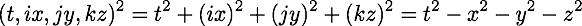

    Is it useful? Is it used? Does it bring anything? Or is it just funny?

    Isaac, March 20, 2011, 939 reputation points

People ask questions on physics stackexchange because they don't know the 
answer. Often the question itself is not well-formed. I know I have made that
mistake myself. In those cases, comments are posed right under the question
which then gets edited until the question is well-formed and people provide
suggested answers.

The one line of math is not well-formed for three different reasons. Let me go
from mini, to minor, silent, to train wreck. The mini issue is that quaternions as a four
vector have four basis elements, not just three. To make the basis for the time
term explicit instead of implicit, I have often used the letter "e" to complete
the collection with i, j, and k. The minor issue is that one should not mix the
tuple notation - the parentheses - with the vector notation. It took quite a bit
of polite pestering from David Halliday for me to finally see that issue. The
left-hand side should be written as:

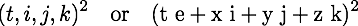

Pick one and stick with it. I favor the first form since it uses fewer marks on
a page.

Note that either way it is written, there is no subscript or a superscript. I 
call this the silent error. In mathematics, a vector can be added to another
vector or multiplied by another scalar. In physics, a 4-vector means something
more specific. Not only does it have those qualities, but it also lives in
either a tangent or a cotangent space of a manifold. That is signified by the
subscript or superscript. An interval results by contracting with a metric
tensor. In flat space-time, there is one tangent or cotangent space for all.
In curved space-time, every point has its own tangent space. One has to specify
the path to do any calculation of an interval since different paths will have
different sets of tangent spaces. This is different from a quaternion-based
calculation where there is only one rule for calculating squares. Apple, meet
orange. Quaternions work in the manifold, the special relativity interval is
in the tangent space of the manifold.

A quaternion multiplied by a quaternion generates a quaternion. The train-wreck
error was that the result of the calculation was plain old-fashioned wrong.
Here is a pedantic way to write the square of a quaternion:

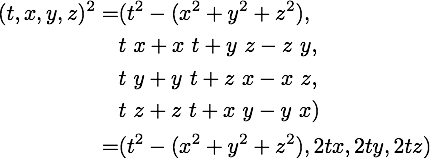

The fact that the original poster ignored the three imaginary terms is
interesting. It shows the bias of talking about what is familiar, ignoring the
strange. The Lorentz invariant interval of special relativity is familiar. The
terms I call space-times-time - (2tx, 2ty, 2tz) - are not.

The top voted reply by Peter Morgan was a suggestion to go study Clifford
algebras, reading what John Baez has written about often on SPR and kept on his
web site. Further study is always a good thing, but why not stay focused on the
question at hand?

Morgan writes out all the correct terms for the square of a quaternion in his
answer:

    Isaac, this is how I think your derivation ought to go, if we just use

    The xy,yz,zx terms cancel nicely, but the  tx, ty, tz terms don't,
    unless we do as Luboš did and introduce the conjugate
    q<super>*</super>=t−ix−jy−kz. This, however, doesn't do what I take you to be
    trying to do. So, instead, ...

STOP. There is no need for an instead. Why does Morgan *presume* that the three
space-times-time terms must be equal to zero? As John Baez has pointed out, a
metric tensor is a machine that can take in two 4-vectors and spit out one
number in return. A metric tensor has formally nothing to say about the three
space-times-time terms. Silence does not mean zero. If one starts with four
pieces of information with an event, then one should end up with four pieces of
information so that information is not lost. The standard approach to
calculating intervals does lose information.  If you have two observers and
those two observers are moving at a constant velocity to each other along the x
axis only, we know the following:

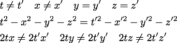

Seeing the two intervals are equal will say that the two observers are moving
at a constant velocity to each other. It also says nothing about what that
motion is. An analysis of the three space-times-time terms will reveal the
exact motion. That is great information to know. Space-times-time data is
useful.

The invariant interval of special relativity can be represent using analytic
geometry. The familiar light cone has hyperbolas that are curves with equal
intervals.

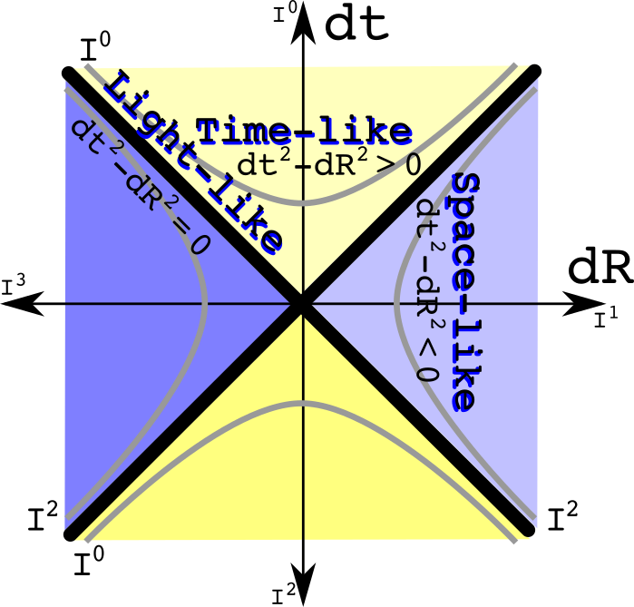

I could write three such graphs for each of the imaginary spatial directions,
but have combined them for simplicity. The time like intervals are always
positive real numbers. The space-like intervals are always negative real
numbers. An interval of zero is a path only the massless photon and gluon can
travel.

Now ask the question in reverse: what if two observers agree to the
space-times-time value, but disagree about the interval? What area of physics
is involved? The only subject I know where the metric changes is gravity. If
one insists on preserving the space-times-time value and being consistent with
weak gravitational field tests, open up Misner, Thorne, and Wheeler to equation
40.2:

Observers at different heights in a gravitational field will make different
measurements of dt, dx, dy, and dz. The intervals will be different. Yet their
space-times-time calculations will be the same.

Use analytic geometry to draw constant space-times-time curves:

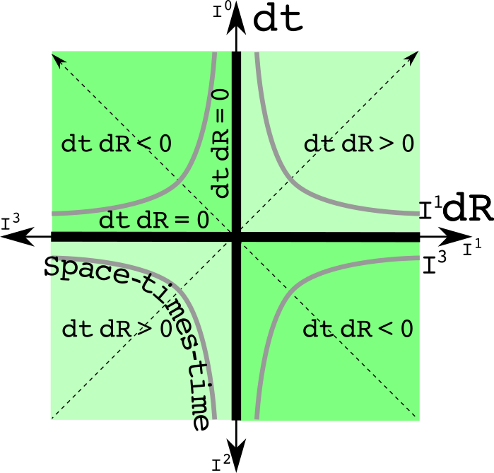

This graph is the light cone graph rotated by 45 degrees. The constant
space-times-time hyperbolas are positive or negative imaginary numbers.

We finally get to Luboš's reply.  I will quote it in full:

    It's just funny. Note that your equation doesn't actually use any single
    general quaternion. You only use the i,j,ki,j,k imaginary units in an *ad hoc*
    way to get three minus signs whenever you need them.

    If you were using an actual quaternion

    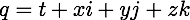

    then the only semi-natural real bilinear invariant you may construct out of it
    is

    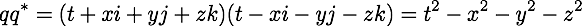

    so the 4 real components in a quaternion still have the Euclidean, rather than
    Minkowskian, signature. But even for a 4-dimensional Euclidean space, the
    quaternions are actually just a game because we haven't really used the main
    nontrivial structure of the quaternions, their multiplication, in any
    nontrivial way. Quaternions are not genuine quaternions if you never use the
    relations *ij=−ji=k* and its cyclic permutations - and we haven't used
    them above. We only used the fact that *i, j* etc. anticommute with each other,
    but we didn't really care what their product is.

    Because we haven't really used those relations, we haven't used full
    quaternions - except as a meaningless bookkeeping device. In the same way, one
    may organize 8 real numbers under the umbrella of a single "octonion" except
    that if the complicated and cool octonion multiplication table - with the G2
    automorphism group - is never employed, it's clear that the "octonion"
    interpretation was just a game to give a name to a collection of 8 numbers. But
    not every collection of 4 or 8 numbers deserves to be called "quaternion" and
    "octonion", even though, of course, one may get the individual components out
    of the "quaternion" and "octonion", too.

    In the very same way, a general pair of two real numbers is simply not a
    complex number. By its very essence, a complex number must act as one number -
    so there must be a notion of holomorphy required somewhere or everywhere in the
    formalism - rather than two numbers. The references linked in the other answers
    don't understand the purpose and relevance of all those mathematical
    structures, so they lead to incorrect answers to the fundamental question
    whether the trick is real or just a fun. The right answer is that it is just a
    fun, and your fun even used a wrong signature that differs from a somewhat more
    natural fun.

This is a defensible position. As such, I have no doubt if asked today Luboš
will still consider it a flawless answer. My comments that follow are not
directed toward Luboš who has demonstrated the intellectual flexibility of a
stapler. Rather it is for the entertainment of people who like taking down
folks with more than 130,000 reputation points.

Luboš completely ignores the original poster's question which is typical of his
style. There is nothing *ad hoc* about the rule for multiply quaternions on a
four dimensional real manifold to assure that an inverse exists unless the 
quaternion is zero. The original post was asking about something that is
central to special relativity, the real-valued interval.

Here is the misdirection play:

    ...then the only semi-natural real bilinear invariant you may construct out of
    it is...

I have no notion of what "semi-natural" might mean. What does it take to be
fully natural? All that is going on is that Luboš is making a similar
assumption that if one does an operation to get the Lorentz invariant interval,
the other terms necessarily should be zero. That cannot be done with
quaternions, and that is a good thing.

The real flaw in the statement is the inclusion of the word "invariant".
Invariant by itself is meaningless. One is required to list the transformations
that keep the value invariant. The rotation group SO(3) would point the
imaginary spatial vector in a new direction leaving the norm unchanged. The
group U(1) would also leave the quaternion norm unaltered. The group U(1) is
the gauge group symmetry of electromagnetism. Quaternions are a normed division
algebra. Since the norm of U(1) is one, that would mean anytime one took the
norm of a quaternion expression - no matter how complicated - that norm would
be invariant if multiplied by a member of U(1). The same goes for the unitary
quaternion SU(2) which is the gauge group for the weak force.

This is the power of using quaternions as a unified algebra. Anytime one takes
the norm of any quaternion expression, we know that norm will not change under
an electro-weak transformation without doing a thing. I consider that fully
natural.

Luboš makes the same train wreck error that the original poster did. A
quaternion times the conjugate of a quaternion creates a quaternion. The right
answer for the calculation of the norm is:

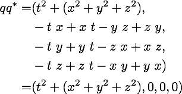

The full quaternion algebra is required for all these calculations. There is
often interesting physics at nearby point. Think about (q+dq)q\*. The
neighborhood of norm will use the three imaginaries. Do I know of even one
problem in physics that can be addressed by exploring the neighborhood of a
norm? The direct answer is no. Since I have both U(1) and SU(2) symmetry, it
does strike me as something that is worth further study.

Anytime one has a simple algebraic expression, it means there is a graph one
should generate. The symmetry of U(1) is known as a unit circle in a complex
plane:

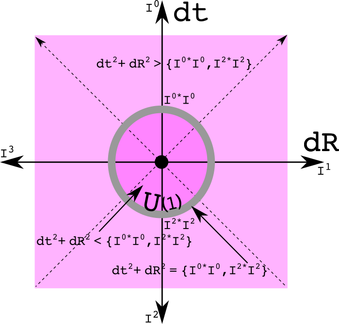

All three spatial dimensions are bundled together as one imaginary factor. If
the three imaginaries are kept separate, a graph of SU(2) results which I am
suggesting as a sphere:

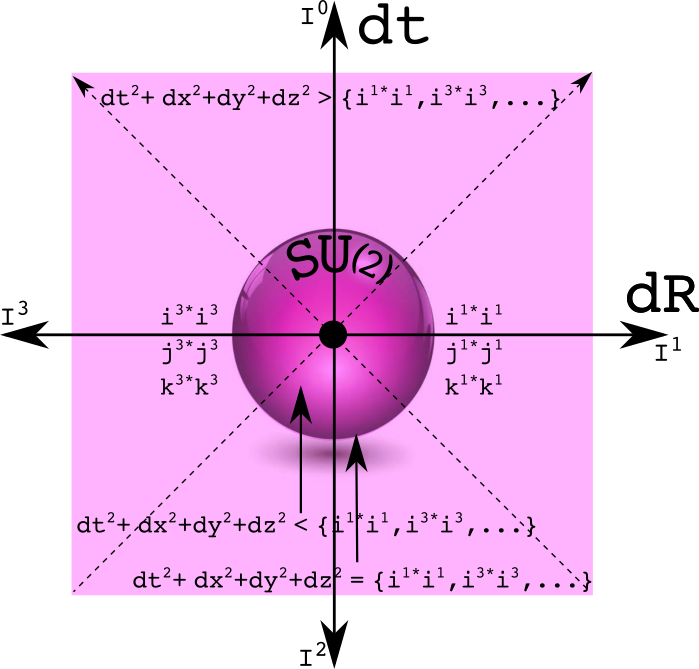

To be honest, I don't deeply understand these graphs at this point. That can be
a sign one is doing research: things are precisely defined but all the
implications are not clear. One can be inside the circle or sphere, on the
circle or sphere, or outside. It will take many particles to create such a
structure since half the points have a space-like separation. How exactly is
this related to charge conservation?

Luboš wrote "so the 4 real components in a quaternion still have the
Euclidean, rather than Minkowskian, signature. I call this sophisticated
garbage. The Minkowski metric tensor takes two 4-vectors and returns one real
number. The elements along the diagonal of the 4x4 matrix are +--- or -+++ for
a signature of +2 or -2 respectively. If instead one works with a Euclidean
metric tensor, then all the elements on the diagonal are ++++ for a signature
of +4.

Quaternions don't use a metric tensor. Ever. Quaternions are neither covariant
nor contravariant 4-vectors living in a tangent space. If one represents a
quaternion as a matrix, only the first term of that lives along the diagonal
of the 4x4 matrix. The signature of the matrix is either +4 or -4, depending
only on the sign of the first term. There is nothing wrong with working with
both the square of a quaternion *and* the norm of a quaternion. This is
different from the situation using metric tensors where such a choice needs
to be addressed.

It was great to read this:

    In the very same way, a general pair of two real numbers is simply not a
    complex number. By its very essence, a complex number must act as one number -
    so there must be a notion of holomorphy required somewhere or everywhere in the
    formalism - rather than two numbers.

Initially, I did think of a quaternion only as a collection of rules one
applies to four real numbers. With complex numbers, one does not have to deal
exclusively with the manifold R2 as they are always introduced.
Instead one can work with the complex manifold. One then works with z and its
conjugate z\*. With a quaternion manifold, two more conjugates are
required. The first conjugate will keep one of the spatial elements positive
while flipping the other three terms. The second conjugate will keep a
different spatial element positive while filling the other three. To keep the
sign of the third one the same while flipping all the others, no more
conjugates are required. Instead, multiply by minus one times all three
conjugates to do the job. There are few people who think about quaternions as
more than just funny, and fewer still who consider it to be one number.

It was this idea of a quaternion as one number that drove me to develop
space-time numbers. I have blogged about them earlier. Instead of four numbers,
there are 8 just like the quaternion group Q8. Space-times-time
numbers do not use the real number, starting instead with more basic
ingredient like zero, one, and the set of positive numbers. There is an
equivalence relation so one can always go from the space-times-time numbers to
quaternions.

Quaternion bashing is an old sport. With little effort, one could cite the
literature in support of of Luboš' reply. Let's compile of list of "just
funny" links one can make between the two simple quaternion functions of a
square and norm with physics. Start with two observers looking at the
difference between two events (which eliminates the need to agree about the
origin). Let both observers square the values they obtained. If both intervals
are the same, then the space-times-time values can be used to figure out how
one observer is moving steadily relative to the other. If the three
space-times-time values are identical, then the difference in the intervals can
be used to determine the difference in GM/c2R between between the
two observers. If the norms are the same, then there exists both a U(1) and an
SU(2) transformation between the two. At this point, I have not idea what that
means. I do believe that someday it will be useful. I like betting against
Luboš.
