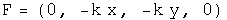
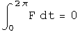

#  Four Tests for a Conservative Force

There are four well-known, equivalent tests to determine if a force is
conservative:  the curl is zero, a potential function whose gradient is the
force exists, all closed path integrals are zero, and the path integral
between any two points is the same no matter what the path chosen.  In this
notebook, quaternion operators perform these tests on quaternion-valued
forces.

##  1.  The Curl Is Zero

To make the discussion concrete, define a force quaternion F.

The curl is the commutator of the differential operator and the force.  If
this is zero, the force is conservative.

Let the differential operator quaternion act on the force, and test if the
vector components equal zero.

##  2\. There Exists a Potential Function for the Force

Operate on force quaternion using integration.  Take the negative of the
gradient of the first component.  If the field quaternion is the same, the
force is conservative.

This is the same force as we started with, so the scalar inside the integral
is the scalar potential of this vector field.  The vector terms inside the
integral arise as constants of integration.  They are zero if t=z=0.  What
role these vector terms in the potential quaternion may play, if any, is
unknown to me.

##  3\. The Line Integral of Any Closed Loop Is Zero

Use any parameterization in the line integral, making sure it comes back to
go.

##  4\. The Line Integral Along Different Paths Is the Same

Choose any two parameterizations from A to B, and test that they are the same.
These paths are from (0, r, 0, 0) to (0, -r, 2 r, 0).

The same!

##  Implications

The four standard tests for a conservative force can be done with operator
quaternions.  One new avenue opened up is for doing path integrals.  It would
be interesting to attempt four dimensional path integrals to see where that
might lead!

