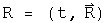
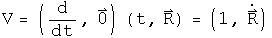
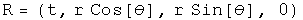

#  Newton's Second Law

The form of Newton's second law for three separate cases will be generated
using quaternion operators acting on position quaternions.  In classical
mechanics, time and space are decoupled.  One way that can be achieved
algebraically is by having a time operator cat only on space, or by space
operator only act on a scalar function.  I call this the "2 zero" rule: if
there are two zeros in the generator of a law in physics, the law is
classical.

##  Newton's 2nd Law for an Inertial Reference Frame in Cartesian
Coordinates

Define a position quaternion as a function of time.

Operate on this once with the differential operator to get the velocity
quaternion.

Operate on the velocity to get the classical inertial acceleration quaternion.

This is the standard form for acceleration in Newton's second law in an
inertial reference frame.  Because the reference frame is inertial, the first
term is zero.

##  Newton's 2nd Law in Polar Coordinates for a Central Force in a Plane

Repeat this process, but this time start with polar coordinates.

The velocity in a plane.

Acceleration in a plane.

Not a pretty sight.  For a central force,  =
![\[Graphics:img/s_gr_10.gif\]](../img/Classical_physics/force/s_gr_10.gif), and
![\[Graphics:img/s_gr_11.gif\]](../img/Classical_physics/force/s_gr_11.gif) = 0.  Make these
substitution and rotate the quaternion to get rid of the theta dependence.

The second term is the acceleration in the radial direction, the third is
acceleration in the theta direction for a central force in polar coordinates.

##  Newton's 2nd Law in a Noninertial, Rotating Frame

Consider the "noninertial" case, with the frame rotating at an angular speed
omega.  The differential time operator is put into the first term of the
quaternion, and the three directions for the angular speed are put in the next
terms.  This quaternion is then multiplied by the position quaternion to get
the velocity in a rotating reference frame. Unlike the previous examples where
t did not interfere with the calculations, this time it must be set explicitly
to zero (I wonder what that means?).

Operate on the velocity quaternion with the same operator.

The first three terms of the 3-vector are the translational, coriolis, and
azimuthal alterations respectively.  The last term of the 3-vector may not
look like the centrifugal force, but using a vector identity it can be
rewritten:

If the angular velocity an the radius are orthogonal, then

The scalar term is not zero.  What this implies is not yet clear, but it may
be related to the fact that the frame is not inertial.

##  Implications

Three forms of Newton's second law were generated by choosing appropriate
operator quaternions acting on position quaternions.  The differential time
operator was decoupled from any differential space operators.  This may be
viewed as an operational definition of "classical" physics.

