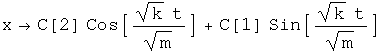
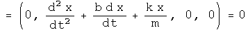

#  Oscillators and Waves

A professor of mine once said that everything in physics is a simple harmonic
oscillator.  Therefore it is necessary to get a handle on everything.

##  The Simple Harmonic Oscillator (SHO)

The differential equation for a simple harmonic oscillator in one dimension
can be express with quaternion operators.

This equation can be solved directly.

Find the velocity by taking the derivative with respect to time.

##  The Damped Simple Harmonic Oscillator

Generate the differential equation for a damped simple harmonic oscillator as
done above.

Solve the equation.

##  The Wave Equation

Consider a wave traveling along the x direction.  The equation which governs
its motion is given by

The third term is the one dimensional wave equation.  The forth term is the
instantaneous power transmitted by the wave.

##  Implications

Using the appropriate combinations of quaternion operators, the classical
simple harmonic oscillator and wave equation were written out and solved.  The
functional definition of classical physics employed here is that the time
operator is decoupled from any space operator.  There is no reason why a
similar combination of operators cannot be used when time and space operators
are not decoupled.  In fact, the four Maxwell equations appear to be one
nonhomogeneous quaternion wave equation, and the structure of the simple
harmonic oscillator appears in the Klein-Gordon equation.

