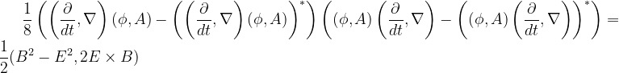

# EM invariants

To derive the field equations of electromagnetism (EM), we need to find Lorentz
invariants that use the electric (E) and magnetic (B) fields of EM that then
get plugged into the Euler-Lagrange equation.

An invariant is something all observers can agree on.  The Egyptians figure out
one long ago:

This was the basis for surveying in the flood plains of the Nile. It remains
true today.  The 3D Egyptians know we could also include a third spacial
dimension:

Einstein showed that Egyptians in rockets could only agree on the interval
between events.

Accelerating or spinning is alright for observing events is you can figure out
the right sort of functions to put into the interval.

Masters of general relativity can figure out the dynamic functions for _f_ and _g_
in only a few special cases because the math remains so difficult. The proposal
described in this site, quaternion gravity, should make this issue tractable
since then one has an algebra problem instead of ten nonlinear differential
equations to solve.  For the rest of the discussion of EM, it is assumed f and
g are equal to one since it makes the math simple.

The first term of a quaternion product is a Lorentz invariant scalar. Couple
the current with the potential by multiplying them together:

The electric and magnetic fields can be written in terms of differential
operators acting on a potential. Form the product:

The first term is a gauge term.  EM has gauge symmetry.  Set this to zero in a
way that assures that no matter what gauge we pick - terms involving the time
derivative of phi or divergence of A - the other terms are unchanged.

There are two times of 3-vectors.  An axial vector will not change if the
order of the product is reverse.  A polar vector will flip signs by changing
the order.  That is a property of cross products and curls.  Here are the two
possibilities:

These should both be as "long" as each other, but will point in a different
direction so long as the magnetic field B is not zero.  Zero is an invariant,
so take the difference of the norms of both of these, and that will always,
necessarily, be equal to zero.

The dot product of the electric and magnetic field will be used to derive the
homogeneous Maxwell equations, the no monopoles and Faraday's law.

The product of the two ways to multiply a differential and a potential also
form an invariant:

This Lorentz invariant quantity will be used when deriving the Maxwell source
equations, Gauss' and Ampere's laws.

Combine all these smaller observations into one expression:

Is this "complicated look" necessary or does it reveal something? I vote for
the latter. The 4-derivative of a 4-potential has the electric and magnetic
fields without further adjustment, a remarkable thing. It also has a gauge
field. It is my hope this is a great thing for particles with mass. For a
theory of photons that have no rest mass, that field must be set to zero. That
is accomplished with the subtractions. The Lorentz invariant is the difference
of two squares of the magnetic and electric fields. That is achieved by
swapping the order of the derivative and potential. 

The other term is called Poynting's vector. It is the energy flux of the
electromagnetic field. It is this vector that "gets work done". I confess to
thinking worked was done by pushing electrons here and there. There are several
videos on the web that will clarify how important the Poynting vector is to
understanding work done by electromagnetism: [Veritasium,
2021-11-19](https://www.youtube.com/watch?v=bHIhgxav9LY) and [The Science
Asylum, 2019-01-31](https://www.youtube.com/watch?v=C7tQJ42nGno). My new
perspective is that work gets done in a particular direction, so that is where
the Poynting vector comes into play. Note that because of resistence, in
practice the electric and magnetic fields are not at 90-degree angles. No doubt
there is an equation for that, but I do not know it yet.
