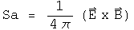

#  The Stress Tensor of the Electromagnetic Field

I will outline a way to generate the terms of the symmetric 2-rank stress-
momentum tensor of an electromagnetic field using quaternions.  This method
may provide some insight into what information the stress tensor contains.

Any equation written with 4-vectors can be rewritten with quaternions.  A
straight translation of terms could probably be automated with a computer
program.  What is more interesting is when an equation is generated by the
product of operators acting on quaternion fields.  I have found that generator
equations often yield useful insights.

A tensor is a bookkeeping device designed to keep together elements that
transform in a similar way.  People can choose alternative bookkeeping
systems, so long as the tensor behaves the same way under transformations.
Using the terms as defined in "The classical theory of fields" by Landau and
Lifshitz, the antisymmetric 2-rank field tensor F is used to generate the
stress tensor T

I have a practical sense of an E field (the stuff that makes my hair stand on
end) and a B field (the invisible hand directing a compass), but have little
sense of the field tensor F, a particular combination of the other two.
Therefore, express the stress tensor T in terms of the E and B fields only:

Together, the energy density(W), Poynting's vector (Sa) and the Maxwell stress
tensor (m_ab) are all the components of the stress tensor of the
electromagnetic field.

##  Generating a Symmetric 2-Tensor Using Quaternions

How should one rationally go about to find a generator equation that creates
these terms instead of using the month-long hunt-and-peck technique actually
used?  Everything is symmetric, so use the symmetric product:

The fields E and B are kept separate except for the cross product in the
Poynting vector.  Individual directions of a field can be selected by using a
unit vector Ua:

The following double sum generates all the terms of the stress tensor:

The first line generates the energy density W, and part of the +0.5 delta(a,
b)(E^2 + B^2) term of the Maxwell stress tensor.  The rest of that tensor is
generated by the second line.  The third line creates the Poynting vector.
Using quaternions, the net sum of these terms ends up in the scalar.

Does the generator equation have the correct properties?  Switching the order
of Ua and Ub leaves T unchanged, so it is symmetric.  Check the trace, when Ua
= Ub

The trace equals zero, as it should.

The generator is composed of three parts that have different dependencies on
the unit vectors: those terms that involve Ua and Ub, those that involve Ua or
Ub, and those that involve neither.  These are the Maxwell stress tensor, the
Poynting vector and the energy density respectively.  Changing the basis
vectors Ua and Ub will effect these three components differently.

##  Implications

So what does the stress tensor represent?  It looks like every combination of
the 3-vectors E and B that avoids quadratics (like Ex^2) and over-counting
cross terms.  I like what I will call the "net" stress quaternion:

This has the same properties as an stress tensor.  Since the vector is zero,
it commutes with any other quaternion (this may be a reason it is so useful).
Switching x terms for y terms would flip the signs of the terms produced by
the Poynting vector as required, but not the others.  There are no terms of
the form Ex^2, which is equivalent to the statement that the trace of the
tensor is zero.

On a personal note, I never thought I would understand what a symmetric 2-rank
tensor was, even though I listen in on a discussion of the topic.  Yes, I
could nod along with the algebra, but without any sense of F, it felt hollow.
Now that I have a generator and a net quaternion expression, it looks quite
elegant and straightforward to me.

