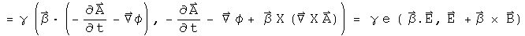

#  The Lorentz Force

The Lorentz force acts on a moving charge.  The covariant form of this law is,
where W is work and P is momentum:

In the classical case for a point charge, beta is zero and the E = k e/r^2, so
the Lorentz force simplifies to Coulomb's law.  Rewrite this in terms of the
potentials phi and A.

In this notebook, I will look for a quaternion equation that can generate this
covariant form of the Lorentz force in the Lorenz gauge.  By using potentials
and operators, it may be possible to create other laws like the Lorentz force,
in particular, one for gravity.

##  A Quaternion Equation for the Lorentz Force

The Lorentz force is composed of two parts.  First, there is the E and B
fields.  Generate those just as was done for the Maxwell equations

Another component is the 4-velocity

Multiplying these two terms together creates thirteen terms, only 5 of whom
belong to the Lorentz force.  That should not be surprising since a bit of
algebra was needed to select only the covariant terms that appear in the
Maxwell equations.  After some searching, I found the combination of terms
required to generate the Lorentz force.

This combination of differential quaternion operator, quaternion potential and
quaternion 4-velocity generates the covariant form of the Lorentz operator in
the Lorenz gauge, minus a factor of the charge e which operates as a scalar
multiplier.

##  Implications

By writing the covariant form of the Lorentz force as an operator acting on a
potential, it may be possible to create other laws like the Lorentz force.
For point sources in the classical limit, these new laws must have the form of
Coulomb's law, F = k e e'/r^2.  An obvious candidate is Newton's law of
gravity, F = - G m m'/r^2.  This would require a different type of scalar
potential, one that always had the same sign.

