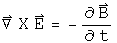

#  Classical Electrodynamics

Maxwell speculated that someday quaternions would be useful in the analysis of
electromagnetism.  Hopefully after a 130 year wait, in this notebook we can
begin that process.  This approach relies on a judicious use of commutators
and anticommutators.

##  The Maxwell Equations

The Maxwell equations are formed from a combinations of commutators and
anticommutators of the differential operator and the electric and magnetic
fields E and B respectively (for isolated charges in a vacuum.

The first quaternion equation embodies the homogeneous Maxwell equations.  The
scalar term says that there are no magnetic monopoles.  The vector term is
Faraday's law.  The second quaternion equation is the source term.  The scalar
equation is Gauss' law.  The vector term is Ampere's law, with Maxwell's
correction.

##  The 4-Potential A

The electric and magnetic fields are often viewed as arising from the same
4-potential A.  These can also be expressed easily using quaternions.

The electric field E is the vector part of the anticommutator of the
conjugates of the differential operator and the 4-potential.  The magnetic
field B involves the commutator.

These forms can be directly placed into the Maxwell equations.

The homogeneous terms are formed from the sum of both orders of the commutator
and anticommutator.  The source terms arise from the difference of two
commutators and two anticommutators.

##  The Lorentz Force

The Lorentz force is generated similarly to the source term of the Maxwell
equations, but there a small game required to get the signs correct for the
4-force.

This is the covariant form of the Lorentz force.  The additional minus sign
required may be a convention handed down through the ages.

##  Conservation Laws

The continuity equation--conservation of charge--is formed by applying the
conjugate of the differential operator to the source terms of the Maxwell
equations.

The upper is zero, so the dot product of the E field and the current density
plus the rate of change of the charge density must equal zero.  That means
that charge is conserved.

Poynting's theorem for energy conservation is formed in a very similar way,
except that the conjugate of electric field is used instead of the conjugate
of the differential operator.

Additional vector identities are required before the final form is reached.

Use these equations to simplify to the following.

This is Poynting's equation.

##  Implications

The foundations of classical electrodynamics are the Maxwell equations, the
Lorentz force, and the conservation laws.  In this notebook, these basic
elements have been written as quaternion equations, exploiting the actions of
commutators and anticommutators.  There is an interesting link between the E
field and a differential operator for generating conservation laws.  More
importantly, the means to generate these equations using quaternion operators
has been displayed.  This approach looks independent from the usual method
which relies on an antisymmetric 2-rank field tensor and a U(1) connection.

