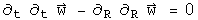

#  The Maxwell Equations in the Light Gauge: QED?

What makes a theory non-classical?  Use an operational definition: a classical
approach neatly separates the scalar and vector terms of a quaternion.  Recall
how the electric field was defined (where {A, B} is the even or symmetric
product over 2, and [A, B] is the odd, antisymmetric product over two or cross
product).

The scalar information is explicitly discarded from the E field quaternion.
In this notebook, the scalar field that arises will be examined and shown to
be the field which gives rise to gauge symmetry.  The commutators and
anticommutators of this scalar and vector field do not alter the homogeneous
terms of the Maxwell equations, but may explain why light is a quantized,
transverse wave.

##  The E and B Fields, and the Gauge with No Name

In the previous notebook, the electric field was generated differently from
the magnetic field, since the scalar field was discard.  This time that will
not be done.

What is the name of the scalar field, d phi/dt - Del.A which looks like some
sort of gauge?  It is not the Lorenz or Landau gauge which has a plus sign
between the two.  It is none of the popular gauges: Coulomb (Del.A = 0), axial
(Az = 0), temporal (phi = 0), Feynman, unitary...

[special note: I am now testing the interpretation that this gauge constitutes
the gravitational field.  See the section on Einstein's Vision]  

The standard definition of a gauge starts with an arbitrary scalar function
psi.  The following substitutions do not effect the resulting equations.

This can be written as one quaternion transformation.

The goal here is to find an arbitrary scalar and a 3-vector that does the same
work as the scalar function psi.  Let

Look at how the gauge symmetry changes by taking its derivative.

This is the gauge with no name!  Call it the "light gauge".  That name was
chosen because if the rate of change in the scalar potential phi is equal to
the spatial change of the 3-vector potential A as should be the case for a
photon, the distance is zero.

##  The Maxwell Equations in the Light Gauge

The homogeneous terms of the Maxwell equations are formed from the sum of both
orders of the commutator and anticommutator.

The source terms arise from of two commutators and two anticommutators.  In
the classical case discussed in the previous notebook, this involved a
difference.  Here a sum will be used because it generates a simpler
differential equation.

Notice how the scalar and vector parts have neatly partitioned themselves.
This is a wave equation, except that a sign is flipped.  Here is the equation
for a longitudinal wave like sound.

The second time derivative of w must be the same as Del^2 w.  This has a
solution which depends on sines and cosines (for simplicity, the details of
initial and boundary conditions are skipped, and the infinite sum has been
made finite).

Hit w with two time derivatives, and out comes -n^2 pi^2 w.  Take Del^2, and
that creates the same results.  Thus every value of n will satisfy the
longitudinal wave equation.

Now to find the solution for the sum of the second time derivative and Del^2.
One of the signs must be switched by doing some operation twice.  Sounds like
a job for i!  With quaternions, the square of a  normalized 3-vector equals
(-1, 0), and it is i if y = z = 0 .  The solution to Maxwell's equations in
the light gauge is

Hit this two time derivatives yields -n^2 pi^2 w.  Del^2 w has all of this and
the normalized phase factor V^2 = (-1, 0).  V acts like an imaginary phase
factor that rotates the spatial component.  The sum for any n is zero (the
details of the solution depend on the initial and boundary conditions).

##  Implications

The solution to the Maxwell equations in the light gauge is a superposition of
waves--each with a separate value of n--where the spatial part gets rotated by
the 3D analogue of i.  That is a quantized, transverse wave.  That's
fortunate, because light is a quantized transverse wave.  The equations were
generated by taking the classical Maxwell equations, and making them simpler.

