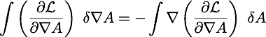

# Derive the Euler-Lagrange equations

The Euler-Lagrange equations are used to generate field equations from a
Lagrange density. Think of a Lagrange density as every way energy can be traded
inside of a box. The action S integrates the Lagrange density (mass per volume)
over space and _time_, resulting in a value of mass times time.

Notice that the action could be just about any value by integrating over
different amounts of time, from a nano-second to a billion years.

The approach is to _vary something_ in the action S so this integral _does not
change_. This means that the "something" is a symmetry of the action.  Where
there is a symmetry, there is necessarily a conserved quantity.

This is a minimization problem, or more formally, the calculus of variations.
The first types of minimization problems one learns are about the minimum value
of something like a velocity at a point in space-time. This is about a 
minimization of a function over all of space-time. The mechanics are the same - 
take a derivative, set it to zero - but the thing that gets plugged in is 
different.

## Examples

* If the Lagrange density is not a function of **time**, then time is a 
symmetry and **energy** is conserved.

* If the Lagrange density is not a function of **space**, then space is a 
symmetry and **linear momentum** is conserved.

* If the Lagrange density is not a function of **angle**, then rotation is a 
symmetry and **angular momentum** is conserved.

## Counter example

* If a Lagrange equation **is a function of space and time**, then **energy and 
momentum are not conserved**. This happens for systems that have friction.  The 
energy and momentum go into waste heat. Those terms usually are not included in 
the Lagrange density. 

## Deriving the Euler-Lagrange equations

If a Lagrange density depends on a 4-potential A and the derivatives of A, then 
vary these and find a minimum. This is the heart of the Euler-Lagrange 
equations.

This is a minimum problem with the potential A and its derivative, A'.

1\. Start with a Lagrange density that is a function of the potential and its derivatives.

Note that one is not allowed to vary position or speed. If we were to do the 
reverse - fix the potential and its derivative, but vary position and velocity 
- then we would be deriving the force equation from the same Lagrange density.

2\. For the action by integrating over a volume of space-time.

3\. Vary the action.

4\. The action needs to be varied with respect to one variable, the potential A, 
not the field. This change can be done using integration by parts.

Sidebar: integration by parts

This uses the product rule in the context of integrals.

In this case, the u and v functions are more complicated, but it does line up
exactly:

What happens with the calculus of variations is the path is altered, but the
start and endpoints are fixed. This is the reason the integrated term does not
contribute to the variation - it does not vary at all. One is left with this
equality:

5\. Substitute 4 into the variation in 3:

6\. The variation will be at the minimum if the variation in the action S is 
zero, which happens if the integrand is zero:

QED

There are so many partial differential equations when using Euler-Lagrange,
people with think you are brilliant.

## The Quaternion Variation

When quaternion expressions try to step in for tensor equations, it is common
in my experience that a sign change is necessary. The difference in the
magnetic field squared minus the electric field is invariant under a Lorentz
boost. To make that work with quaternion, the fields must be defined like so:

The field variable uses the conjugate of A. For quaternion, the relevant form
of Euler-Lagrange is:

The derivations of the Maxwell equations that follow will use these expressions.

