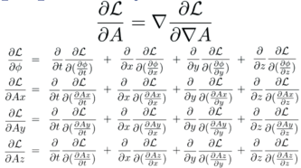

# Derive the Euler-Lagrange equations

The Euler-Lagrange equations are used to generate field equations from a
Lagrange density. Think of a Lagrange density as every way energy can be traded
inside of a box. The action S integrates the Lagrange density (mass per volume)
over space and _time_, resulting in t mass times time.

Notice that the action could be just about any value by integrating over
different amounts of time, from a nano-second to a billion years.

The approach is to _vary something_ in the action S so this integral _does not
change_. This means that the "something" is a symmetry of the action.  Where
there is a symmetry, there is necessarily a conserved quantity.

this is a minimization problem, or more formally, the calculus of variations.
the first types of minimization problems one learns are about the minimum value
of something like a velocity at a point in space-time. this is about a 
minimization of a function over all of space-time. the mechanics are the same - 
take a derivative, set it to zero - but the thing that gets plugged in is 
different.

## examples

* if the lagrange density is not a function of **time**, then time is a 
symmetry and **energy** is conserved.

* if the lagrange density is not a function of **space**, then space is a 
symmetry and **linear momentum** is conserved.

* if the lagrange density is not a function of **angle**, then rotation is a 
symmetry and **angular momentum** is conserved.

## counter example

* if a lagrange equation **is a function of space and time**, then **energy and 
momentum are not conserved**. this happens for systems that have friction.  the 
energy and momentum go into waste heat. those terms usually are not included in 
the lagrange density. 

## deriving the euler-lagrange equations

if a lagrange density depends on a 4-potential a and the derivatives of a, then 
vary these and find a minimum. this is the heart of the euler-lagrange 
equations.

This is a mimnum problem with the potential A and its derivative, A'.

1: Start with a Lagrange density that is a function of the potential and its derivatives.

Note that one is not allowed to vary position or speed. If we were to do the 
reverse - fix the potential and its derivative, but vary position and velocity 
- then we would be deriving the force equation from the same Lagrange density.

2: For the action by integrating over a volume of space-time.

3: Vary the action.

4: The problem is with the variation in A versus the variantion is the derivative of A.  Use the product rule to get two variations in A.

5: A theorem of Gauss says:

so:

6: Subsitute 5 into the variation in 3:

7: The variation will be at the minimum if the variation in the action S is 
zero, which happends if the integrand is zero:

QED

There are so many partial differential equations when using Euler-Lagrange,
people with thin you are brilliant.

