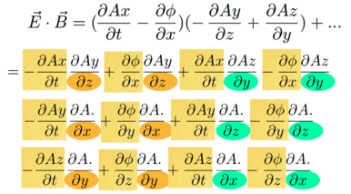
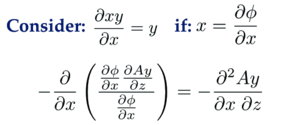
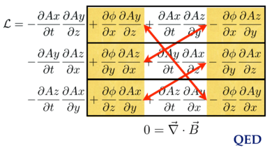
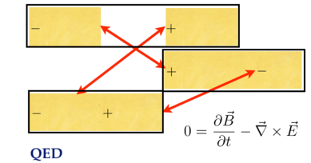

# Derive the Maxwell homogeneous equations

## The easy way

There are several different roads to the same results, the no monopoles law and
Faraday's law, known together as the homogeneous equations.  The quickest path
is to show how they are vector identities.  The divergence of a curl is zero, so
if the magnetic field is the curl of the potential A, then there are no
magnetic monopoles.

One down, one to go.

Plug the potential definitions of a B and E field into Faraday's law, and watch
all the terms drop.

QED.

The path followed here is _considerably_ longer.  Everyone uses the
Euler-Lagrange equations to derive the source equations, Gauss' law and
Ampere's law.  For the sake of logical consistency, and to get practice with
the details of Euler-Lagrange, the same machinery will be used to derive all
four Maxwell equations.

## Maxwell defined

The Maxwell equations are the pinnacle of classical physics, the way all light,
electric charges, and magnets play with each other gracefully.  Here is a one
sentence definition:

    The Maxwell equations define how a current density is the source of all the
    changes in space-time of changes in space-time of a space-time potential
    that travels at the speed of light.

The Maxwell equations are a complete set of second order differential equations
along with the vector identities.  Nothing is missing.[^1]

## The fields defined

A quaternion derivative has a time derivative and three spatial derivatives.  A
quaternion potential has a scalar potential and three others for space no
matter what one's choice of coordinate systems.  Construct the complete set of
first order changes of a potential by taking the product.

Simple enough.

No, stop.  This is amazing enough to repeat.

**The most basic complete quaternion derivative of a potential is EM**

But what about that first term?  One of the defining characteristic of light is
how its interval is zero.  A photon cannot wear a watch.  Photons are timeless.
The way to implement that quality is to set this gauge term equal to zero like
so:

This is a recurring technique.  If something travels at the speed of light,
there will be non of the four gauge terms:

The electric and magnetic field are unchanged by changing the guage because the
gauge terms are always subtracted away.

One enormous subject I have not looked into is what happens if one keeps this
gauge term.  The resulting physics must describe thing that do not travel at
the speed of light.  It is the subject of particles with a mass.

## The plan

Here is how we will derive the no monopoles law.

* Start with 1 easy term, _E~x~_
* Pair that with 1 _B~x~_
* Multiply it out
* Clone lines, filling in _E~y~_ and _E~z~_
* Look for patterns

## Writing out the Lagrangian

The dot product of the electric and magnetic fields has 24 terms.  It is scary,
so start simple with one term only, _E~x~_:

The magnetic field _B~x~_ has everything not found in _E~x~_, including both
the potentials and derivatives.

It is seeing details like all four potential terms and all four differentials
in each line that makes the Maxwell equations feel so complete.

Multiply this out.

![E dot B equals minus the time derivative of A~x~ minus the derivative of phi with respect to x times the derivative of A~y~ with respect of z minus the derivative of A~z~ with respect to y; which equals minus the 
time derivative of A~x~ the derivative of A~y~ with respect to z minus the
derivative of phi with respect to x the derivative of A~y~ with respect to z plus the time derivative of A~x~ the derivative of A~z~ with respect to y plus the derivative of phi with respect to x the derivative of A~z~ with respect to y](../images/EM/derive_Maxwell_homogeneous_equations/E_dot_B_Ex_Bx_details.png)

* Half the terms are positive, half are negative, setting up for cancellations.
* Each term has a t, x, y, z-ish part.
* 8 down, 16 to go.

Clone _E~x~_ to make _E~y~_ and _E~z~_ making all necessary substitutions:

Look for patterns in the partial derivatives:

The electric field terms are in yellow.  The top line has the magnetic field,
_B~x~_. None of these has an _x_, it is pairs of _y_'s and _z_'s.

The next part of the puzzle is to figure out where the rest of the derivative
with respect to _x_ go.  That will dictate where the other partials go too.

This is the game of curl Sudoku.  Fill in the missing values for _x_, _y_ and _z_.

All the needed slots are filled in.  The Sudoku game is complete.

Now remove some of the details.  The dot product of _E_ and _B_ is pretty:

The Lorentz invariant Lagrange density is complete.

# Derive the no monopoles law

Plug the 16 terms of the Lagrange density into 20 slots in the Euler-Lagrange
equations:

This is a mountain of details.  People are much better at spotting patterns.

Do simple things, one at a time.  Here is the first Euler-Lagrange equation:

* Only terms with phi matter.
* The derivative repeat.
* That's it.

Here are the terms in the Lagrangian that have a phi:

Every term with a phi is mixed.  Derivatives of mixed terms is simple:

Here's what happens:
* After Euler-Lagrange is applied, there is no phi left.
* There is 1 term in the numerator, and two partial derivatives.
* All three spatial directions appear once.
Using these three guides, you should be able to picture how the Lagrange
density is changed by applying the Euler-Lagrange equation.

With minuses in one column, and pluses in the other, cancellations happen:

Focus on the example.  See how the phi drops, and one has mixed derivatives
with opposite signs.  Nice.

What is going on in terms of the E and B fields?  Look at things row by row:

The first line of the Lagrangian has two derivatives of phi with respect to
_x_. After going through the Euler-Lagrange equation, one is left with a second
order derivative which is the _x_ derivative of the magnetic field.

Rinse and repeat for _y_ and _z_:

These cancellations all happen because of a vector identity: the divergence
of a curl is zero.

# Derive Faraday's law

To continue down this longer road and arrive at Faraday's law, start from the
same Lagrangian, but focus on the A~x~ terms:

* The Euler-Lagrange will wipe out the _A~x~_'s, leading to cancellations.
* The top line is a time derivative of _B~x~_.
* The second and third lines together form the curl of _E~x~_.

Here is the pattern:

This is Faraday's law.

[^1]: A driver of traffic to my sign is a claim on the Internet that the first
edition of "A Treatise on Electricity and Magnetism" had 200 equations written
with quaternions that were deleted by the second edition by Heaviside.  Finding
the first version was a struggle, but I did find it.  It had two sections with
"Quaternion" in the title.  It was clear that this grand master of old was only
using the 3-vector part of a quaternion.  This is not where the fun is in my
opinion.  Since I have derived and rewritten my derivations of
the Maxwell equations using only quaternions many times, I can assure you,
nothing is missing.

