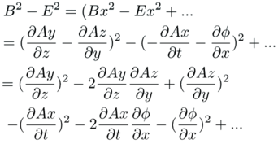
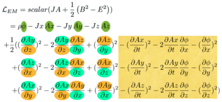
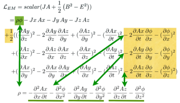
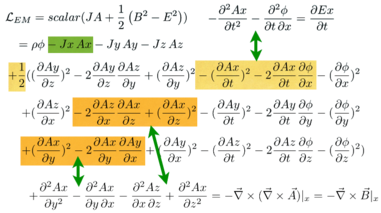
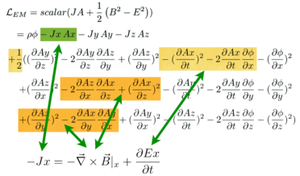
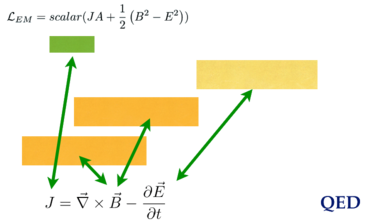

# Derive the Maxwell source equations

The Maxwell source equations are Gauss' law and Ampere's law.  A Lorentz
invariant coupling of the current density to the potential is needed.  That is
simply the product of the current density with the potential:

We also need a Lorentz invariant of the E and B fields.  As discussed in 
[EM invariants](EM_invariants.md), the gauge-free derivative of a potential written
in both orders does the trick:

This is a difference of squares.  We get the Poynting 3-vector created for
free.  This is not a minor addition.  Neither of the fields E or B are changed
if time is reversed.   The square of the E field has two terms that flip signs,
so effectively no sign flips, while the square of the B field has none.  The 
same is not true of the Poynting vector.  There is only one term with a time
factor in the E field, so it would flip signs.  One long standing riddle in
physics is the perfect time symmetry in the Maxwell equations.  Those equations
start with only the difference of squares, not the Poynting vector.  If, for
the biggest complete vision, we need to consider both of these terms, a
solution to the time symmetry riddle could be found.  That is speculation, but
worth pointing out.

# The plan

Start by writing out the Lagrange density
* Write out _E~x~_ and _B~x~_.
* Multiply it out.
* Clones _E~y~_, _E~z~_, _B~y~_, and _B~z~_.

# The Lagrange density

Start easy by writing out _E~x~_ and _B~x~_:

Multiply it out.

Every term is negative except the squares of the _B~x~_ field.  Continue the
process for ~y~ and ~z~.

The electric field terms in yellow are simple substitutions.  The magnetic
field involves the curl, so it can be intimidating.  Once one term is done, the
rest follow from the pattern set for_ B~x~_ along with a "no redundant"
requirement, much like a Sudoku puzzle.

The Lagrange density needs the current coupling and the difference of the
square of the fields.  One detail is that a factor of a half is needed to
simplify derivative equations

There is a clean separation of electric fields (in yellow) and the magnetic
field (in green and orange).

The Lagrange density for the Maxwell source equations is complete.

# Derive Gauss's law.

Start applying the Euler-Lagrange equation by focusing on terms with a phi in
them:

There is one current coupling term.  There are six terms all coming from the
electric field.  This is reasonable because only the electric field has a phi,
and the E and B fields are separated in the differences of squares EM
Lagrangian.

We need to do calculus on two types of terms.  One is a square, the other is a
mixed derivative:

Even though these expressions look impressively complicated, one is only taking
the derivatives of x^2^ and xy, the first sorts of derivatives one learns in
the study of calculus.  It is x that is odd, being another derivative.

Apply the Euler-Lagrange equation to all the terms with a phi:

Here is the pattern:

This is Gauss's law.

# Derive Ampere's law

This time focus on terms on _A~x~_ in the Lagrange density:

Write out the Euler-Lagrange derivatives:

Collect the terms generated by the Euler-Lagrange equations:

Look at the pattern:

This is Ampere's law.

# The big pictures

Gauss's law is only about the electric field.  Ampere's law is about both.

The two Lagrangians and four Maxwell field equations together on one stage:

