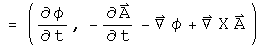
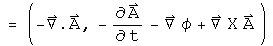

#  Electromagnetic field gauges

A gauge is a measure of distance.  Gauges are often chosen to make solving a
particular problem easier.  A few are well known: the Coulomb gauge for
classical electromagnetism, the Lorenz gauge which makes electromagnetism look
like a simple harmonic oscillator, and the gauge invariant form which is used
in the Maxwell equations.  In all these cases, the E and B field is the same,
only the way it is measured is different.  In this notebook, these are all
generated using a differential quaternion operator and a quaternion
electromagnetic potential.

##  The Field Tensor F in Different Gauges

The anti-symmetric 2-rank electromagnetic field tensor F has 3 properties: its
trace is zero, it is antisymmetric, and it contains all the components of the
E and B fields.  The field used in deriving the Maxwell equations had the same
information written as a quaternion:

What makes this form gauge-invariant, so no matter what the choice of gauge
(involving dphi/dt and Del.A), the resulting equation is identical?  It is the
work of the zero!  Whatever the scalar field is in the first term of the
generator gets subtracted away in the second term.  

A mathematical aside: a friend of mine calls this a "conjugator".  The well-
known commutator involves commuting two terms and then subtracting them from
the starting terms.  In this case, the two terms were conjugated and then
subtracted from the original.  Any quaternion expression that gets acted on by
a conjugator results in a 0 scalar and a 3-vector.  An anti-conjugator does
the opposite task.  By adding together something with its conjugate, only the
scalar remains.  The conjugator will be used often here.

Generating the field tensor F in the Lorenz gauge starting from the gauge-
invariant from involves swapping the fields in the following way:

This looks more complicated than it is.  The first term of the generator
involves the scalar field only, (phi, 0), and the second term involves the
3-vector field only, (0, A).

The field tensor F in the Coulomb gauge is generated by subtracting away the
divergence of A, which explains why the second and third terms involve only A,
even though Del.A is zero :-)

The field tensor F in the temporal gauge is quite similar to the Coulomb
gauge, but some of the signs have changed to target the dphi/dt term.

What is the simplest expression that all of these generator share?  I call it
the field tensor F in the light gauge:

The light gauge is one sign different from the Lorenz gauge, but its generator
is a simple as it gets.

##  Implications

In the quaternion representation, the gauge is a scalar generated in such a
way as to not alter the 3-vector.  In a lists of gauges in graduate-level
quantum field theory written by Kaku, the light gauge did not make the list of
the top 6 gauges.  There is a reason for this.  Gauges are presented as a
choice for a physicist to make.  The most interesting gauges have to do with a
long-running popularity contest.  The relationship between gauges is guessed,
not written explicitly as was done here.  The term that did not make the cut
stands out.  Perhaps some of the technical issues in quantum field theory
might be tackled in this gauge using quaternions.

