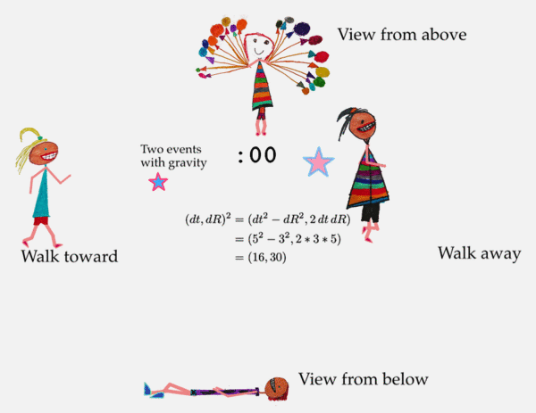

# Measure the difference between space-time events

Two stars go supernova while four kids watch.

  

There is a difference in time (dt).

There is a difference in space (dR).

Together they make a difference in space-time.

Each kid measures a different values for time and space.

Yet the walkers agree on something they can calculate called the interval.
This is the standard physics of Special Relativity, the physics of moving.

This site promotes a new proposal for gravity called Quaternion Gravity where
the kids above or below agree on a different value they calculate, 
