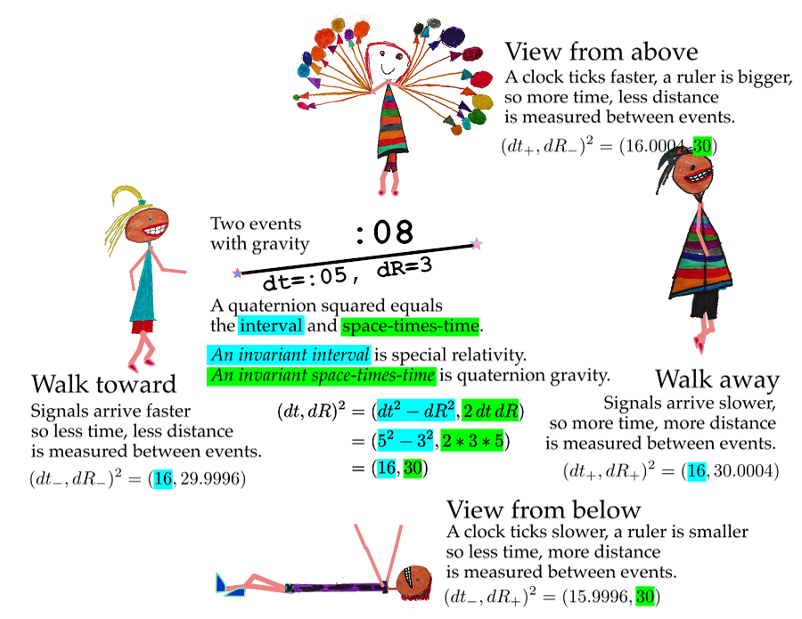

# SR + QG - *S*pecial *R*elativity and *Q*uaternion *G*ravity

This graphic says most of it...

Start with the reference square which has an interval of 16 and a space-times
time of 30.

Compare the reference square with the walkers. They all have the same interval
of 16 because that in what is invariant for inertial observers, folks moving at
a constant speed compared to the reference.

Compare the reference square with the girl above and boy below. Because they
are in a gravitational field, they are not inertial observers. The quaternion
gravity proposal says the space-times-time value are exactly the same at 30.
The interval will be of different sizes.

If one compares a walker to one of the kids above or below, there is no overlap
between them.

## For nerds

Since there is a gravitational field everywhere, there are no inertial
observers. Working with the squares of quaternions, things are a little
easier. Just compare the reference square with any other square. For the
walkers, since they travel at a constant speed and are at the same location in
the gravitational field as the reference square, they will have the same
interval.

The kids above and below are not moving compared to the reference square. By
the quaternion gravity proposal, the space-times-time is an invariant. All
agree on the value of 30. What then has to be different is the interval. But
how different, and how does that depend on the gravitional source mass?

Fortunately, there is no choice in answering the question if one is to be
consistent with current experimental tests of gravity. For a spherically
symmetric, non-rotating, uncharged source, gravity depends on the ratio of the
graviational source mass over the distance to the center of that mass. Whatever
function is used to make the time measurement smaller must be the exact inverse
of the one that makes a spatial measurment larger. Since gravitational systems
follow simple harmonic patterns for billions of years, an exponential and its
inverse that depens on the M/R ratio is an obvious thing to propose.

The interval looks just like the Rosen bi-metric proposal, even though
quaternion gravity uses no metrics. The Rosen metric is known to be consistent
with current tests of weak field gravity up to first-order Parametrized
Post-Newtonian accuracy. The extra metric creates a problem for Rosen's
proposal since gravity waves would have a dipole moment and lose entry faster
than observed. The simplicity of the quaternion gravity proposal would require
for an isolated mass in space that the lowest mode of emission is a quadrapole,
consistent with what is seen. Yet there is no graviton with quaternion gravity.
The energy could be carried away with photons that happen to have a quadrapole
moment, but no a dipole one.

My entry to the [_2015 Awards for Essays on 
Gravitation_](http://www.gravityresearchfoundation.org/index.html) is a more formal
presentation of this research effort, [available as a
pdf](../../Stuff/pdfs/space-times-time_invariance.pdf).
