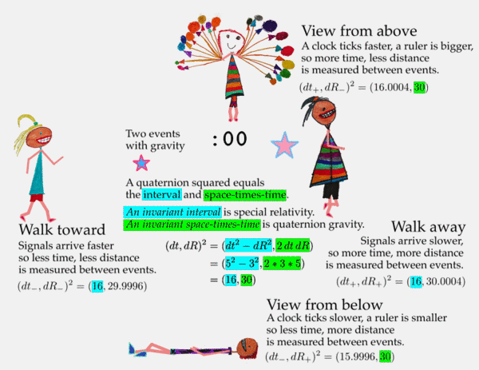

# SR + QG - *S*pecial *R*elativity and *Q*uaternion *G*ravity

This graphic says most of it...

  

[printable pdf](../pdfs/sr_and_qg.all.pdf) or [editable svg](../images/Gravity/Measurement-101/sr_and_qg.all.svg)

