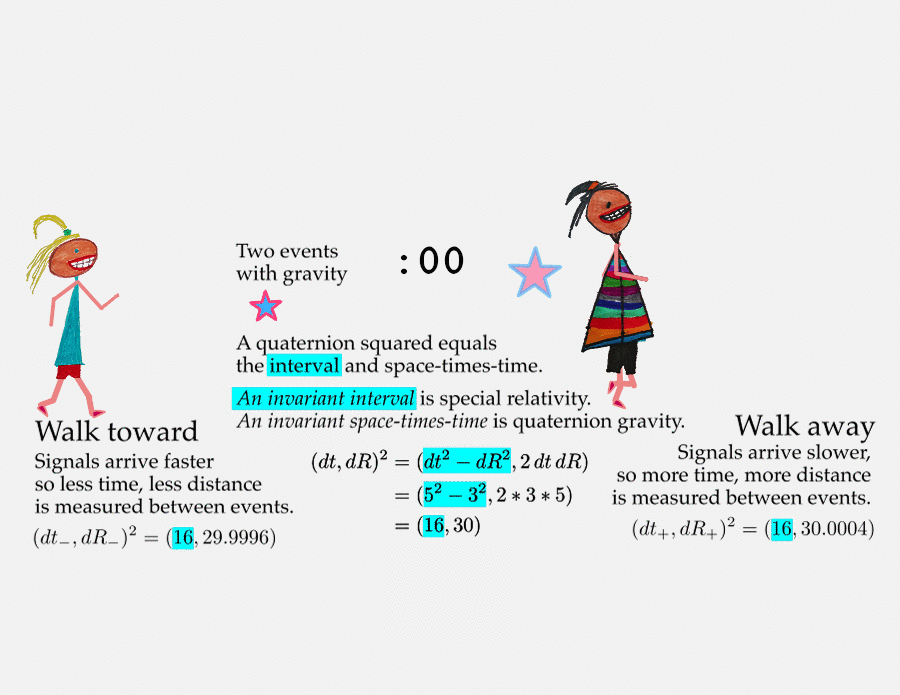

# Special relativity

Walking changes how one measures deadly supernovae.

As long as the kids move at a constant rate, special relativity comes into play.

Relativity is not an arbitrary change, but incredibly precise change.

And there is that interval that is *exactly* the same size.

Note: the numbers are **far too big** (off by 16 orders of magnitude, I just
didn't want to write _lots_ of zeros).

## Page-cast

A brief explanation of this page.

## For nerds

Take measurements made by two observers written as quaternions and square them. 
If the first terms are the same, then the two observers are in reference frames 
that are moving in a steady way relative to each other. Note that the 
observers can be in a gravity field which is a non-inertial reference frame, 
but that does not cause an issue here.

The observers do not have to make sure their coordinate systems are the same. 
So long as both agree to compare so called natural units (a way to consistently 
be dimensionless), then the numbers will be the same.
As long as the kids move at a constant rate, special relativity comes into play.
