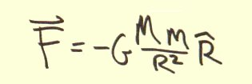

# Quaternion gravity

1. [Three roads to quaternion gravity](three_roads_to_quaternion_gravity.md)
  [PDF](three_roads_to_quaternion_gravity.pdf) 2018, 13 pages, technical paper
1. Measurement-101
    * [Measuring events](Measurement-101/measure.md)
    * [Special relativity](Measurement-101/special_relativity.md)
    * [Quaternion gravity](Measurement-101/quaternion_gravity.md)
    * [SR + GR: Special relativity and quaternion gravity](Measurement-101/measure_it_all.md)
1. [Quaternion space-times-time invariance as gravity](space-times-time_invariance.md)
1. [The *2015 Essays on Gravitation* contest](essays_on_gravitation.md)
1. [The PGT - Personal Gravity Theory - Homework Assignment](PGT/personal_gravity_theory.md)
