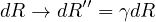
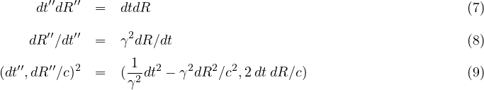

# Three Roads to Quaternion Gravity

D. B. Sweetser

sweetser@alum.mit.edu

Three roads merge to create a different approach to gravity. Our deepest
insights into nature use symmetries because symmetries remain unchanged.
Using quaternion algebra instead of tensor calculus, the conservation of
space-times-time is the symmetry underlying the quaternion gravity
proposal for non-inertial observers in a gravitational field. Where
there is a symmetry, there need also be a transformation law to detail
how change is permitted to happen. The notion of relaxed relativity
holds that in a gravitational field, one observer looking at another
observer measuring the speed of light will find the product of
wavelength and frequency differs from the speed of light in a precise
way ($c' =  c \gamma^2_{esc}$). (\(c' =  c \gamma^2_{esc}\))Lorentz invariance remains for inertial observers, but
non-inertial observers are governed by different symmetries. Gravity is
different everywhere, so a field theory is also necessary using escape
velocities. With some reasonable guesses constrained by observations,
one can form a quaternion gravity proposal that is consistent with weak
field gravity tests. No gravitons are required for this technical
variant of special relativity.

$$E = m c^2$$

## Conserving Changes in Space-times-time

    The views of space and time which I wish to lay before you have sprung
    from the soil of experimental physics, and therein lies their strength.
    They are radical. Henceforth space by itself, and time by itself, are
    doomed to fade away into mere shadows, and only a kind of union of the
    two will preserve an independent reality. *Herman Minkowski, 1908*

To enforce that prediction, I have made a study of writing physics
equations in terms of the division algebra known as quaternions as a
"kind of union of the two" (results at http://quaternions.com). Such an
approach builds into all subsequent operations the unification of space
and time. Using quaternions to this extent makes me an honorary member
of the Quaternion Society, a long disbanded group of as many as sixty
mathematicians and physicists who worked for almost twenty years
promoting the utility of quaternions at the turn of the twentieth
century. They considered quaternions to be a part of static geometry.
The advent of special relativity opened an unseen door to the dynamic
geometry of space-time.

A corollary is that we should think about all possible combinations of
space and time. Velocity is a change in space over a change in time. A
differential area is a change in space times a change in space. A
differential angle is a change in space divided by change in space. But
what is a change in space times a change in time? Under what situation
would this simple yet odd product appear?

Consider two events measured that are arbitrarily close to one another.
To make life simpler, use Euclidean coordinates, assuming space-time is
flat. Because quaternions are numbers, the difference between the two
numbers can be squared without using a metric tensor:

The scalar term (aka first term) is the Lorentz invariant interval
squared of spatial relativity for two inertial observers. The 3-vector
term (aka the next three terms) I call space-times-time. For inertial
observers, space-times-time is Lorentz *variant*: how they change under
a rotation or a boost is understood. Some might find this equation an
abomination - a universally useful Lorentz invariant term sitting right
next to these three amigos that vary. To my eye, this looks like a
complete story, one that provides more useful information from the same
starting information. Relativity is a game of what one observer says
about another's observations. Let our primary observer be called
observer *A*, and the one moving away is observer *B*. Observer *A*
makes a measurement between two events, recording it as $(dt, dx/c, dy/c, dz/c)$. Observer *A*
is able to say that the measurement made by observer *B* looks to be $(dt', dx'/c, dy'/c, dz'/c)$.
If all one reports is the Lorentz invariant interval, then the interval
squared, $d \tau^2$, will be the same according to special relativity. If instead
one squares these two as quaternions, again the first terms are
identical. The space-times-time terms are different and can be use to
calculate how observer *B* is moving relative to observer *A*. From an
information point of view, if one starts with four pieces of
information, one should end with four pieces of information as happens
with using quaternions to do the calculation.

Given the long history of doing calculations with 4-vectors and metrics,
I expect no one to be persuaded. The space-times-time terms are the
off-diagonal elements of a contraction with a metric tensor. I argue
that a scalar times a vector element should point in the direction of
the vector element since all that happens to the vector is that its
scale changes. There is an opportunity to do new physics. For special
relativity, the interval will be the same for two inertial observers
while the space-times-time is Lorentz variant. Ask the opposite
question: what sort of physics results from when observer *A* looks at
the measurements happening for observer *B* and finds that the
space-times-time values are identical but the intervals are not? The two
observers are non-inertial based on standard special relativity.

General relativity is a relativity theory: it describes what observer
*A* says about observer *B*'s measurements in a gravitational field. In
the simple case of an electrically neutral, uncharged, non-rotating
source, the changes in measurements of time accidentally almost cancel
the changes in space. The details depend on coordinate choice. For those
well-schooled in general relativity, coordinate-dependent statements are
of nominal interest. Quaternion gravity proposes that space-times-time
is an invariant in a gravitational field.

At this point, some might ask if a flat space-time metric is being
assumed due to the inflexible rules of quaternion multiplication? Recall
that real numbers are rank zero tensors. As such, the rules for
multiplying them are the same in all expressions, whether the topic is
special relativity, general relativity, or quantum mechanics. The same
is true for complex numbers as rank zero tensors. Complex numbers
contain as a subgroup the real numbers and the rules for multiplying
them are the same in all physics expressions. For the sake of logical
consistency, quaternions in this proposal are rank zero tensors.
Quaternions contain real and complex numbers as subgroups and the rules
for multiplying them are the same for all physics expressions. That
translates to the rules for multiplying quaternions are the same with or
without gravity. A metric tensor, dynamic or not, has no place in the
quaternion gravity proposal.

Quaternion expressions can always be written in a coordinate-free way by
using the one-dimensional quaternion manifold . There is never an
exception to this rule. To be honest, this author does always default to
a Cartesian calculation-world view on the manifold . But for the sake of
good practice, write space-times-time invariance in a manifestly
coordinate-free form:

The quaternion gravity proposal is that the second term above will be
constant in a simple gravitational field.

## Relaxed Relativity Transformations

In special relativity, all observers agree on the speed of light $c$. I ask
the reader's patience because I am going to be pedantic about how this
is discussed. Observer *A* measures the speed of light locally as $c$.
Observer *B* likewise measures the speed of light locally as $c$. This is
not what special relativity is about. Nature is graciously consistent.
Special relativity shows how observer *A* looking at how observer *B* is
measuring the speed of light will say that observer *B*'s measurements
also show the speed of light to be $c$. Special relativity provides the
relativistic Doppler shift for both the wavelength and the frequency
such that the product is constant: $\lambda \ne \lambda'$, $\nu \ne \nu'$, and 
$\lambda \nu = \lambda' \nu' = c$. This well-establish result
can serve as a test that observer *B* is a relatively inertial observer
for observer *A*. "Relatively inertial"? Everywhere in the Universe is
changed by the presence of gravity. What relatively inertial means is
that the effect of gravity is the same for both observers. Effectively
it means that two observers at sea level on the Earth experience the
same pull of gravity but may be moving at a steady speed relative to
each other. The sea level observer *A* will find that sea level observer
*B* has measured the speed of light and the product of the wavelength
and frequency remains the speed of light $c$ in this weak gravitational
field.

Relaxed relativity is defined operationally as observer *A* looking at
how observer *B* is measuring the speed of light and seeing that $\lambda' \nu'
\ne c$. This
covers every situation not covered by special relativity, so is huge.
This paper will only focus on transformations that conserve
space-times-time as discussed in the first section. How does that play
out for observer *A*? It means $\frac{\lambda}{\nu} = \frac{\lambda'}{\nu'}$.  
Wavelength *divided* by frequency? It
is simple but strange. Perhaps it is not that strange. When the path of
a wave is bent going though a medium, the wave travels at a different
speed. In a vacuum with gravity, there is no medium. The path of light
is bent. The consequence of observer *A* seeing the product of observer
*B*'s wavelength and frequency does not equal $c$ is indistinguishable from
the path of light bending.

Many of the ideas carefully crafted for special relativity still apply
to relaxed relativity. The time measured by observer *A* is what
observer *A* sees on her wristwatch. The length of any bar is measured
as a time between two events emitted simultaneously from the ends of the
bar, treating the term "simultaneously" with care.

Since this study is restricted to observer *A* transforming measurements
made by observer *B* such that the three space-times-time values are
equal, that applies to events that are simultaneous for observer *A*, $dt = 0$.
The product of anything with zero is zero, thus when $dt = 0$, $dt dR = dt' dR'= 0$. 
Observer *A* will find that simultaneous for observer *A* appears to be simultaneous
for observer *B*. The same applies to changes in space at the spatial
origin, where , . The non-zero constant space-times-time values will be
parabolas that approach each axis:

The familiar constant intervals of the light cone are rotated 45 degrees
to form the constant space-times-time graph. The mathematical
perspective is that both are about the same function, a quaternion
squared. The difference is that for special relativity, what is constant
is a real value, $dt^2 - dR^2/c^2$. The focus of this paper is on three constant
imaginary values, $2 dt dR$.

The form of transformations in relaxed relativity must start from the
same form as for special relativity.[^1]

In relaxed relativity, one can explore other types of transformations
that are not allowed under special relativity. It has been established
that when events are simultaneous, $dt = 0$, there is a space-times-time
constant independent of changes in space, $dR=0$. Figure out a transformation
of the first expression that eliminates the spatial term. Any constant
linear function can be added to the primed frame since it will be
subtracted away.

See how this coordinate choice effects the transformation:

This coordinate choice eliminates the dependence on changes in space, $dR$.
Events that are simultaneous in the unprimed frame will be simultaneous
in the double primed frame.

The next task is to figure out how changes in space happen going from
the unprimed to the doubly primed reference frame. Consider a bar of
length L in the unprimed frame emitting two photons from the ends of
that bar simultaneously in the unprimed frame.

The two events will be simultaneous in the doubly primed frame. Say
gamma was 2. Then it would appear to take twice as long to appear in the
double primed frame based on the time transformation described above. As
such, the length would be twice as long in the double primed frame. The
transformation is thus:

With these two transformations in hand, look at what happens for
space-times-time, velocities, and a differential quaternion squared:

This coordinate transformation does preserve space-times-time. This is
not special relativity since an observer in the double primed frame will
report that the observer in the unprimed frame who is trying to measure
the speed of light is not $c$, but changes by a factor of gamma squared, $c''=c \gamma^2$.
The square alters the interval but leaves the space-times-time constant.
To this point, this is just a math exercise.

## Teaching Newtonian Gravity New Tricks

Newton's theory of gravity produces a field where every point in
space-time is assigned a force. Both space and time are absolute.
Special relativity demonstrates that time and space can mix via boosts,
so space and time are not absolute. General relativity showed how to
view gravity not as a force, but instead as the easiest path through
space-time. Observer *A* looking at observer *B* making a measurement
would determine that the interval was different depending on exactly
where observer *B* was in a gravitational field.

In *Principia*, Newton pictured a cannon ball being fired off of a
mountain top. Without being concerned with any engineering details, he
calculated the escape velocity for the cannon ball, how fast it would
need to go to escape the gravity field and come to rest at infinity. The
escape velocity can be calculated for every point in space-time, so is
an escape-velocity field. Use this escape velocity field as the velocity
needed to calculate the square interval.

This is an improvement on Newton's original proposal for gravity. Notice
how measurements of space change. This is enough for the three classical
tests that general relativity first passed by 1919: light bending around
the Sun during an eclipse, the precession of the perihelion of Mercury,
and the gravitational redshift of light.

Unfortunately, this proposal is not good enough to match the today's
data. There have been theoretical and experimental developments used to
characterize alternative approaches to general relativity, in particular
the Parameterized Post-Newtonian (PPN) formalism developed by Nordvedt
and Will. Multiple experiments have confirmed that there is a second
order term for time with a coefficient of +2 (the actual parameter is
$\beta = 1$ with a multiplier of 2).

Now we get to have some real fun, to challenge ideas deeply locked into
our notions of what gravity is. Newton's work got close, but not close
enough. That means that a search is afoot for a new, better
gravitational potential, one that can match to first order PPN
accuracy\...

Actually, that is not the right direction to head. What must be done is
embrace the lesson of the first section: this proposal is a different
class of symmetries of space-time made possible by quaternion algebra.
In special relativity applied to inertial observers, one has a velocity
between observers that has been created by the history of observer *A*
compared to the history of observer *B*. No one asks why do they have
that exact velocity relationship? In exactly that way, I argue that
there are different escape velocities for observers created by the
history of observer *A* compared to the history of observer *B*.

Newton's escape velocity is a truncated series of the truth. How should
we go about finding the full series? Look to special relativity. Both
rotations and boosts can be represented with exponential functions.[^2]
Therefore it seams natural to propose that the geometric length of a
source mass, $\frac{G M}{c^2 R}$, be used in an exponential function since it will generate
the five terms found in the first order PPN formalism.

The first term of this expression has the form of the contraction of two
rank 1 4-vectors using a flat Minkowski metric. Mathematically, it is no
such animal. The input is two rank zero tensors. The output is not one
value, but four in a rank 0 tensor. The rules of multiplying two
quaternion do not change under any circumstance which has similarities
to a fix background tensor. The off diagonal terms that can appear for a
tensor contraction end up in the space-times-time terms.

The first term of the above equation will be
consistent with all weak field tests of gravity to first order PPN
accuracy. This covers spherically symmetric, non-rotating, uncharged
sources. This "exponential metric" - in form only - is not a solution to
the field equations of general relativity. In the literature, it is
known as the Rosen metric. That particular proposal assumed there was a
second, always constant background metric. Unfortunately the Rosen
bi-metric proposal had a dipole mode for gravitational wave emission, so
was not consistent with gravity wave energy loss of binary pulsar data.
Notice that the quaternion gravity does not allow any off-diagonal
contributions to the interval, thus eliminating effects for
preferred-location, preferred-frame, or violations of total momentum
conservation. The same is true of general relativity but not other
proposals for gravity.

What happens when things get more complicated, like the source spins, or
there are multiple sources? For every point in space-time, there will be
an escape velocity such that going that precise speed means an object
will stop when it reaches infinity. That is not too practical. There is
an experimental approach. For observer *A*, set up many other observers,
each measuring the speed of light. Each of these observers measures the
speed of light locally is *c*. Have observer *A* determine for each of
these many other observers what the wavelength and frequency look like
to observer *A*. The result of the product will be $c \gamma^2_{esc}$. 
The escape velocity field will always exist and can be measured.

At second order PPN accuracy, the interval using Newton's escape velocity
 will not agree with the
Schwarzschild solution of general relativity. The difference for light
bending around the Sun is about 6% and under a micro-arcsecond. Our
current accuracy for measuring light deflection is on the order of 100
micro-arcseconds. Even if the state of the art were improved, effects
like the rotation of mass in the Sun and the Sun's quadrapole moment
would be on the same order. Getting a direct experimental conformation
of the difference between this proposal and general relativity will
depend on future developments.

Using the same approach that appears in the analysis of the
Schwarzschild solution of general relativity, one could rewrite the
first term of the square in spherical coordinates and see no dependence
on either time or angles. As such, the expression will conserve both
energy and angular momentum. If one only keeps the lowest order terms of
the exponential equation, the equations of motion are:

These are exactly the same equations of motion as the Schwarzschild
solution of general relativity since the first order expressions have an
identical form. This form of the proposal may be more convenient for
some calculations.

## Extreme Gravity

Black holes, quantum gravity, and gravitational waves are three topics
of current research. How does quaternion gravity deal with these topics?

It used to be that when a physics theory had a mathematical singularity,
that was considered a sign that the theory had to be replaced in the
domain of the singularity. Einstein considered the "frozen stars"
solution of general relativity to be serious given the historical
pattern of progress in physics. It was part of his motivation in his
unsuccessful quest for a unified field theory. While the event horizon
of a black hole can be eliminated by a different choice in coordinates,
work by Penrose and Hawking showed the mathematical singularity could
not be transformed away so the singularity was essential. It is common
opinion that a quantum theory for gravity will eliminate this issue. In
this way, black hole physics and quantum gravity are linked.

There are few exact solutions to general relativity. Numerical solutions
are also hard to craft. Because general relativity has ten non-linear
second-order differential equations, one expects an enormous challenge.
In contrast, any function that can be inverted could be used to preserve
space-times-time while changing how observer *A* sees an interval
measured by observer *B*. This may sound too easy, but is consistent
with the logic of general relativity. What contributes to bending of
space-time in general relativity? Absolutely everything, no exceptions.
In quaternion gravity, the only question is what does it take to escape
your shared history with the particles around you, no matter what every
particles are doing? Everything can and does contribute to inching the
escape velocity up.

The exponential factor in this proposal
does have a singularity at $R=0$. Since the distance is positive definite,
the singularity will only be approached for $R$ positive. The real part will
approach zero. The imaginary part is a pole that goes to positive
infinity. It should be possible to remove the singularity, so the
expression for the exponential quaternion gravity is well-behaved.

What happens when more matter than can be supported by the nuclear
forces falls into a neutron star? I don't know.

General relativity has resisted all efforts at renormalizable
quantization. It is a reasonable hypothesis that a spin 2 graviton would
be the particle to mediate the force. There is some internal tension in
the phrase "particle to mediate the force" since the strong equivalence
principle asserts that geodesics are the easiest of all possible paths
through space-time, requiring no force what-so-ever. There is no
particle for special relativity. Instead, observations of all particles
by relatively inertial observers must obey the rules set by special
relativity. There is no particle for quaternion gravity. All particles
must obey the rules of quaternion gravity. In some ways, this is a minor
loss: there are no efforts now or in the near future to detect gravitons
since they beyond our ability to generate. Quaternion gravity proposed
there is no graviton. In other ways, this is huge given the ongoing
efforts to find quantum gravity. All relativity theories are about
exactly what one observer says about another observers measurements.
Stated that way, there should be no particles doing this work.

The physics community is excited by the observations of gravitational
waves. The waves matched models of a ring down event for a binary system
to a black hole. The space-times-time symmetry requirement for the
quaternion gravity proposal is dynamic in the sense that the distance
used in the exponential can be a function of time. Yet it is far to
early to claim the proposal can be consistent with the gravity wave data
collected to date.

## Quaternion Gravity as a Simpler Competitor to General Relativity

Some have argued that there is no simpler metric theory possible than
general relativity. In a vacuum, the Lagrangian is only composed of the
Ricci scalar . The radical simplicity of general relativity has two
different implications for tests of gravity. First is that the path of
light is changed. Since light has no rest mass but does have equal parts
energy and momentum, a proposal that centers on rest mass will fail. A
second consequence has to do with gravity wave emissions. Observations
of pulsar data support the conclusion that the lowest mode of gravity
wave emission is a quadrapole (think wobbling water balloon). Add any
new field and the new proposal will likely have a dipole mode of
emission and thus be in conflict with experimental data.

The only possible way to have a simpler Lagrangian in a vacuum than
general relativity is one with no letters at all. At first and second
glance, that does not sound like a theory. Careful reflection is needed
on what special relativity is as a physics theory. Special relativity is
a set of algebraic constraints on all physics theories. There is no
"particle" for special relativity. Rather all particles must obey its
rules. Those rules are not about how things move. The rules are about
observers observing other observers. The rules only cover inertial
observers.

Quaternion gravity is profoundly similar to special relativity given it
is merely a rotation of the light-cone by 45 degrees. There is no
particle needed for differences in observers observing other observers.
Both special relativity and quaternion gravity will necessarily apply to
all particles whether they have a rest mass or not.

There is no extra field where energy could be stored. For an isolated
mass to conserve both energy and momentum, a system would have to wobble
like a water balloon. Could a system lose energy? It is vital to recall
that a gravity wave is not something done via particles like
electromagnetic waves and the photon. Masses in cyclic motion will
create cyclic variations in the escape velocity field because an
observer will be different distances away from the source at different
times. Anything varying cyclically can be characterized by a wave. Waves
have both energy and momentum.

Why then does gravity work? Actually, gravity does no work, just like
special relativity. Both quaternion gravity and special relativity are
about the consequences of differences in space-time history of two
observers. If observer *A* is moving at a steady velocity relative to
observer *B* who is measuring the speed of light, observer *A* will say
both the frequency and the wavelength measured at *B* are different, but
the product, the speed of light, is *c*. If observer *A* is not moving
relative to observer *B*, but is closer to a gravitational source, a
different situation arises. Since observer *B* is farther away from the
gravitational source than observer *A*, observer *A* will see the
measurement made by *B* as easier - there is less stuff - meaning
observer *A* measures observer *B*'s clock as ticking freer and faster,
and observer *B*'s ruler looks bigger. This means observer A will say
the speed of light looks greater than *c* at *B*. One could argue that
such an effect should be crazy small, yet that is what gravity is, a
crazy small effect. If gravity is treated as a force, then it is more
than forty orders of magnitude smaller than electromagnetism. The
disparity between gravity and the three other fundamental forces is an
open mystery.

What about Newton's apple falling from a tree? The apple is trying to
oscillate around the center of the Earth, reach its antipode in 45
minutes, and return in 90 minutes (approximately). The rest of the mass
of the Earth is in its way in a traffic jam so that does not happen. If
the tree were uprooted and put into deep space with no gravitational
mass of any consequence near by, the apple would not fall anywhere.
Herein lies the appeal of the exponential solution. In deep space, the
exponent is zero. On the surface of the Earth, the exponent is so tiny,
only the first term of the Taylor series comes into play. That first
term is Newton's proposal for gravity cast in a different format. Quaternion gravity may be the
only comprise between Newtonian gravity, the space-time curvature of
general relativity, and an alternative view on the math of special
relativity.

[^1]: The idea for this transformation was written in a YouTube comment
    by PurplePenguin, a physics professional whose name is not known to
    me.

[^2]: It is an unpublished result of mine that a real-valued hyperbolic
    function can do the trick. It has been known since 1910 that
    complex-valued quaternions can do Lorentz boosts. For a boost along
    the axis, a space-time event and a function can do the standard
    boost with this function:

    

    It may be the case that people searched for a function that was only
    one triple product as happens for rotations, and not this sum of
    three triple products.
