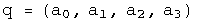
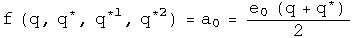
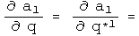
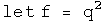
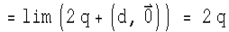
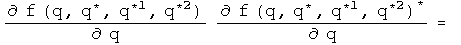

#  Quaternion Analysis

Complex numbers are a subfield of quaternions.  My hypothesis is that complex
analysis should be self-evident within the structure of quaternion analysis.

The challenge is to define the derivative in a non-singular way, so that a
left derivative always equals a right derivative.  If quaternions would only
commute...  Well, the scalar part of a quaternion does commute.  If, in the
limit, the differential element converged to a scalar, then it would commute.
This idea can be defined precisely.  All that is required is that the
magnitude of the vector goes to zero faster than the scalar.  This might
initially appears as an unreasonable constraint.  However, there is an
important application in physics.  Consider a set of quaternions that
represent events in space-time.  If the magnitude of the 3-space vector is less
than the time scalar, events are separated by a timelike interval.  It
requires a speed less than the speed of light to connect the events.  This is
true no matter what coordinate system is chosen.

##  Defining a Quaternion

A quaternion has 4 degrees of freedom, so it needs 4 real-valued variables to
be defined:

Imagine we want to do a simple binary operation such as subtraction, without
having to specify the coordinate system chosen.  Subtraction will only work if
the coordinate systems are the same, whether it is Cartesian, spherical or
otherwise.  Let e~0~, e~1~, e~2~, and e~3~ be the shared, but unspecified, basis.  Now
we can define the difference between two quaternion q and q' that is
independent of the coordinate system used for the measurement.

What is unusual about this definition are the factors of a third.  They will
be necessary later in order to define a holonomic equation later in this
section.  Hamilton gave each element parity with the others, a very reasonable
approach.  I have found that it is important to give the scalar and the sum of
the 3-vector parity.  Without this "scale" factor on the 3-vector, change in
the scalar is not given its proper weight.

If dq is squared, the scalar part of the resulting quaternion forms a metric.

What should the connection be between the squares of the basis vectors?  The
amount of intrinsic curvature should be equal, so that a transformation
between two basis 3-vectors does not contain a hidden bump.  Should time be
treated exactly like space?  The Schwarzschild metric of general relativity
suggests otherwise.  Let e~1~, e~2~, and e~3~ form an independent, dimensionless,
orthogonal basis for the 3-vector such that:

This unusual relationship between the basis vectors is consistent with
Hamilton's choice of 1, i, j, k if e~0~^2^ = 1.  For that case, calculate the
square of dq:

The scalar part is known in physics as the Minkowski interval between two
events in flat space-time.  If e~0~^2^ does not equal one, then the metric would
apply to a non-flat space-time.  A metric that has been measured experimentally
is the Schwarzchild metric of general relativity.  Set e~0~^2^ = (1 - 2 GM/c^2^
R), and calculate the square of dq:

This is the Schwarzchild metric of general relativity.  Notice that the
3-vector is unchanged (this may be a defining characteristic).  There are very
few opportunities for freedom in basic mathematical definitions.  I have
chosen this unusual relationships between the squares of the basis vectors to
make a result from physics easy to express.  Physics guides my choices in
mathematical definitions :-)

##  An Automorphic Basis for Quaternion Analysis

A quaternion has 4 degrees of freedom.  To completely specify a quaternion
function, it must also have four degrees of freedom.  Three other linearly-
independent variables involving q can be defined using conjugates combined
with rotations:

The conjugate as it is usually defined (q^*^) flips the sign of all but the
scalar.  The q^*1^ flips the signs of all but the e~1~ term, and q^*2^ all but the
e~2~ term.  The set q, q^*^, q^*1^, q^*2^ form the basis for quaternion analysis.  The
conjugate of a conjugate should give back the original quaternion.

Something subtle but perhaps directly related to spin happens looking at how
the conjugates effect products:

The conjugate applied to a product brings the result directly back to the
reverse order of the elements.  The first and second conjugates point things
in exactly the opposite way.  The property of going "half way around" is
reminiscent of spin.  A tighter link will need to be examined.

##  Future Timelike Derivative

Instead of the standard approach to quaternion analysis which focuses on left
versus right derivatives, I concentrate on the ratio of scalars to 3-vectors.
This is natural when thinking about the structure of Minkowski space-time,
where the ratio of the change in time to the change in 3-space defines five
separate regions: timelike past, timelike future, lightlike past, lightlike
future, and spacelike.  There are no continuous Lorentz transformations to
link these regions.  Each region will require a separate definition of the
derivative, and they will each have distinct properties.  I will start with
the simplest case, and look at a series of examples in detail.

Definition: The future timelike derivative:

Consider a covariant quaternion function f with a domain of H and a range of
H.  For a future timelike derivative to be defined, the 3-vector must approach
zero faster than the positive scalar.  If this is not the case, then this
definition cannot be used.  Implementing these requirements involves two limit
processes applied sequentially to a differential quaternion D.  First the
limit of the three vector is taken as it goes to zero, (D - D^*^)/2 -&gt; 0.
Second, the limit of the scalar is taken, (D + D^*^)/2 -&gt; +0 (the plus zero
indicates that it must be approached with a time greater than zero, in other
words, from the future).  The net effect of these two limit processes is that
D-&gt;0\.

The definition is invariant under a passive transformation of the basis.

The 4 real variables a0, a1, a2, a3 can be represented by functions using the
conjugates as a basis.

Begin with a simple example:

The definition gives the expected result.

A simple approach to a trickier example:

So far, the fancy double limit process has been irrelevant for these identity
functions, because the differential element has been eliminated.  That changes
with the following example, a tricky approach to the same result.

Because the 3-vector goes to zero faster than the scalar for the differential
element, after the first limit process, the remaining differential is a scalar
so it commutes with any quaternion.  This is what is required to dance around
the e~1~ and lead to the cancellation.

The initial hypothesis was that complex analysis should be a self-evident
subset of quaternion analysis.  So this quaternion derivative should match up
with the complex case, which is:

These are the same result up to two subedits.  Quaternions have three
imaginary axes, which creates the factor of three.  The conjugate of a complex
number is really doing the work of the first quaternion conjugate q^*1^ (which
equals -z^*^), because z^*^ flips the sign of the first 3-vector component, but no
others.

The derivative of a quaternion applies equally well to polynomials.

This is the expected result for this polynomial.  It would be straightforward
to show that all polynomials gave the expected results.

Mathematicians might be concerned by this result, because if the 3-vector D
goes to -D nothing will change about the quaternion derivative.  This is
actually consistent with principles of special relativity.  For timelike
separated events, right and left depend on the inertial reference frame, so a
timelike derivative should not depend on the direction of the 3-vector.

##  Analytic Functions

There are 4 types of quaternion derivatives and 4 component functions.  The
following table describes the 16 derivatives for this set

This table will be used extensively to evaluate if a function is analytic
using the chain rule.  Let's see if the identity function w = q is analytic.

Use the chain rule to calculate the derivative will respect to each term:

Use combinations of these terms to calculate the four quaternion derivatives
using the chain rule.

This has the derivatives expected if w=q is analytic in q.

Another test involves the Cauchy-Riemann equations.  The presence of the three
basis vectors changes things slightly.

This also solves a holonomic equation.

There are no off diagonal terms to compare.

This exercise can be repeated for the other identity functions.  One
noticeable change is that the role that the conjugate must play.  Consider the
identity function w = q^*1^.  To show that this is analytic in q^*1^ requires that
one always works with basis vectors of the q^*1^ variety.

This also solves a first conjugate holonomic equation.

Power functions can be analyzed in exactly the same way:

This time there are cross terms involved.

At first glance, one might think these are incorrect, since the signs of the
derivatives are suppose to be opposite.  Actually they are, but it is hidden
in an accounting trick :-)  For example, the derivative of u with respect to
a1 has a factor of e~1~^2^, which makes it negative.  The derivative of the first
component of V with respect to a0 is positive.  Keeping all the information
about signs in the e's makes things look non-standard, but they are not.  

Note that these are three scalar equalities.  The other Cauchy-Riemann
equations evaluate to a single 3-vector equation.  This represents four
constraints on the four degrees of freedom found in quaternions to find out if
a function happens to be analytic.

This also solves a holonomic equation.

Since power series can be analytic, this should open the door to all forms of
analysis.  (I have done the case for the cube of q, and it too is analytic in
q).

##  4 Other Derivatives

So far, this work has only involved future timelike derivatives.  There are
five other regions of space-time to cover.  The simplest next case is for past
timelike derivatives.  The only change is in the limit, where the scalar
approaches zero from below.  This will make many derivatives look time
symmetric, which is the case for most laws of physics.

A more complicated case involves spacelike derivatives.  In the spacelike
region, changes in time go to zero faster than the absolute value of the
3-vector.  Therefore the order of the limit processes is reversed.  This time
the scalar approaches zero, then the 3-vector.  This creates a problem,
because after the first limit process, the differential element is (0, D),
which will not commute with most quaternions.  That will lead to the
differential element not cancelling.  The way around this is to take its norm,
which is a scalar.

A spacelike differential element is defined by taking the ratio of a
differential quaternion element D to its 3-vector, D - D^*^.  Let the norm of
D approach zero.  To be defined, the three vector must approach zero faster
than its corresponding scalar.  To make the definition non-singular
everywhere, multiply by the conjugate.  In the limit D D^*^/((D - D^*^)(D - D^*^))*
approaches (1, 0), a scalar.

To make this concrete, consider a simple example, f = q^2.  Apply the
definition:

The second and fifth terms are unitary rotations of the 3-vector B.  Since the
differential element D could be pointed anywhere, this is an arbitrary
rotation. Define:

Substitute, and continue:

Look at how wonderfully strange this is!  The arbitrary rotation of the
3-vector B means that this derivative is bound by an inequality.  If D is in
direction of B, then it will be an equality, but D could also be in the
opposite direction, leading to a destruction of a contribution from the
3-vector.  The spacelike derivative can therefore interfere with itself.  This
is quite a natural thing to do in quantum mechanics.  The spacelike derivative
is positive definite, and could be used to define a Banach space.

Defining the lightlike derivative, where the change in time is equal to the
change in space, will require more study.  It may turn out that this
derivative is singular everywhere, but it will require some skill to find a
technically viable compromise between the spacelike and timelike derivative to
synthesis the lightlike derivative.

