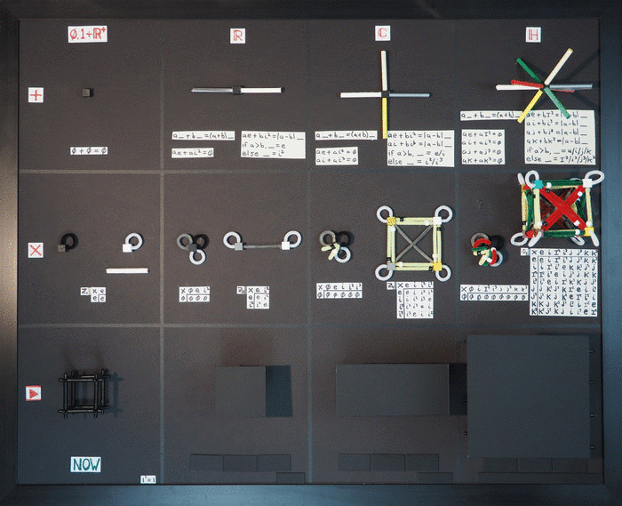
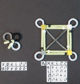

# Really Complex Quaternions

What is a quaternion? Mathematicians might claim it was the independent
inventions of Gauss, Hamilton, and Rodrigues. Unit quaternions are useful to
do 3D rotations and as an esteemed member of the standard model. They are also
one of many Clifford algebras, *Cl*(0, 2) being its formal name.

In this essay, the physics of space-time will drive the discussion, not
accidents of history. The words for real and imaginary numbers arose from a
catfight between mathematicians over complex numbers. The labels I will use
always have to be tied to space-time. Please consider this odd constraint a
playful way to think differently about numbers for physics

The method for constructing quaternions with the roots in space-time will
start with discrete groups. A discrete group can be made continuous. The theory
of Lie groups provides the background for such a process. Physics is about
stuff in motion. With both "stuff" and "motion" broadly defined, animations
will be provided.

I will detail the rules for addition, multiplication, and animations for 0,
the real numbers, the complex numbers, and the quaternions. Going into this
much detail requires my longest essay ever. To provide an overview, here is one
image with the information:

In this essay we will discuss each area to understand the logic of numbers
Nature may use to account for everything.

## Zero, One, and the Positive Real Numbers

Start with the trivial group. It has one member, call it the identity element
e, so the entire set is {e}. Mathematicians have provided a horrible label for
this group since it sounds unworthy of careful consideration. I was going to
do the same until I thought about how I was going to make a short film of this
discrete group. It is the shortest of all possible films, lasting exactly one
frame. I talked with the cinematographer, the lighting director, and the
artistic director about the shoot: they all thought it would be easy. The key
grip interrupted my mumbling to myself to ask what we were going to take a
picture of? The math consultant on the set said anything and everything can be
considered a way to represent the trivial group. The permutation operator,
call it *p*, means *epe=e*. The permutation operator works on any number or object
to be found in the Universe. Making a one frame film about everything did not
sound practical.

I remembered [Peano's work](https://en.wikipedia.org/wiki/Giuseppe_Peano) where he built number theory up from 0 and 1.  
I will focus on two operators, addition and multiplication, because together 
those are needed to make a mathematical field. A mathematical field in turn is 
the ground floor needed for calculus, the study of change in space-time. For 
addition, only the trivial group {0} has closure.  One plus one makes two after 
all. Here is a representation of the topology, the way things are connected for zero.

Downright trivial, as expected. There is only one thing, the black cube on a
black background. This image will get more complicated as new numbers are
examined.

The multiplication operator allows us to use either of the binary buddies to
represent the trivial group. Here are the 4 needed qualities for *e*=1:

1. There is closure: 1 x 1 = 1
1. There is an identity: 1
1. There is an inverse element in the group: 1
1. The operations are associative: (1 x 1) x 1 = 1 x (1 x 1)

The same can be done for *e*=0:

1. There is closure: 0 x 0 = 0
1. There is an identity: 0
1. There is an inverse element in the group: 0
1. The operations are associative: (0 x 0) x 0 = 0 x (0 x 0)

Notice I was careful not to talk about division. The operator is
multiplication and the set needs an inverse of multiplication. The set has one
element, and that element happens to be its own inverse with the
multiplication operator.

There is a good reason to never mention subtraction or division as operators.
Neither of them is associative:

(*a* - *b*) - *c* != *a* - (*b* -*c*)

(*a* / *b*) / *c* != *a* / (*b* / *c*)

These two operators are so ingrained in me, it is hard to part with them, but
I will do it for the sake of associativity and group theory :-)

Below is the product table, describing all possible multiplication products:

Trivial again because *e* x *e* = *e*.  The same information can be presented with
graph theory, where the cubes are vertices and the edges are the multipliers:

The vertex in the graph is the cube, the edge is the pipe cleaner. The rule
for multiplication is vertex times an edge goes to a vertex. In this simple
case, the edge makes a loop. I also included a white straw as a way to
represent the continuous version of the *e*=1 trivial group.

Recall one of the fundamental differences between zero and one under
multiplication:

n x 1 = n

n x 0 = 0

Think of the message these two simple equations tell. In the first case any
number gets to stay just like themselves. In the second case, the number must
become like 0. This is a source of tension in these two ways to represent the
trivial group with the multiplication operator.

Try to make the trivial group cover more ground by using the set of positive
real numbers that do not have zero, **R**+ \\{0}. A continuous group is formed by
multiplying the trivial group with *e*=1 times every element in the infinite set
**R**+ \\{0}. Each element in this continuous group will have a multiplicative
inverse. This part of the story is exclusively about multiplication.

Repeat this process exactly as before except to use *e*=0 as the representative
of the trivial group. Zero times the positive reals without zero always
generates a zero. The group remains trivial, having only one member.

I don't want to go overboard with the following claim, but it is the kind of
thing that makes thinking about physics interesting while I walk around. One
profound mystery in physics is how processes can be discrete as well as
continuous, the proverbial wave/particle duality. It would be cool if the root
of this mystery was an appreciation of the trivial group.

## The Trivial Film

Here is the one frame trivial film for *e*=0:

In space-time, now (*e*=0) goes on and on forever. The idea that this one frame
animation would last a billion years struck me as odd initially. Yet "now" is
something that is always in space-time without anyone's intervention. Now
requires no energy.

I don't think I can honestly make an animation of the trivial group with *e*=1,
or its continuous extension **R**+ \\{0}. The problem is with start of the film.
It necessarily is in the future. Because zero is explicitly excluded, there is
no now to start the film to then see what the future looks like based on a
math model.

Is the trivial group a mathematical field? It is time for me to open
"Principles of Mathematical Analysis" by Rudin and turn to page 5. One needs
both addition and multiplication to have group properties. Check. The
distributive law must also hold. Check. All three of these work in the case
for *e*=0. There is a stipulation (M4) that the multiplicative inverse is not
equal to the additive inverse. Therefore the trivial group is not a
mathematical field.

I will define something called the trivial mathematical field. It has every
rule set out in Rudin without the requirement that the additive inverse be
distinct from the multiplicative one. The trivial group with *e*=0 is a trivial
mathematical field. The trivial group with *e*=1 is not a trivial mathematical
field because addition is not closed.

Some might complain that the trivial mathematical field is beyond dull. I
argue that change can only be understood against a backdrop that has no
capacity to change. It is the canvas for change. "Now" is an unchanging
quality of the Universe. I sometime call it the observer where the observer is
as passive as can be imagined. By contrast, I think of one as a signal in
space-time.

The trivial group will be there in all subsequent discussions of the real
numbers, the complex numbers, and quaternions. The tension between
zero/now/observer and one/signal will remain.

## The Real Numbers

Start by understanding the rules for multiplication that require the [abelian
cyclic group Z~2~](http://groupprops.subwiki.org/wiki/Cyclic_group:Z2), also known as the sign group. Here is the product table:

In practice, the way to use a product table is to pick one value from the
first column then multiply it by something from the top row to get the result
from where they meet in the table. So *e* x *e* = *e* which is the trivial group product
discussed in the previous section and *e* x *i^2^* = *i^2^*. Because the off diagonal
elements are symmetric, the group is abelian, meaning the order of
multiplication does not matter.

The labels one uses for the product table (the *e* and *i^2^*) don't matter unless
one wants to tell a longer, logically consistent story. Since I have to pass
through complex numbers on the way to quaternions, the *i^2^* will be helpful. The
folks at groupprops.subwiki.org use x, but -1 is common. To be honest, I use
-1 to check I did things right.

Graph theory can be used to communicate the same information:

The vertices are the cubes, the edges are the pipe cleaners. The trivial group
with *e*=0 in black is here. The trivial group with *e*=1 is here too. The gray
cube with the white loop is not the trivial group since it involves both *e* and
*i^2^*. The four products in the product table should be easy to find in the
graph.

If the information is exactly the same, why present both the product table and
graph? The reason is biological: language is processed in a different part of
the brain that the visuals (which happens against the back wall of the skull).
More processing power is built into visual analysis, so it would be good to
have a precise visual representation of these ideas.

It is common practice to not include the white loops. I am consistently
against dropping "obvious" information. Explicit trumps implicit. The gray
pipe cleaner is bi-directional because the vertex *e* times *i^2^* gets to the *i^2^*
vertex, while *i^2^* times *i^2^* returns to *e*.

While the discrete groups may help us understand multiplication, to get closure
with addition we often need infinite sets. Start with a discrete example:

*e* + *i^2^* = 0

The astute reader will notice how this expression needs both possible
representations for the trivial group: *e*=0 and *e*=1, the additive and
multiplicative identities respectively. It is the multiplicative identity that
can be used to cover all the real numbers as before: multiply *e*=1 and *i^2^* by
the set of positive reals without zero.

A way to represent the real numbers addition is with the real number line:

What is this figure really? It is not a graph which has a vertex, edge, and
vertex. I look at it as a statement of topology: the positive numbers connect
to the negative numbers at the additive inverse and nowhere else. Zero
provides the bridge between sets of non-zero numbers.

The real numbers with both the addition and multiplication operators form a
mathematical field.

## Animations of Time Numbers

What do real numbers represent in patterns of events in space-time? Time. Like
the real numbers, time is a totally ordered set. One event in time can either
be:

  1. before another event
  2. after another event
  3. at the same time as another event

for any particular observer. The "particular observer" caveat is important
from what we know of special relativity. Two observers can and will disagree
about what should be said about the order in time of any particular set of
events, but each observer individually has a specific ordering.

Instead of the label "real numbers", I will use the label "time numbers". All
the properties of real numbers are found in time numbers. I am forcing this
jargon change on myself to shift how I view numbers, from something full of
the history of mathematics to how Nature may use numbers in space-time.

For time numbers, zero is now. The location of now is arbitrary. The past is a
distance in time from a past event to now. The future is a distance in time
from now to a future event. When one says that there is always an additive
inverse, that means there always is a time in the past that is equally far
from now as a time in the future is from now.

I will do a discrete time animation first. This short film has three times: one
for *i^2^*, 0, and *e*. Those frames represent the past, now, and future time
respectively. My first discrete time number film titled "100" has an event in
the past and nothing else.

I have put the short film on repeat. Here is the film titled "101":

Notice the symmetry: the past looks exactly like the future. That is the case
for half of the eight possible discrete videos.

What does zero look like? It depends on which element one uses. If it is *e*=0,
the observer, then now is a blank cube. If it is *e*=1, the signal, then we
expect a box in the now cube.

I hope you find this as troubling as I did initially. The roots go back to the
two representations of the trivial group that have quite different properties.
If *e*=0, that is the blank, always blank idea of now. This one is easy to
accept. It is also easy to accept the signal in the past as a white cube or in
the future as a white cube. The idea of treating time as a number is that any
moment can be made to be now. When a future signal becomes now, it will still
be a signal at time now (aka zero).

Another way to view this is that every material object in the universe
necessarily requires both representations of the trivial group. If I am
looking at the object, it is a signal. If the object is being the observer, it
is the center of its own world in time and space.

There are 2^3^=8 discrete time number films.

I have a difficult time digesting 8 animations (8 stills is far more simple
for my brain). The upper left hand corner is all observer, all zeros. The
lower right is all signals, all the time. Each horizontal pair is different in
the now frame. Each vertical pair is different in the past frame, but has the
same now and future.

A continuous animation of time creates a conceptual problem: how to deal with
infinity. No critical reader will believe an animation started infinitely long
ago in the past, not that I have the resources to keep a film going beyond
four billion years when the Sun becomes a red giant and envelopes the Earth. I
really just need to understand Lie algebras better. That will have to await
another day. Let me just assert there should be a way to go from the discrete
cyclic group Z~2~ to a continuous, smooth group and union that with the
trivial group with *e*=0. In other words, have a limited section of the time
number line including zero. Consider this graph of points on the time number
line:

An animation of the time number line is nothing more than a steady scan from
left to right:

There is no space to this animation. Something is either there or not. The
moment marked as now should feel completely arbitrary because it is. Now is
also brief in this context. You need to watch for it as it blinks by. An
essential quality of time numbers is that any point can be designated as now,
the additive inverse of zero.

But wasn't now forever? Yes for the trivial group, not so with a past and
future defined.

## The Time Number Doublet

I have said I want to only write down positive numbers because a minus
operator is not associative. That creates a problem. How should I write down a
negative number? Perhaps I could insist that the minus sign never be used as
an operator, instead always staying "close" to the number in question. Yet
there is a bigger issue: the group Z~2~ looks, well, like it should involve two
things. The same applies to the addition rule which has two continuous sets
that meet at zero. The two sets have different labels, but otherwise are
precisely the same sets. Time numbers are constructed from two different
representations of the trivial group, *e*=0 and *e*=1. How can we use both?

With real numbers, notation is easy: numbers come in 1-tuples: (1), (-2),
(0)... No one actually wastes the effort to write parentheses. I propose a new
nomenclature for time numbers called the doublet. Let me show, then tell:

The rules for doublets are simple: one or two of the numbers inside the square
brackets must be zero. A doublet without a zero is not allowed. The first one
is the positive number, the second one is the additive inverse.

An event described by *a* time number can be in the future ([*a*, 0]), in the past
([0, *b*]), or now ([0, 0]), but never in the past and future. Events work that
way. Real numbers have the same property: no number can be both positive and
negative.

Writing out an additive inverse is simplicity itself:

All this says is adding the time *a* in the future plus the time *a* in the past
brings one to now.

## Hidden But Not a Hidden Variable

For the discrete time number animations, I had titles like "000" and "010".
They were visually distinct. Perhaps triplets should be used instead of
doublets for time numbers. I suspect that is the wrong approach. How can we
learn about zero using addition and multiplication? Addition would provide no
information since 0+*a*=*a*. Multiplication is no better, leaving us where we
started - at now=0 no matter what number is used.

One could just wait until now was in the past. The problem with such an
approach is the current now is suffering the same plight. I summarize the
situation like so:

    "You cannot know yourself, you can only be yourself in the moment."

All observers, big and subatomic, are in this same boat due to the
mathematical logic. Now is not subject to change. Now is.

## Complex Numbers

Start as before by understanding the rules of multiplication. Those rules are
contained in the [abelian cyclic group Z~4~](http://groupprops.subwiki.org/wiki/Cyclic_group:Z4). Here is the product table:

I love how no minus signs are needed since that is one of the oldest rules I
learned about the products of complex numbers. Here again my expectations were
wrong: I expected two things but have four. Fortunately the group theory nerds
are on my side, saying the cyclic group Z~4~ over the complex numbers except
zero is the reason for the rules of complex number multiplication.
The trivial group with *e*=1 lives in the upper left hand corner. The cyclic 
group Z~2~ is also there as the intersection of the first and third columns.

The graph of the multiplication will show the same information as the product
table to a different part of the brain.

The edges with *e* and *i^2^* in white loops and the gray cross are bi-directional.
The edge in yellow with a white bead is *i*, but with a black bead is *i^3^*. These
edges are directional. The vertex *e* times *i* gets to *i*, but to go back, one
needs to multiply *i* by *i^3^* to get to *e* because four *i*'s make an *e*. The *i*'s go
clockwise while *i^3^*'s go counterclockwise. This provides a simple data quality
check. The graph for time number multiplication is the diagonal going from *e*
to *i^2^*.

To make these discrete rules for multiplication cover more ground, construct a
continuous group by multiplying each of the four elements in Z~4~ by the
positive reals without zero. This provides an understanding of multiplying
complex numbers, but is silent about addition.

Addition requires the time number rule plus a new one:

*e* + *i^2^* = 0

*i* + *i^3^* = 0

These two rules again use both ways to represent the trivial group. The key
thing to notice is that both rules share the same additive identity. That
requires the real number line which contains *e* and *i^2^*, must intersect the
imaginary one, with *i* and *i^3^* like so:

This is the complex plane. Addition works like one would expect. Multiplying
by a time number expands or contracts how long something is around.
Multiplying by an imaginary number creates a rotation of space-time.

## Animations of Distance-time Numbers

What is in a name? That which we call a complex number by any other name would
do math as sweet. To assert a connection with events in space-time, I will
call complex numbers distance-time numbers. The time (or real) part is a
measure from the origin to an event either in the past or the future. The
distance is also relative to the origin. The distance is along *i* or its
additive inverse *i^3^*.

Start with a discrete, three frame animation which has a past, now and future
spread in space from *i^3^* to the origin out to *i*:

Introduce a new operator, the conjugate, that puts *i* values into *i^3^* and the
reverse. Repeat the above animation, but include the conjugate values:

The conjugate operator is a spatial mirror. A pair of images are seen on
opposite sides of the origin. This animation also happens to be symmetric in
time - the past looks like the future. Together, these two symmetries are used
in the continuous U(1) gauge symmetry of electromagnetism.

There are a total of 2^3*3^=512 different animations in this discrete universe
with three slots for time and three for space. One important upgrade from time
to distance-time animations is now one can animate strings. In the time number
animations, all we saw was blinking. With distance-time animations, there can
be strings extended in space.

Where there is a string, one can start to make loops like so:

One thing I ponder is whether the 512 different discrete animations constitute a
complete "alphabet" for the continuous complex plane. In other words, any and
every pattern in a complex plane could be represented using a combination of
the 512 discrete cases. Probably not, but they might be able to approximate
every possibility.

For the continuous movies (not shown, imagine longer animations), multiplying
by a time of 2 makes the distance to now twice as big. The product of two
events at time=now which both have *i* values becomes an event in the past. The
product of two time=now events, one with *i*, the other with *i^3^*, will be an
event in the future. If you find yourself fighting such an interpretation,
recall that all that is happening is a left-to-right line scan of the complex
plane.

## Distance-time 2-tuples of Doublets

Addition requires 4 straws, one for *e*, *i*, *i^2^*, and *i^3^* and the cube for *e*=0. The
group Z~4~ has the first four elements and Z~1~ covers *e*=0. Two doublets should do
the work:

The first doublet is better known as the real numbers, the second as the
imaginary numbers. When animated, the first doublet is for time, in this case,
an event in the future. The second number is a distance, this one along *i^3^*.

## Quaternions

The pattern used in this essay should be established. Start by explaining the
multiplication rule using a discrete group. Show the graph for that group. Write
out the rules for addition and its topology. Show an animated version of the
number. The only thing that changes is that the story gets more complicated.
The logical consistency can be checked at any time by looking for the trivial
group Z~1~ with both representations, Z~2~, and Z~4~ at any stage of the process.

I have always described a quaternion as three complex numbers that share the
same real number. See what happens if one uses that idea with the group Z~4~ to
write out the product table for quaternion multiplication:

Notice how the highlighted rows are identical. You should also be able to spot
three columns that have the same property. This suggests we could introduce a
new label that was a composition of these three rows:

*I^2^* = (*i^2^* \+ *j^2^* \+ *k^2^*)/3

Instead of a product table with 10x10 rows, the substitution would lead to one
that was 8x8 which looks like so:

The result is not a cyclic group due to the reduction of terms. This exercise
has derived the quaternion group Q~8~. That group provides the rules of
quaternion multiplication so abstract no minus signs are needed. Note that
often people use them, but it is not necessary. I still find this odd, but it
is consistent with the story told so far.

The trivial group Z~1~ and cyclic groups Z~2~ and Z~4~ live in the upper left hand
quarter of the product table. Notice how elements in that quarter are
symmetric over the diagonal.  This is a sign that the three groups are
abelian, meaning the order of multiplication does not matter. The same cannot
be said for the quaternion group Q~8~. The off diagonal elements are the same if
one of the terms is *e* or *I^2^*. Otherwise, the off-diagonal terms are the same
element - and *i*, *j*, or *k* \- but will be to the first power on one side and a
cube on the other. If you have played Sudoku, you will notice that each of the
eight elements appears only once per row and once per column.

The graph for multiplication using the quaternion group Q~8~ is the most complex
we have seen so far:

The complex planes run along diagonals. One error checking technique I use is
to make sure the white directional beads go in a circle opposite of the black
ones. You should be able to spot several complex planes, six in all.

Addition must be just like before, only more complicated, four lines instead
of two:

*e* + *I^2^* = 0

*i* + *i^3^* = 0

*j* + *j^3^* = 0

*k* + *k^3^* = 0

All share the same zero, the additive inverse.

When I constructed this with a hot glue gun, it was simple enough to have six
straws line up and pass through the cube which has six faces. It was
appropriate to put the spatial ones there. The white and gray straws stick out
from corners, hanging on to three edges with a big wad of glue.

It might have been more accurate to do all the addition and multiplication
steps using animation. Such an effort will have to wait.

One thing should be striking: complex numbers look like they are great to deal
with flat planes, while quaternions are obviously designed for the animated 3D
world we live in:

Modern mathematical physics uses complex numbers and avoids quaternions.
Visually, I can no longer defend the status quo.

## Animations for Space-time Numbers

I favor using the label "space-time numbers" over quaternions for a few
reasons. Hamilton chose "quaternions" to emphasize the four-ness of his big
insight since he had spent a fruitless decade trying to multiply - and divide
- triplets of numbers. The name suggests four equal partners. There is a
separation between one part and the other three. That is clear from the dash
in space-time numbers.

Quaternions were thought of as a series of multiplication rules over four real
numbers. In this essay, I have gone to great lengths to start from the trivial
group. Space-time numbers are not a mathematical field because they do not
commute. That makes quaternions a division algebra, a post some consider less
lofty. The thing to recall is that from any and all places in space-time, it
is possible to get to any other place in space-time with the rules of addition
and multiplication set out for space-time numbers. It is also possible to go
back, because there is both an additive and multiplicative inverse.

The largest surprise was the size of the discrete possible animations. A cell
could be filled in or blank. There is the past, now, and future. Space has
3^3^=27 possibilities. The number of discrete films one could make with this
limited palette is 2^3*27^=2^81^=\~2.4x10^24^. This so swamps the 512 possible
discrete distance-time number of animations. Nature has impressive diversity.
Space-time numbers - even the discrete collection - looks like it is large
enough to encompass Nature's diversity.

Here is a simple animation: linear motion.

The time-numbers always has a signal. The distance-time numbers moves to the
right. The space-time numbers moves right and down. There are 26 different
lines one could follow. An open question is how to map from the distance-time
numbers to the space-time numbers since the latter has two more degrees of
freedom.

The animation of a string for distance-time numbers can also be done for
space-time numbers:

I added a twist in the future of space-time numbers in the third panel that is
not visible in the distance-time numbers in the middle. Extra degrees of
freedom can have visible consequences.

Here are the loops:

I did make a lot of arbitrary choices in the final panel. That is what having
a discrete space of 2.4x10^24^ possibilities is like.

There are also new things that can happen. For example, consider a dynamic
membrane, an area that moves:

I have no idea how to work with dynamic membranes.

## Backwards From Space-time Numbers

This essay has built up quaternions from the decidedly simple, isolated trivial
group to the eight members of the quaternion group Q~8~ that all connect to
zero. The process was additive. Without being destructive, can we see the
simpler structures of distance-time and time numbers in space-time numbers?
Start with this summary image:

Become red-green-yellow color blind. For addition, there are three straws
above the white/gray line, and three straws below. For distance-time numbers,
the three straws above act as one imaginary basis, the other three as the cube
of that basis. The gray straw is the square of this new basis.

Going from the cube to the plane looks like a good math puzzle. For each
color, one of the complex planes involves *e* and *i^2^*. This would have to be the
final plane. Then one would have to come up with a few rules about how to go
from red-green-yellow to just one color.

To get the animation to be like a distance-time, only count two of the three
dimensions. For example, give credit for how top or bottom it is, but ignore
how much it is left/right and up/down.

For the time numbers, one approach is to take the results of the distance-time
numbers and roll up the paper, so the plane become a tube along the time
number line. Alternatively, one could either take the square of any imaginary
value which then tosses things onto the *i^2^* line. One might prefer to work with
the norm of imaginary numbers that puts numbers onto e. For the animation, the
only thing that counts is if there is a signal in the cube.

## Space-time 4-tuple of Doublets

Quaternions can be viewed as a 4-tuple of real numbers. That will not work for
space-time numbers that start one step below real numbers with two
representations of the trivial group. An 8-tuple would be so wrong. A 4-tuple
of doublets may make sense:

Some might object to writing at least 4 zeroes every time. In this case, 5
zeroes were needed. I would argue this is how we normally describe events, but
we use silence for the zeroes. Say we observe something in the past, to the
left, high in the sky in front of us. We don't have to say the event was not
in the future, it was not on the right, nor was it below and behind us. The
doublet notation makes these four implicit statements explicit.

For anyone who has made it to the end, thanks for reading. I hope I was
precise about what I think a space-time numbers is, a really complex
quaternion that may have untapped power to explain patterns of events in
space-time.

