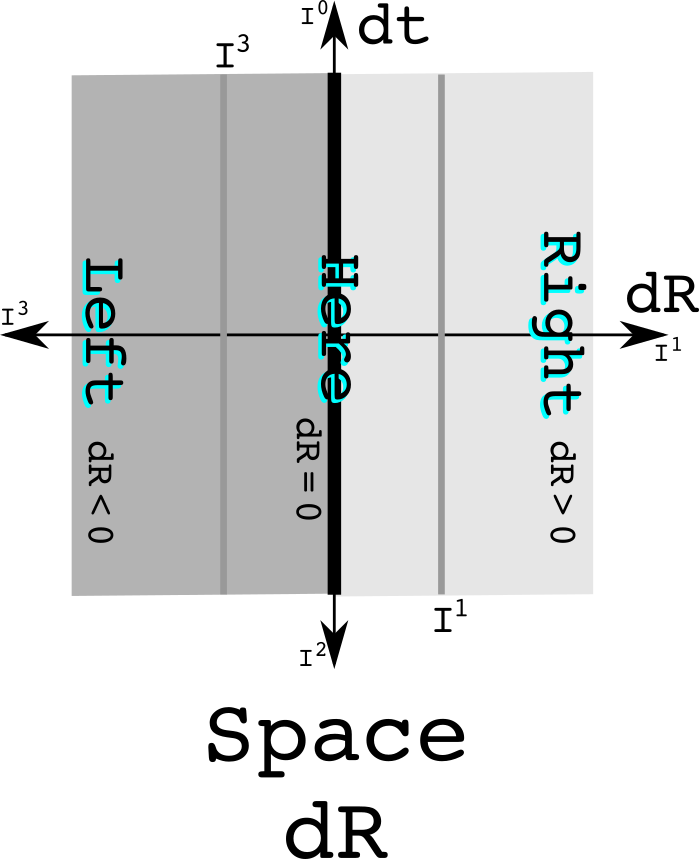
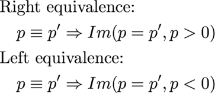
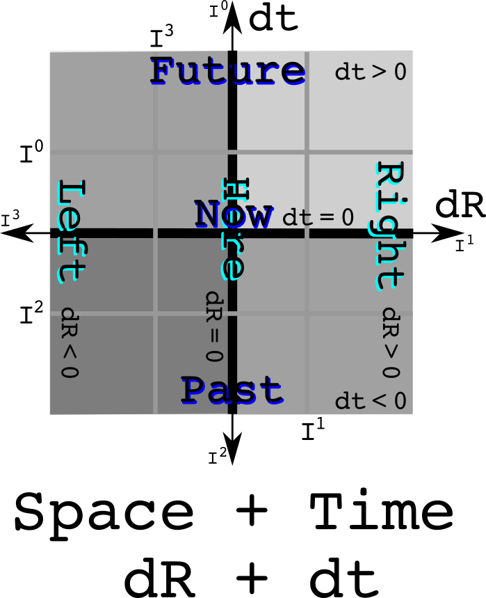
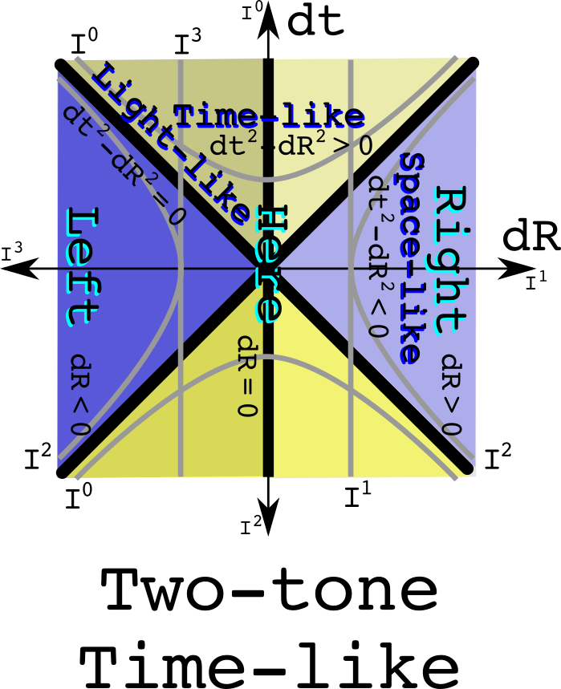
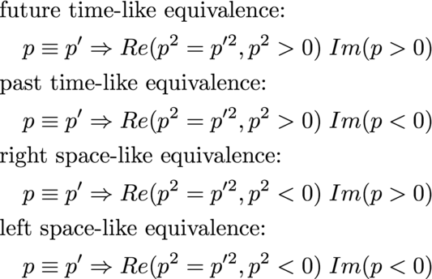

# Using quaternion equivalence classes to understand space-time and physics

Space-time is a big place. It holds every event that has ever happened since
the big bang, and all future events everywhere. An equivalence class can be
used to partition space-time into smaller, disjoint sets. Here is a simple
example: the past and the future are separated by now.

Observations of Nature involve looking at differences which is why dt and dR
are used. The measurement of time is a real number while measurements of space
uses three imaginary numbers. An equivalence relation can be defined to say
what it means to be at the same time in the future or the past:

Knowing if something is in the past or the future uses only the real part of
a quaternion. The equivalence class of one day in the future does use where
one happens to be.

A similar analysis can be done to divide space into equivalence classes such as 
left and right separate by here, or up and down separated by here, or near and
far separated by here. Look at the first case:

Notice that there is one line that divides space-time. The equivalence classes 
all are straight.

For space, the equivalnce relation isolates the imaginary values:

When things happen - the real part - does not matter when partitioning by here,
a spatial difference of zero from the reference observer.

## Where is plus and minus one?

Quaternions can be viewed as three complex numbers that share the same real
value, the three pairs being (t, x), (t, y) and (t, z) with t being the 
shared real value. The multiplication rule for complex numbers is the cyclic group Z~2~. 
This means that I^0^ or I^4^ are the same as +1, and I^2^ is the same as -1.
Why bother? It helps make clear that the reals can mingle with the imaginary.
The real and imaginary numbers are cut from the same cloth. It is allowed to
work with a factor of "I" that is raised to a number that is not an integer.

## Time + space equivalence classes

Equivalence classes can be combined. Do so with here and now as the separators:

Notice how nice and square things are. This is Newtonian physics. Both time and
space are absolutes and do not mix with each other.

## The light cone as a divider of space-time

Light has an interval of zero: the changes in time are exactly equal to the 
changes in space. Space-time is seperated into two regions where the origin
can have a causal relationship with other event - the time-like areas - and 
there are the regions that are too far away in space-time for a photon to reach
the origin:

These regions are separate. It no longer makes sense to draw an equivalence
class as a straight line because that line would then not remain in the separate
regions. If two events are the same interval away from the origin, then they are
both on the same hyperbola.

The equivlance relation uses the square of a quaternion:

The only thing that is different in the equivalence relation between time and
this one for special relativity is using a quaternion to the first or second
power respectively.

Combine the time and causality equivlance classes:

Notice that the future time-like cone is all the same yellow as is the past
time-like cone. The space-like regions have two tones because the upper part is
in the future while the lower is in the past. A hyperbola travels between the
two. Therefore one cannot say if a space-like event is in the past or the
future. 

The equivalence relation combines the one for time and causality:

This has equivalence relations in linear and quadratic function of quaternions.

Combine the space and causality equivalence classes:

Space is a solid color which makes total since one used the space equivalence
class. It is time that is two tone, so left and right, up and down, and near
and far depend on the motion of an observer.

The equivalence relations would be the same as the previous four cases except
that one would work with linear imaginary values.

The ability to combine equivalence classes suggest considerable power in this 
purely geometric approach.

## Space + Time relativisticly may be gravity

In the classical combination of time and space, the two did not mix. Now allow
the two to mix. The result should look like a light cone rotated by 45 degrees.

The curved lines cannot be due to a linear time. The least required is a 
quadratic term. There is also the constraint that this quadratic term must be
zero when dt is zero and dR is zero. Thus, the curves must be dtdR. I call these
space-times-time, an imaginary quantity. The equivalence relation is the
imaginary twin of the one for special relativity:

This equivalence could be divided further into each of the four quadrants, but
that would be of questionable value. One of the more remarkable features of
gravity is the universal attraction - it doesn't know how to change signs.

## The U(1) and the circle of light

So far, four straight lines have been used to slice up space-time. Now try a
unit circle. One problem is that if zero is at the origin as one always does, 
then the space-time plane is not divided into two regions. Instead, let the
circle have a value of zero and let a one sit at the origin.

This has the equation for a circle. This is also the norm of a quaternion, the
product of a quaternion with its conjugate. The norm of one and its additive
inverse is one.

## SU(2) as the imaginary extension of U(1)

The weak force as SU(2) as its gauge symmetry group. The group SU(2) is also
known as the unit quaternions. Because it has three elements in its Lie algebra
su(2), this requires think about representing space using three numbers.

