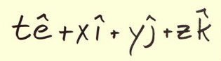

# Quaternion math

1. [Overview](overview.md)
1. [A brief history](history.md)
1. [Numbers 101 site](numbers_101.md)
1. [Multiplying the easy way](multiplying.md)
1. [Products](products.md)
1. [Scalars, vectors, tensors, and all that](scalars_vectors.md)
1. [Complex quaternions](complex_quaternions.md) A long essay that starts from 
the trivial group and builds out to numbers appropriate for space-time events,
including a small variation on quaternions.
1. [Quaternion analysis](analysis.md)
1. [Equivalence classes in space-time](equivalence_classes.md)
1. [Topology](topology.md)
1. [Where quaternions fit in math](fit.md)
1. [Tools](tools.md)
