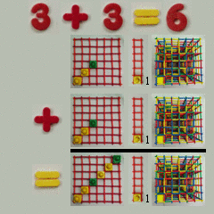

 # Animated math

 I have a website dedicated to this one subject. I built models out of simple
 blocks. If you want to visit, great, this link will open up in a new tab:

 <a href="https://dougsweetser.github.io/simply_animate_math/" target="_blank">Numbers 101</a>

