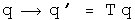

#  Scalars, Vectors, Tensors and All That

According to my math dictionary, a tensor is ...

    An abstract object having a definitely specified system of components in every
    coordinate system under consideration and such that, under transformation of
    coordinates, the components of the object undergoes a transformation of a
    certain nature.

To make this introduction less abstract, I will confine the discussion to the
simplest tensors under rotational transformations.  A rank-0 tensor is known
as a scalar.  It does not change at all under a rotation.  It contains exactly
one number, never more or less.  There is a zero index for a scalar.  A rank-1
tensor is a vector.  A vector does change under rotation.  Vectors have one
index which can run from 1 to the number of dimensions of the field, so there
is no way to know a priori how many numbers (or operators, or ...) are in a
vector.  n-rank tensors have n indices. The number of numbers needed is the
number of dimensions in the vector space raised by the rank.  Symmetry can
often simplify the number of numbers actually needed to describe a tensor.

There are a variety of important spin-offs of a standard vector.  Dual
vectors, when multiplied by its corresponding vector, generate a real number,
by systematically multiplying each component from the dual vector and the
vector together and summing the total.  If the space a vector lives in is
shrunk, a contravariant vector shrinks, but a covariant vector gets larger.  A
tangent vector is, well, tangent to a vector function.

Physics equations involve tensors of the same rank.  There are scalar
equations, polar vector equations, axial vector equations, and equations for
higher rank tensors.  Since the same rank tensors are on both sides, the
identity is preserved under a rotational transformation.  One could decide to
arbitrarily combine tensor equations of different rank, and they would still
be valid under the transformation.

There are ways to switch ranks.  If there are two vectors and one wants a
result that is a scalar, that requires the intervention of a metric to broker
the transaction.  This process in known as an inner tensor product or a
contraction.  The vectors in question must have the same number of dimensions.
The metric defines how to form a scalar as the indices are examined one-by-
one.  Metrics in math can be anything, but nature imposes constraints on which
ones are important in physics.  An aside: mathematicians require that the distance
is non-negative, but physicists do not.  I will be using the physics notion of
a metric.  In looking at events in space-time (a 4-dimensional vector), the
axioms of special relativity require the Minkowski metric, which is a 4x4 real
matrix that has (1, -1, -1, -1) down the diagonal and zeros elsewhere.  Some
people prefer the signs to be flipped, but to be consistent with everything
else on this site, I choose this convention.  Another popular choice is the
Euclidean metric, which is the same as an identity matrix.  The result of
general relativity for a spherically symmetric, non-rotating mass is the
Schwarzschild metric, which has "non-one" terms down the diagonal, zeros
elsewhere, and becomes the Minkowski metric in the limit of the mass going to
zero or the radius going to infinity.

An outer tensor product is a way to increase the rank of tensors.  The tensor
product of two vectors will be a 2-rank tensor.  A vector can be viewed as the
tensor product of a set of basis vectors.

##  What Are Quaternions?

Quaternions could be viewed as the outer tensor product of a scalar and a
3-vector.  Under rotation for an event in space-time represented by a
quaternion, time is unchanged, but the 3-vector for space would be rotated.
The treatment of scalars is the same as above, but the notion of vectors is
far more restrictive, as restrictive as the notion of scalars. Quaternions can
only handle 3-vectors.  To those familiar to playing with higher dimensions,
this may appear too restrictive to be of interest.  Yet physics on both the
quantum and cosmological scales is confined to 3-spatial dimensions.  Note
that the infinite Hilbert spaces in quantum mechanics a function of the
principle quantum number n, not the spatial dimensions.  An infinite
collection of quaternions of the form (En, Pn) could represent a quantum
state.  The Hilbert space is formed using the Euclidean product (q* q').

A dual quaternion is formed by taking the conjugate, because q* q = (t^2 \+
X.X, 0).  A tangent quaternion is created by having an operator act on a
quaternion-valued function

What would happen to these five terms if space were shrunk?  The 3-vector F
would get shrunk, as would the divisors in the Del operator, making functions
acted on by Del get larger.  The scalar terms are completely unaffected by
shrinking space, because df/dt has nothing to shrink, and the Del and F cancel
each other.  The time derivative of the 3-vector is a contravariant vector,
because F would get smaller.  The gradient of the scalar field is a covariant
vector, because of the work of the Del operator in the divisor makes it
larger.  The curl at first glance might appear as a draw, but it is a
covariant vector capacity because of the right-angle nature of the cross
product.  Note that if time where to shrink exactly as much as space, nothing
in the tangent quaternion would change.

A quaternion equation must generate the same collection of tensors on both
sides.  Consider the product of two events, q and q':

Where is the axial vector for the left hand side?  It is imbedded in the
multiplication operation, honest :-)

The axial vector is the one that flips signs if the order is reversed.

Terms can continue to get more complicated.  In a quaternion triple product,
there will be terms of the form (XxX').X".  This is called a pseudo-scalar,
because it does not change under a rotation, but it will change signs under a
reflection, due to the cross product.  You can convince yourself of this by
noting that the cross product involves the sine of an angle and the dot
product involves the cosine of an angle. Neither of these will change under a
rotation, and an even function times an odd function is odd.  If the order of
quaternion triple product is changed, this scalar will change signs for at
each step in the permutation.

It has been my experience that any tensor in physics can be expressed using
quaternions.  Sometimes it takes a bit of effort, but it can be done.

Individual parts can be isolated if one chooses.  Combinations of conjugation
operators which flip the sign of a vector, and symmetric and antisymmetric
products can isolate any particular term.  Here are all the terms of the
example from above

The metric for quaternions is imbedded in Hamilton's rule for the field.

This looks like a way to generate scalars from vectors, but it is more than
that.  It also says implicitly that i j = k, j k = i, and i, j, k must have
inverses.  This is an important observation, because it means that inner and
outer tensor products can occur in the same operation. When two quaternions
are multiplied together, a new scalar (inner tensor product) and vector (outer
tensor product) are formed.

How can the metric be generalized for arbitrary transformations?  The
traditional approach would involve playing with Hamilton's rules for the
field.  I think that would be a mistake, since that rule involves the
fundamental definition of a quaternion.  Change the rule of what a quaternion
is in one context and it will not be possible to compare it to a quaternion in
another context.  Instead, consider an arbitrary transformation T  which takes
q into q'

T is also a quaternion, in fact it is equal to q' q^-1.  This is guaranteed to
work locally, within neighborhoods of q and q'.  There is no promise that it
will work globally, that one T will work for any q.  Under certain
circumstances, T will work for any q.  The important thing to know is that a
transformation T necessarily exists because quaternions are a field. The two
most important theories in physics, general relativity and the standard model,
involve local transformations (but the technical definition of local
transformation is different than the idea presented here because it involves
groups).

This quaternion definition of a transformation creates an interesting
relationship between the Minkowski and Euclidean metrics.

In order to change from wrist watch time (the interval in space-time) to the
norm of a Hilbert space does not require any change in the transformation
quaternion, only a change in the multiplication step. Therefore a
transformation which generates the Schwarzschild interval of general
relativity should be easily portable to a Hilbert space, and that might be the
start of a quantum theory of gravity.

##  So What Is the Difference?

I think it is subtle but significant.  It goes back to something I learned in
a graduate level class on the foundations of calculus.  To make calculus
rigorous requires that it is defined over a mathematical field. Physicists do
this be saying that the scalars, vectors and tensors they work with are
defined over the field of real or complex numbers.

What are the numbers used by nature?  There are events, which consist of the
scalar time and the 3-vector of space.  There is mass, which is defined by the
scalar energy and the 3-vector of momentum.  There is the electromagnetic
potential, which has a scalar field phi and a 3-vector potential A.

To do calculus with only information contained in events requires that a
scalar and a 3-vector form a field.  According to a theorem by Frobenius on
finite dimensional fields, the only fields that fit are isomorphic to the
quaternions (isomorphic is a sophisticated notion of equality, whose
subtleties are appreciated only by people with a deep understanding of
mathematics).  To do calculus with a mass or an electromagnetic potential has
an identical requirement and an identical solution.  This is the logical
foundation for doing physics with quaternions.

Can physics be done without quaternions?  Of course it can!  Events can be
defined over the field of real numbers, and then the Minkowski metric and the
Lorentz group can be deployed to get every result ever confirmed by
experiment.  Quantum mechanics can be defined using a Hilbert space defined
over the field of complex numbers and return with every result measured to
date.

Doing physics with quaternions is unnecessary, unless physics runs into a
compatibility issue.  Constraining general relativity and quantum mechanics to
work within the same division may be the way to unite these
two separately successful areas. 

**Update** Nope, not going to work according to my current efforts. An new
symmetry is at the heart of gravity, basically the great Minkowski light cone
rotated by 45 degrees. Quantum mechanics need quaternion series which is
neither normed or a division algebra (it is a semi-group instead).

