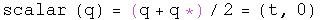
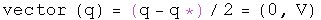
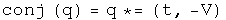

# A Quaternion Algebra Tool Set

Here is a compilation of basic algebra for quaternions.  It should look very
similar to complex algebra, since it contains three sets of complex numbers, t
+ x i, t + y j, and t + z k.  To strengthen the link, and keep things looking
simpler, all quaternions have been written as a pair of a scalar t and a
3-vector V, as in (t, V).  All these relations have been tested in a C library
and a Java quaternion calculator.

Technical note: it is vital that every tool in this set can be expressed as
working with a whole quaternion q.  This will make doing quaternion analysis
with automorphic functions fruitful.

##  Parts

##  Simple algebra

##  Multiplication

The Grassman product as defined here uses the same rule Hamilton developed.
The Euclidean product takes the conjugate of the first of the two elements
(following a tradition from quantum mechanics).

##  Trigonometry

Note: since the unit vectors of sine and cosine are the same, these two
commute so the order is irrelevant.

##  Powers

##  Logs

##  Quaternion exponential multiplication

Andrew Millard suggested the result for the Grassman product.

