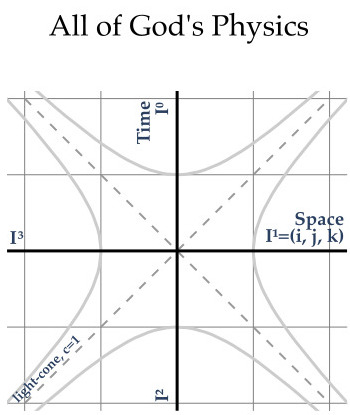
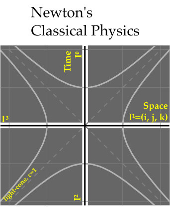

# Bell's Future Quantum Mechanics - a Novel Interpretation

This essay provides an introduction to a new interpretation for 
quantum mechanics. Here it is in two sentences:

    Bell's inequality backed by experimental evidence shows that
    quantum mechanics must be non-local, thus the wave function
    is space-like separated from the observer at the origin, 
    here-now. The product of the wave function and its conjugate
    provide the odds for an interaction with the observer 
    happening here (0, 0, 0) in the future.

This novel interpretation is called Bell's future quantum mechanics.

## New Views on Old Space-time

Start with a Minkowski space-time graph. All information that is 
local to the observer at the origin here-now is in the past 
lightcone. Quantum mechanics is non-local, ergo delete all local
information - delete the past lightcone! The wave function has 
to reside in the space-like regions of space-time. The conjugate
of the wave function goes on the other side. The product of the 
wave function and its conjugate is necessarily in the future
at the spatial origin (here, or (0, 0, 0)). Quantum mechanics has
always been about the future. What are the odds that an event
will happen to an observer in the future? Bell's inequality is 
about the non-local nature of quantum mechanics. Deleting the
past lightcone enforces non-locality. Space-like information 
can be used only to predict the future. This is the Bell's Future
interpretation of quantum mechanics.

## Historical Background

In 1935, Einstein, Polodsky, and Rosen (EPR) proposed that 
variables hidden in the past light cone could explain how 
quantum mechanics worked. The claimed inherent uncertainty
of quantum mechanics could be traded for something more real,
variables that are hidden. This was not an easy to dismiss 
proposal given Einstein's stature. It took until the 1960s
when John Bell found an inequality that could test if variables
are hidden in the past lightcone or the entangled states of
quantum mechanics where somehow real because quantum information
was non-local. If one asks the same question the same way, both
models make identical predictions. If questions are asked at a
different angle, the hidden variable hypothesis is unchanged. 
Quantum mechanics says correlations between measurements become
stronger. A huge experimental effort from the 1980s until today
has always confirmed the same result: quantum mechanics is 
non-local and hidden variable models are wrong.

## My Beliefs About It All in 3D Space + Time

Einstein put Lorentz transformations to great use to solve
difficult theoretical problems in physics. It was his math
professor who recognized that Einstein was doing rotations
not just in space, but in space-time. Here is a picture of
all of space:

I hope the gentle reader is not put off by referencing a deity.
The word choice was made because it is my belief that all of
physics, both that that is currently known which is the vast
majority, and that which remain unknown, must live only in 
3D space + time, or space-time. I am more concerned with why parity is not conserved
for beta decay than any biblical issue.

Notice how three spatial dimensions are written explicitly in
the space-time graph. Starting from studies done with five dimensions in the 1920s, research
begun in the 1970s created a significant investigation into higher
spatial dimensions. I believe all such work will have no lasting
value. More recently, people have been championing the 
multi-verse. A multi-verse has multiple space-times. Again, I 
believe all such work will have no lasting value.

I am radical conservative circa 1960s in regards to space-time.

### Technical Tangent: quaternions

The graph reveals that I am a 1908 Minkowski radical. He wrote:

    Henceforth space by itself, and time by itself, 
    are doomed to fade away into mere shadows, 
    and only a kind of union of the two 
    will preserve an independent reality.

If an event in space-time is just a bag of numbers (a vector with scant structure), it is OK to ask if the bag can be expanded
as higher dimensional research does. If an event is just one
number, the bag cannot be expanded. I study a kind of number with
that property, quaternions. A breadcrumb appears on how the axes
are labeled with power series of the 3-vector I ($I^0$ for the
positive reals, $I^1$ for the imaginaries, $I^2$ for the
negative reals, $I^3$ for the negative imaginaries). I like to 
algegraically enforce Minkowski's vision. 

**Quaternions are not central to Bell's future quantum mechanics**.
Still, while the car is in for repairs, one might as well 
consider a complete overhaul.

END of technical tangent.

In summary, space-time is everything we know, everything we do
not know, all on the same stage.

## Newton Through Subtraction

It is odd that most of space-time gets subtracted for Newtonian
physics.

Space is absolute. Time is absolute. There is no way in Newtonian
physics to rotate space into time. This is the physics we 
experience everyday. 

##  Einstein's Causal Relativistic Physics

The only kinds of events that can change an observer at the
origin are events from the past lightcone. 

Einstein was adroit
at working with the space-like regions, realizing for example
that events that are simultaneous in one reference frame will 
not be so in another. If one decides to restrict to the study causality, that
is the reason to black out the space-time regions. Why did 
something happen? The answer is in the past lightcone, not
the space-like region. 

## Bell's Future Quantum Mechanics

This is from a [Wikipedia discussion of EPR paper](https://en.wikipedia.org/wiki/EPR_paradox#The_paradox
):

    The 1935 EPR paper condensed the philosophical discussion into a physical argument. The authors claim that given a specific experiment, in which the outcome of a measurement is known before the measurement takes place, there must exist something in the real world, an "element of reality", that determines the measurement outcome. They postulate that these elements of reality are, in modern terminology, local, in the sense that each belongs to a certain point in space-time. Each element may, again in modern terminology, only be influenced by events which are located in the backward light cone of its point in space-time (i.e., the past).  These claims are founded on assumptions about nature that constitute what is now known as local realism.

It was the clause "only be influenced by events which are
located in the backward light cone" that caught my attention. If
there are no hidden variables as shown by experiments, remove
any possibility.

Notice how Einstein causality and Bell's future combine to cover
all of space-time. Both relativity and quantum mechanics were
born and matured in the same time window, and at for Einstein,
in the same mind. 

## Repeat the Exercise for Tangent Spaces

Space-time records where-when things are: location, location, 
location. Space-time formally has no information about change. 
Change lives in tangent spaces. Which tangent space is used
determines what change is under study. The most common one
is energy-momentum. Tangent spaces can also be broken up into
the same four types: all, classical, relativistic, and quantum:

Imagine one were to study the classical motion of a rock. There
would be energy and momentum at the point in space-time where 
the rock happened to be. Everywhere-when else in space-time, the 
energy-momentum space would be zero. These zeroes are usually 
ignored, so the topic of tangent spaces only appears at the
graduate-level. It makes the switch to continuous fields 
seem mystical. Instead, the difference between the two
is more like discrete and continuous for energy-momentum.

Physicists have studied all combinations of the base space
space-time with the tangent space energy-momentum. There is both
classical and relativistic quantum mechanics.

### Uncool Sidebar: The Base Space is the Base

The base space, space-time, cannot be changed by anything. I
appreciate that this clear statement will be violently rejected
by those who have made a serious study of Einstein's general 
relativity. Tens of thousands of times it has been repeated:
gravity bends space-time. I am not in denial of the words. I
do feel compelled to at least question the link to the math.
Gravity alters a tangent space of space-time as seen by the
dt and dR in metric solutions. Space-time has Lorentz symmetry
and its origin. Gravity and energy-momentum have Poincare
symmetry. Summing up all the changes in all the tangent spaces
results in a curved path in space-time. All the change happens
in the tangent space. We should be saying the tangent space is
curved then summed, not that the base space is curved.

End sidebar

## Momentum versus a Momentum State

Why use momentum in relativity, but momentum states in quantum
mechanics? Momentum from the past lightcone can change the 
motion of the observer at the origin. The entire chain of events
leading to that change in the observer can be known. A space-like
momentum state is different. Momentum states may never change
the observer at the origin, here-now. The precise odds of a 
momentum state changing the momentum of an observer can be
calculated. In the future, if an interaction does occur, it will
change the path of the observer in the usual way. The entire
chain of events leading to this momentum change cannot be known
because they are space-like separated. The observer is
necessarily blind-sided by a momentum state.

The same story applies to energy versus an energy state. 
Observers can absorb energy from the past lightcone and heat up.
Observers cannot absorb energy from an energy state as it is too
far away. The can in the future absorb the energy to the same
effect. We can calculate the odds.

## The Wave Function

The wave function is a set of space-like energy-momentum states.
Each state may not have a time-like relationship to the observer
at the origin, here-now. Each state of the wave function can have
a time-like relationship with other states in the wave function.
Light-like relationships are not addressed for the moment as that
is a refinement one will have to include with care later.

For a complex-valued wave function, the conjugate is simple to
construct. The product of a wave function and its conjugate
evaluates to a positive real number. If properly normalized,
the positive number is the odds of an interaction happening. 
Nothing unusual is happening under the Bell's future 
interpretation, all calculations will be the same.

## Dull Quaterion Series Quantum Mechanics

Quaternion quantum mechanics has been studied and presented
in a book-length form by Stephen Adler. The topic has been
commented on in a December 2018 blog by Scott Aaronson where
he came to the conclusion that quaternion quantum
mechanics was a "complete dumpster fire" because it would
allow superluminal transfer of information. I agree, any 
algebraic system that allows superluminal transformation is
boring and deserves no futher study. I was surprised that this
flaw was known to Adler as he admitted to Aaronson.

In a rapid exchange I had with Aaronson, I came up with the idea
of "point-one-way" quaternions. Pick an arbitrary direction and
stick with that for all calculations. Aaronson agreed it would
work. He just thought it was so dull it did not even deserve a
new name.

As I considered it more, a better name would have been 
"point-with-precision" quaternion series quantum mechanics.
In the lab, physics experiments are known for their precision
of the experimental apparatus. It is common to use tables that
isolate the vibrations of the surroundings from the experiment.
The precision of location known at the bench is apply to the
math used. Quaternions that point in the same direction commute.
A quaternion series is not a division algebra like the 
quaternions. Instead it is a semi-group with inverses. A
semi-group has more than one inverse.

For quaternion-valued wave functions, the conjugate has a 
physical meaning: it is a mirror reflection in space. Why do so?
The product of the wave function and its mirror reflection is a
here-future value, (0, 0, 0) for the 3-vector and a positive
real number. If properly normalized, the real value is the odds
of seeing an interaction. It is the simple, physical 
interpretation of an otherwise abstraction notion of a 
complex-valued wave function that I see as a benefit worthy
of exploration.

The Bell's future quantum mechanics interpretation in no way
depends on quaternion series quantum mechanics being a viable
algebric approach to doing calculations.

## Interpretations of Quantum Mechanics

There are at least 20 interpretations of quantum mechanics. Nearly
all of them make the same predictions as does this one. I have 
seen Sean Carroll take a poll of graduate students to find their
favorite. This is not the was physics works. Physics is a contact
sport with only one eventual winner.

Physics by subtraction defines areas of study. Newton's classical
physics uses only the axes. Causality in special relativity uses
only the past lightcone. By contrast, quantum mechanics uses 
nothing from the past lightcone. Quantum mechanics uses 
space-like states to calculate the odds of interactions in the
future.

Bell's future quantum mechanics looks bright. I hope this idea
goes viral in a good way.

## Other Presentations

[8 page PDF](http://bit.ly/BellsFuturePDF)

[You Tube, 3 minutes](http://bit.ly/BellsFutureYT3)

[You Tube, 23 minutes](http://bit.ly/BellsFutureYT23)
