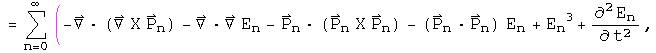

#  Introduction to Relativistic Quantum Mechanics

The relativistic quantum mechanic equation for a free particle is the Klein-
Gordon equation (h=c=1)

The Schr&ouml;dinger equation results from the non-relativistic limit of this
equation. In this section, the machinery of the Klein-Gordon equation will be
ported to quaternions.

##  The Wave Function

The wave function is the superposition of all possible states of a system. The
product of the conjugate of a wave function with another wave function forms a
complete inner product space. In the energy/momentum representation, this
would involve all possible energy levels and momenta.

This infinite sum of quaternions should contain all the information about a
system.  The quaternion wave function can be normalized.

The first quaternion is the conjugate or transpose of the second.  Since the
transpose of a quaternion wave function times a wave function creates a
Euclidean norm, this representation of wave functions as an infinite sum of
quaternions can form a complete, normed product space.

##  The Klein-Gordon Equation

The Klein-Gordon equation can be divided into two operators that act on the
wave function:  the D'Alembertian and the scalar m^2.  The quaternion operator
required to create the D'Alembertian, along with vector identities, has
already been worked out for the Maxwell equations in the Lorenz gauge.

The first term of the scalar, and the second term of the vector, are both
equal to zero.  What is left is the D'Alembertian operator acting on the
quaternion wave function.

To generate the scalar multiplier m^2, substitute En and Pn for the operators
d/dt and del respectively, and repeat.  Since the structure of the operator is
identical to the previous one, instead of the D'Alembertian times the wave
function, there is En^2-Pn^2.  The sum of all these terms becomes m^2.

Set the sum of these two operators equal to zero to form the Klein-Gordon
equation.

It takes some skilled staring to assure that this equation contains the Klein-
Gordon equation along with vector identities.

##  Connection to the Maxwell Equations

If m=0, the quaternion operators of the Klein-Gordon equation simplifies to
the operators used to generate the Maxwell equations in the Lorenz gauge.  In
the homogeneous case, the same operator acting on two different quaternions
equals the same result.  This implies that

Under this interpretation, a nonzero mass changes the wave equation into a
simple harmonic oscillator.  The simple relationship between the quaternion
potential and the wave function may hold for the nonhomogeneous case as well.

##  Implications

The Klein-Gordon equation is customarily viewed as a scalar equation (due to
the scalar D'Alembertian operator) and the Maxwell equations are a vector
equation (due to the potential four vector).  In this notebook, the quaternion
operator that generated the Maxwell equations was used to generate the Klein-
Gordon equation.  This also created several vector identities which are
usually not mentioned in this context.  A quaternion differential equation is
needed to perform the work of the Dirac equation, but since quaternion
operators are a field, an operator that does the task must exist.

