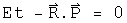

#  Deriving A Quaternion Analog to the Schr&ouml;dinger Equation

The Schr&ouml;dinger equation gives the kinetic energy plus the potential (a sum
also known as the Hamiltonian H) of the wave function psi, which contains all
the dynamical information about a system.  Psi is a scalar function with
complex values.

For the time-independent case, energy is written at the operator -i hbar d/dt,
and kinetic energy as the square of the momentum operator, i hbar Del, over
2m.  Given the potential V(0, X) and suitable boundary conditions, solving
this differential equation generates a wave function psi which contains all
the properties of the system.

In this section, the quaternion analog to the Schr&ouml;dinger equation will be
derived from first principles.  What is interesting are the constraint that
are required for the quaternion analog.  For example, there is a factor which
might serve to damp runaway terms.

##  The Quaternion Wave Function

The derivation starts from a curious place :-)  Write out classical angular
momentum with quaternions.

What makes this "classical" are the zeroes in the scalars.  Make these into
complete quaternions by bringing in time to go along with the space 3-vector
R, and E with the 3-vector P.

Define a dimensionless quaternion psi that is this product over h bar.

The scalar part of psi is also seen in plane wave solutions of quantum
mechanics.  The complicated 3-vector is a new animal, but notice it is
composed of all the parts seen in the scalar, just different permutations that
evaluate to 3-vectors.  One might argue that for completeness, all
combinations of E, t, R and P should be involved in psi, as is the case here.

Any quaternion can be expressed in polar form:

Express psi in polar form.  To make things simpler, assume that psi is
normalized, so |psi| = 1.  The 3-vector of psi is quite complicated, so define
one symbol to capture it:

Now rewrite psi in polar form with these simplifications:

This is what I call the quaternion wave function.  Unlike previous work with
quaternionic quantum mechanics (see S. Adler's book "Quaternionic Quantum
Mechanics"), I see no need to define a vector space with right-hand operator
multiplication.  As was shown in the section on bracket notation, the
Euclidean product of psi (psi* psi) will have all the properties required to
form a Hilbert space.  The advantage of keeping both operators and the wave
function as quaternions is that it will make sense to form an interacting
field directly using a product such as psi psi'.  That will not be done here.
Another advantage is that all the equations will necessarily be invertible.

##  Changes in the Quaternion Wave Function

We cannot derive the Schr&ouml;dinger equation per se, since that involves
Hermitian operators that acting on a complex vector space.  Instead, the
operators here will be anti-Hermitian quaternions acting on quaternions.
Still it will look very similar, down to the last h bar :-)  All that needs to
be done is to study how the quaternion wave function psi changes.  Make the
following assumptions.

1\. Energy and Momentum are conserved.

2.  Energy is evenly distributed in space 

3\. The system is isolated

4\. The position 3-vector X is in the same direction as the momentum 3-vector
P

The implications of this last assumption are not obvious but can be computed
directly by taking the appropriate derivative.  Here is a verbal explanation.
If energy and momentum are conserved, they will not change in time.  If the
position 3-vector which does change is always in the same direction as the
momentum 3-vector, then I will remain constant in time.  Since I is in the
direction of X, its curl will be zero.

This last constraint may initially appear too confining.  Contrast this with
the typical classical quantum mechanics.  In that case, there is an imaginary
factor i which contains no information about the system.  It is a mathematical
tool tossed in so that the equation has the correct properties.  With
quaternions, I is determined directly from E, t, P and X.  It must be richer
in information content.  This particular constraint is a reflection of that.

Now take the time derivative of psi.

The denominator must be at least 1, and can be greater that that.  It can
serve as a damper, a good thing to tame runaway terms.  Unfortunately, it also
makes solving explicitly for energy impossible unless Et - P.X equals zero.
Since the goal is to make a direct connection to the Schr&ouml;dinger equation,
make one final assumption:

5\. Et - R.P = 0

There are several important cases when this will be true.  In a vacuum, E and
P are zero.  If this is used to study photons, then t = |R| and E = |P|.  If
this number happens to be constant in time, then this equation will apply to
the wave front.

Now with these 5 assumptions in hand, energy can be defined with an operator.

The equivalence of the energy E and this operator is called the first
quantization.

Take the spatial derivative of psi using the under the same assumptions:

Square this operator.

The Hamiltonian equals the kinetic energy plus the potential energy.

Typographically, this looks very similar to the Schr&ouml;dinger equation.  Capital
I is a normalized 3-vector, and a very complicated one at that if you review
the assumptions that got us here.  phi is not a vector, but is a quaternion.
This give the equation more, not less, analytical power.  With all of the
constraints in place, I expect that this equation will behave exactly like the
Schr&ouml;dinger equation.  As the constraints are removed, this proposal becomes
richer.  There is a damper to quench runaway terms.  The 3-vector I becomes
quite the nightmare to deal with, but it should be possible, given we are
dealing with a topological algebraic field.

##  Implications

Any attempt to shift the meaning of an equation as central to modern physics
had first be able to regenerate all of its results.  I believe that the
quaternion analog to Schr&ouml;dinger equation under the listed constraints will do
the task.  These is an immense amount of work needed to see as the constraints
are relaxed, whether the quaternion differential equations will behave better.
My sense at this time is that first quaternion analysis as discussed earlier
must be made as mathematically solid as complex analysis.  At that point, it
will be worth pushing the envelope with this quaternion equation.  If it
stands on a foundation as robust as complex analysis, the profound problems
seen in quantum field theory stand a chance of fading away into the
background.

