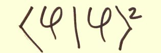

# Quantum mechanics

1. [Bracket notation using quaternions](bracket_notation.md)
1. [Multiplying polar quaternions](polar.md)
1. [The uncertainty principle](uncertainty_principle.md)
1. [Spin and angular momentum](spin_and_angular_momentum.md)
1. [The Schr&ouml;dinger equation](Schrodinger.md)
1. [The Klein-Gordon equation](Klein-Gordon.md)
1. [Standard model symmetries](standard_model_symmetries.md)
1. [Space-time reversal](time_reversal.md)
