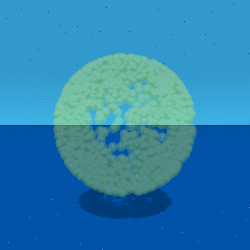
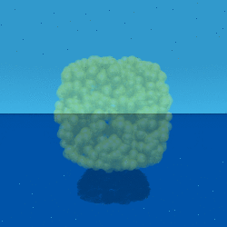

# An Introduction to the Standard Model

The Standard Model of physics was developed in the 1970's to explain the ~270
different types of particles seen in colliders (a general introduction is
available on [wikipedia](http://en.wikipedia.org/wiki/Standard_Model), and a
one page [cheat
sheet](http://en.wikipedia.org/wiki/Image:Particle_chart.jpg)). The part we
need to understand is the groups that describe the symmetry of the standard
model.

What is a group? A group has an identity, an inverse, and a binary operation
(multiplication). One member of the group times another member of the group
generates yet another member of the same group. This is a case where the math
name is accurate: once in a group, you are always in a group.

The standard model has three continuous groups that characterize three of the
four known fundamental forces of nature. The simplest group is known as U(1)
and governs electromagnetism via the photon. The reason there is one photon is
that the Lie algebra u(1) - note that was a small u! - has one degree of
freedom. This group is called the [ unary
group](http://en.wikipedia.org/wiki/Unitary_group), complex numbers with a
norm of 1. The members of this group commute, so it does not matter the order
things are written in. Quaternions have this property only when all point in
the same or opposite directions, which is the case for when using one
quaternion times itself.

The continuous group SU(2) rules the weak force, the stuff driving radioactive
decay. Mathematically this is call unitary quaternions, quaternions with a
norm of 1. The Lie algebra used to generate this group has three degrees of
freedom. That is why the weak force is mediated by three particles, the W+,
W-, and the Z.

The group SU(3) is for the strong force whose residual interactions keep
nuclei together. Its Lie algebra has eight members, and there are eight
gluons.

## Animations of Groups

Start with a simple picture, layer pictures together, and we will be able to
see what the standard model of particle physics looks like.

## S0 - So simple!

This is the symmetry of +/-R, one number.  What was  
up/down | What is | What can be  
---|---|---  
 |
 |
  
 |
 |
  
What was  
near/far | What was  
left/right | What can be  
that is  
This is (-1, 0, 0, 0) and (+1, 0, 0, 0). It sits in the center, as quaternions
of the form (n, 0, 0, 0) like to do.

## [S1 - The Circle](http://www.theworld.com/%7Esweetser/quaternions/quantum
/standard_model/S1)

Now we let the sum of squares of 2 numbers equal 1. This creates a circle.
What was  
up/down | What is | What can be  
---|---|---  
 |
 |
  
 |
 |
  
What was  
near/far | What was  
left/right | What can be  
that is  
The circle could have any orientation in 3D space. The program choose one at
random.

## S2 - Slice of an Expanding/Contracting Sphere

The sum of squares of 3 numbers equal 1. A quaternion has four numbers. One
approach to representing S2 is to set t=0. You get the standard sphere, but
only at the instant of t=0. Blink!  What was  
up/down | What is | What can be  
---|---|---  
 |
 |
  
 |
 |
  
What was  
near/far | What was  
left/right | What can be  
that is  
That looks like a typical sphere, except it doesn't last long. Three straight
lines appear in the "what was" graph because time is fixed.

Another way to represent S2 is to set x=0. Then you have an edge view of an
expanding circle.

What was  
up/down | What is | What can be  
---|---|---  
 |
 |
  
 |
 |
  
What was  
near/far | What was  
left/right | What can be  
that is  
Only the "what was left/right" graph has a fixed, straight line graph, because
x=0.

If z=0, at least you can see the "circleness"

What was  
up/down | What is | What can be  
---|---|---  
 |
 |
  
 |
 |
  
What was  
near/far | What was  
left/right | What can be  
that is  
In the "what was" graphs, it is easy to spot which dimension is set to zero:
it is the straight line.

## S3 - A Quaternion Sphere

Now use all 4 terms, and fill in the sphere in both time and space!  What was  
up/down | What is | What can be  
---|---|---  
 |
 |
  
 |
 |
  
What was  
near/far | What was  
left/right | What can be  
that is  
  
## SU(2) - Like S2, the Partial Sphere

The graphs of S2 were all paper thin or fleeting. They do not "fill up"
spacetime. The next graph, generated by putting random quaternions into the
expression exp(q-q*), fills up spacetime.  What was  
up/down | What is | What can be  
---|---|---  
 |
 |
  
 |
 |
  
What was  
near/far | What was  
left/right | What can be  
that is  
  
Although more of spacetime appears filled, only places were time is greater
than zero have a chance to have an event.

## U(1)xSU(2) - Like the Complete Quaternion Sphere S3

SU(2) has only three of the four degrees of freedom available to a quaternion.
There is no way to fill up all of spacetime with just SU(2). Now fill
spacetime in by multiplying by itself, or q/|q| exp(q-q*)  What was  
up/down | What is | What can be  
---|---|---  
 |
 |
  
 |
 |
  
What was  
near/far | What was  
left/right | What can be  
that is  
  
Most of the points cluster on the negative side of the time line.

## U(1)xSU(2)xSU(3) - The Standard Model

The question is how to generate SU(3)? It has a Lie algebra su(3) that has
eight elements. Based on work done on quaternion quantum mechanics, it is
clear I need to work with the conjugate of one quaternion times another, what
I call the Euclidean product, because q* q generates the norm of a quaternion
q, (t2 \+ x2 \+ y2 \+ z2, 0, 0, 0). If we have 2 different quaternions, q and
q', we can write them as q* q' as U(1)xSU(2): (q/|q| exp(q-q*))* (q'/|q'|
exp(q'-q'*)). Here is its animation:  What was  
up/down | What is | What can be  
---|---|---  
 |
 |
  
 |
 |
  
What was  
near/far | What was  
left/right | What can be  
that is  
  
Notice how all of spacetime is filled evenly with events. A product of two
quaternions that uses a conjugate different from a standard product because
multiplication is no longer associative ((a b)*c does not equal a* (b c)). The
norms are preserved, so the norm will remain 1. Eight independent number are
used to make something with a norm of one. The identity is 1, and all elements
have an inverse under what I call "Euclidean multiplication", q* q'. Based on
the animation, the group is compact and simply connected. All of this traits
contribute to the conclusion that the symmetry of the standard model can be
represented by quaternions in this way.

It would be great to include gravity, which is all about how measurements
change as one moves around a differentiable 4D manifold. Include the metric as
part of the calculation of a quaternion product.

  
The group Diff(M) is all diffeomorphisms of a compact smooth manifold. It is
at the heart of general relativity. One can imagine this spacetime filling
sphere on any compact smooth manifold.

What happens if q=q'? That is shown below:

What was  
up/down | What is | What can be  
---|---|---  
 |
 |
  
 |
 |
  
What was  
near/far | What was  
left/right | What can be  
that is  
The standard model is about the group symmetry of the quaternion
multiplication identity in spacetime.

OK, but what does that mean? Here is my take. Observers sit at here-now in
spacetime, or numerically at (0, 0, 0, 0). An observer sees something out
there, and tries to characterize the "thingie". The basic bit of information
it can classify is an event. Whatever set of events is collected, they are all
tied up in describing this one thingie out there. Every event contributes to
the description of the thingie, and so makes a group. The multiplicative
identity of a quaternion, (1, 0, 0, 0) is a way to represent the thingie.
Almost none of the events map to (1, 0, 0, 0). The events are scattered all
around spacetime. U(1)xSU(2)xSU(3) is the way to cow-rope all the events and
bring them home, while remaining part of the same group, the one thing being
observed.

