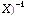
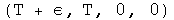

#  Time Reversal Transformations for Intervals

Classical Time Reversal  
Relativistic Time Reversal  
Implications

The following transformation R for quaternions reverses time:

The quaternion R exist because quaternions are a field.  

R will equal  (-t, X )(t, .  The inverse of
quaternion is the transpose over the square of the norm, which is the scalar
term of the transpose of a quaternion times itself.

For any given time, R can be defined based on the above.

##  Classical Time Reversal

Examine the form of the quaternion which reverses time under two conditions.
A interval normalized to the interval takes the form (1, beta), a scalar one
and a 3-vector relativistic velocity beta .  In the classical region,
beta&lt;&lt;&lt;1.  Calculate R in this limit to one order of magnitude in
beta.

  The operator R is almost the negative identity, but the vector is non-zero,
so it would not commute.

##  Relativistic Time Reversal

For a relativistic interval involving one axis, the interval could be
characterized by the following:

Find out what quaternion is required to reverse time for this relativistic
interval to first order in epsilon.

This approaches q[-e/T, 1, 0, 0], almost a pure vector, a result distinct from
the classical case.

##  Implications

In special relativity, the interval between events is considered to be 4
vector are operated on by elements of the Lorentz group.  The element of this
group that reverses time has along its diagonal  
{-1, 1, 1, 1}, zeroes elsewhere.  There is no dependence on relative velocity.
Therefore special relativity predicts the operation of time reversal should be
indistinguishable for classical and relativistic intervals.  Yet classically,
time reversal appears to involve entropy, and relativistically, time reversal
involves antiparticles.

In this notebook, a time reversal quaternion has been derived and shown to
work.  Time reversal for classical and relativistic intervals have distinct
limits, but these transformations have not yet been tied explicitly to the
laws of physics.

