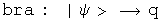

#  Commutators and the Uncertainty Principle

Commutators and the uncertainty principle are central to quantum mechanics.
Using quaternions in these roles has already been established by others
(Horwitz and Biedenharn, Annals of Physics, 157:432, 1984).  The first proof
of the uncertainty principle I saw relied solely on the properties of complex
numbers, not on physics!  In this notebook I will repeat that analysis,
showing how commutators and an uncertainty principle arise from the properties
of quaternions (or their subfield the complex numbers).

##  Commutators

Any quaternion can be written in a polar form.

This is identical to Euler's formula except that the imaginary unit vector i
is replaced by the normalized 3-vector.  The two are equivalent if j = k = 0.
Any quaternion could be the limit of the sum of an infinite number of other
quaternions expressed in a polar form.  I hope to show that such a quaternion
mathematically behaves like the wave function of quantum mechanics, even if
the notation is different.

To simplify things, use a normalized quaternion, so that q* q = 1.  Collect
the normalized 3-vector together with I = V/(V* V)^.5.

The angle s/(q* q)^.5 is a real number.  Any real number can be viewed as the
product of two other real numbers.  This seemingly irrelevant observation
lends much of the flexibility seen in quantum mechanics :-)  Here is the
rewrite of q.

The unit vector I could also be viewed as the product of two quaternions.For
classical quantum mechanics, this additional complication is unnecessary.  It
may be required for relativistic quantum mechanics, so this should be kept in
mind.

A point of clarification on notation:the same letter will be used 4 distinct
ways.There are operators, A hat, which act on a quaternion wave function by
multiplying by a quaternion, capital A.  If the operator A hat is an
observable, then it generates a real number, (a, 0), which commutes with all
quaternions, whatever their form. There is also a variable with respect to a
component of a quaternion, a_i, that can be used to form a differential
operator.

Define a linear operator A hat that multiplies q by the quaternion A.

If the operator A hat is an observable, then the quaternion  A is a real
number, (a, 0).  This will commute with any quaternion.  This equation is
functionally equivalent to an eigenvalue equation, with A hat as an
eigenvector of q and (a, 0) as the eigenvalue.  However, all of the components
of this equation are quaternions, not separate structures such as an operator
belonging to a group and a vector.  This might make a subtle but significant
difference for the mathematical structure of the theory, a point that will not
be investigated here.

Define a linear operator B hat that multiplies q by the quaternion B.  If B
hat is an observable,  then this operator can be defined in terms of the
scalar variable a.

Operators A and B are linear.

Calculate the commutator [A, B], which involves the scalar a and the
derivative with respect to a.

The commutator acting on a quaternion is equivalent to multiplying that
quaternion by the normalized 3-vector I.

##  The Uncertainty Principle

Use these operators to construct things that behave like averages (expectation
values) and standard deviations.

The scalar a--generated by the observable operator A hat acting on the
normalized q--can be calculated using the Euclidean product.

It is hard to shuffle quaternions or their operators around.  Real scalars
commute with any quaternion and are their own conjugates.  Operators that
generate such scalars can move around.  Look at ways to express the
expectation value of A.

Define a new operator A' based on A whose expectation value is always zero.

Define the square of the operator in a way designed to link up with the
standard deviation.

An identical set of tools can be defined for B.

In the section on bracket notation, the Schwarz inequality for quaternions was
shown.

The Schwarz inequality applies to quaternions, not quaternion operators.  If
the operators A' and B' are surrounded on both sides by q and q*, then they
will behave like scalars.

The left-hand side of the Schwarz inequality can be rearranged to form a
commutator.

The right-hand side of the Schwarz inequality can be rearranged to form the
square of the standard deviation operators.

Plug both of these back into the Schwarz inequality, stripping the primes and
the q's which appear on both sides along the way.

This is the uncertainty principle for complementary observable operators.

##  Connections to Standard Notation

This quaternion exercise can be mapped to the standard notation used in
physics

![commutator: \[A, B\] maps to \[A,
B\]](../images/QM/uncertainty_principle/s_gr_25.gif)

One subtlety to note is that a quaternion operator is anti-Hermitian only if
the scalar is zero.  This is probably the case for classical quantum
mechanics, but quantum field theory may require full quaternion operators.
The proof of the uncertainty principle shown here is independent of this
issue.  I do not yet understand the consequence of this point.

To get to the position-momentum uncertainty equation, make these specific maps

The product of the squares of the standard deviation for position and momentum
in the x-direction has a lower bound equal to half the expectation value of
the commutator of those operators.  The proof is in the structure of
quaternions.

##  Implications

There are many interpretations of the uncertainty principle.  I come away with
two strange observations.  First, the uncertainty principle is about
quaternions of the form q = Exp[a b I].  With this insight, one can see by
inspection that a plane wave Exp[((Et - P.X)/hbar I], or wave packets that are
superpositions of plane waves, will have four uncertainty relations, one for
the scalar Et and another three for the three-part scalar P.X.  This
perspective should be easy to generalize.

Second, the uncertainty principle and gravity are related to the same
mathematical properties.  This proof of the uncertainty relation involved the
Schwarz inequality.  It is fairly straightforward to convert that inequality
to the triangle inequality.  Finding geodesics with quaternions involves the
triangle inequality.  If a complete theory of gravity can be built from these
geodesics (it hasn't yet been done :-) then the inequalities may open
connections where none appeared before.

