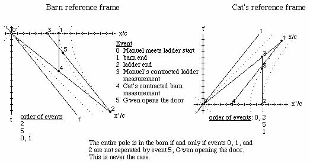

# 8.033 Problem Set 3: The Lorentz transformation and addition of velocities

##  Lorentz transformations

##  Baranger: Inverse of a boost

Q: Start from the 4 Lorentz equations giving the variables T, X, Y, and Z in
terms of t, x, y and z, and solve these equations for t, x, y and z in terms
of T, X, Y, and Z. Make sure the result is what you expected.

A: The problem will be solved for a boost transformation without any angular
momentum (the case for y and z not equal to zero just gets messier, not
deeper).

![\[Graphics:ps3gr1.
gif\]](../images/SR/problem_set_3/ps3gr1.gif)

    
    
![\[Graphics:ps3gr3.gif\]](../images/SR/problem_set_3/ps3gr3.gif)

L q = q', so q = L^-1 q'. L's inverse always exists and is straight forward to
calculate: the inverse is the transpose divided by the square of the norm.

![\[Graphics:ps3gr4.
gif\]](../images/SR/problem_set_3/ps3gr4.gif)

![\[Graphics:ps3gr5.
gif\]](../images/SR/problem_set_3/ps3gr5.gif)

    
    
![\[Graphics:ps3gr6.gif\]](../images/SR/problem_set_3/ps3gr6.gif)

(The inverse was big and ugly, that's why it was hidden from view, but it does
work! The things that change are the sign of the second component and the
normalization factor which is quite bulky).

##  Baranger: Boosting photons

Q: In frame S, a flash of light is emitted at the origin and is absorbed on
the x axis at x = d. Answer the following questions from the point of view of
frame S', moving in the standard way: (a) What is the spatial separation d'
between the point of emission and the point of absorption of the light? (b)
How much time elapses between the emission and the absorption?

A: (a) In frame S, the point of absorption is q[d, d, 0, 0]. Boost this to
frame S', and look at the x component.

![\[Graphics:ps3gr7.
gif\]](../images/SR/problem_set_3/ps3gr7.gif)

    
    
![\[Graphics:ps3gr8.gif\]](../images/SR/problem_set_3/ps3gr8.gif)

The separation is
![\[Graphics:ps3gr9.gif\]](../images/SR/problem_set_3/ps3gr9.gif)presuming frame S'
is moving in the same direction as the light.

(b) The elapsed time is the first component of the transformed quaternion from
above, or ![\[Graphics:ps3gr10.gif\]](../images/SR/problem_set_3/ps3gr10.gif).

##  Baranger: The ladder in the barn

Q: (long) Manuel wants to demonstrate the Lorentz length contraction by
fitting his 10 m ladder inside his 8 m garage. He ties the ladder on top of
his station wagon and asks his friend Linda to drive the wagon into the open
door of the garage. Linda drives it at the speed of 0.8c, than therefore gamma
= 5/3, which makes the ladder only 6 m long. Manuel is standing by the door
and, as soon as the rear end of the ladder has passed, he shuts the door. He
now has the entire ladder inside the 8 m garage, just as he said he would.
However, this garage also has a back door and, since the brakes on the wagon
are a little worn out, Manuel has instructed his other friend Gwen to open the
back door at the precise instant that the front end of the ladder is about to
hit it. It's OK, says Manuel, because the ladder was actually inside the
garage, with both doors shut, for a finite amount of time, and that is all he
wanted to prove. But it turns out that Gwen's cat, CloudNine, was sitting all
the time on the ladder on top of the wagon, and CloudNine disagrees totally.
He says: the ladder was really 10 m, while the garage was Lorentz contracted
and only 8 m x 3/5 = 4.8 m, and obviously that the ladder was never, never
totally inside the garage. CloudNine looks in good health; the ladder is still
in one piece. What's going on? Who is right?  
INSTRUCTIONS: Define 4 separate events. Choose coordinates in two frames.
Elaborate the 2 descriptions of what happened, Manuel's and CloudNine's,
giving precise numbers for all the events. Show that these two descriptions
are actually totally consistent, given the known laws of special relativity.

A. From the viewpoint of the barn, the ladder is contracted. This involves
boosting the end of the ladder, and subtracting where the start of the ladder
has moved to at a simultaneous time.

![\[Graphics:ps3gr11
.gif\]](../images/SR/problem_set_3/ps3gr11.gif)

![\[Graphics:ps3gr12
.gif\]](../images/SR/problem_set_3/ps3gr12.gif)

![\[Graphics:ps3gr13
.gif\]](../images/SR/problem_set_3/ps3gr13.gif)

    
    
![\[Graphics:ps3gr14.gif\]](../images/SR/problem_set_3/ps3gr14.gif)

Manuel observes (correctly) that the ladder appears to be length contracted to
6 m in his reference frame.

Repeat this exercise for the cat frame looking at the length of the barn.

![\[Graphics:ps3gr15
.gif\]](../images/SR/problem_set_3/ps3gr15.gif)

![\[Graphics:ps3gr16
.gif\]](../images/SR/problem_set_3/ps3gr16.gif)

![\[Graphics:ps3gr17
.gif\]](../images/SR/problem_set_3/ps3gr17.gif)

    
    
![\[Graphics:ps3gr18.gif\]](../images/SR/problem_set_3/ps3gr18.gif)

The barn is only 4.8m long from the cat's reference frame.

Manuel and the cat make correct statements about length contraction from their
own reference frames.

What makes this problem confusing to discuss is that the doors of the barn and
the ends of the ladder are space-like separated, so the order of events in time
can be reversed depending on the reference frame.

The reference event chosen for the following space-time diagrams (created in
the program Space-time by Prof. Edwin F. Taylor) is Manuel meeting the start of
the ladder. The end of the barn and the end of the ladder must be located on
invariant hyperbolae 8 and 10 meters long respectively. Gwen must open the
door somewhere on the barn's 8 meter hyperbola. Manuel's dream will only come
true if the reference event and the two ends are not separated by Gwen's
action. This is not the case as seen in the figure below:

Gwen always opens the far barn door before both ends of the ladder and barn
are together with Manuel and the start of the ladder, averting disaster. The
barn stays in one piece and we have had fun with moving objects with space-like
separations.

##  R&amp;H: 2-34 2 flashes at different places - or are they?

Q: An observer S sees a flash of red light 1200 m from his position and a
flash of blue light 720 m closer to him and on the same straight line. He
measures the time interval between the occurrences of the flashes to be 5
microseconds, the red flash occurring first. (a) What is the relative velocity
**v** of a second observer S' who would record these flashes as occurring at
the same place? (b) From the point of view of S', which flash occurs first?
(c) What time between them would S' measure?

A: (a) Boost both red and blue lights by beta into frame S'.

![\[Graphics:ps3gr19
.gif\]](../images/SR/problem_set_3/ps3gr19.gif)

![\[Graphics:ps3gr20
.gif\]](../images/SR/problem_set_3/ps3gr20.gif)

Set the distances equal to each other (the second components of the boosted
quaternions) and solve.

![\[Graphics:ps3gr21
.gif\]](../images/SR/problem_set_3/ps3gr21.gif)

    
    
![\[Graphics:ps3gr22.gif\]](../images/SR/problem_set_3/ps3gr22.gif)

The second observer moves toward the first observer at a relative speed of
0.48c.

(b) Substitute the value for v/c into the boosted time for the events.

![\[Graphics:ps3gr23
.gif\]](../images/SR/problem_set_3/ps3gr23.gif)

    
    
![\[Graphics:ps3gr24.gif\]](../images/SR/problem_set_3/ps3gr24.gif)

![\[Graphics:ps3gr25
.gif\]](../images/SR/problem_set_3/ps3gr25.gif)

    
    
![\[Graphics:ps3gr26.gif\]](../images/SR/problem_set_3/ps3gr26.gif)

The red light happens first for observer S'.

(c) Calculate the difference between the first two components of the
quaternions.

![\[Graphics:ps3gr27
.gif\]](../images/SR/problem_set_3/ps3gr27.gif)

    
    
![\[Graphics:ps3gr28.gif\]](../images/SR/problem_set_3/ps3gr28.gif)

The time difference is 4.39 microseconds.

### Addition of velocities

If a quaternion is normalized to its interval, it becomes:

![\[Graphics:ps3gr29
.gif\]](../images/SR/problem_set_3/ps3gr29.gif)

If a quaternion is normalized to its interval and the first term which is
gamma, the result is a quaternion characterizing the velocities:

![\[Graphics:ps3gr30
.gif\]](../images/SR/problem_set_3/ps3gr30.gif)

This quaternion can be formed from any quaternion and boosted accordingly.

For this series of problems, we need a more general boost quaternion, one
where y and z are not zero.

![\[Graphics:ps3gr31
.gif\]](../images/SR/problem_set_3/ps3gr31.gif)

![\[Graphics:ps3gr32
.gif\]](../images/SR/problem_set_3/ps3gr32.gif)

Define the function Lambda to do the general boost along x.

![\[Graphics:ps3gr33
.gif\]](../images/SR/problem_set_3/ps3gr33.gif)

## R&amp;H: 2-59 Watching the decay of a moving nucleus

Q: A radioactive nucleus moves with a uniform velocity of 0.050c along the x
axis of a reference frame S fixed with respect to the laboratory. It decays by
emitting an electron whose speed, measured in a reference frame S' moving with
the nucleus, is 0.80c. Consider first the case in which the emitted electron
travels (a) along the common x-x' axis and (b) along the y' axis and find, for
each case, its velocity as measured in frame S. (c) Suppose, however, that the
emitted electron, viewed now from frame S, travels along the y axis of that
frame with a speed of 0.80c. What is its velocity as measured in frame S'?

A: (a) Boost the velocity quaternion by -0.05c, and keep it as a velocity
quaternion by normalizing it with the resulting gamma.

![\[Graphics:ps3gr34
.gif\]](../images/SR/problem_set_3/ps3gr34.gif)

    
    
![\[Graphics:ps3gr35.gif\]](../images/SR/problem_set_3/ps3gr35.gif)

The relative velocity in frame S is 0.817c along the x axis.

(b) Do that again, with y = 0.8.

![\[Graphics:ps3gr36
.gif\]](../images/SR/problem_set_3/ps3gr36.gif)

    
    
![\[Graphics:ps3gr37.gif\]](../images/SR/problem_set_3/ps3gr37.gif)

The magnitude and angle of the velocity vector can be calculated.

![\[Graphics:ps3gr38
.gif\]](../images/SR/problem_set_3/ps3gr38.gif)

    
    
![\[Graphics:ps3gr39.gif\]](../images/SR/problem_set_3/ps3gr39.gif)

![\[Graphics:ps3gr40
.gif\]](../images/SR/problem_set_3/ps3gr40.gif)

    
    
![\[Graphics:ps3gr41.gif\]](../images/SR/problem_set_3/ps3gr41.gif)

The velocity vector is 0.8005c 3.58 degrees to the right of the y axis.

(c) Repeat the calculation, switching the sign of the boost.

![\[Graphics:ps3gr42
.gif\]](../images/SR/problem_set_3/ps3gr42.gif)

    
    
![\[Graphics:ps3gr43.gif\]](../images/SR/problem_set_3/ps3gr43.gif)

A similar quaternion to b, so the velocity vector is 0.80056c, but 3.57
degrees to the left of the y axis.

##  Baranger: Boosting boosted frames

Q: (a) Frame S' moves with respect to frame S with velocity beta1 in the +x
direction. Frame S'' moves with respect to frame S' with velocity beta2 also
in the + x direction. Frame S" moves with respect to frame S with velocity
Beta, also in the +x direction. Let gamma1, gamma2, and Gamma be the 3 Lorentz
factors corresponding to these 3 velocities, respectively. Prove the formula

![\[Graphics:ps3gr44
.gif\]](../images/SR/problem_set_3/ps3gr44.gif)

(b) 2 identical particles are having a head-on collision. In their center-of-
mass frame, each has a Lorentz factor gamma. Assume gamma &gt;&gt; 1\. Now
look at them in the Lab frame in which one of them is at rest, and call Gamma
the Lorentz factor of the projectile particle. Show that Gamma is
approximately equal to
![\[Graphics:ps3gr45.gif\]](../images/SR/problem_set_3/ps3gr45.gif).

A: (a) From the reference frame of S', beta1 is towards it (so is negative)
and beta2 is away from S' (so it is positive).

![\[Graphics:ps3gr46
.gif\]](../images/SR/problem_set_3/ps3gr46.gif)

    
    
![\[Graphics:ps3gr47.gif\]](../images/SR/problem_set_3/ps3gr47.gif)

![\[Graphics:ps3gr48
.gif\]](../images/SR/problem_set_3/ps3gr48.gif)

    
    
![\[Graphics:ps3gr49.gif\]](../images/SR/problem_set_3/ps3gr49.gif)

The first term is the gamma being sought. Note that the second term divided by
the first term gives the expected addition of relative velocities for frame
S'. The sign is opposite for frame S.

(b) If gamma &gt;&gt; 1, use the approximation for beta of one minus epsilon,
where epsilon is a small number. Plug into the results from part (a).

![\[Graphics:ps3gr50
.gif\]](../images/SR/problem_set_3/ps3gr50.gif)

    
    
![\[Graphics:ps3gr51.gif\]](../images/SR/problem_set_3/ps3gr51.gif)

Square gamma.

![\[Graphics:ps3gr52
.gif\]](../images/SR/problem_set_3/ps3gr52.gif)

    
    
![\[Graphics:ps3gr53.gif\]](../images/SR/problem_set_3/ps3gr53.gif)

Substitute back into Gamma big.

![\[Graphics:ps3gr54
.gif\]](../images/SR/problem_set_3/ps3gr54.gif)

    
    
![\[Graphics:ps3gr55.gif\]](../images/SR/problem_set_3/ps3gr55.gif)

Gamma for the projectile particle is the first term of the above quaternion,
approximately ![\[Graphics:ps3gr56.gif\]](../images/SR/problem_set_3/ps3gr56.gif).

##  French: 5-7 2 ways to double a boost

Q: An inertial system S1 has a constant velocity v1 along the x axis relative
to an inertial system S. Inertial system S2 has a velocity v2 relative to S1.
Two successive Lorentz transformations enable up to go from (t, x, y, z) to
(t1, x1, y1, z1) and then from (t1, x1, y1, z1) to (t2, x2, y2, z2). Show that
this gives the same result as a single Lorentz transformation from (t, x, y,
z) to (t2, x2, y2, z2) provided we take the velocity of S1 relative to S as  
![\[Graphics:ps3gr57.gif\]](../images/SR/problem_set_3/ps3gr57.gif) .

A: Boost once, then again.

![\[Graphics:ps3gr58
.gif\]](../images/SR/problem_set_3/ps3gr58.gif)

    
    
![\[Graphics:ps3gr59.gif\]](../images/SR/problem_set_3/ps3gr59.gif)

![\[Graphics:ps3gr60
.gif\]](../images/SR/problem_set_3/ps3gr60.gif)

    
    
![\[Graphics:ps3gr61.gif\]](../images/SR/problem_set_3/ps3gr61.gif)

Now boost once using the addition of velocities rule.

![\[Graphics:ps3gr62
.gif\]](../images/SR/problem_set_3/ps3gr62.gif)

    
    
![\[Graphics:ps3gr63.gif\]](../images/SR/problem_set_3/ps3gr63.gif)

These two quaternions are identical, as expected.

##  Initialization functions

There are a few tools required to solve problems in special relativity using
quaternions to characterize events in space-time. The most basic are a round
value for c and gamma.

![\[Graphics:ps3gr64
.gif\]](../images/SR/problem_set_3/ps3gr64.gif)

![\[Graphics:ps3gr65
.gif\]](../images/SR/problem_set_3/ps3gr65.gif)

Define a function for quaternions using its matrix representation.

![\[Graphics:ps3gr66
.gif\]](../images/SR/problem_set_3/ps3gr66.gif)

A quaternion L that transforms a quaternion (L q[**x**] = q[**x'**]) identical
to how the Lorentz transformation acts on 4-vectors  
(Lambda **x** = **x'**) should exist. These are described in detail in the
notebook "A different algebra for boosts." For boosts along the x axis with y
= z = 0, the general function for L is

![\[Graphics:ps3gr67
.gif\]](../images/SR/problem_set_3/ps3gr67.gif)

Most of the problems here involve much simpler cases for L, where t or x is
zero, or t is equal to x.

If t = 0, then

![\[Graphics:ps3gr68
.gif\]](../images/SR/problem_set_3/ps3gr68.gif)

    
    
![\[Graphics:ps3gr69.gif\]](../images/SR/problem_set_3/ps3gr69.gif)

If x = 0, then

![\[Graphics:ps3gr70
.gif\]](../images/SR/problem_set_3/ps3gr70.gif)

    
    
![\[Graphics:ps3gr71.gif\]](../images/SR/problem_set_3/ps3gr71.gif)

If t = x, then

![\[Graphics:ps3gr72
.gif\]](../images/SR/problem_set_3/ps3gr72.gif)

    
    
![\[Graphics:ps3gr73.gif\]](../images/SR/problem_set_3/ps3gr73.gif)

Note: this is for redshifts. Blueshifts have a plus instead of the minus.

The problems are from "Basic Concepts in Relativity" by Resnick and Halliday,
1992 by Macmillian Publishing, "Special Relativity" by A. P. French, 1966,
1968 by MIT, and Prof. M. Baranger of MIT.

