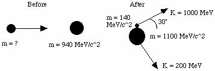

# 8.033 Problem Set 5: Energy, Momentum and Mass

##  French: 6-3

Q: A particle of rest mass m and kinetic energy 2 m c^2 strikes and sticks to
a stationary particle of rest mass 2m. Find the rest mass M of the composite
particle.

A: Calculate the square of the mass of the system by squaring the quaternion
and looking at the first term.

![\[Graphics:ps5gr1.
gif\]](../img/SR/problem_set_5/ps5gr1.gif)

    
    
![\[Graphics:ps5gr3.gif\]](../img/SR/problem_set_5/ps5gr3.gif)

The mass of the composite particle is
![\[Graphics:ps5gr4.gif\]](../img/SR/problem_set_5/ps5gr4.gif).

##  French: 6-4

Q: (a) A photon of energy E collides with a stationary particle of rest mass m
and is absorbed. What is the velocity of the resulting composite particle? (b)
A particle of rest mass mo moving at a speed of 4/5c collides with a similar
particle at rest and forms a composite particle. What is the rest mass of the
composite particle and what is its speed?

A: (a) The speed can be calculated from the ratio of the momentum to the
energy. Define the before and after quaternions, set these ratios equal to
each other and solve.

![\[Graphics:ps5gr5.
gif\]](../img/SR/problem_set_5/ps5gr5.gif)

![\[Graphics:ps5gr6.
gif\]](../img/SR/problem_set_5/ps5gr6.gif)

![\[Graphics:ps5gr7.
gif\]](../img/SR/problem_set_5/ps5gr7.gif)

    
    
![\[Graphics:ps5gr8.gif\]](../img/SR/problem_set_5/ps5gr8.gif)

The velocity of the composite particle is
![\[Graphics:ps5gr9.gif\]](../img/SR/problem_set_5/ps5gr9.gif).

(b) The problem is the same, only the numbers have been changed to protect the
writer.

![\[Graphics:ps5gr10
.gif\]](../img/SR/problem_set_5/ps5gr10.gif)

![\[Graphics:ps5gr11
.gif\]](../img/SR/problem_set_5/ps5gr11.gif)

    
    
![\[Graphics:ps5gr12.gif\]](../img/SR/problem_set_5/ps5gr12.gif)

Because mass is conserved, the mass of the composite equals the mass of the
system before the collision.

![\[Graphics:ps5gr13
.gif\]](../img/SR/problem_set_5/ps5gr13.gif)

    
    
![\[Graphics:ps5gr14.gif\]](../img/SR/problem_set_5/ps5gr14.gif)

The composite travels at 0.5c with a mass of
![\[Graphics:ps5gr15.gif\]](../img/SR/problem_set_5/ps5gr15.gif).

##  Baranger: The projectile

Q: A projectile of rest mass M1, energy E1, and momentum p1, is directed at a
stationary target of mass m2. Find a simple expression for the velocity of the
center of mass frame.

A: Define the before and after quaternions (a boost to the center of mass
frame - not a collision!).

![\[Graphics:ps5gr16
.gif\]](../img/SR/problem_set_5/ps5gr16.gif)

![\[Graphics:ps5gr17
.gif\]](../img/SR/problem_set_5/ps5gr17.gif)

We need to find a boost that will transform between the two. The boost
quaternion is simple for the center of mass frame where x=y=z=0.

![\[Graphics:ps5gr18
.gif\]](../img/SR/problem_set_5/ps5gr18.gif)

The ratio of the second component to the first one is p/E or v/c, exactly what
we are looking for.

![\[Graphics:ps5gr19
.gif\]](../img/SR/problem_set_5/ps5gr19.gif)

    
    
![\[Graphics:ps5gr20.gif\]](../img/SR/problem_set_5/ps5gr20.gif)

The velocity of the center of mass frame is
![\[Graphics:ps5gr21.gif\]](../img/SR/problem_set_5/ps5gr21.gif).

##  French: 6-11

Q: The neutral pi meson decays into two gamma rays (and nothing else). If the
pion (whose rest mass is 135 MeV) is moving with a kinetic energy of 1 GeV:
(a) What are the energies of the gamma rays if the decay process causes them
to be emitted in opposite directions along the pion's original line of motion?
(b) What angle is formed between the two gamma rays if they are emitted at
equal angles to the direction of the pion's motion?

A: (a) Define the before and after quaternions.

![\[Graphics:ps5gr22
.gif\]](../img/SR/problem_set_5/ps5gr22.gif)

![\[Graphics:ps5gr23
.gif\]](../img/SR/problem_set_5/ps5gr23.gif)

Solve for E2 using energy conservation, then E1 using momentum conservation.

![\[Graphics:ps5gr24
.gif\]](../img/SR/problem_set_5/ps5gr24.gif)

    
    
![\[Graphics:ps5gr25.gif\]](../img/SR/problem_set_5/ps5gr25.gif)

One gamma is 1131 MeV, the other is 4 MeV.

(b) The after quaternion has been changed. Solve first for the energy, then
the angle.

![\[Graphics:ps5gr26
.gif\]](../img/SR/problem_set_5/ps5gr26.gif)

![\[Graphics:ps5gr27
.gif\]](../img/SR/problem_set_5/ps5gr27.gif)

    
    
![\[Graphics:ps5gr28.gif\]](../img/SR/problem_set_5/ps5gr28.gif)

Theta is the half angle in radians.

![\[Graphics:ps5gr29
.gif\]](../img/SR/problem_set_5/ps5gr29.gif)

    
    
![\[Graphics:ps5gr30.gif\]](../img/SR/problem_set_5/ps5gr30.gif)

There is 13.6 degrees between the two gamma rays.

##  French: 6-14

Q: Show that the following processes are dynamically impossible: (a) A single
photon strikes a stationary electron and gives up all its energy to the
electron. (b) A single photon in empty space is transformed into an electron
and a positron. (c) A fast positron and a stationary electron annihilate,
producing only one photon.

A: (a) By inspection, momentum is conserved only if E = 0.

![\[Graphics:ps5gr31
.gif\]](../img/SR/problem_set_5/ps5gr31.gif)

![\[Graphics:ps5gr32
.gif\]](../img/SR/problem_set_5/ps5gr32.gif)

![\[Graphics:ps5gr33
.gif\]](../img/SR/problem_set_5/ps5gr33.gif)

    
    
![\[Graphics:ps5gr34.gif\]](../img/SR/problem_set_5/ps5gr34.gif)

A photon with no momentum is no photon at all.

(b) The square of the mass of the photon is zero. Examine the same for the
electron and positron.

![\[Graphics:ps5gr35
.gif\]](../img/SR/problem_set_5/ps5gr35.gif)

![\[Graphics:ps5gr36
.gif\]](../img/SR/problem_set_5/ps5gr36.gif)

    
    
![\[Graphics:ps5gr37.gif\]](../img/SR/problem_set_5/ps5gr37.gif)

The mass in never less than 2 m, so this transition violates conservation of
mass.

(c) The mass of the photon is zero. Find out the mass of the electron and
positron..

![\[Graphics:ps5gr38
.gif\]](../img/SR/problem_set_5/ps5gr38.gif)

![\[Graphics:ps5gr39
.gif\]](../img/SR/problem_set_5/ps5gr39.gif)

    
    
![\[Graphics:ps5gr40.gif\]](../img/SR/problem_set_5/ps5gr40.gif)

There is no choice of theta that makes the mass zero, so the transformation is
not possible without a violation of conservation of mass.

##  French: 7-1

Q: A K meson traveling through the laboratory breaks up into two pi mesons.
One of the pi mesons is left at rest. What was the energy of the K? What is
the energy of the remaining pi meson? (Rest mass of K meson = 494 MeV; rest
mass of pi meson ~137 MeV).

A: Define the quaternions for the before and after states.

![\[Graphics:ps5gr41
.gif\]](../img/SR/problem_set_5/ps5gr41.gif)

![\[Graphics:ps5gr42
.gif\]](../img/SR/problem_set_5/ps5gr42.gif)

![\[Graphics:ps5gr43
.gif\]](../img/SR/problem_set_5/ps5gr43.gif)

    
    
![\[Graphics:ps5gr44.gif\]](../img/SR/problem_set_5/ps5gr44.gif)

The kinetic energy will be E - M = gamma M - M.

![\[Graphics:ps5gr45
.gif\]](../img/SR/problem_set_5/ps5gr45.gif)

    
    
![\[Graphics:ps5gr46.gif\]](../img/SR/problem_set_5/ps5gr46.gif)

The pion has 616.6 MeV of kinetic energy.

Use the fact that energy is conserved to calculate the kinetic energy of the K
meson.

![\[Graphics:ps5gr47
.gif\]](../img/SR/problem_set_5/ps5gr47.gif)

    
    
![\[Graphics:ps5gr48.gif\]](../img/SR/problem_set_5/ps5gr48.gif)

The K meson has 396.6 MeV of kinetic energy.

##  Baranger: Protons to K's

Q: Consider the annihilation of an antiproton with a proton, both particles
being at rest, according to the reaction

![\[Graphics:ps5gr49
.gif\]](../img/SR/problem_set_5/ps5gr49.gif)

mass p = 940 MeV/c^2, mass kaon = 500 MeV/c^2. (a) Find the kinetic energies
and momenta of the created kaon particles. (b) If the proper lifetime of the
kaon's is 10^-10 s, find their actual lifetime in the lab frame and the
distance they travel.

A: (a) The mass of the system is 1880 MeV. After the creation of the kaon's,
the total momentum is still zero.

![\[Graphics:ps5gr55
.gif\]](../img/SR/problem_set_5/ps5gr55.gif)

![\[Graphics:ps5gr56
.gif\]](../img/SR/problem_set_5/ps5gr56.gif)

![\[Graphics:ps5gr57
.gif\]](../img/SR/problem_set_5/ps5gr57.gif)

    
    
![\[Graphics:ps5gr58.gif\]](../img/SR/problem_set_5/ps5gr58.gif)

![\[Graphics:ps5gr59
.gif\]](../img/SR/problem_set_5/ps5gr59.gif)

    
    
![\[Graphics:ps5gr60.gif\]](../img/SR/problem_set_5/ps5gr60.gif)

![\[Graphics:ps5gr61
.gif\]](../img/SR/problem_set_5/ps5gr61.gif)

    
    
![\[Graphics:ps5gr62.gif\]](../img/SR/problem_set_5/ps5gr62.gif)

Each kaon has 440 MeV of kinetic energy and a momentum of 796 Mev.

(b) t' = gamma t and d' = beta c t'. Simple stuff.

![\[Graphics:ps5gr64
.gif\]](../img/SR/problem_set_5/ps5gr64.gif)

    
    
![\[Graphics:ps5gr65.gif\]](../img/SR/problem_set_5/ps5gr65.gif)

![\[Graphics:ps5gr66
.gif\]](../img/SR/problem_set_5/ps5gr66.gif)

    
    
![\[Graphics:ps5gr67.gif\]](../img/SR/problem_set_5/ps5gr67.gif)

In 0.188 nanoseconds, the kaon's travel 4.77 cm.

##  Baranger: A photon collision

Q: A photon of energy E = 600 MeV, traveling in the +x direction, hits a
stationary particle of rest energy M c^2 = 1000 MeV. After the collision,
these two particles are replaced by two new particles of masses m1 and m2
respectively. The total energy (including rest energy) of particle 1 is E1 =
700 MeV and its momentum is p1x = 400 MeV, p1y = 300 MeV. (a) Draw a "before
and after" picture. (b) Find the energy and the momentum of particle 2. (c)
Find the masses m1 and m2.

A: (b) Lots of data is given to define the quaternions.

![\[Graphics:ps5gr69
.gif\]](../img/SR/problem_set_5/ps5gr69.gif)

![\[Graphics:ps5gr70
.gif\]](../img/SR/problem_set_5/ps5gr70.gif)

![\[Graphics:ps5gr71
.gif\]](../img/SR/problem_set_5/ps5gr71.gif)

![\[Graphics:ps5gr72
.gif\]](../img/SR/problem_set_5/ps5gr72.gif)

Because energy and mass are conserved, we know by inspection that for particle
2, E2 = 900 MeV, p2x c = 200 MeV, p2y c = -300 MeV.

![\[Graphics:ps5gr73
.gif\]](../img/SR/problem_set_5/ps5gr73.gif)

    
    
![\[Graphics:ps5gr74.gif\]](../img/SR/problem_set_5/ps5gr74.gif)

(c) Calculate the masses by squaring the quaternions.

![\[Graphics:ps5gr75
.gif\]](../img/SR/problem_set_5/ps5gr75.gif)

    
    
![\[Graphics:ps5gr76.gif\]](../img/SR/problem_set_5/ps5gr76.gif)

![\[Graphics:ps5gr77
.gif\]](../img/SR/problem_set_5/ps5gr77.gif)

    
    
![\[Graphics:ps5gr78.gif\]](../img/SR/problem_set_5/ps5gr78.gif)

The masses are m1 = 490 MeV and m2 = 825 Mev.

##  Baranger: Multiplying 4 vectors

Q: Let the energy-momentum 4-vector be

![\[Graphics:ps5gr79
.gif\]](../img/SR/problem_set_5/ps5gr79.gif)

Let the 4-velocity be the 4-vector

![\[Graphics:ps5gr80
.gif\]](../img/SR/problem_set_5/ps5gr80.gif)

Prove (carefully, rigorously!) that, if a particle of 4 momentum p is observed
by an observer of 4-velocity u, then the energy of the particle in the frame
of the observer is

![\[Graphics:ps5gr81
.gif\]](../img/SR/problem_set_5/ps5gr81.gif)

HINT: Choose special, convenient coordinate axes for the space components (and
say what these axes are).

A: Choose to define the velocity vector in terms of the momentum vectors.
Define the two quaternions.

![\[Graphics:ps5gr82
.gif\]](../img/SR/problem_set_5/ps5gr82.gif)

![\[Graphics:ps5gr83
.gif\]](../img/SR/problem_set_5/ps5gr83.gif)

![\[Graphics:ps5gr84
.gif\]](../img/SR/problem_set_5/ps5gr84.gif)

Calculate their product, looking at the first term which has units of energy.

![\[Graphics:ps5gr85
.gif\]](../img/SR/problem_set_5/ps5gr85.gif)

![\[Graphics:ps5gr86
.gif\]](../img/SR/problem_set_5/ps5gr86.gif)

The result can be written as
![\[Graphics:ps5gr87.gif\]](../img/SR/problem_set_5/ps5gr87.gif).

There is an even easier way to express this product.

![\[Graphics:ps5gr88
.gif\]](../img/SR/problem_set_5/ps5gr88.gif)

    
    
![\[Graphics:ps5gr89.gif\]](../img/SR/problem_set_5/ps5gr89.gif)

This is M/E or 1/gamma. This result was due to the unusual choice of the
velocity vector. Look at the other terms.

![\[Graphics:ps5gr90
.gif\]](../img/SR/problem_set_5/ps5gr90.gif)

    
    
![\[Graphics:ps5gr91.gif\]](../img/SR/problem_set_5/ps5gr91.gif)

The entire quaternion product is

![\[Graphics:ps5gr92
.gif\]](../img/SR/problem_set_5/ps5gr92.gif)

##  Baranger: An inelastic collision

Q: Consider the following inelastic collision:

Find the mass of the incoming projectile.

A: Determine the gammas from the kinetic energy and masses given.

![\[Graphics:ps5gr93
.gif\]](../img/SR/problem_set_5/ps5gr93.gif)

    
    
![\[Graphics:ps5gr94.gif\]](../img/SR/problem_set_5/ps5gr94.gif)

![\[Graphics:ps5gr95
.gif\]](../img/SR/problem_set_5/ps5gr95.gif)

    
    
![\[Graphics:ps5gr96.gif\]](../img/SR/problem_set_5/ps5gr96.gif)

We can calculate the py momentum for the m140 particle.

![\[Graphics:ps5gr97
.gif\]](../img/SR/problem_set_5/ps5gr97.gif)

    
    
![\[Graphics:ps5gr98.gif\]](../img/SR/problem_set_5/ps5gr98.gif)

The py momentum for the m1100 must be equal and opposite, which allows a
calculation of the angle.

![\[Graphics:ps5gr99
.gif\]](../img/SR/problem_set_5/ps5gr99.gif)

    
    
![\[Graphics:ps5gr100.gif\]](../img/SR/problem_set_5/ps5gr100.gif)

Calculate the amount of momentum in the x direction.

![\[Graphics:ps5gr10
1.gif\]](../img/SR/problem_set_5/ps5gr101.gif)

    
    
![\[Graphics:ps5gr102.gif\]](../img/SR/problem_set_5/ps5gr102.gif)

![\[Graphics:ps5gr10
3.gif\]](../img/SR/problem_set_5/ps5gr103.gif)

    
    
![\[Graphics:ps5gr104.gif\]](../img/SR/problem_set_5/ps5gr104.gif)

![\[Graphics:ps5gr10
5.gif\]](../img/SR/problem_set_5/ps5gr105.gif)

    
    
![\[Graphics:ps5gr106.gif\]](../img/SR/problem_set_5/ps5gr106.gif)

All of this momentum is from the incoming projectile.

Calculate the total energy after minus m940 to get the energy of the incoming
projectile.

![\[Graphics:ps5gr10
7.gif\]](../img/SR/problem_set_5/ps5gr107.gif)

    
    
![\[Graphics:ps5gr108.gif\]](../img/SR/problem_set_5/ps5gr108.gif)

Calculate the mass of incoming projectile the usual way by looking at the
first term of the square root of the squared quaternion.

![\[Graphics:ps5gr10
9.gif\]](../img/SR/problem_set_5/ps5gr109.gif)

    
    
![\[Graphics:ps5gr110.gif\]](../img/SR/problem_set_5/ps5gr110.gif)

The mass of the incoming projectile is 588 MeV.

##  Initialization functions

There are a few tools required to solve problems in special relativity using
quaternions to characterize events in spacetime. The most basic are a round
value for c and gamma.

![\[Graphics:ps5gr11
1.gif\]](../img/SR/problem_set_5/ps5gr111.gif)

![\[Graphics:ps5gr11
2.gif\]](../img/SR/problem_set_5/ps5gr112.gif)

Define a function for quaternions using its matrix representation.

![\[Graphics:ps5gr11
3.gif\]](../img/SR/problem_set_5/ps5gr113.gif)

A quaternion L that transforms a quaternion (L q[**x**] = q[**x'**]) identical
to how the Lorentz transformation acts on 4- vectors  
(Lambda **x** = **x'**) should exist. These are described in detail in the
notebook "A different algebra for boosts." For boosts along the x axis with y
= z = 0, the general function for L is

![\[Graphics:ps5gr11
4.gif\]](../img/SR/problem_set_5/ps5gr114.gif)

Most of the problems here involve much simpler cases for L, where t or x is
zero, or t is equal to x.

If t = 0, then

![\[Graphics:ps5gr11
5.gif\]](../img/SR/problem_set_5/ps5gr115.gif)

    
    
![\[Graphics:ps5gr116.gif\]](../img/SR/problem_set_5/ps5gr116.gif)

If x = 0, then

![\[Graphics:ps5gr11
7.gif\]](../img/SR/problem_set_5/ps5gr117.gif)

    
    
![\[Graphics:ps5gr118.gif\]](../img/SR/problem_set_5/ps5gr118.gif)

If t = x, then

![\[Graphics:ps5gr11
9.gif\]](../img/SR/problem_set_5/ps5gr119.gif)

    
    
![\[Graphics:ps5gr120.gif\]](../img/SR/problem_set_5/ps5gr120.gif)

Note: this is for blueshifts. Redshifts have a plus instead of the minus.

The problems are from "Basic Concepts in Relativity" by Resnick and Halliday,
1992 by Macmillian Publishing, "Special Relativity" by A. P. French, 1966,
1968 by MIT, and Prof. M. Baranger of MIT.

