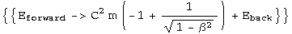
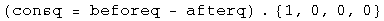
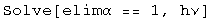
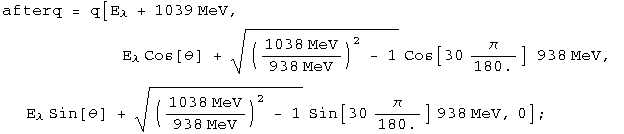
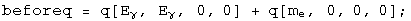
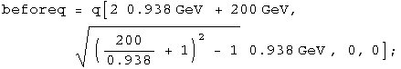
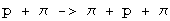
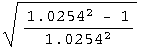
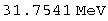

#  8.033 Problem Set 6:  The Compton Effect and Threshold Collision Problems

##  French:  6-16 The Compton effect

Q:  The usual theory of the Compton effect considers a stationary free
electron being struck by a photon, resulting in a scattered photon of lower
energy.  Suppose that a photon (of energy E) has a head-on collision with a
_moving_ electron (of rest mass mo)  What initial velocity does the electron
have if the collision results in a photon recoiling straight backward with the
same energy E as the incident photon?

A:  There are the same number of particles before and after, traveling in
opposite directions with the same energy.  Define the before and after
quaternions.

Conserve momentum and solve for the speed.

The initial velocity of the electron is
`****`.

##  French:  6-17

Q:  A stream of very high energy photons (&gt;&gt;10 MeV) is fired at a block
of matter.   Show that the energy E of the photons scattered directly backward
is essentially independent of the energy of the incident photons.  What is the
value of E backward?

A:  Define the relevant quaternions.

Solve for the energy forward using energy conservation.

Solve for the energy back using momentum conservation and the previous result.

As beta approaches one, the value of E backward approaches 1/2 mc^2.  The
photons are most likely to collide with electrons of mass 511 MeV, so E
backward is approximately 255 MeV.

##  French:  6-18

Q:  (a) A photon of energy hv collides elastically with an electron at rest.
After the collision the energy of the photon is hv/2, and it travels in a
direction making an angle of 60 degrees with its original direction.  What is
the value of the frequency?  What sort of photon is it?  (b) A photon of
energy hv  collides with an excited atom at rest.  After the collision the
photon still has energy hv, but its direction has changed by 180 degrees.nbsp;
If the atom is in its ground state after the collision, what was its initial
excitation energy?

A:  (a) Define the before and after quaternions.

By conservation of energy and momentum, the beforeq minus the afterq should be
zero.

There are 3 equations (each term is equal to zero) and three unknowns (hv,
alpha, and theta).  Eliminate theta using a trig identity, then eliminate
alpha using a hyperbolic trig identity.  (It's not easy, but it does work).

This identity equals 1, so it can be solved for hv.

Find the frequency by putting in the appropriate constants.

The frequency of the photon is 2.5 10^20 s^-1, a gamma ray.

(b) Define the before and after quaternions.

Solve for beta in terms of the ground state using momentum conservation.

Solve for the excited state using energy conservation.

The excitation energy will be .

##  French:  6-19

Q:  A high-energy photon strikes and is scattered by a proton that is
initially stationary and completely free to recoil.  The proton is observed to
recoil at a 30 degree angle with a kinetic energy of 100 MeV.  (a) What was
the energy of the incident photon?  (b) What are the direction and energy of
the scattered photon?

A:  (a) Define the before and after quaternions.

By conservation of energy and momentum, the beforeq minus the afterq should be
zero.

There are 2 equations (each term is equal to zero) and 2 unknowns (E and
theta).  Eliminate the angle using a trig identity.

This identity equals 1, so it can be solved for hv.

The incident photon is E + 100 MeV, or 329 MeV.

(b)  The energy of the scattered photon was calculated above at 229 MeV.  The
momentum in the conservation quaternion can be solved for theta.

The photon scatters at an angle of 104
degrees

##  French: 7-2

Q:  An electron-positron pair can be produced by a gamma ray striking a
stationary electron:

What is the minimum gamma ray energy that will make this process go?

A:  Define the before and after quaternions.

Set the square of the masses equal to each other and solve for E.

The minimum energy of the gamma ray is 2044 MeV.

##  Baranger:  Threshold KE

Q:  What is the threshold kinetic energy, in the Lab system, for the reaction:

The protons have mass M, the pions have mass m.  Set c = 1.

A:  K = E - M.  gamma = E/M = K/M + 1.  These relations can be used to define
the before and after quaternions.

Set the masses equal to each other and solve for K.

The minimum kinetic energy required is K = (2m^2 + 4m M)/M.

##  French:  7-3

Q:  Suppose that a certain accelerator can give protons a kinetic energy of
200 GeV.  The rest mass mo of a proton is 0.938 GeV.  Calculate the largest
possible rest mass Mo of a particle X that could be produced by the impact of
one of these high-energy protons on a stationary proton in the following
process:

A:  K = E - M.  gamma = E/M = K/M + 1.  These relations can be used to define
the before and after quaternions.

Set the square of the masses equal to each other and solve for X.

The largest possible rest mass is 17.6 GeV for this accelerator.

##  Baranger:  Another threshold

Consider the reaction:

The target proton is at rest.  The rest mass of the proton is 940 MeV and the
pion is 140 MeV.  (a) Calculate the threshold kinetic energy of the incident
pion for this reaction.  (b) At threshold, calculate the velocities and
momenta of the final-state proton and the pions in the lab system.

A:  (a) Define the before and after quaternions.

Set the square of the masses equal to each other and solve for K.

The threshold kinetic energy of the pion is 171 MeV.

(b) In the center-of-mass frame, all three particles are at rest.  In the Lab
frame, all three particles have the same velocity, but different momenta.
Calculate the energy before.

The gamma after is this energy divided by the mass.

Knowing gamma, both velocity and momenta can be calculated.

The particles have a relativistic velocity of 0.22, the pions have a momentum
pc = 31.7 MeV, and the protons have a momentum of pc= 213 MeV.

##  French: 7-6

Q:  The kinetic energy K of a system in the lab frame is related to the
kinetic energy K* in the center of mass frame in the nonrelativistic case by
the expression K = K* + MV^2/2, where M is the total mass of the system and V
is the velocity of the center of mass.  What is the analogous expression for
the relativistic case?  Show that it reduces to the above result if all speeds
are much less than c.

A:  Boost the quaternion for the center-of-mass frame to the lab, where Mo is
the sum of the rest masses of the particles in the system.

Energy is conserved, so `****`.

The kinetic energy in the lab frame is
.

Look at the nonrelativistic limit.

    

Note that  (K + Mo c^2) is the total mass of the system.  In the
nonrelativistic limit, the lab kinetic energy equals the kinetic energy within
the center of mass frame plus the kinetic energy of all the individual masses
in the center of mass frame.

##  Post ramble:  Initialization functions

There are a few tools required to solve problems in special relativity  using
quaternions to characterize events in spacetime.  The most basic are a round
value for c and gamma.

Define a function for quaternions using its matrix representation.

A quaternion L that transforms a quaternion (L q[**x**] = q[**x'**]) identical
to how the Lorentz transformation acts on 4-vectors  
(Lambda **x** = **x'**) should exist.  These are described in detail in the
notebook "A different algebra for boosts."  For boosts along the x axis with y
= z = 0, the general function for L is

Most of the problems here involve much simpler cases for L, where t or x is
zero, or t is equal to x.

If t = 0, then

If x = 0, then

If t = x, then

Note: this is for blueshifts.  Redshifts have a plus instead of the minus.

The problems are from "Basic Concepts in Relativity" by Resnick and Halliday,
1992 by Macmillian Publishing, "Special Relativity" by A. P. French, 1966,
1968 by MIT, and Prof. M. Baranger of MIT.

