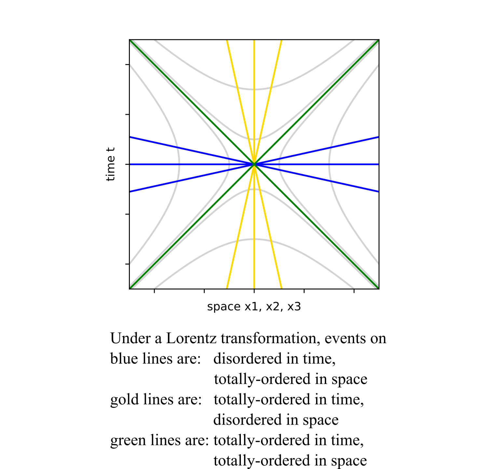

# Totally-ordered and Disordered Sets in Space-time under Lorentz Transformations

In Einstein's first paper on special relativity in 1905, he shows how
simultaneity is not an invariant under a Lorentz transformation. While there
may be an observer that says events _A_ and _B_ happened at the same moment in
time, a second observer may say _A_ happened before _B_ while a third reports _B_
happened before _A_. Is there something that all three observers can agree upon
about events _A_ and _B_, that is invariant under a proper Lorentz transformation?
For space-like separated events _A_ and _B_, so long as the observers have put in
the effort to agree about their choices in coordinates and the origin, then the
three observers will all agree on the ordering in space of these events in
space. If the first observer says _A_ is left of _B_, then so do observers two and
three. If events _A_ and _B_ were in the same location for one of the dimensions,
they would remain together. A totally-ordered set means one can say exactly one
of three things about any pair of numbers: one is bigger than the other, one is
less than the other, or both have the same value. An axis on a graph is a
totally-ordered set. Here we are thinking about pairs of space-like events that
can be connected by a straight line that runs through the origin. Under a
Lorentz transformation, the time for these pairs can switch order depending on
the inertial observer chosen. I will call this a disordered in time set of
events for space-like separated events under proper Lorentz transformations.
The measurements of space will form three totally-ordered sets.

The same exercise can be repeated for all time-like pairs events that fall on a
line running through the origin. These pairs of events will be totally-ordered
in time: event _A_ did happen before event _B_ and all observers agree to that. If
event _A_ was simultaneous to event _B_, that will remain true for all possible
inertial observers. To be time-like, simultaneous, and be on a line through the
origin requires that the spatial location of _A_ is identical to _B_. What is
disordered are measurements of space. If event _A_ is located at the same place
as event _B_ for one observer, a different observer could put _A_ left of _B_. The
third observer may see event _A_ to the right of _B_. There are three disordered in
space sets of events for time-like separated events in a straight line through
the origin under Lorentz transformations.

Pairs of light-like events remain totally-ordered in both time and the three
directions of space. Since everything in the light-cone travels at the same
speed, there is no way for one event to “catch up” and pass another. Using a
proper Lorentz transformation, an event is always stuck in a particular
quadrant of a space-time plot. Light-like and space-like events on hyperbolas
can use Lorentz transformations to cross one axis (the disordered one), and not
the other (the totally-ordered one). 

Here is a summary table:

| Relation to origin | Space-time component | Ordering |
| :---: | :---: | :---: |
| space-like | t | disordered |
|  " | X1	| totally-ordered |
| " | X2 | totally-ordered |
| " | X2 | totally-ordered |
| time-like | t | totally-ordered |
| " | X1 | disordered |
| " | X2 | disordered |
| " | X3 | disordered | 
| light-like | t | totally-ordered |
| " | X1 | totally-ordered |
| " | X2 | totally-ordered |
| " | X3 | totally-ordered |

For this summary to be valid, for all the events in the set there must exist an
inertial reference frame where all the events are on the space axis for
space-like events, on the time axis for time-like events or on the light cone
for light-like events. For any other collection of events, this analysis does
not apply. It is relevant to Einstein's initial observation about simultaneous
space-like events which fall on the space axis. I find it interesting that
events on the light cone retain their relative ordering under Lorentz
transformations. For different inertial observers, there will be relativistic
Doppler shifting which is well-understood. 

Another way to understand these observations is with a space-time diagram:

Axes are totally-ordered sets. A Lorentz transformation does not alter that
quality. Instead, it is the other axis that becomes disordered under a Lorentz
transformation. It is interesting that the light cone itself remains
totally-ordered in both time and space under Lorentz transformations. Values
will change, but ordering will not.

Is the requirement of this analysis that for all event there exists straight
line so narrow as to make this observation uninteresting? I would argue that
every material object's world line to the itself is a straight world line. While
I may bike around suburbia, I am at the center of my observable world. I can
never ride fast enough to separate from my own eyes. Everyone does agree about
which moment of my life came first, second and last. Being North or South, East
or West, and up or down would depend on the inertial observer.

The subject of all totally ordered sets in space-time came up while thinking
about causality in quantum mechanics. [Bell's Future Quantum
Mechanics](https://bit.ly/BellsFuture) is a page devoted to the new
interpretation. See the bottom of the page for other presentations of the idea.
