# Art Portfolio

Click to enlarge, more info on each below...

<table style="display:inline-block">
    <tr>
        <td style="vertical-align: middle;">
<a class="fancybox-button" rel="fancybox-button"
    href="../../images/Stuff/Art/gray_albert_750.png">
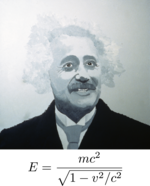 </a>
        </td>

        <td style="vertical-align: middle;">
<a class="fancybox-button" rel="fancybox-button"
    href="../../images/Stuff/Art/turquoise_einstein_750.png">
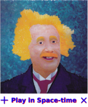 </a>
        </td>

        <td style="vertical-align: middle;">

        </td>

        <td style="vertical-align: middle;">
<a class="fancybox-button" rel="fancybox-button"
    href="../../images/Stuff/Art/space-time_geometries_750.png">
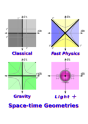 </a>
        </td>

        <td style="vertical-align: middle;">
<a class="fancybox-button" rel="fancybox-button"
    href="../../images/Stuff/Art/xmas_apple_card_750.png">
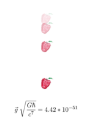 </a>
        </td>
    </tr>

    <tr>
        <td style="vertical-align: middle;">
<a class="fancybox-button" rel="fancybox-button"
    href="../../images/Stuff/Art/photons_750.png">
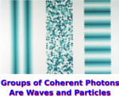 </a>
        </td>

        <td style="vertical-align: middle;">
<a class="fancybox-button" rel="fancybox-button"
    href="../../images/Stuff/Art/speed_of_light_750.png">
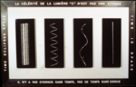 </a>
        </td>

        <td style="vertical-align: middle;">
<a class="fancybox-button" rel="fancybox-button"
    href="../../images/Stuff/Art/big_equations_750.png">
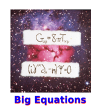 </a>
        </td>

        <td style="vertical-align: middle;">

        </td>

        <td style="vertical-align: middle;">

        </td>
    </tr>

    <tr>
        <td style="vertical-align: middle;">

        </td>

        <td style="vertical-align: middle;">
<a class="fancybox-button" rel="fancybox-button"
    href="../../images/Stuff/Art/drawing_zero_750.png">
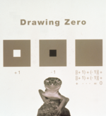 </a>

        <td style="vertical-align: middle;">

    </tr>
</table>

## Einstein

### "Gray Albert"
36" x 36", oil on linen, 1995
 [buy as a t-shirt & stuff](http://www.redbubble.com/people/visualphysics/works/22331790-gray-albert), [hi res](../images/Stuff/Art/gray_albert_big.png)

This is an oil painting done in 1995:

The **most famous equation in physics** was written this way by Einstein in
1905. The amount of energy one measures depends on a relative velocity in
precisely this way.

### "Turquoise Einstein"
36" x 36", oil on linen, 1995 
 [buy as a t-shirt & stuff](http://www.redbubble.com/people/visualphysics/works/22331871-turquoise-einstein), [hi res](../images/Stuff/Art/turquoise_einstein_big.png)

This is an oil painting done in 1995:
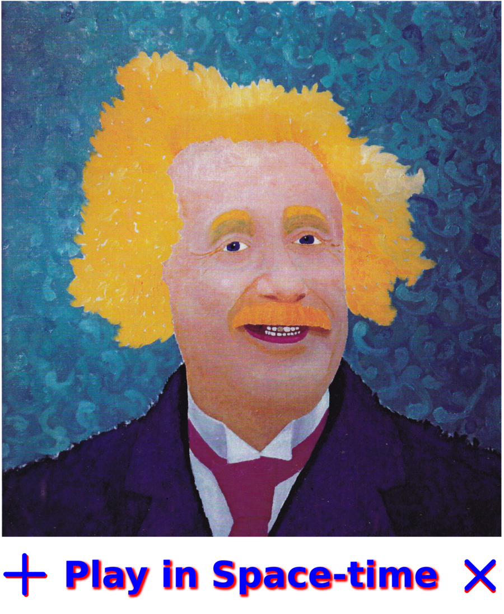

Einstein's math teacher Minkowski said:

    The views of space and time which I wish to lay before you have sprung from the
    soil of experimental physics, and therein lies their strength. They are
    radical. Henceforth space by itself, and time by itself, are doomed to fade
    away into mere shadows, and only a kind of union of the two will preserve an
    independent reality. 

I am trying to realize Minkowski's mission by using a type of number where only
the union of space and time can be used.

## Gravity

### "Play in Space-time"
Marker drawing on paper, 8.5"x11", 2015
Elle and Doug Sweetser
 [buy as a t-shirt & stuff](http://www.redbubble.com/people/visualphysics/works/22331937-play-in-space-time), [hi res](../images/Stuff/Art/play_in_space-time_big.png)

This graphic was developed in collaboration with my daughter to explain a new
purely geometric approach to gravity. 
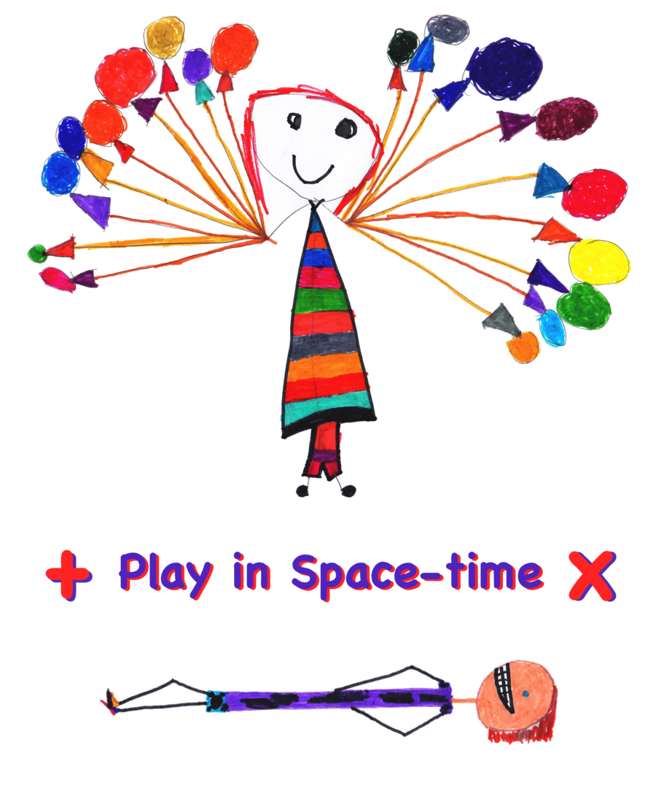

Balloon girl and prone boy agree on the value of space-times-time which results 
from squaring a quaternion.

### "Space-time Geometries"
Computer graphic, 2016
 [buy as a t-shirt & stuff](http://www.redbubble.com/people/visualphysics/works/22331988-space-time-geometries), [hi res](../images/Stuff/Art/space-time_geometries_big.png)

Nature knows how to do many forms of physics simultaneously. Thus we need to 
think of multiple forms of geometry together as is done on this t-shirt.

Newtonian physics has absolute time paired with absolute space (in gray).
Einstein added the limitation that massless light is the only thing where time
is space, the 45 degree angle. My new proposal for gravity takes the Newtonian
absolutes and makes sure nothing crosses the lines. If space-time is a number
and not a vector field, then one can see the symmetries that underlies both
electromagnetism and the weak force.

### "Small Apple"
Pastel on paper + computer, 3"x6", 2005
 [buy as a t-shirt & stuff](http://www.redbubble.com/people/visualphysics/works/22332132-tiny-dimensionless-apple-falling?), [hi res](../images/Stuff/Art/xmas_apple_card_big.png)

Simple, silent, and dimensionless

    Gravity written wihout units
    tiny beyond the tiniest tiny
    gives weight to mountains and butterflies
    even light bends to this King.

    Lives lived without words
    alive, breathing, being in now
    give weight to
    responsibilities and laughter
    even love bows to life.

From a Christmas card written after my daughter was born.

## Quantum

### "Groups of Coherent Photons Behave Like Waves and Particles"
36"x24", Computer graphic, 1995
 [buy as a t-shirt & stuff](http://www.redbubble.com/people/visualphysics/works/22337065-groups-of-coherent-particles-are-waves-and-particles), [hi res](../images/Stuff/Art/photons_big.png)
It's the source, not the slits.

A source for light **must be coherent** to create an interference pattern. That
requires organization. The middle column is incoherent and never has an 
interference pattern.

### "The Speed of Light According to Ren&eacute; Magritte"
Mixed media, 60"x36", 1995
 [buy t-shirts & stuff](http://www.redbubble.com/people/visualphysics/works/22337263-the-speed-of-light-according-to-ren-magritte), [hi res](../images/Stuff/Art/speed_of_light_big.png)

The speed of light is about the relationship between time and space, not how
fast something is going.

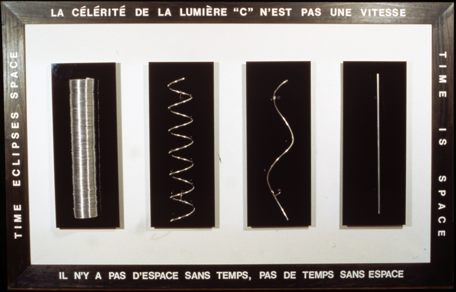

If you can sit around and tell the long story of your life to me, then time
eclipses space. The greater the difference in our speeds, the less of a story
one can tell. Photons get one chance to tell one story and then they are gone.

### "Big Equations"
Mixed media, 3x3", 1995

The field equations of general relativity and the Dirac equation.
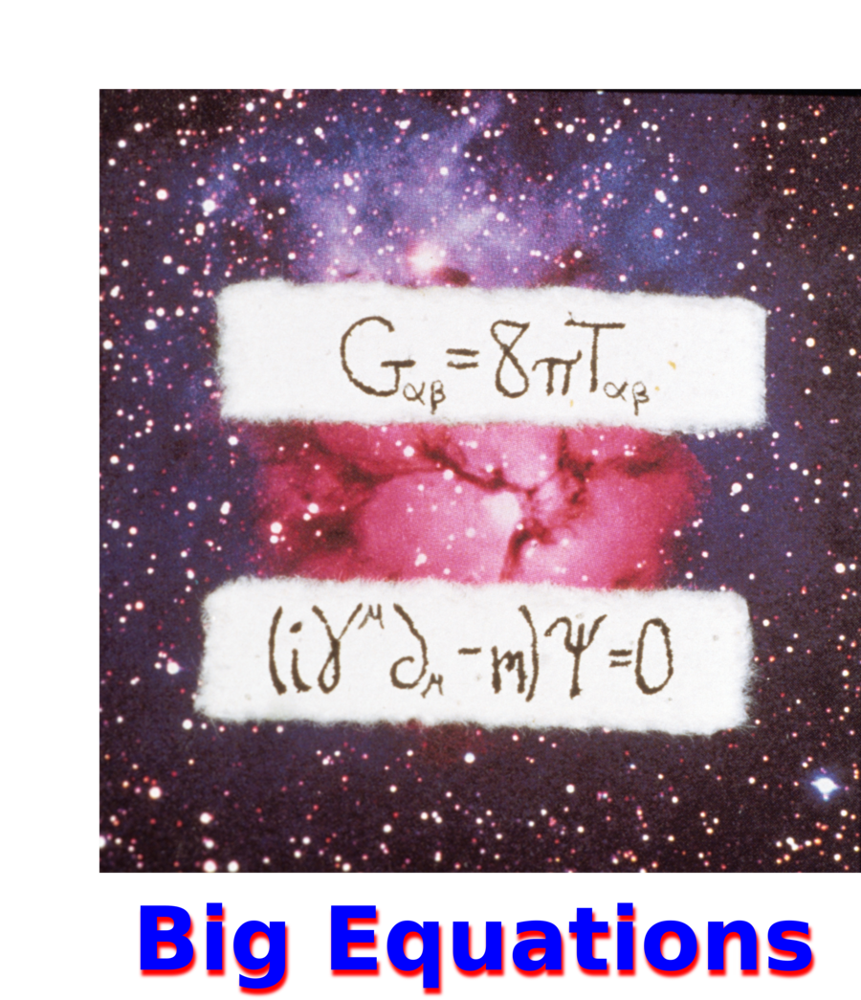

The field equations of general relativity cover the big stuff of the Universe.
The small stuff is accounted for by the Dirac equation.

## Number Theory

### "Numbers in Theory" 
Mixed media, 42"x32", 2014

Zero, one, real, complex, and quaternion numbers, all in one animation.

So simple in the upper left, so beyond big by the lower right.

### Zero Spider
Mixed media, detail

The graph theory for multiplying by zero in 4D looks like a spider.

White means one, gray is minus one, black is zero. The three colored cleaners
are i, j, and k, each being positive or negative depending on if it has white
or black bead respectively.

### "Drawing Negative Infinity"
Computer graphic, 16"x10", 1995
[hi res](../images/Stuff/Art/drawing_negative_infinity_big.png)

### "Drawing Zero"
Computer graphic, 12"x12", 1995
[hi res](../images/Stuff/Art/drawing_zero_big.png)
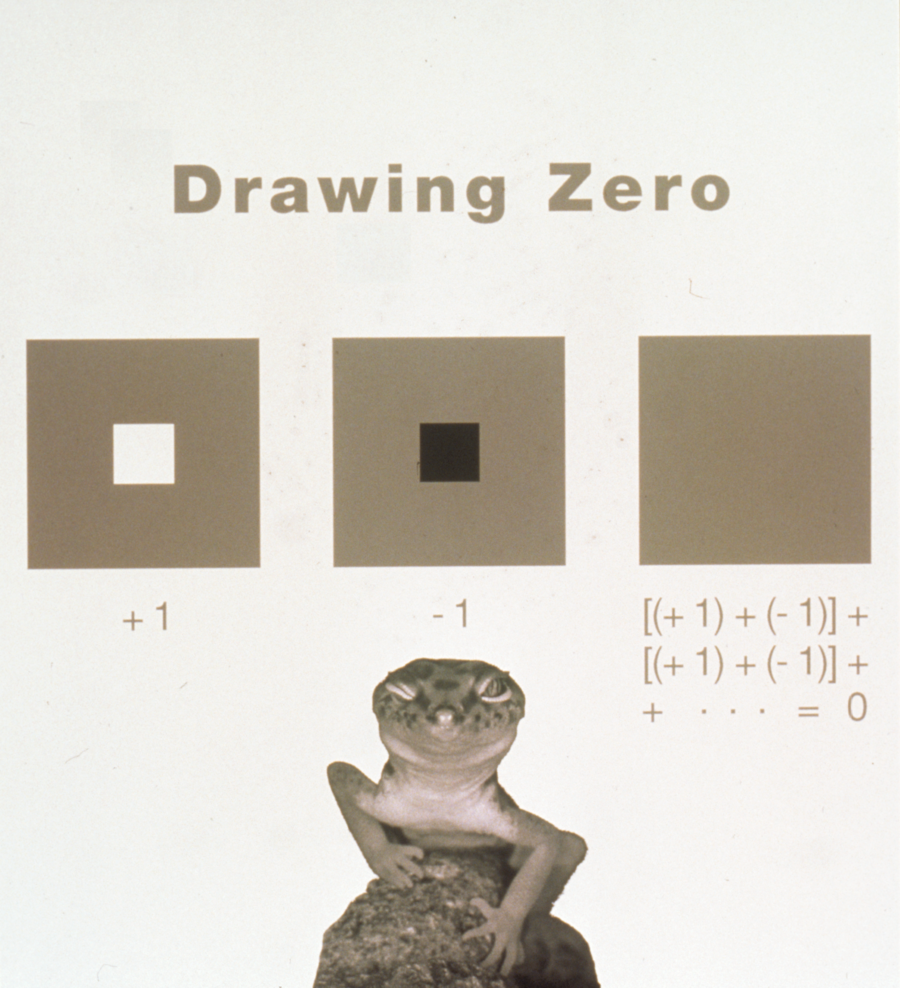

### "Drawing Positive Infinity"
Computer graphic, 16"x10", 1995
[hi res](../images/Stuff/Art/drawing_positive_infinity_big.png)

## Videos

### A 6 minute tour

A walk through my townhouse.

<iframe width="1020" height="630"
src="https://www.youtube.com/embed/zaFRDYXWWP4" frameborder="0"
allowfullscreen></iframe>

### Einstein!

Thoughts on the great thinker.

<iframe width="840" height="630"
src="https://www.youtube.com/embed/k_psORscNpw" frameborder="0"
allowfullscreen></iframe>

### Light, Art, and Physics

A talk about 2 of the works, "The Speed of Light According to Ren&eacute; Magritte" 
and "Groups of Coherent Photons Behave Like Waves and Particles."

<iframe width="840" height="630"
src="https://www.youtube.com/embed/gmnPL4mkYSM" frameborder="0"
allowfullscreen></iframe>
