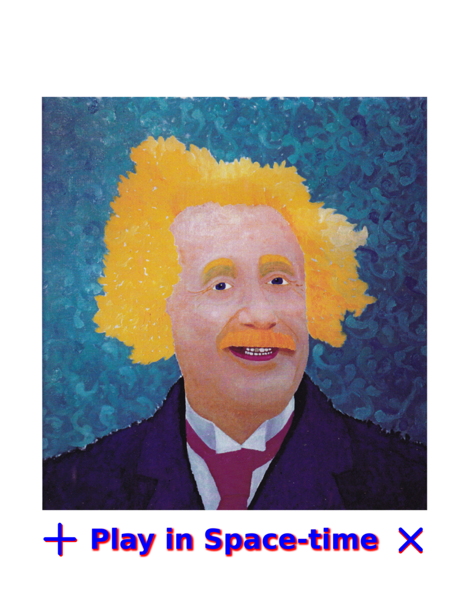
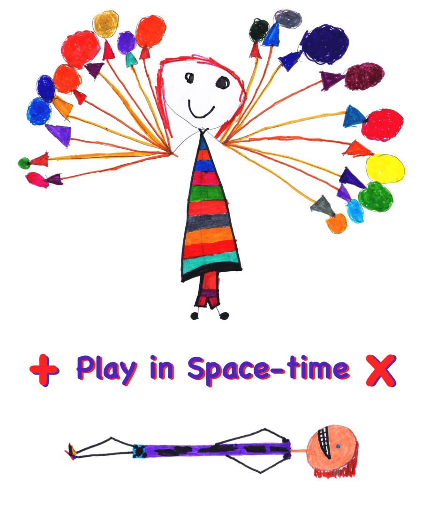
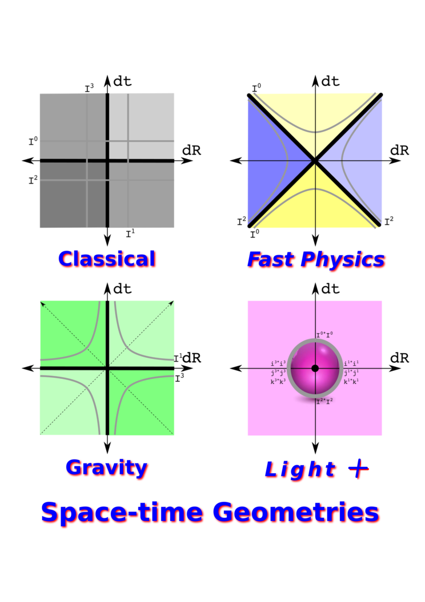
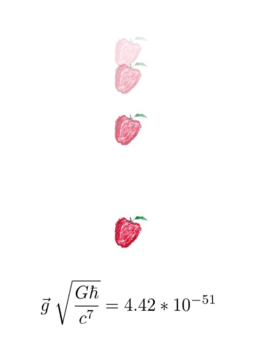

# T-shirts

If a physics idea fits on a t-shirt, that is a good thing. Here are four such
designs (at 1/3 the final resolution).

## Turquoise Einstein

This is an oil painting done in 1995:

Einstein's math teacher Minkowski said:

    The views of space and time which I wish to lay before you have sprung from the
    soil of experimental physics, and therein lies their strength. They are
    radical. Henceforth space by itself, and time by itself, are doomed to fade
    away into mere shadows, and only a kind of union of the two will preserve an
    independent reality. 

I am trying to realize Minkowski's mission by using a type of number where only
the union of space and time can be used.

## Play in Space-time

This graphic was developed in collaboration with my daughter to explain a new
purely geometric approach to gravity. 

Balloon girl and prone boy agree on the value of space-times-time which results 
from squaring a quaternion.

## Space-time Geometries

Nature knows how to do many forms of physics simultaneously. Thus we need to 
think of multiple forms of geometry together as is done on this t-shirt.

Newtonian physics has absolute time paired with absolute space (in gray).
Einstein added the limiation that massless light is the only thing where time
is space, the 45 degree angle. My new proposal for gravity takes the Newtonian
absolutes and makes sure nothing crosses the lines. If space-time is a number
and not a vector field, then one can see the symmetries that underlies both
electromagnetism and the weak force.

## Apple falling

Simple, silent, and dimensionless

    Gravity written wihout units
    tiny beyond the tiniest tiny
    gives weight to mountains and butterflies
    even light bends to this King.

    Lives lived without words
    alive, breathing, being in now
    give weight to
    responsibilities and laughter
    even love bows to life.

From a Christmas card written after my daughter was born.
