# Overview

## Unifying Two Views of Events

An experimentalist collects events about a physical system. A theorists builds a model to describe what patterns of events within a system might generate the experimentalist's data set. With hard work and luck, the two will agree!

Events are handled mathematically as 4-vectors. They can be added or subtracted
from another, or multiplied by a scalar. Nothing else can be done. A theorist
can import very powerful tools to generate patterns, like metrics and group
theory. Theorists in physics have been able to construct the most accurate
models of nature in all of science.

I hope to bring the full power of mathematics down to the level of the events
themselves. This may be done by representing events as the mathematical field
of quaternions. All the standard tools for creating mathematical patterns -
multiplication, trigonometric functions, transcendental functions, infinite
series, the special functions of physics - should be available for quaternions.
Now a theorist can create patterns of events with events. This may lead to a
better unification between the work of a theorist and the work of an
experimentalist.

## An Overview of Doing Physics with Quaternions

It has been said that one reason physics succeeds is because all the terms in
an equation are tensors of the same rank.  This work challenges that
assumption, proposing instead an integrated set of equations which are all
based on the same 4-dimensional mathematical field of quaternions.  Mostly this
document shows in cookbook style how quaternion equations are equivalent to
approaches already in use.  As Feynman pointed out, "whatever we are allowed to
imagine in science must be consistent with everything else we know."   Fresh
perspectives arise because, in essence, tensors of different rank can mix
within the same equation.  The four Maxwell equations become one nonhomogeneous
quaternion wave equation, and the Klein-Gordon equation is part of a quaternion
simple harmonic oscillator.  There is hope of integrating general relativity
with the rest of physics because the affine parameter naturally arises when
thinking about lengths of intervals where the origin moves.  Since all of the
tools used are woven from the same mathematical fabric, the interrelationships
become more clear to my eye.  Hope you enjoy. 

# A Brief History of Quaternions

Complex numbers were a hot subject for research in the early eighteen hundreds.
An obvious question was that if a rule for multiplying two numbers together was
known, what about multiplying three numbers?  For over a decade, this simple
question had bothered Hamilton, the big mathematician of his day.  The pressure
to find a solution was not merely from within.  Hamilton wrote to his son:

Every morning in the early part of the above-cited month [Oct. 1843] on my
coming down to breakfast, your brother William Edwin and yourself used to ask
me, 'Well, Papa, can you multiply triplets?' Whereto I was always obliged to
reply, with a sad shake of the head, 'No, I can only add and subtract them.'

We can guess how Hollywood would handle the Brougham Bridge scene in Dublin.
Strolling along the Royal Canal with Mrs. H-, he realizes the solution to the
problem, jots it down in a notebook.  So excited, he took out a knife and
carved the answer in the stone of the bridge.

Hamilton had found a long sought-after solution, but it was weird, very weird,
it was 4D.  One of the first things Hamilton did was get rid of the fourth
dimension, setting it equal to zero, and calling the result a "proper
quaternion."  He spent the rest of his life trying to find a use for
quaternions.  By the end of the nineteenth century, quaternions were viewed as
an oversold novelty.

In the early years of this century, Prof. Gibbs of Yale found a use for proper
quaternions by reducing the extra fluid surrounding Hamilton's work and adding
key ingredients from Rodrigues concerning the application to the rotation of
spheres.  He ended up with the vector dot product and cross product we know
today.  This was a useful and potent brew.  Our investment in vectors is
enormous, eclipsing their place of birth (Harvard had >1000 references under
"vector", about 20 under "quaternions", most of those written before the turn
of the century).

In the early years of this century, Albert Einstein found a use for four
dimensions.  In order to make the speed of light constant for all inertial
observers, space and time had to be united.  Here was a topic tailor-made for a
4D tool, but Albert was not a math buff, and built a machine that worked from
locally available parts.  We can say now that Einstein discovered Minkowski
spacetime and the Lorentz transformation, the tools required to solve problems
in special relativity.

Today, quaternions are of interest to historians of mathematics.  Vector
analysis performs the daily mathematical routine that could also be done with
quaternions.  I personally think that there may be 4D roads in physics that can
be efficiently traveled only by quaternions, and that is the path which is laid
out in these web pages.

In a longer history, Gauss would get the credit for seeing quaternions first in
one of his notebooks. Rodrigues developed 3D rotations all on his own also in
the 1840's. The Pauli spin matrices and Penrose's spinors are reinventions of
the wheel that miss out on division. Although I believe that is a major
omission and cause of subtle flaws at the foundations of modern physics, spin
matrices and spinors have many more adherents today than quaternions.

#  Multiplying Quaternions the Easy Way

Multiplying two complex numbers a + b I and c + d I is straightforward.

For two quaternions, b I and d I become the 3-vectors B and D, where    B = x
I + y J + z K and similarly for D.  Multiplication of quaternions is like
complex numbers, but with the addition of the cross product.

Note that the last term, the cross product, would change its sign if the order
of multiplication were reversed (unlike all the other terms).  That is why
quaternions in general do not commute.

If a is the operator d/dt, and B is the del operator, or d/dx I + d/dy J \+
d/dz K (all partial derivatives), then these operators act on the scalar
function c and the 3-vector function D in the following manner:

This one quaternion contains the time derivatives of the scalar and 3-vector
functions, along with the divergence, the gradient and the curl.  Dense
notation :-)

#  Inner and Outer Products of Quaternions

A good friend of mine has wondered what is means to multiply two quaternions
together (this question was a hot topic in the nineteenth century).  I care
more about what multiplying two quaternions together can do.  There are two
basic ways to do this: just multiply one quaternion by another, or first take
the transpose of one then multiply it with the other.  Each of these products
can be separated into two parts: a symmetric (inner product) and an
antisymmetric (outer product) components.  The symmetric component will remain
unchanged by exchanging the places of the quaternions, while the antisymmetric
component will change its sign.  Together they add up to the product.  In this
section, both types of inner and outer products will be formed and then
related to physics.

##  The Grassman Inner and Outer Products

There are two basic ways to multiply quaternions together.  There is the
direct approach.

I call this the Grassman product (I do not know if anyone else does, but I need
a label).  The inner product can also be called the symmetric product, because
it does not change signs if the terms are reversed.

I have defined the anticommutator (the bold curly braces) in a non-standard
way, including a factor of two so I do not have to keep remembering to write
it.  The first term would be the Lorentz invariant interval if the two
quaternions represented the same difference between two events in spacetime
(i.e. t=t'=delta t,...).  The invariant interval plays a central role in
special relativity.  The vector terms are a frame-dependent, symmetric product
of space with time and does not appear on the stage of physics, but is still a
valid measurement.

The Grassman outer product is antisymmetric and is formed with a commutator.

This is the cross product defined for two 3-vectors.  It is unchanged for
quaternions.

##  The Euclidean Inner and Outer Products

Another important way to multiply a pair of quaternions involves first taking
the conjugate of one of the quaternions.  For a real-valued matrix
representation, this is equivalent to multiplication by the transpose which
involves flipping the sign of the 3-vector.

Form the Euclidean inner product.

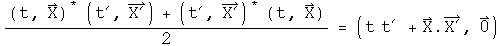

The first term is the Euclidean norm if the two quaternions are the same (this
was the reason for using the adjective "Euclidean").  The Euclidean inner
product is also the standard definition of a dot product.

Form the Euclidean outer product.

The first term is zero.  The vector terms are an antisymmetric product of
space with time and the negative of the cross product.

##  Implications

When multiplying vectors in physics, one normally only considers the Euclidean
inner product, or dot product, and the Grassman outer product, or cross
product.  Yet, the Grassman inner product, because it naturally generates the
invariant interval, appears to play a role in special relativity.  What is
interesting to speculate about is the role of the Euclidean outer product.  It
is possible that the antisymmetric, vector nature of the space/time product
could be related to spin.  Whatever the interpretation, the Grassman and
Euclidean inner and outer products seem destined to do useful work in physics.

#  Scalars, Vectors, Tensors and All That

According to my math dictionary, a tensor is ...

    An abstract object having a definitely specified system of components in every
    coordinate system under consideration and such that, under transformation of
    coordinates, the components of the object undergoes a transformation of a
    certain nature.

To make this introduction less abstract, I will confine the discussion to the
simplest tensors under rotational transformations.  A rank-0 tensor is known
as a scalar.  It does not change at all under a rotation.  It contains exactly
one number, never more or less.  There is a zero index for a scalar.  A rank-1
tensor is a vector.  A vector does change under rotation.  Vectors have one
index which can run from 1 to the number of dimensions of the field, so there
is no way to know a priori how many numbers (or operators, or ...) are in a
vector.  n-rank tensors have n indices. The number of numbers needed is the
number of dimensions in the vector space raised by the rank.  Symmetry can
often simplify the number of numbers actually needed to describe a tensor.

There are a variety of important spin-offs of a standard vector.  Dual
vectors, when multiplied by its corresponding vector, generate a real number,
by systematically multiplying each component from the dual vector and the
vector together and summing the total.  If the space a vector lives in is
shrunk, a contravariant vector shrinks, but a covariant vector gets larger.  A
tangent vector is, well, tangent to a vector function.

Physics equations involve tensors of the same rank.  There are scalar
equations, polar vector equations, axial vector equations, and equations for
higher rank tensors.  Since the same rank tensors are on both sides, the
identity is preserved under a rotational transformation.  One could decide to
arbitrarily combine tensor equations of different rank, and they would still
be valid under the transformation.

There are ways to switch ranks.  If there are two vectors and one wants a
result that is a scalar, that requires the intervention of a metric to broker
the transaction.  This process in known as an inner tensor product or a
contraction.  The vectors in question must have the same number of dimensions.
The metric defines how to form a scalar as the indices are examined one-by-
one.  Metrics in math can be anything, but nature imposes constraints on which
ones are important in physics.  An aside: mathematicians require that the distance
is non-negative, but physicists do not.  I will be using the physics notion of
a metric.  In looking at events in spacetime (a 4-dimensional vector), the
axioms of special relativity require the Minkowski metric, which is a 4x4 real
matrix that has (1, -1, -1, -1) down the diagonal and zeros elsewhere.  Some
people prefer the signs to be flipped, but to be consistent with everything
else on this site, I choose this convention.  Another popular choice is the
Euclidean metric, which is the same as an identity matrix.  The result of
general relativity for a spherically symmetric, non-rotating mass is the
Schwarzschild metric, which has "non-one" terms down the diagonal, zeros
elsewhere, and becomes the Minkowski metric in the limit of the mass going to
zero or the radius going to infinity.

An outer tensor product is a way to increase the rank of tensors.  The tensor
product of two vectors will be a 2-rank tensor.  A vector can be viewed as the
tensor product of a set of basis vectors.

##  What Are Quaternions?

Quaternions could be viewed as the outer tensor product of a scalar and a
3-vector.  Under rotation for an event in spacetime represented by a
quaternion, time is unchanged, but the 3-vector for space would be rotated.
The treatment of scalars is the same as above, but the notion of vectors is
far more restrictive, as restrictive as the notion of scalars. Quaternions can
only handle 3-vectors.  To those familiar to playing with higher dimensions,
this may appear too restrictive to be of interest.  Yet physics on both the
quantum and cosmological scales is confined to 3-spatial dimensions.  Note
that the infinite Hilbert spaces in quantum mechanics a function of the
principle quantum number n, not the spatial dimensions.  An infinite
collection of quaternions of the form (En, Pn) could represent a quantum
state.  The Hilbert space is formed using the Euclidean product (q* q').

A dual quaternion is formed by taking the conjugate, because q* q = (t^2 \+
X.X, 0).  A tangent quaternion is created by having an operator act on a
quaternion-valued function

What would happen to these five terms if space were shrunk?  The 3-vector F
would get shrunk, as would the divisors in the Del operator, making functions
acted on by Del get larger.  The scalar terms are completely unaffected by
shrinking space, because df/dt has nothing to shrink, and the Del and F cancel
each other.  The time derivative of the 3-vector is a contravariant vector,
because F would get smaller.  The gradient of the scalar field is a covariant
vector, because of the work of the Del operator in the divisor makes it
larger.  The curl at first glance might appear as a draw, but it is a
covariant vector capacity because of the right-angle nature of the cross
product.  Note that if time where to shrink exactly as much as space, nothing
in the tangent quaternion would change.

A quaternion equation must generate the same collection of tensors on both
sides.  Consider the product of two events, q and q':

Where is the axial vector for the left hand side?  It is imbedded in the
multiplication operation, honest :-)

The axial vector is the one that flips signs if the order is reversed.

Terms can continue to get more complicated.  In a quaternion triple product,
there will be terms of the form (XxX').X".  This is called a pseudo-scalar,
because it does not change under a rotation, but it will change signs under a
reflection, due to the cross product.  You can convince yourself of this by
noting that the cross product involves the sine of an angle and the dot
product involves the cosine of an angle. Neither of these will change under a
rotation, and an even function times an odd function is odd.  If the order of
quaternion triple product is changed, this scalar will change signs for at
each step in the permutation.

It has been my experience that any tensor in physics can be expressed using
quaternions.  Sometimes it takes a bit of effort, but it can be done.

Individual parts can be isolated if one chooses.  Combinations of conjugation
operators which flip the sign of a vector, and symmetric and antisymmetric
products can isolate any particular term.  Here are all the terms of the
example from above

The metric for quaternions is imbedded in Hamilton's rule for the field.

This looks like a way to generate scalars from vectors, but it is more than
that.  It also says implicitly that i j = k, j k = i, and i, j, k must have
inverses.  This is an important observation, because it means that inner and
outer tensor products can occur in the same operation. When two quaternions
are multiplied together, a new scalar (inner tensor product) and vector (outer
tensor product) are formed.

How can the metric be generalized for arbitrary transformations?  The
traditional approach would involve playing with Hamilton's rules for the
field.  I think that would be a mistake, since that rule involves the
fundamental definition of a quaternion.  Change the rule of what a quaternion
is in one context and it will not be possible to compare it to a quaternion in
another context.  Instead, consider an arbitrary transformation T  which takes
q into q'

T is also a quaternion, in fact it is equal to q' q^-1.  This is guaranteed to
work locally, within neighborhoods of q and q'.  There is no promise that it
will work globally, that one T will work for any q.  Under certain
circumstances, T will work for any q.  The important thing to know is that a
transformation T necessarily exists because quaternions are a field. The two
most important theories in physics, general relativity and the standard model,
involve local transformations (but the technical definition of local
transformation is different than the idea presented here because it involves
groups).

This quaternion definition of a transformation creates an interesting
relationship between the Minkowski and Euclidean metrics.

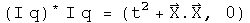

In order to change from wrist watch time (the interval in spacetime) to the
norm of a Hilbert space does not require any change in the transformation
quaternion, only a change in the multiplication step. Therefore a
transformation which generates the Schwarzschild interval of general
relativity should be easily portable to a Hilbert space, and that might be the
start of a quantum theory of gravity.

##  So What Is the Difference?

I think it is subtle but significant.  It goes back to something I learned in
a graduate level class on the foundations of calculus.  To make calculus
rigorous requires that it is defined over a mathematical field. Physicists do
this be saying that the scalars, vectors and tensors they work with are
defined over the field of real or complex numbers.

What are the numbers used by nature?  There are events, which consist of the
scalar time and the 3-vector of space.  There is mass, which is defined by the
scalar energy and the 3-vector of momentum.  There is the electromagnetic
potential, which has a scalar field phi and a 3-vector potential A.

To do calculus with only information contained in events requires that a
scalar and a 3-vector form a field.  According to a theorem by Frobenius on
finite dimensional fields, the only fields that fit are isomorphic to the
quaternions (isomorphic is a sophisticated notion of equality, whose
subtleties are appreciated only by people with a deep understanding of
mathematics).  To do calculus with a mass or an electromagnetic potential has
an identical requirement and an identical solution.  This is the logical
foundation for doing physics with quaternions.

Can physics be done without quaternions?  Of course it can!  Events can be
defined over the field of real numbers, and then the Minkowski metric and the
Lorentz group can be deployed to get every result ever confirmed by
experiment.  Quantum mechanics can be defined using a Hilbert space defined
over the field of complex numbers and return with every result measured to
date.

Doing physics with quaternions is unnecessary, unless physics runs into a
compatibility issue.  Constraining general relativity and quantum mechanics to
work within the same topological algebraic field may be the way to unite these
two separately successful areas.

#  Quaternion Analysis

Complex numbers are a subfield of quaternions.  My hypothesis is that complex
analysis should be self-evident within the structure of quaternion analysis.

The challenge is to define the derivative in a non-singular way, so that a
left derivative always equals a right derivative.  If quaternions would only
commute...  Well, the scalar part of a quaternion does commute.  If, in the
limit, the differential element converged to a scalar, then it would commute.
This idea can be defined precisely.  All that is required is that the
magnitude of the vector goes to zero faster than the scalar.  This might
initially appears as an unreasonable constraint.  However, there is an
important application in physics.  Consider a set of quaternions that
represent events in spacetime.  If the magnitude of the 3-space vector is less
than the time scalar, events are separated by a timelike interval.  It
requires a speed less than the speed of light to connect the events.  This is
true no matter what coordinate system is chosen.

##  Defining a Quaternion

A quaternion has 4 degrees of freedom, so it needs 4 real-valued variables to
be defined:

Imagine we want to do a simple binary operation such as subtraction, without
having to specify the coordinate system chosen.  Subtraction will only work if
the coordinate systems are the same, whether it is Cartesian, spherical or
otherwise.  Let e0, e1, e2, and e3 be the shared, but unspecified, basis.  Now
we can define the difference between two quaternion q and q' that is
independent of the coordinate system used for the measurement.

What is unusual about this definition are the factors of a third.  They will
be necessary later in order to define a holonomic equation later in this
section.  Hamilton gave each element parity with the others, a very reasonable
approach.  I have found that it is important to give the scalar and the sum of
the 3-vector parity.  Without this "scale" factor on the 3-vector, change in
the scalar is not given its proper weight.

If dq is squared, the scalar part of the resulting quaternion forms a metric.

What should the connection be between the squares of the basis vectors?  The
amount of intrinsic curvature should be equal, so that a transformation
between two basis 3-vectors does not contain a hidden bump.  Should time be
treated exactly like space?  The Schwarzschild metric of general relativity
suggests otherwise.  Let e1, e2, and e3 form an independent, dimensionless,
orthogonal basis for the 3-vector such that:

This unusual relationship between the basis vectors is consistent with
Hamilton's choice of 1, i, j, k if e0^2^ = 1.  For that case, calculate the
square of dq:

The scalar part is known in physics as the Minkowski interval between two
events in flat spacetime.  If e0^2^ does not equal one, then the metric would
apply to a non-flat spacetime.  A metric that has been measured experimentally
is the Schwarzchild metric of general relativity.  Set e0^2^ = (1 - 2 GM/c^2^
R), and calculate the square of dq:

This is the Schwarzchild metric of general relativity.  Notice that the
3-vector is unchanged (this may be a defining characteristic).  There are very
few opportunities for freedom in basic mathematical definitions.  I have
chosen this unusual relationships between the squares of the basis vectors to
make a result from physics easy to express.  Physics guides my choices in
mathematical definitions :-)

##  An Automorphic Basis for Quaternion Analysis

A quaternion has 4 degrees of freedom.  To completely specify a quaternion
function, it must also have four degrees of freedom.  Three other linearly-
independent variables involving q can be defined using conjugates combined
with rotations:

The conjugate as it is usually defined (q^*^) flips the sign of all but the
scalar.  The q^*1^ flips the signs of all but the e1 term, and q^*2^ all but the
e2 term.  The set q, q^*^, q^*1^, q^*2^ form the basis for quaternion analysis.  The
conjugate of a conjugate should give back the original quaternion.

Something subtle but perhaps directly related to spin happens looking at how
the conjugates effect products:

The conjugate applied to a product brings the result directly back to the
reverse order of the elements.  The first and second conjugates point things
in exactly the opposite way.  The property of going "half way around" is
reminiscent of spin.  A tighter link will need to be examined.

##  Future Timelike Derivative

Instead of the standard approach to quaternion analysis which focuses on left
versus right derivatives, I concentrate on the ratio of scalars to 3-vectors.
This is natural when thinking about the structure of Minkowski spacetime,
where the ratio of the change in time to the change in 3-space defines five
separate regions: timelike past, timelike future, lightlike past, lightlike
future, and spacelike.  There are no continuous Lorentz transformations to
link these regions.  Each region will require a separate definition of the
derivative, and they will each have distinct properties.  I will start with
the simplest case, and look at a series of examples in detail.

Definition: The future timelike derivative:

Consider a covariant quaternion function f with a domain of H and a range of
H.  A future timelike derivative to be defined, the 3-vector must approach
zero faster than the positive scalar.  If this is not the case, then this
definition cannot be used.  Implementing these requirements involves two limit
processes applied sequentially to a differential quaternion D.  First the
limit of the three vector is taken as it goes to zero, (D - D^*^)/2 -&gt; 0.
Second, the limit of the scalar is taken, (D + D^*^)/2 -&gt; +0 (the plus zero
indicates that it must be approached with a time greater than zero, in other
words, from the future).  The net effect of these two limit processes is that
D-&gt;0\.

The definition is invariant under a passive transformation of the basis.

The 4 real variables a0, a1, a2, a3 can be represented by functions using the
conjugates as a basis.

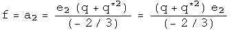

Begin with a simple example:

The definition gives the expected result.

A simple approach to a trickier example:

So far, the fancy double limit process has been irrelevant for these identity
functions, because the differential element has been eliminated.  That changes
with the following example, a tricky approach to the same result.

Because the 3-vector goes to zero faster than the scalar for the differential
element, after the first limit process, the remaining differential is a scalar
so it commutes with any quaternion.  This is what is required to dance around
the e1 and lead to the cancellation.

The initial hypothesis was that complex analysis should be a self-evident
subset of quaternion analysis.  So this quaternion derivative should match up
with the complex case, which is:

These are the same result up to two subedits.  Quaternions have three
imaginary axes, which creates the factor of three.  The conjugate of a complex
number is really doing the work of the first quaternion conjugate q^*1^ (which
equals -z^*^), because z^*^ flips the sign of the first 3-vector component, but no
others.

The derivative of a quaternion applies equally well to polynomials.

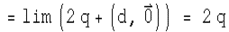

This is the expected result for this polynomial.  It would be straightforward
to show that all polynomials gave the expected results.

Mathematicians might be concerned by this result, because if the 3-vector D
goes to -D nothing will change about the quaternion derivative.  This is
actually consistent with principles of special relativity.  For timelike
separated events, right and left depend on the inertial reference frame, so a
timelike derivative should not depend on the direction of the 3-vector.

##  Analytic Functions

There are 4 types of quaternion derivatives and 4 component functions.  The
following table describes the 16 derivatives for this set

This table will be used extensively to evaluate if a function is analytic
using the chain rule.  Let's see if the identity function w = q is analytic.

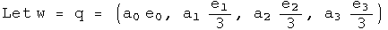

Use the chain rule to calculate the derivative will respect to each term:

Use combinations of these terms to calculate the four quaternion derivatives
using the chain rule.

This has the derivatives expected if w=q is analytic in q.

Another test involves the Cauchy-Riemann equations.  The presence of the three
basis vectors changes things slightly.

This also solves a holonomic equation.

There are no off diagonal terms to compare.

This exercise can be repeated for the other identity functions.  One
noticeable change is that the role that the conjugate must play.  Consider the
identity function w = q^*1^.  To show that this is analytic in q^*1^ requires that
one always works with basis vectors of the q^*1^ variety.

This also solves a first conjugate holonomic equation.

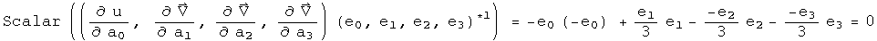

Power functions can be analyzed in exactly the same way:

This time there are cross terms involved.

At first glance, one might think these are incorrect, since the signs of the
derivatives are suppose to be opposite.  Actually they are, but it is hidden
in an accounting trick :-)  For example, the derivative of u with respect to
a1 has a factor of e1^2^, which makes it negative.  The derivative of the first
component of V with respect to a0 is positive.  Keeping all the information
about signs in the e's makes things look non-standard, but they are not.  

Note that these are three scalar equalities.  The other Cauchy-Riemann
equations evaluate to a single 3-vector equation.  This represents four
constraints on the four degrees of freedom found in quaternions to find out if
a function happens to be analytic.

This also solves a holonomic equation.

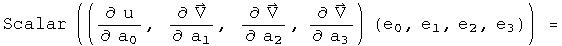

Since power series can be analytic, this should open the door to all forms of
analysis.  (I have done the case for the cube of q, and it too is analytic in
q).

##  4 Other Derivatives

So far, this work has only involved future timelike derivatives.  There are
five other regions of spacetime to cover.  The simplest next case is for past
timelike derivatives.  The only change is in the limit, where the scalar
approaches zero from below.  This will make many derivatives look time
symmetric, which is the case for most laws of physics.

A more complicated case involves spacelike derivatives.  In the spacelike
region, changes in time go to zero faster than the absolute value of the
3-vector.  Therefore the order of the limit processes is reversed.  This time
the scalar approaches zero, then the 3-vector.  This creates a problem,
because after the first limit process, the differential element is (0, D),
which will not commute with most quaternions.  That will lead to the
differential element not cancelling.  The way around this is to take its norm,
which is a scalar.

A spacelike differential element is defined by taking the ratio of a
differential quaternion element D to its 3-vector, D - D^*^.  Let the norm of
D approach zero.  To be defined, the three vector must approach zero faster
than its corresponding scalar.  To make the definition non-singular
everywhere, multiply by the conjugate.  In the limit D D^*^/((D - D^*^)(D - D^*^))*
approaches (1, 0), a scalar.

To make this concrete, consider a simple example, f = q^2.  Apply the
definition:

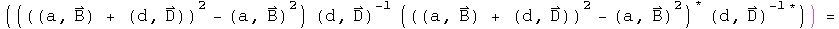

The second and fifth terms are unitary rotations of the 3-vector B.  Since the
differential element D could be pointed anywhere, this is an arbitrary
rotation. Define:

Substitute, and continue:

Look at how wonderfully strange this is!  The arbitrary rotation of the
3-vector B means that this derivative is bound by an inequality.  If D is in
direction of B, then it will be an equality, but D could also be in the
opposite direction, leading to a destruction of a contribution from the
3-vector.  The spacelike derivative can therefore interfere with itself.  This
is quite a natural thing to do in quantum mechanics.  The spacelike derivative
is positive definite, and could be used to define a Banach space.

Defining the lightlike derivative, where the change in time is equal to the
change in space, will require more study.  It may turn out that this
derivative is singular everywhere, but it will require some skill to find a
technically viable compromise between the spacelike and timelike derivative to
synthesis the lightlike derivative.

#  Topological Properties of Quaternions

### I have not taken a topology class, so no doubt this particular section contains errors.

Mathematician are so much more precise than I will ever be.

##  Topological Space

If we choose to work systematically through Wald's "General Relativity", the
starting point is "Appendix A, Topological Spaces".  Roughly, topology is the
structure of relationships that do not change if a space is distorted.   Some
of the results of topology are required to make calculus rigorous.

In this section, I will work consistently with the set of quaternions, H^1, or
just H for short.  The difference between the real numbers R and H is that H
is not a totally ordered set and multiplication is not commutative.  These
differences are not important for basic topological properties, so statements
and proofs involving H are often identical to those for R.

First an open ball of quaternions needs to be defined to set the stage for an
open set.  Define an open ball in H of radius (r, 0) centered around a point
(y, Y) [note: small letters are scalars, capital letters are 3-vectors]
consisting of points (x, X) such that

An open set in H is any set which can be expressed as a union of open balls.  
[p. 423 translated] A quaternion topological space (H,T) consists of the set H
together with a collection T of subsets of H with these properties:

1. The union of an arbitrary collection of subsets, each in T, is in T  
1. The intersection of a finite number of subsets of T is in T  
1. The entire set H and the empty set are in T

T is the topology on H.  The subsets of H in T are open sets.  Quaternions
form a topology because they are what mathematicians call a metric space,
since q^\*^ q evaluates to a real positive number or equals zero only if q is
zero.  Note: this is not the meaning of metric used by physicists.  For
example, the Minkowski metric can be negative or zero even if a point is not
zero.  To keep the same word with two meanings distinct, I will refer to one
as the topological metric, the other as an interval metric.  These descriptive
labels are not used  in general since context usually determines which one is
in play.

An important component to standard approaches to general relativity is product
spaces.  This is how a topology for R^n^ is created.  Events in spacetime
require R^4^, one place for time, three for space.  Mathematicians get to make
choices: what would change if work was done in R^2^, R^3^, or R^5^?  The
precision of this notion, together with the freedom to make choices, makes
exploring these decisions fun (for those few who can understand what is going
on :-)

By working with H, product spaces are unnecessary.  Events in spacetime can be
members of an open set in H. Time is the scalar, space the 3-vector.  There is
no choice to be made.

##  Open Sets

The edges of sets will be examined by defining boundaries, open and closed
sets, and the interior and closure of a set.

I am a practical guy who likes pragmatic definitions.  Let the real numbers L
and U represent arbitrary lower and upper bounds respectively such that L &lt;
U. For the quaternion topological space (H, T), consider an arbitrary induced
topology (A, t) where x and a are elements of A. Use inequalities to define:

The union of an arbitrary collection of open sets is open.  
The intersection of a finite number of open sets is open.  
The union of a finite number of closed sets is closed.  
The intersection of an arbitrary number of closed sets is closed.

Clearly there are connections between the above definitions

This creates complementary ideas.  [Wald, p.424]  
The interior of A is the union of all open sets contained within A.  
The interior equals A if and only if A is open.  
The closure of A is the intersection of all closed sets containing A.  
The closure of A equals A if and only if A is closed.

Define a point set as the set where the lower bound equals the upper bound.
The only open set that is a point set is the null set.  The closed point set
is H.  A point set for the real numbers has only one element which is
identical to the boundary.  A point set for quaternions has an infinite number
of elements, one of them identical to the boundary.

What are the implications for physics?

With quaternions, the existence an open set of events has nothing to do with
the causality of that collection of events.

A proper time can have exactly the same absolute value as a pure spacelike
separation, so these two will be included in the same sets, whether open,
closed or on a boundary.

There is no correlation the reverse way either.  Take for example a collection
of lightlike events.  Even though they all share exactly the same interval -
namely zero - their absolute value can vary all over the map, not staying
within limits.

Although independent, these two ideas can be combined synergistically.
Consider an open set S of timelike intervals.

The set S could depict a classical world history since they are causally
linked and have good topological properties.  A closed set of lightlike events
could be a focus of quantum electrodynamics.  Topology plus causality could be
the key for subdividing different regions of physics.

**Hausdorff Topology**

This property is used to analyze compactness, something vital for rigorously
establishing differentiation and integration.

[Wald p424] The quaternion topological space (H, T) is Hausdorff because for
each pair of distinct points a, b E H, a not equal to b, one can find open
sets Oa, Ob E T such that a E Oa, b I Ob and the intersection of Oa and Ob is
the null set.

For example, find the half-way point between a and b.  Let that be the radius
of an open ball around the points a and b:

Neither set quite reaches the other, so their intersection is null.

##  Compact Sets

In this section, I will begin an investigation of compact sets of quaternions.
I hope to share some of my insights into this subtle but significant topic.

First we need the definition of a compact set of quaternions.

[Translation of Wald p. 424] Let A be a subset of the quaternions H. Set A
could be opened, closed or neither.  An open cover of A is the union of open
sets {Oa} that contains A.  A union of open sets is open and could have an
infinite number of members.  A subset of {Oa} that still covers A is called a
subcover.  If the subcover has a finite number of elements it is called a
finite subcover.  The set A subset of H is compact if every open cover of A
has a finite subcover.

Let's find an example of a compact set of quaternions.  Consider a set S
composed of points with a finite number of absolute values:

The set S has an infinite number of members, since for any of the equalities,
specifying the absolute value still leaves three degrees of freedom (if the
domain had been x E R, then S would have had a finite number of elements).
The set S can be covered by an open set {O} which could have an infinite
number of members.  There exists a subset {C} of {O} that is finite and still
covers S.  The subset {C} would have one member for each absolute value.

Every set of quaternions composed of a finite number of absolute values like
the set S is compact.

Notice that the set S is closed because it consists of a boundary without an
interior.  The link between compact, closed and bound set is important, and
will be examined next

A compact set is a statement about the ability to find a finite number of open
sets that cover a set, given any open cover.  A closed set is the interior of
a set plus the boundary of that set.  A set is bound if there exists a real
number M such that the distance between a point and any member of the set is
less than M.

For quaternions with the standard topology, in order to have a finite number
of open sets that cover the set, the set must necessarily include its boundary
and be bound.  In other words, to be compact is to be closed and bound, to be
closed and bound is to be compact.

[Wald p. 425] Theorem 1 (Heine-Borel). A closed interval of quaternions S:

with the standard topology on H is compact.

Wald does not provide a proof since it appears in many books on analysis.
Invariably the Heine-Borel Theorem employs the domain of the real numbers, x E
R.  However, nothing in that proof changes by using quaternions as the domain.

[Wald p. 425] Theorem 2.  Let the topology (H, T) be Hausdorff and let the set
A subset of H be compact.  Then A is closed.

Theorem 3.  Let the topology (H, T) be compact and let the set A subset of H
be closed.  Then A is compact.

Combine these theorems to create a stronger statement on the compactness of
subsets of quaternions H.

Theorem 4.  A subset A of quaternions is compact if and only if it is closed
and bounded.

The property of compactness is easily proved to be preserved under continuous
maps.

Theorem 5.  Let (H, T) and (H', T') be topological spaces.  Suppose (H, T) is
compact and the function f: H -&gt; H' is continuous.  The f[H] = {h' E H' |
h' = f(h)} is compact. This creates a corollary by theorem 4.

Theorem 6.  A continuous function from a compact topological space into H is
bound and its absolute value attains a maximum and minimum values.

[end translation of Wald]

##  R^1^ versus R^n^

It is important to note that these theorems for quaternions are build directly
on top of theorems for real numbers, R^1^.  Only the domain needs to be changed
to H^1^.  Wald continues with theorems on product spaces, specifically
Tychonoff's Theorem, so that the above theorems can be extended to R^n^.  In
particular, the product space R^4^ should have the same topology as the
quaternions.

Hopefully, subtlety matters in the discussion of the logical foundations of
general relativity.  Both R^1^ and H^1^ have a rule for multiplication, but H^1^
has an antisymmetric component.  This is a description of a difference.  R^4^
does not come equipped with a rule for multiplication, so it is qualitatively
different, even if topologically similar to the quaternions.

# Where do quaternions fit in with math?

Adapted from a figure by Max Tegmark, 1998.

# A Quaternion Algebra Tool Set

Here is a compilation of basic algebra for quaternions.  It should look very
similar to complex algebra, since it contains three sets of complex numbers, t
+ x i, t + y j, and t + z k.  To strengthen the link, and keep things looking
simpler, all quaternions have been written as a pair of a scalar t and a
3-vector V, as in (t, V).  All these relations have been tested in a C library
and a Java quaternion calculator.

Technical note: it is vital that every tool in this set can be expressed as
working with a whole quaternion q.  This will make doing quaternion analysis
with automorphic functions fruitful.

##  Parts

##  Simple algebra

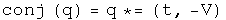

##  Multiplication

The Grassman product as defined here uses the same rule Hamilton developed.
The Euclidean product takes the conjugate of the first of the two elements
(following a tradition from quantum mechanics).

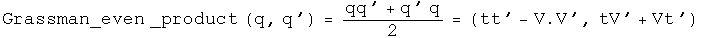

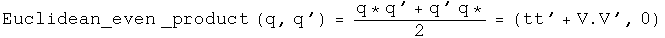

##  Trigonometry

Note: since the unit vectors of sine and cosine are the same, these two
commute so the order is irrelevant.

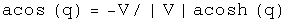

##  Powers

##  Logs

##  Quaternion exponential multiplication

Andrew Millard suggested the result for the Grassman product.

#  Newton's Second Law

The form of Newton's second law for three separate cases will be generated
using quaternion operators acting on position quaternions.  In classical
mechanics, time and space are decoupled.  One way that can be achieved
algebraically is by having a time operator cat only on space, or by space
operator only act on a scalar function.  I call this the "2 zero" rule: if
there are two zeros in the generator of a law in physics, the law is
classical.

##  Newton's 2nd Law for an Inertial Reference Frame in Cartesian
Coordinates

Define a position quaternion as a function of time.

Operate on this once with the differential operator to get the velocity
quaternion.

Operate on the velocity to get the classical inertial acceleration quaternion.

This is the standard form for acceleration in Newton's second law in an
inertial reference frame.  Because the reference frame is inertial, the first
term is zero.

##  Newton's 2nd Law in Polar Coordinates for a Central Force in a Plane

Repeat this process, but this time start with polar coordinates.

The velocity in a plane.

Acceleration in a plane.

Not a pretty sight.  For a central force,  =

 = 0.  

Make these substitution and rotate the quaternion to get rid of the theta dependence.

The second term is the acceleration in the radial direction, the third is
acceleration in the theta direction for a central force in polar coordinates.

##  Newton's 2nd Law in a Noninertial, Rotating Frame

Consider the "noninertial" case, with the frame rotating at an angular speed
omega.  The differential time operator is put into the first term of the
quaternion, and the three directions for the angular speed are put in the next
terms.  This quaternion is then multiplied by the position quaternion to get
the velocity in a rotating reference frame. Unlike the previous examples where
t did not interfere with the calculations, this time it must be set explicitly
to zero (I wonder what that means?).

Operate on the velocity quaternion with the same operator.

The first three terms of the 3-vector are the translational, coriolis, and
azimuthal alterations respectively.  The last term of the 3-vector may not
look like the centrifugal force, but using a vector identity it can be
rewritten:

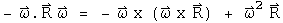

If the angular velocity an the radius are orthogonal, then

The scalar term is not zero.  What this implies is not yet clear, but it may
be related to the fact that the frame is not inertial.

##  Implications

Three forms of Newton's second law were generated by choosing appropriate
operator quaternions acting on position quaternions.  The differential time
operator was decoupled from any differential space operators.  This may be
viewed as an operational definition of "classical" physics.

#  Oscillators and Waves

A professor of mine once said that everything in physics is a simple harmonic
oscillator.  Therefore it is necessary to get a handle on everything.

##  The Simple Harmonic Oscillator (SHO)

The differential equation for a simple harmonic oscillator in one dimension
can be express with quaternion operators.

This equation can be solved directly.

Find the velocity by taking the derivative with respect to time.

##  The Damped Simple Harmonic Oscillator

Generate the differential equation for a damped simple harmonic oscillator as
done above.

Solve the equation.

##  The Wave Equation

Consider a wave traveling along the x direction.  The equation which governs
its motion is given by

The third term is the one dimensional wave equation.  The forth term is the
instantaneous power transmitted by the wave.

##  Implications

Using the appropriate combinations of quaternion operators, the classical
simple harmonic oscillator and wave equation were written out and solved.  The
functional definition of classical physics employed here is that the time
operator is decoupled from any space operator.  There is no reason why a
similar combination of operators cannot be used when time and space operators
are not decoupled.  In fact, the four Maxwell equations appear to be one
nonhomogeneous quaternion wave equation, and the structure of the simple
harmonic oscillator appears in the Klein-Gordon equation.

#  Four Tests for a Conservative Force

There are four well-known, equivalent tests to determine if a force is
conservative:  the curl is zero, a potential function whose gradient is the
force exists, all closed path integrals are zero, and the path integral
between any two points is the same no matter what the path chosen.  In this
notebook, quaternion operators perform these tests on quaternion-valued
forces.

##  1\.  The Curl Is Zero

To make the discussion concrete, define a force quaternion F.

The curl is the commutator of the differential operator and the force.  If
this is zero, the force is conservative.

Let the differential operator quaternion act on the force, and test if the
vector components equal zero.

##  2\. There Exists a Potential Function for the Force

Operate on force quaternion using integration.  Take the negative of the
gradient of the first component.  If the field quaternion is the same, the
force is conservative.

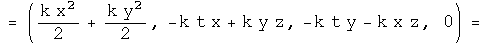

This is the same force as we started with, so the scalar inside the integral
is the scalar potential of this vector field.  The vector terms inside the
integral arise as constants of integration.  They are zero if t=z=0.  What
role these vector terms in the potential quaternion may play, if any, is
unknown to me.

##  3\. The Line Integral of Any Closed Loop Is Zero

Use any parameterization in the line integral, making sure it comes back to
go.

##  4\. The Line Integral Along Different Paths Is the Same

Choose any two parameterizations from A to B, and test that they are the same.
These paths are from (0, r, 0, 0) to (0, -r, 2 r, 0).

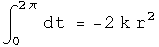

The same!

##  Implications

The four standard tests for a conservative force can be done with operator
quaternions.  One new avenue opened up is for doing path integrals.  It would
be interesting to attempt four dimensional path integrals to see where that
might lead!

# Problem set answers for MITs 8.033 using real valued quaternions

[Problem set 1](problem_set_1.md)

Problem sets 2-6 are at another site, [Doing Special Relativity with
Quaternions](http://dougsweetser.github.io/SRQ)

## The Back Story

In early 1997, I had a meeting with a famous physicist to discuss my research 
project. Actually, I sat outside his door and talked with him to and from the 
chinese food truck. He thought my project was "Interesting, but not very 
interesting." The reason was that I had a few math widgets, but no theory. I 
thanked him for his time.

Now I had to find a theory. This is a crazy assignment. I decided to begin my 
search by posing a question: define a brief definition of time that must be two 
sentences or less and only be about phyiscs or math, not philosophy. My runon 
sentence answer used quaternions as a definition of events in space-time.

To test the hypothesis, I asked the professor who taught the class if I could 
audit 8.033, Classical and Relativitic Mechanics (it is now 
[online](http://ocw.mit.edu/courses/physics/8-033-relativity-fall-2006/)). He 
approved. As a test of quaternions as an essential tool for physics, I had 
three ground rules for the assigned problems:

1. Each problem had to be solved the standard way
1. Each problem had to be solved using real-valued quaternions
1. If any problem could not be solved with real-valued quaternions, there would 
   be no need to look further into quaternions

It turned out that all 53 assigned problems were solved using real-valued 
quaternions. That was the start of my ongoing study. To avoid the book being 
overrun with the problem set answers, they were moved to a separate book.

# 8.033 Problem Set 1, Kinematic Effects of Relativity

##  Preamble: Initiation functions

There are a few tools required to solve problems in special relativity using
quaternions to characterize events in spacetime. The most basic are gamma and
a round value for c.

Define a function for quaternions using its matrix representation.

A quaternion L that perform a transform on a quaternion -  
L q[**x**] = q[**x'**] - identical to how the Lorentz transformation acts on
4-vectors - Lambda **x** = **x'** \- should exist. These are described in
detail in the notebook "A different algebra for boosts." For boosts along the
x axis with y = z = 0, the general function for L is

Most of the problems here involve much simpler cases for L, where t or x is
zero, or t is equal to x.

If t = 0, then

If x = 0, then

If t = x, then

    
    

Note: this is for blueshifts. Redshifts have a plus instead of the minus.

The problems are from "Basic Concepts in Relativity" by Resnick and Halliday,
1992 by Macmillian Publishing, "Special Relativity" by A. P. French, 1966,
1968 by MIT, and Prof. M. Baranger of MIT.

##  R&amp;H 2-9: A moving clock

Q: A clock moves along the x axis at a speed of 0.6c and reads zero as it
passes the origin. What time does it read as it passes the 180 m mark on the x
axis?

A: A clock measures an interval between two events. The first event occurs at
the origin. The second event happens at 180 m in a time of 180 m/v. Calculate
the interval by squaring the difference quaternion and then taking the square
root of the first term.

    

The moving clock reads 8 x 10^-7^ seconds.

##  R&amp;H 2-10: A moving rocket

Q: A rod lies parallel to the x axis of reference frame S, moving along this
axis at a speed of 0.6c. Its rest length is 1.0 m. What will be its measured
length in frame S?

A: Consider the meter stick at rest in a frame S', one end at the origin, the
other at q[0, 1 m, 0, 0]. We want to boost the stick end quaternion to frame
S. The boost quaternion when t=y=z=0 is
. In frame S',frame S is moving at -0.6c.

The start of the stick will move for a time equal to the first term of the
boosted quaternion, and moved by a distance x = vt/c.

The meter stick's length in frame S will be the difference at the same instant
in this frame between the boosted stick end and translocated stick start.

    
    

The meter stick is length contracted to 0.8 meters in frame S.

##  R&amp;H 2-13: A fast spaceship

Q: The length of a spaceship is measured to be exactly half its rest length.
(a) What is the speed of the spaceship relative to the observer's frame? (b)
By what factor does the spaceship's clocks run slow, compared to clocks in the
observer's frame?

A: (a) Consider the spaceship at rest, one end at the origin, the other at
q[0, d, 0, 0]. We want to boost the ship end quaternion to the observer's
frame. The boost quaternion when t=y=z=0 is
. In the ship'sframe, the observer is moving at -v/c.

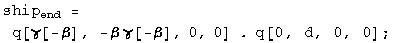

The start of the ship will move for a time equal to the first term of the
boosted quaternion, and moved by a distance x = vt/c.

The ship's length in the observer's frame will be the difference at the same
instant in this frame between the boosted ship end and translocated ship
start.

    
    

Solve for beta setting this distance to d/2.

    
    

Beta is ![\[Graphics:ps1gr27.gif\]](images/SR/problem_set_1/ps1gr27.gif)/2 =
0.866.  
  
(b) The factor that the clocks appear to run at different rates is gamma.

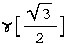

    
    

# Measure the difference between space-time events

Two stars go supernova while four kids watch.

There is a difference in time (dt).

There is a difference in space (dR).

Together they make a difference in space-time.

Each kid measures a different values for time and space.

Yet the walkers agree on something they can calculate called the interval.
This is the standard physics of Special Relativity, the physics of moving.

This site promotes a new proposal for gravity called Quaternion Gravity where
the kids above or below agree on a different value they calculate, 
space-times-time. gIn this standard approach to gravity known as General 
Relativity, this is almost, but not quite true.

## For nerds

Special relativity is special because it is restricted to inertial observers. g
To cover more cases requires the machinery of differential geometry. gA tensor 
can be added to another tensor or multiplied by a scalar. gAn interval is 
formed by contracting two rank 1 contra-variant tensors with a symmetric, 
rank-2 metric tensor. gA connection is needed to describe how the metric 
changes in space-time. gThere are many technical choices one makes along the 
way to calculating an interval in curved space-time.

The site issues a formal challenge to the algebraic standards of differential 
geometry used today by physics. In place of tensors, metrics, and connections, 
only quaternions will be used. gFor those trained in the craft of differential 
geometry, that should sound wildly inadequate. Doing more with less is always a
challenge.

# Special relativity

Walking changes how one measures deadly supernovae.

As long as the kids move at a constant rate, special relativity comes into play.

Relativity is not an arbitrary change, but increadibly precise change.

And there is that interval that is *exactly* the same size.

Note: the numbers are **far too big** (off by 16 orders of magnitude, I just
didn't want to write _lots_ of zeros).

## For nerds

Take measurements made by two observers written as quaternions and square them. 
If the first terms are the same, then the two observers are in reference frames 
that are moving in a steady way relative to each other. Note that the 
observers can be in a gravity field which is a non-inertial reference frame, 
but that does not cause an issue here.

The observers do not have to make sure their coordinate systems are the same. 
So long as both agree to compare so called natural units (a way to consistently 
be dimensionless), then the numbers will be the same.

# Quaternion gravity

Looking down or looking from below changes time and space measurements in opposite ways.

If one kid is at a different height in a gravity field to another, then
time measurements get smaller while spatial ones get bigger. That is standard 
physics (general relativity, GR).

The Quaternion Gravity (QG) proposal says the space-times-time values are 
precisely the same. With general relativity, this space-times-time is not 
mentioned, but it is almost - but not quite - the same.

Note: the numbers are **far too big** (off by 16 orders of magnitude, I just
didn't want to write _lots_ of zeros).

## For nerds

Special relativity could have been called "special invariance" because it is
the invariant interval that all inertial observers argee upon. Inviarnce
principles are deep insights into how Nature works. They are truths that do
not change.

The quaternion gravity proposal postulates a new invariance principle: that
different observers making measurements in different locations in a
gravitational field will agree on an invariant value for space-times-time.
Some care is required to say this in a coordinate-independent way. All
observers are free to pick their coordinate system. There then exists a
norm-preserving rotation in space such that the space-times-time measurement of
one observer is exactly equal to another.

But how precisely does the interval change? For a spherically symmetric,
non-rotating, unchanged source, only one dimensionless ratio comes into play:
GM/c^2^R. Orbital systems are harmonic systems, suggesting that one use
exponential of the dimensionless ratio. The requirment that the
space-times-time term is invariant means the time term is the inverse of the
exponential experienced by the space term, like so:

The resulting exponential interval has the same form as the Rosen metric. The Rosen
matric makes the same experimental predictions as the Schwarzschild metric for
all weak field gravity tests to first order Parameterize Post-Newtonian (PPN)
accuracy. At second order PPN accuracy, the exponential interval predicts 12%
more bending of light around the Sun. We have yet to acheive the precision to 
decide this issue on experimental data.

Special relativity is not a field field theory. It is a constraint on all
field theories. The quaternion gravity proposal is also not a field theory.
Like special relativity, it is a constraint on all field theories. As such,
there is no need for a graviton. Quaternion gravity makes the search for
quantum gravity moot.

# SR + QG - *S*pecial *R*elativity and *Q*uaternion *G*ravity

This graphic says most of it...

Start with the reference square which has an interval of 16 and a space-times
time of 30.

Compare the reference square with the walkers. They all have the same interval
of 16 because that in what is invariant for inertial observers, folks moving at
a constant speed compared to the reference.

Compare the reference square with the girl above and boy below. Because they
are in a gravitational field, they are not inertial observers. The quaternion
gravity proposal says the space-times-time value are exactly the same at 30.
The interval will be of different sizes.

If one compares a walker to one of the kids above or below, there is no overlap
between them.

## For nerds

Since there is a gravitational field everywhere, there are no inertial
observers. Working with the squares of quaternions, things are a little
easier. Just compare the reference square with any other square. For the
walkers, since they travel at a constant speed and are at the same location in
the gravitational field as the reference square, they will have the same
interval.

The kids above and below are not moving compared to the reference square. By
the quaternion gravity proposal, the space-times-time is an invariant. All
agree on the value of 30. What then has to be different is the interval. But
how different, and how does that depend on the gravitional source mass?

Fortunately, there is no choice in answering the question if one is to be
consistent with current experimental tests of gravity. For a spherically
symmetric, non-rotating, uncharged source, gravity depends on the ratio of the
graviational source mass over the distance to the center of that mass. Whatever
function is used to make the time measurement smaller must be the exact inverse
of the one that makes a spatial measurment larger. Since gravitational systems
follow simple harmonic patterns for billions of years, an exponential and its
inverse that depens on the M/R ratio is an obvious thing to propose.

The interval looks just like the Rosen bi-metric proposal, even though
quaternion gravity uses no metrics. The Rosen metric is known to be consistent
with current tests of weak field gravity up to first-order Parametrized
Post-Newtonian accuracy. The extra metric creates a problem for Rosen's
proposal since gravity waves would have a dipole moment and lose entry faster
than observed. The simplicity of the quaternion gravity proposal would require
for an isolated mass in space that the lowest mode of emission is a quadrapole,
consistent with what is seen. Yet there is no graviton with quaternion gravity.
The energy could be carried away with photons that happen to have a quadrapole
moment, but no a dipole one.

My entry to the [_2015 Awards for Essays on 
Gravitation_](http://www.gravityresearchfoundation.org/index.html) is a more formal
presentation of this research effort, [available as a
pdf](Stuff/pdfs/space-times-time_invariance.pdf).

# Quaternion Space-times-time Invariance as Gravity*

D. B. Sweetser

March 31, 2015

*Essay written for the Gravity Research Foundation 2015 Awards for Essays on Gravitation  
39 Drummer Road, Acton, MA 01720  
sweetser@alum.mit.edu

Abstract

    The square of a quaternion luckily has the Lorentz invariant interval of
    special relativity as its first term. The other three space-times-time
    terms are commonly ignored. Ways to vary a quaternion with a continuous
    function that leave the intraval in the square invariant are discussed. 
    One method uses exponentials, leading to the hyperbolic functions found 
    useful in special relativity. Using the same approach to keep the 
    space-times-time invariantleads to a dynamic interval term. By preserving 
    the space-times-time terms using an exponential function and the geometric 
    source mass, an interval term is found that is similar but experimentally 
    distinct from the Schwarzschild metric applied to space-time 4-vectors. 
    Space-times-time invariance is not a field theory, so gravitons are not 
    necessary and quantization is moot.

General relativity, Einstein's elegant theory of gravity, is a field theory
like the three other fundamental forces of Nature: electromagnetism, the weak
force, and the strong force. The cause of gravity is any form of energy or
momentum. The field equations dictate the motion of particles with energy,
thus applying to all particles, even light.

Special relativity is not a special case of general relativity, despite the
name. Special relativity is about an invariant quantity in Nature that all
inertial observers agree upon: the interval, a difference of squares in
measurements of space and time. Special relativity applies to all
measurements, even those involving the fundamental forces. The product of a
measurement in space and one in time, referred to hereafter as space-times-
time, will change in known ways for different inertial observers.[^1]

This essay explores the opposite situation: what if two observers find their
space-times-time was an invariant, but their intervals were different? It is
suggestive that a defining characteristic of general relativity is that
intervals vary at different places in a gravitational field.

The invariant interval of special relativity in flat spacetime is generated by
contracting a 4-vector using the Minkowski metric. With such a simple system,
other products are omitted, namely, any with the space-times-time form, dtdxi.
Such terms could appear if one used a metric with non-diagonal components
which are unnecessary for flat spacetime.

There is a type of math that naturally embraces space-times-time terms. All
are familiar with real numbers, a mathematical field that allows for addition,
subtraction, multiplication, and division. The complex numbers are also a
mathematical field, but now one has two degrees of freedom, often represented
by a pair of numbers.[^2] Complex
numbers are no longer a totally ordered set. The next sort of numbers has
four-part harmonies, with a real bass and three imaginary tenors. Known as the
quaternions, they do not commute, so live with the label of a division
algebra. Quaternions still retain addition, subtraction, multiplication, and
division. The rules are similar for the complex numbers, with the imaginary i
replaced by an imaginary 3-vector and the inclusion of the anti-symmetric
cross product. Quaternions play a minor technical role as the best way to do
rotations in three dimensions.[8] A unit quaternion SU(2) sits in the center
of the standard model gauge symmetries. Despite that central role, quaternions
have historically been vilified to a comic degree.

    "Quaternions came from Hamilton after his really good work had been done; and
    though beautifully ingenious, have been an unmixed evil to those who have
    touched them in any way, including Maxwell."  
    
    Lord Kelvin[10, See vol. II, p. 1070.]  
  
There are published claims that one cannot write the Maxwell equations or
represent the Lorentz group using real-valued quaternions.[2, 4, 6, 9] Neither
happens to be true. See the appendix for details if interested.

The square of a space-time measurement represented with quaternions is:

  
The first term of the square is the Lorentz invariant interval. It is followed
by the three space-times-time terms. There are a few advantages to having
these three extra bits of information. Say two inertial observers Alice and
Bob saw a collection of events. The first term of the square of the quaternion
would be the same. An analysis of the space-times-time value would let us know
how Alice was moving relative to Bob. If they also calculate the product of
two different events in both orders, then we would know something about the
angle between the events and the observer. If ab = ba, then they are in a
straight line. If for the three space-times-time terms, ab = -ba , they are at
a right angle. Anything between those extremes is in between.

What happens in curved space-time? With the standard machinery of differential
geometry, a simple subtraction is not allowed. Instead, one has to parallel
transport one event to another along a geodesic using a known connection. Then
the subtraction can be done properly.

Quaternions don't have a metric. Without a metric, there is no connection.
Maybe quaternions are an "unmixed evil." Let's explore anyway.

Construct a quaternion out of space-time functions that can be varied, yet the
first term of the square is invariant as required by special relativity:

  
If the function f was exactly the same as each normalized gi, then the first
term in the square, the interval, would always be zero.[^3] This is an important case: it is light. Changes in
time are exactly equal to the magnitude of changes in space.

With zero covered, find a way so the first term in the square is equal to one
for all inertial observers. The square of f must cancel out the square of g,
but leave unity behind. Work with a third function h and its inverse:

  
So long as the function h has an inverse, this will always work.[^4] Exponential functions play an important
role in theoretical physics. If the exponent is zero, unity is the result and
nothing is changed. For tiny exponents, the result may contain a simple
harmonic oscillator which are ubiquitous in Nature. For the case in hand, the
function f is a hyperbolic cosine which is the stretch factor gamma of special
relativity. The function g is the hyperbolic sine, the gamma beta factor that
also appears in special relativity.

Repeat these two simple math exercises for space-times-time. Find a general
way to make the square of a measurement have either three zeroes or three ones
- times the factor of two that is from the sum of two identical terms.
Generating three zero space-times-time factors is easy: take the norm of any
quaternion. Some effort has gone into quantum mechanics that uses quaternions
in place of complex numbers.[1] That topic is beyond the scope of this short
essay. The general way to generate three factors of two is also not difficult:

  
  
An exponential function could be plugged in as before. This moves from a pure
math exercise to one with physics content if the exponential is chosen to be
related to gravity by using the geometric length of a mass[^5]:

Let's pause to discuss this expression. No metric was used to get here. No
field equation was solved. Instead a new invariance of Nature has been
proposed as it applies to products of quaternions in a weak gravitational
system characterized by one length. Algebraically, the first term is the same
as the Rosen exponential metric applied to an event 4-vector.[7]

Experimental tests of weak gravity fields use the first three terms of the
Taylor series expansion in z for the change in time, and the first two for
changes in space. Those terms are identical for the space-times-time invariant
expression and the Schwarzschild metric in Cartesian coordinates. There is no
way to distinguish these two at what is called first-order Parameterized Post-
Newtonian (PPN) accuracy. At second order, the new invariance proposal
predicts 6% more bending of light around a gravitational source.[3] Since the
effect is smaller than a micro-arcsecond, that is beyond our reach today.

Massless light is bent by gravity. That can be accounted for in general
relativity because the coupling is to energy density which light has. With the
space-times-time invariance, there is no coupling term nor any field
equations. The same thing happens in special relativity: there is no coupling,
nor field equations. The space-times-time invariance may be the correct
variation on the invariant interval of special relativity, thus being the
simplest pure geometry approach to gravity, but not too simple.

With no graviton to quantize, there is no issue of quantizing a gravitational
field. What about energy loss by a binary pulsar? The Rosen metric allows for
a dipole mode of gravity wave emission, so is ruled out by the data which
requires a lower rate of gravity wave emissions.[11, See section 12.3(b).] In
the space-times-time invariant proposal, the exponential function and its
inverse applied to gravity above was static. Make it dynamic by including a
time factor in a way consistent with how we see the metric change in time for
a binary pulsar.

Is a graviton required to carry away the energy? The system in question is an
isolated binary pulsar that conserves both energy and momentum. It does not
have a dipole moment like a magnet, but does have a quadruple moment, like a
wobbling water balloon. The energy could be carried away by an electromagnetic
field that had a quadruple as its lowest moment. While unusual, it is
possible.

Does gravity as a space-times-time invariance play nicely with the three other
fundamental forces of physics? Given the stellar record of special relativity,
there is reason to hope.

## Appendix: Maxwell equations and the Lorentz group using real-valued
quaternions

The homogeneous Maxwell equations are vector identities. They hold when
written using quaternions. The Lagrange density used to derive the Maxwell
source equations is the difference of the squared magnetic and electric
fields[5]:  

The difference of two squares is the product of their sums and difference. The
simplest product of a quaternion differential operator and potential generates
the difference of the magnetic and electric fields:

  
This also has a gauge field g which can easily be eliminated by subtracting
the conjugate of this product. The sum of these two fields - times a factor of
minus one - is formed by reversing the order of the differential with the
potential:   

The first term drops into the Euler-Lagrange equations to generate the Gauss
and Ampere laws of electromagnetism. As a bonus, there is the Poynting vector,
the directional energy flux density of an electromagnetic field.

Representing the compact Lie group needed to do spatial rotations is itself
compact when using quaternions:

If one tries to simply change from the cosine and sine function to the
hyperbolic cosine and sine function, a member of the Lorentz group is not
generated. This should not be a surprise since that group is not compact, a
non-trivial change. Other terms are required to pull off the trick:

Quaternions provide another way to write these expressions. Nothing new is
learned, other than to be skeptical of claims about the limitations of
quaternions.
 

## Bibliography

[1]  S. L. Adler. Quaternionic Quantum Mechanics and Quantum Fields. Oxford
University Press, 1995.

[2]  A. W. Conway. On the application of quaternions to some recent
developments of electrical theory. Proc. Roy. Irish Acad., 29:1-9, 1911.

[3]  R. Epstein and I. I. Shapiro. Post-post-newtonian deflection of light by
the sun. Phys. Rev. D, 22(12):2947-2949, 1980.

[4]  P. R. Girard. The quaternion group and modern physics. Eur. J. Phys.,
5:25-32, 1984.

[5]  J. D. Jackson. Classical Electrodynamics, Second Edition. John Wiley and
Sons, 1975.

[6]  J. Lambek. If hamilton had prevailed: quaternions in physics.
Mathematical Intelligencer, 17(4), 1995.

[7]  N. Rosen. A bi-metric theory of gravitation. General Relativity
Gravitation, 4(6):435-447, 1973.

[8]  E. Salamin. Application of quaternions to computation with rotations.
Internal Working Paper, Santford Artificial Intelligence Lab, pages 1-9,
1979\.

[9]  L. Silberstein. Quaternionic form of relativity. Phil. Mag.,
23(137):790-809, 1912\.

[10]  S. P. Thompson. The Life of William Thomson, Baron Kelvin of Largs,
volume II. Macmillan, 1910.

[11]  C. M. Will. Theory and experiment in gravitational physics: Revised
edition. Cambridge University Press, 1993.

## Footnotes

[^1]: How space-times-time changes under a Lorentz transformation is somewhat
complicated.

[^2]: Deeper insights can sometimes be found working on a complex manifold,
C^1^
using a complex number and its conjugate instead of R^2^.

[^3]: The normalization depends on the count of non-zero g factors, 1 over
the square root of 3 if none are zero.

[^4]: Adjusting the normalization factor as needed.

[^5]: The coordinate-independent formulation is that the product of time and the
norm of space is invariant in a gravitational field.

# Essays on Gravitation contest

The essay, ["Quaternion space-times-time invariance as gravity"](../Stuff/pdfs/space-times-time_invariance.pdf) was submitted to the 
_2015 Essays on Gravitation_ contest run by the [Gravity Research 
Foundation](http://www.gravityresearchfoundation.org/index.html).

By comparison with typical technical physics papers, an effort was made to
make the math simpler and have less jargon. It is seven pages long. It has five
equations in the body of the paper, and five more in the appendix.  There are
eleven references.  

The results are in... The winner was an essay by Gerard 't Hooft, a Nobel Prize
winner and all around smart guy.  My essay did not win second, or third, or
forth, or fifth, or honerable mention.  The contest gets plenty of submissions
from fringe physicists.  I suspect the word "quaternion" in the title and my
non-academic address meant the paper was quickly dismissed.

## Hard core stuff

I did learn something about my own efforts from reading the paper.  His paper
was about conformal symmetry breaking.  Roughly speaking, that has to do with
the scale of measurements in time and space.  Maxwell's theory for how light
works has conformal symmetry.  If we use light to measure things, then the
absolute size of _anything_ cannot be known.  Cool.  We can figure out relative
sizes and times.

This cannot be the entire story since we can figure out the the absolute sizes
of things.  He writes that something about quantum gravity is going to break 
conformal symmetry.  You would have to read the paper to struggle to see his 
point.

In my own effort, there are two numbers that enter in to make measurements 
different.  One is the relativistic velocity of an observer.  That is plain old 
special relativity.  The other is the dimensionless gravitational length of a 
graviational source.  It would be this value that breaks conformal symmetry in 
quaternion gravity.

# Derive the Euler-Lagrange equations

The Euler-Lagrange equations are used to generate field equations from a
Lagrange density. Think of a Lagrange density as every way energy can be traded
inside of a box. The action S integrates the Lagrange density (mass per volume)
over space and _time_, resulting in t mass times time.

Notice that the action could be just about any value by integrating over
different amounts of time, from a nano-second to a billion years.

The approach is to _vary something_ in the action S so this integral _does not
change_. This means that the "something" is a symmetry of the action.  Where
there is a symmetry, there is necessarily a conserved quantity.

This is a minimization problem, or more formally, the calculus of variations.
the first types of minimization problems one learns are about the minimum value
of something like a velocity at a point in space-time. this is about a 
minimization of a function over all of space-time. the mechanics are the same - 
take a derivative, set it to zero - but the thing that gets plugged in is 
different.

## Examples

* If the lagrange density is not a function of **time**, then time is a 
symmetry and **energy** is conserved.

* If the lagrange density is not a function of **space**, then space is a 
symmetry and **linear momentum** is conserved.

* If the lagrange density is not a function of **angle**, then rotation is a 
symmetry and **angular momentum** is conserved.

## Counter example

* If a lagrange equation **is a function of space and time**, then **energy and 
momentum are not conserved**. this happens for systems that have friction.  the 
energy and momentum go into waste heat. those terms usually are not included in 
the lagrange density. 

## Deriving the euler-lagrange equations

If a lagrange density depends on a 4-potential a and the derivatives of a, then 
vary these and find a minimum. this is the heart of the euler-lagrange 
equations.

This is a mimnum problem with the potential A and its derivative, A'.

1: Start with a Lagrange density that is a function of the potential and its derivatives.

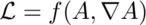

Note that one is not allowed to vary position or speed. If we were to do the 
reverse - fix the potential and its derivative, but vary position and velocity 
- then we would be deriving the force equation from the same Lagrange density.

2: For the action by integrating over a volume of space-time.

3: Vary the action.

4: The problem is with the variation in A versus the variantion is the derivative of A.  Use the product rule to get two variations in A.

5: A theorem of Gauss says:

so:

6: Subsitute 5 into the variation in 3:

7: The variation will be at the minimum if the variation in the action S is 
zero, which happends if the integrand is zero:

QED

There are so many partial differential equations when using Euler-Lagrange,
people with thin you are brilliant.

# EM invariants

To derive the field equations of electromagnetism (EM), we need to find Lorentz
invariants that use the electric (E) and magnetic (B) fields of EM that then
get plugged into the Euler-Lagrange equation.

An invariant is something all observers can agree on.  The Egyptions fiture out
one long ago:

This was the basis for surveying in the flood plains of the Nile. It remains
true today.  The 3D Egyptions know we could also include a third spacial
dimension:

Einstein showed that Egyptions in rockets could only agree on the inverval
between events.

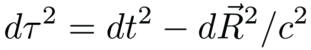

Accelerating or spinning is alright for observing events is you can figure out
the right sort of functions to put into the interval.

Masters of general relativity can figure out the dynamic functions for _f_ and _g_
in only a few special cases because the math remains so difficult. The proposal
described in this site, quaternion gravity, should make this issue tractable
since then one has an algebra problem instead of ten nonliner differential
equations to solve.  For the rest of the discussion of EM, it is assumed f and
g are equal to one since it makes the math simple.

The first term of a quaternion product is a Lorentz invariant scalar. Couple
the current with the potential by multiplying them together:

The electric and magentic fields can be written in terms of differential
operators acting on a potential. Form the product:

The first term is a gauge term.  EM has gauge symmetry.  Set this to zero in a
way that assures that no matter what gauge we pick - terms involving the time
derivative of phi or divergence of A - the other terms are unchanged.

There are two times of 3-vectors.  An axial vector will not change if the the
order of the product is reverse.  A polar vector will flip signs by changing
the order.  That is a property of cross products and curls.  Here are the two
possibilities:

These should both be as "long" as each other, but will point in a different
direction so long as the magnetic field B is not zero.  Zero is an invariant,
so take the difference of the norms of both of these, and that will always,
necssarily, be equal to zero.

The dot product of the electric and magnetic field will be used to derive the
homogenous Maxwell equations, the no monopoles and Faraday's law.

The product of the two ways to multiply a differential and a potential also
form an invariant:

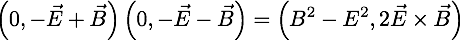

This Lorentz invariant quantity will be used when deriving the Maxwell source
equations, Gauss' and Ampere's laws.

# Derive the Maxwell homogeneous equations

## The easy way

There are several different roads to the same results, the no monopoles law and
Faraday's law, known together as the homogenous equations.  The quickest path
is to show how they are vector idenities.  The divergence of a curl is zero, so
if the magnetic field is the curl of the potential A, then there are no
magnetic monopoles.

One down, one to go.

Plug the potential definitions of a B and E field into Faraday's law, and watch
all the terms drop.

QED.

The path followed here is _considerably_ longer.  Everyone uses the
Euler-Lagrange equations to derive the source equations, Gauss' law and
Ampere's law.  For the sake of logical consistency, and to get practice with
the details of Euler-Lagrange, the same machinery will be used to derive all
four Maxwell equations.

## Maxwell defined

The Maxwell equations are the pinnacle of classical physics, the way all light,
electric charges, and magnets play with each other gracefully.  Here is a one
sentence definition:

    The Maxwell equations define how a current density is the source of all the
    changes in space-time of changes in space-time of a space-time potential
    that travels at the speed of light.

The Maxwell equations are a complete set of second order differential equations
along with the vector identities.  Nothing is missing.[^1]

## The fields defined

A quaternion derivative has a time derivative and three spatial derivatives.  A
quaternion potential has a scalar potential and three others for space no
matter what one's choice of coordinate systems.  Construct the complete set of
first order changes of a potential by taking the product.

Simple enough.

No, stop.  This is amazing enough to repeat.

**The most basic complete quaternion derivative of a potential is EM**

But what about that first term?  One of the defining characteristic of light is
how its interval is zero.  A photon cannot wear a watch.  Photons are timeless.
The way to implement that quality is to set this gauge term equal to zero like
so:

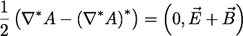

This is a recurring technique.  If something travels at the speed of light,
there will be non of the the four gauge terms:

The electric and magnetic field are unchanged by changing the guage because the
gauge terms are always subtracted away.

One enormous subject I have not looked into is what happens if one keeps this
gauge term.  The resulting physics must describe thing that do not travel at
the speed of light.  It is the subject of particles with a mass.

## The plan

Here is how we will derive the no monopoles law.

* Start with 1 easy term, _E~x~_
* Pair that with 1 _B~x~_
* Multiply it out
* Clone lines, filling in _E~y~_ and _E~z~_
* Look for patterns

## Writing out the Lagrangian

The dot product of the electric and magnetic fields has 24 terms.  It is scary,
so start simple with one term only, _E~x~_:

The magnetic field _B~x~_ has everything not found in _E~x~_, including both
the potentials and derivatives.

It is seeing details like all four potential terms and all four differentials
in each line that makes the Maxwell equations feel so complete.

Multiply this out.

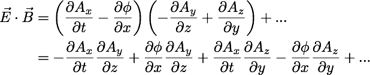

* Half the terms are positive, half are negative, setting up for cancellations.
* Each term has a t, x, y, z-ish part.
* 8 down, 16 to go.

Clone _E~x~_ to make _E~y~_ and _E~z~_ making all necessary subsitutions:

Look for patterns in the partial derivatives:

The electric field terms are in yellow.  The top line has the magnetic field,
_B~x~_. None of these has an _x_, it is pairs of _y_'s and _z_'s.

The next part of the puzzle is to figure out where the rest of the derivative
with respect to _x_ go.  That will dictate where the other partials go too.

This is the game of curl Sudoku.  Fill in the missing values for _x_, _y_ and _z_.

All the needed slots are filled in.  The Soduko game is complete.

Now remove some of the details.  The dot product of _E_ and _B_ is pretty:

The Lorentz invariant Lagrange density is complete.

# Derive the no monopoles law

Plug the 16 terms of the Lagrange density into 20 slots in the Euler-Lagrange
equations:

This is a mountain of details.  People are much better at spotting patterns.

Do simple things, one at a time.  Here is the first Euler-Lagrange equation:

* Only terms with phi matter.
* The derivative repeat.
* That's it.

Here are the terms in the Lagrangian that have a phi:

Every term with a phi is mixed.  Derivatives of mixed terms is simple:

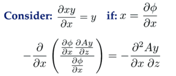

Here's what happens:
* After Euler-Lagrange is applied, there is no phi left.
* There is 1 term in the numerator, and two partial derivatives.
* All three spatial directions appear once.
Using these three guides, you should be able to picture how the Lagrange
density is changed by applying the Euler-Lagrange equation.

With minuses in one column, and pluses in the other, cancellations happen:

Focus on the example.  See how the phi drops, and one has mixed derivatives
with opposite signs.  Nice.

What is going on in terms of the E and B fields?  Look at things row by row:

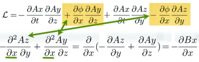

The first line of the Lagrangian has two derivatives of phi with respect to
_x_. After going through the Euler-Lagrange equation, one is left with a second
order derivative which is the _x_ derivative of the magnetic field.

Rinse and repeat for _y_ and _z_:

These cancellations all happen because of a vector identity: the divergence
of a curl is zero.

# Derive Faraday's law

To continue down this longer road and arrive at Faraday's law, start from the
same Lagrangian, but focus on the A~x~ terms:

* The Euler-Lagrange will wipe out the _A~x~_'s, leading to cancellations.
* The top line is a time derivative of _B~x~_.
* The second and third lines together form the curl of _E~x~_.

Here is the pattern:

This is Faraday's law.

[^1]: A driver of traffic to my sign is a claim on the Internet that the first
edition of "A Treatise on Electricity and Magnetism" had 200 equations written
with quaternions that were deleted by the second edition by Heaviside.  Finding
the first version was a struggle, but I did find it.  It had two sections with
"Quaternion" in the title.  It was clear that this grand master of old was only
using the 3-vector part of a quaternion.  This is not where the fun is in my
opinion.  Since I have derived and rederived and rewritten my derivations of
the Maxwell equations using only quaternions many times, I can assure you,
nothing is missing.

# Derive the Maxwell source equations

The Maxwell source equations are Gauss' law and Ampere's law.  A Lorentz
invariant coupling of the current density to the potential is needed.  That is
simply the product of the current density with the potential:

We also need a Lorentz invariant of the E and B fields.  As discussed in [EM
invariants](EM_invariants.md), the gauge-free derivative of a potential written
in both orders does the trick:

This is a difference of squares.  We get the Poynting 3-vector created for
free.  This is not a minor addition.  Neither of the fields E or B are changed
if time is reversed.   The square of the E field has two terms that flip signs,
so effectively no sign flips, while the square of the B field has none.  The 
same is not true of the Poynting vector.  There is only one term with a time
factor in the E field, so it would flip signs.  One long standing riddle in
physics is the perfect time symmetry in the Maxwell equations.  Those equations
start with only the difference of squares, not the Poynting vector.  If, for
the biggest complete vision, we need to consider both of these terms, a
solution to the time symmetry riddle could be found.  That is speculation, but
worth pointing out.

# The plan

Start by writing out the Lagrange density

* Write out _E~x~_ and _B~x~_.
* Multiply it out.
* Clones _E~y~_, _E~z~_, _B~y~_, and _B~z~_.

# The Lagrange density

Start easy by writing out _E~x~_ and _B~x~_:

Multiply it out.

Every term is negative except the squares of the _B~x~_ field.  Continue the
process for ~y~ and ~z~.

The electric field terms in yellow are simple substitutions.  The magnetic
field involves the curl, so it can be intimidating.  Once one term is done, the
rest follow from the pattern set for_ B~x~_ along with a "no redundant"
requirement, much like a Sudoku puzzle.

The Lagrange density needs the current coupling and the difference of the
square of the fields.  One detail is that a factor of a half is needed to
simplify derivative equations

There is a clean separation of electric fields (in yellow) and the magnetic
field (in green and orange).

The Lagrange density for the Maxwell source equations is complete.

# Derive Gauss's law.

Start applying the Euler-Lagrange equation by focusing on terms with a phi in
them:

There is one current coupling term.  There are six terms all coming from the
electric field.  This is reasonable because only the electric field has a phi,
and the E and B fields are separated in the differences of squares EM
Lagrangian.

We need to do calculus on two types of terms.  One is a square, the other is a
mixed derivative:

Even though these expressions look impressively complicated, one is only taking
the derivatives of x^2^ and xy, the first sorts of derivatives one learns in
the study of calculus.  It is x that is odd, being another derivative.

Apply the Euler-Lagrange equation to all the terms with a phi:

Here is the pattern:

This is Gauss's law.

# Derive Ampere's law

This time focus on terms on _A~x~_ in the Lagrange density:

Write out the Euler-Lagrange derivatives:

Collect the terms generated by the Euler-Lagrange equations:

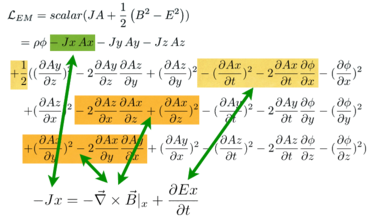

Look at the pattern:

This is Ampere's law.

# The big pictures

Gauss's law is only about the electric field.  Ampere's law is about both.

The two Lagrangians and four Maxwell field equations together on one stage:

# Maxwell by hand

To really lean anything, one needs to practice over and over, by hand.  Here is
a complete derivation of the Maxwell source equations using quaternions.
Instead of picking the familiar Cartesian coordinates of _t_, _x_, _y_, and _z_,
generalized coordiantes are used with the numbers 0-3.

Copy this over until you can do so without looking at a reference image.  Leave
your practice sheets around where you work or study.  People will presume you
are a genius.

#  A Complete Inner Product Space with Dirac's Bracket Notation

A mathematical connection between the bracket notation of quantum mechanics
and quaternions is detailed.  It will be argued that quaternions have the
properties of a complete inner-product space (a Banach space for the field of
quaternions).  A central issue is the definition of the square of the norm.
In quantum mechanics:

In this notebook, the following assertion will be examined (star is the
conjugate, so the vector flips signs):

The inner-product of two quaternions is defined here as the transpose (or
conjugate) of the first quaternion multiplied by the second.  The inner
product of a function with itself is the norm.

##  The Positive Definite Norm of a Quaternion

The square of the norm of a quaternion can only be zero if every element is
zero, otherwise it must have a positive value.

This is the standard Euclidean norm for a real 4-dimensional vector space.

The Euclidean inner-product of two quaternions can take on any value, as is
the case in quantum mechanics for &lt;phi|theta&gt;.  The adjective
"Euclidean" is used to distinguish this product from the Grassman inner-
product which plays a central role in special relativity (see alternative
algebra for boosts).

##  Completeness

With the topology of a Euclidean norm for a real 4-dimensional vector space,
quaternions are complete.

Quaternions are complete in a manner required to form a Banach space if there
exists a neighborhood of any quaternion x such that there is a set of
quaternions y

for some fixed value of epsilon.

Construct such a neighborhood.

An infinite number of quaternions exist in the neighborhood.

Any polynomial equation with quaternion coefficients has a quaternion solution
in x (a proof done by Eilenberg and Niven in 1944, cited in Birkhoff and Mac
Lane's "A Survey of Modern Algebra.")

##  Identities and Inequalities

The following identities and inequalities emanate from the properties of a
Euclidean norm.  They are worked out for quaternions here in detail to
solidify the connection between the machinery of quantum mechanics and
quaternions.

The conjugate of the square of the norm equals the square of the norm of the
two terms reversed.

For quaternions,

These are identical, because the terms involving the cross produce will flip
signs when their order changes.

For products of squares of norms in quantum mechanics,

This is also the case for quaternions.

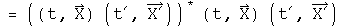

The triangle inequality in quantum mechanics:

For quaternions,

If the signs of each pair of component are the same, the two sides will be
equal.  If the signs are different (a t and a -t for example), then the cross
terms will cancel on the left hand side of the inequality, making it smaller
than the right hand side where terms never cancel because there are only
squared terms.

The Schwarz inequality in quantum mechanics is analogous to dot products and
cosines in Euclidean space.

Let a third wave function, chi, be the sum of these two with an arbitrary
parameter lambda.

The norm of chi will necessarily be greater than zero.

Choose the value for lambda that helps combine all the terms containing
lambda.

Multiply through by the denominator, separate the two resulting terms and do
some minor rearranging.

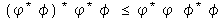

This is now the Schwarz inequality.

Another inequality:

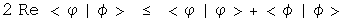

Examine the square of the norm of the difference between two quaternions which
is necessarily equal to or greater than zero.

The cross terms can be put on the other side of inequality, changing the sign,
and leaving the sum of two norms behind.

The inequality holds.

The parallelogram law:

Test the quaternion norm

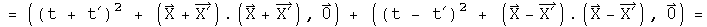

This is twice the square of the norms of the two separate components.

##  Implications

In the case for special relativity, it was noticed that by simply squaring a
quaternion, the resulting first term was the Lorentz invariant interval.  From
that solitary observation, the power of a mathematical field was harnessed to
solve a wide range of problems in special relativity.

In a similar fashion, it is hoped that because the product of a transpose of a
quaternion with a quaternion has the properties of a complete inner product
space, the power of the mathematical field of quaternions can be used to solve
a wide range of problems in quantum mechanics.  This is an important area for
further research.

Note: this goal is different from the one Stephen Adler sets out in
"Quaternionic Quantum Mechanics and Quantum Fields."  He tries to substitute
quaternions in the place of complex numbers in the standard Hilbert space
formulation of quantum mechanics.  The analytical properties of quaternions do
not play a critical role.  It is the properties of the Hilbert space over the
field of quaternions that is harnessed to solve problems.  It is my opinion
that since the product of a transpose of a quaternion with a quaternion
already has the properties of a norm in a Hilbert space, there is no need to
imbed quaternions again within another Hilbert space.  I like a close shave
with Occam's razor.

#  Multiplying Quaternions in Polar Coordinate Form

Any quaternion can be written in polar coordinate form, which involves a
scalar magnitude and angle, and a 3-vector I (which in some cases can be the
more familiar i).  

This representation can be useful due to the properties of the exponential
function, cosines and sines.

The absolute value of a quaternion is the square root of the norm, which is
the transpose of a quaternion multiplied by itself.

The angle is the arccosine of the ratio of the first component of a quaternion
over the norm.

The vector component is generated by normalizing the pure quaternion (the
final three terms) to the norm of the pure quaternion.

I^2 equals -1 just like i^2.  Let (0, V) = (q - q*)/2.

It should be possible to do Fourier analysis with quaternions, and to form a
Dirac delta function (or distribution).  That is a project for the future.
Those tools are necessary for solving problems in quantum mechanics.

##  New method for multiplying quaternion exponentials

Multiplying two exponentials is at the heart of modern analysis, whether one
works with Fourier transforms or Lie groups.  Given a Lie algebra of a Lie
group in a sufficiently small area the identity, the product of two
exponentials can be defined using the Campbell-Hausdorff formula:

This formula is not easy to use, and is only applicable in a small area around
unity. Quaternion analysis that relies on this formula would be very limited.

I have developed (perhaps for the first time) a simpler and general way to
express the product of two quaternion exponentials as the sum of two
components.  The product of two quaternions splits into a commuting and an
anti-commuting part.  The rules for multiplying commuting quaternions are
identical to those for complex numbers.  The anticommuting part needs to be
purely imaginary.  The Grassman product (q q') of two quaternion exponentials
and the Euclidean product (q* q') should both have these properties.  Together
these define the needs for the product of two quaternion exponentials.

I call these operators "conjugators" because they involve taking the conjugate
of the two elements.  Andrew Millard made the suggestion for the Grassman
product that unifies these approaches nicely.  What is happening here is that
both commuting and anticommuting parts scale themselves appropriately.  By
using an exponential that has pi/2 multiplied by a normalized quaternion, this
always has a zero scalar, as it must to accurately represent an anticommuting
part.

#  Commutators and the Uncertainty Principle

Commutators and the uncertainty principle are central to quantum mechanics.
Using quaternions in these roles has already been established by others
(Horwitz and Biedenharn, Annals of Physics, 157:432, 1984).  The first proof
of the uncertainty principle I saw relied solely on the properties of complex
numbers, not on physics!  In this notebook I will repeat that analysis,
showing how commutators and an uncertainty principle arise from the properties
of quaternions (or their subfield the complex numbers).

##  Commutators

Any quaternion can be written in a polar form.

This is identical to Euler's formula except that the imaginary unit vector i
is replaced by the normalized 3-vector.  The two are equivalent if j = k = 0.
Any quaternion could be the limit of the sum of an infinite number of other
quaternions expressed in a polar form.  I hope to show that such a quaternion
mathematically behaves like the wave function of quantum mechanics, even if
the notation is different.

To simplify things, use a normalized quaternion, so that q* q = 1.  Collect
the normalized 3-vector together with I = V/(V* V)^.5.

The angle s/(q* q)^.5 is a real number.  Any real number can be viewed as the
product of two other real numbers.  This seemingly irrelevant observation
lends much of the flexibility seen in quantum mechanics :-)  Here is the
rewrite of q.

The unit vector I could also be viewed as the product of two quaternions.For
classical quantum mechanics, this additional complication is unnecessary.  It
may be required for relativistic quantum mechanics, so this should be kept in
mind.

A point of clarification on notation:the same letter will be used 4 distinct
ways.There are operators, A hat, which act on a quaternion wave function by
multiplying by a quaternion, capital A.  If the operator A hat is an
observable, then it generates a real number, (a, 0), which commutes with all
quaternions, whatever their form. There is also a variable with respect to a
component of a quaternion, a_i, that can be used to form a differential
operator.

Define a linear operator A hat that multiplies q by the quaternion A.

If the operator A hat is an observable, then the quaternion  A is a real
number, (a, 0).  This will commute with any quaternion.  This equation is
functionally equivalent to an eigenvalue equation, with A hat as an
eigenvector of q and (a, 0) as the eigenvalue.  However, all of the components
of this equation are quaternions, not separate structures such as an operator
belonging to a group and a vector.  This might make a subtle but significant
difference for the mathematical structure of the theory, a point that will not
be investigated here.

Define a linear operator B hat that multiplies q by the quaternion B.  If B
hat is an observable,  then this operator can be defined in terms of the
scalar variable a.

Operators A and B are linear.

Calculate the commutator [A, B], which involves the scalar a and the
derivative with respect to a.

The commutator acting on a quaternion is equivalent to multiplying that
quaternion by the normalized 3-vector I.

##  The Uncertainty Principle

Use these operators to construct things that behave like averages (expectation
values) and standard deviations.

The scalar a--generated by the observable operator A hat acting on the
normalized q--can be calculated using the Euclidean product.

It is hard to shuffle quaternions or their operators around.  Real scalars
commute with any quaternion and are their own conjugates.  Operators that
generate such scalars can move around.  Look at ways to express the
expectation value of A.

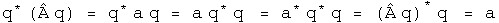

Define a new operator A' based on A whose expectation value is always zero.

Define the square of the operator in a way designed to link up with the
standard deviation.

An identical set of tools can be defined for B.

In the section on bracket notation, the Schwarz inequality for quaternions was
shown.

The Schwarz inequality applies to quaternions, not quaternion operators.  If
the operators A' and B' are surrounded on both sides by q and q*, then they
will behave like scalars.

The left-hand side of the Schwarz inequality can be rearranged to form a
commutator.

The right-hand side of the Schwarz inequality can be rearranged to form the
square of the standard deviation operators.

Plug both of these back into the Schwarz inequality, stripping the primes and
the q's which appear on both sides along the way.

This is the uncertainty principle for complementary observable operators.

##  Connections to Standard Notation

This quaternion exercise can be mapped to the standard notation used in
physics

One subtlety to note is that a quaternion operator is anti-Hermitian only if
the scalar is zero.  This is probably the case for classical quantum
mechanics, but quantum field theory may require full quaternion operators.
The proof of the uncertainty principle shown here is independent of this
issue.  I do not yet understand the consequence of this point.

To get to the position-momentum uncertainty equation, make these specific maps

The product of the squares of the standard deviation for position and momentum
in the x-direction has a lower bound equal to half the expectation value of
the commutator of those operators.  The proof is in the structure of
quaternions.

##  Implications

There are many interpretations of the uncertainty principle.  I come away with
two strange observations.  First, the uncertainty principle is about
quaternions of the form q = Exp[a b I].  With this insight, one can see by
inspection that a plane wave Exp[((Et - P.X)/hbar I], or wave packets that are
superpositions of plane waves, will have four uncertainty relations, one for
the scalar Et and another three for the three-part scalar P.X.  This
perspective should be easy to generalize.

Second, the uncertainty principle and gravity are related to the same
mathematical properties.  This proof of the uncertainty relation involved the
Schwarz inequality.  It is fairly straightforward to convert that inequality
to the triangle inequality.  Finding geodesics with quaternions involves the
triangle inequality.  If a complete theory of gravity can be built from these
geodesics (it hasn't yet been done :-) then the inequalities may open
connections where none appeared before.

#  Unifying the Representation of Spin and Angular Momentum

I will show how to represent both integral and half-integral spin within the
same quaternion division algebra.  This involves using quaternion
automorphisms.  First a sketch of why this might work will be provided.
Second, small rotations in a plane around two axes will be used to show how
the resulting vector points in an opposite way, depending on which involution
is used to construct the infinitesimal rotation.  Finally, a general identity
will be used to look at what happens under exchange of two quaternions in a
commutator.

##  Automorphism, Rotations, and Commutators

Quaternions are formed from the direct product of a scalar and a 3-vector.
Rotational operators that act on each of the 3 components of the 3-vector act
like integral angular momentum.  I will show that a rotation operator that
acts differently on two of the three components of the 3-vector acts like
half-integral spin.  What happens with the scalar is irrelevant to this
dimensional counting.  The same rotation matrix acting on the same quaternion
behaves differently depending directly on what involutions are involved.

Quaternions have 4 degrees of freedom.  If we want to represent quaternions
with automorphisms, 4 are required:  They are the identity automorphism, the
conjugate anti-automorphism, the first conjugate anti-automorphism, and the
second conjugate anti-automorphism:

where

e1, e2, e3 are orthogonal basis vectors

The most important automorphism is the identity.  Life is stable around small
permutations of the identity:-) The conjugate flips the signs of the each
component in the 3-vector.  These two automorphisms, the identity and the
conjugate, treat the 3-vector as a unit.  The first and second conjugate flip
the signs of all terms but the first and second terms, respectively.
Therefore these operators act on only the two of the three components in the
3-vector.  By acting on only two of three components, a commutator will behave
differently.  This small difference in behavior inside a commutator is what
creates the ability to represent integral and half-integral spins.

##  Small Rotations

Small rotations about the origin will now be calculated.  These will then be
expressed in terms of the four automorphisms discussed above.

I will be following the approach used in J. J. Sakurai's book "Modern Quantum
Mechanics", chapter 3, making modifications necessary to accommodate
quaternions.  First, consider rotations about the origin in the z axis.
Define:

Two technical points.  First, Sakurai considered rotations around any point
along the z axis.  This analysis is confined to the z axis at the origin, a
significant but not unreasonable constraint.  Second, these rotations are
written with generalized coordinates instead of the very familiar and
comfortable x, y, z.  This extra effort will be useful when considering how
rotations are effected by curved spacetime.  This machinery is also necessary
to do quaternion analysis (please see that section, it's great :-)

There are similar rotations around the first and second axes at the origin;

Consider an infinitesimal rotation for these three rotation operators.  To
second order in theta,

Calculate the commutator of the first two infinitesimal rotation operators to
second order in theta:

To second order, the commutator of infinitesimal rotations of rotations about
the first two axes equals twice one rotation about the third axis given the
squared angle minus a zero rotation about an arbitrary axis (a fancy way to
say the identity). Now I want to write this result using anti-automorphic
involutions for the small rotation operators.

Nothing has changed.  Repeat this exercise one last time for the first
conjugate:

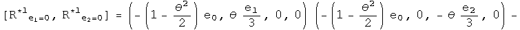

This points exactly the opposite way,even for an infinitesimal angle!

This is the kernel required to form a unified representation of integral and
half integral spin. Imagine adding up a series of these small rotations, say 2
pi of these.  No doubt the identity and conjugates will bring you back exactly
where you started.  The first and second conjugates in the commutator will
point in the opposite direction.  To get back on course will require another 2
pi, because the minus of a minus will generate a plus.

##  Automorphic Commutator Identities

This is a very specific example.  Is there a general identity behind this
work?  Here it is:

It is usually a good sign if a proposal gets more subtle by generalization :-)
In this case, the negative sign seen on the z axis for the first conjugate
commutator is due to the action of an additional first conjugate.  For the
first conjugate, the first term will have the correct sign after a 2 pi
journey, but the scalar, third and forth terms will point the opposite way.  A
similar, but not identical story applies for the second conjugate.

With the identity, we can see exactly what happens if q changes places with q'
with a commutator.  Notice, I stopped right at the commutator (not including
any additional conjugator).  In that case:

Under an exchange, the identity and conjugate commutators form a distinct
group from the commutators formed with the first and second conjugates.  The
behavior in a commutator under exchange of the identity automorphism and the
anti-automorphic conjugate are identical.  The first and second conjugates are
similar, but not identical.

There are also corresponding identities for the anti-commutator:

At this point, I don't know how to use them, but again, the identity and first
conjugates appear to behave differently that the first and second conjugates.

##  Implications

This is not a super-symmetric proposal.  For that work, there is a super-
partner particle for every currently detected particle.  At this time, not one
of those particles has been detected, a serious omission.

Three different operators had to be blended together to perform this feat:
commutators, conjugates and rotations.  These involve issue of even/oddness,
mirrors, and rotations.  In a commutator under exchange of two quaternions,
the identity and the conjugate behave in a united way, while the first and
second conjugates form a similar, but not identical set.  Because this is a
general quaternion identity of automorphisms, this should be very widely
applicable.

#  Deriving A Quaternion Analog to the Schr&ouml;dinger Equation

The Schr&ouml;dinger equation gives the kinetic energy plus the potential (a sum
also known as the Hamiltonian H) of the wave function psi, which contains all
the dynamical information about a system.  Psi is a scalar function with
complex values.

For the time-independent case, energy is written at the operator -i hbar d/dt,
and kinetic energy as the square of the momentum operator, i hbar Del, over
2m.  Given the potential V(0, X) and suitable boundary conditions, solving
this differential equation generates a wave function psi which contains all
the properties of the system.

In this section, the quaternion analog to the Schr&ouml;dinger equation will be
derived from first principles.  What is interesting are the constraint that
are required for the quaternion analog.  For example, there is a factor which
might serve to damp runaway terms.

##  The Quaternion Wave Function

The derivation starts from a curious place :-)  Write out classical angular
momentum with quaternions.

What makes this "classical" are the zeroes in the scalars.  Make these into
complete quaternions by bringing in time to go along with the space 3-vector
R, and E with the 3-vector P.

Define a dimensionless quaternion psi that is this product over h bar.

The scalar part of psi is also seen in plane wave solutions of quantum
mechanics.  The complicated 3-vector is a new animal, but notice it is
composed of all the parts seen in the scalar, just different permutations that
evaluate to 3-vectors.  One might argue that for completeness, all
combinations of E, t, R and P should be involved in psi, as is the case here.

Any quaternion can be expressed in polar form:

Express psi in polar form.  To make things simpler, assume that psi is
normalized, so |psi| = 1.  The 3-vector of psi is quite complicated, so define
one symbol to capture it:

Now rewrite psi in polar form with these simplifications:

This is what I call the quaternion wave function.  Unlike previous work with
quaternionic quantum mechanics (see S. Adler's book "Quaternionic Quantum
Mechanics"), I see no need to define a vector space with right-hand operator
multiplication.  As was shown in the section on bracket notation, the
Euclidean product of psi (psi* psi) will have all the properties required to
form a Hilbert space.  The advantage of keeping both operators and the wave
function as quaternions is that it will make sense to form an interacting
field directly using a product such as psi psi'.  That will not be done here.
Another advantage is that all the equations will necessarily be invertible.

##  Changes in the Quaternion Wave Function

We cannot derive the Schr&ouml;dinger equation per se, since that involves
Hermitian operators that acting on a complex vector space.  Instead, the
operators here will be anti-Hermitian quaternions acting on quaternions.
Still it will look very similar, down to the last h bar :-)  All that needs to
be done is to study how the quaternion wave function psi changes.  Make the
following assumptions.

1\. Energy and Momentum are conserved.

2.  Energy is evenly distributed in space 

3\. The system is isolated

4\. The position 3-vector X is in the same direction as the momentum 3-vector
P

The implications of this last assumption are not obvious but can be computed
directly by taking the appropriate derivative.  Here is a verbal explanation.
If energy and momentum are conserved, they will not change in time.  If the
position 3-vector which does change is always in the same direction as the
momentum 3-vector, then I will remain constant in time.  Since I is in the
direction of X, its curl will be zero.

This last constraint may initially appear too confining.  Contrast this with
the typical classical quantum mechanics.  In that case, there is an imaginary
factor i which contains no information about the system.  It is a mathematical
tool tossed in so that the equation has the correct properties.  With
quaternions, I is determined directly from E, t, P and X.  It must be richer
in information content.  This particular constraint is a reflection of that.

Now take the time derivative of psi.

The denominator must be at least 1, and can be greater that that.  It can
serve as a damper, a good thing to tame runaway terms.  Unfortunately, it also
makes solving explicitly for energy impossible unless Et - P.X equals zero.
Since the goal is to make a direct connection to the Schr&ouml;dinger equation,
make one final assumption:

There are several important cases when this will be true.  In a vacuum, E and
P are zero.  If this is used to study photons, then t = |R| and E = |P|.  If
this number happens to be constant in time, then this equation will apply to
the wave front.

Now with these 5 assumptions in hand, energy can be defined with an operator.

The equivalence of the energy E and this operator is called the first
quantization.

Take the spatial derivative of psi using the under the same assumptions:

Square this operator.

The Hamiltonian equals the kinetic energy plus the potential energy.

Typographically, this looks very similar to the Schr&ouml;dinger equation.  Capital
I is a normalized 3-vector, and a very complicated one at that if you review
the assumptions that got us here.  phi is not a vector, but is a quaternion.
This give the equation more, not less, analytical power.  With all of the
constraints in place, I expect that this equation will behave exactly like the
Schr&ouml;dinger equation.  As the constraints are removed, this proposal becomes
richer.  There is a damper to quench runaway terms.  The 3-vector I becomes
quite the nightmare to deal with, but it should be possible, given we are
dealing with a division algebra.

##  Implications

Any attempt to shift the meaning of an equation as central to modern physics
had first be able to regenerate all of its results.  I believe that the
quaternion analog to Schr&ouml;dinger equation under the listed constraints will do
the task.  These is an immense amount of work needed to see as the constraints
are relaxed, whether the quaternion differential equations will behave better.
My sense at this time is that first quaternion analysis as discussed earlier
must be made as mathematically solid as complex analysis.  At that point, it
will be worth pushing the envelope with this quaternion equation.  If it
stands on a foundation as robust as complex analysis, the profound problems
seen in quantum field theory stand a chance of fading away into the
background.

#  Introduction to Relativistic Quantum Mechanics

The relativistic quantum mechanic equation for a free particle is the Klein-
Gordon equation (h=c=1)

The Schr&ouml;dinger equation results from the non-relativistic limit of this
equation. In this section, the machinery of the Klein-Gordon equation will be
ported to quaternions.

##  The Wave Function

The wave function is the superposition of all possible states of a system. The
product of the conjugate of a wave function with another wave function forms a
complete inner product space. In the energy/momentum representation, this
would involve all possible energy levels and momenta.

This infinite sum of quaternions should contain all the information about a
system.  The quaternion wave function can be normalized.

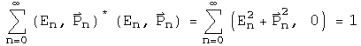

The first quaternion is the conjugate or transpose of the second.  Since the
transpose of a quaternion wave function times a wave function creates a
Euclidean norm, this representation of wave functions as an infinite sum of
quaternions can form a complete, normed product space.

##  The Klein-Gordon Equation

The Klein-Gordon equation can be divided into two operators that act on the
wave function:  the D'Alembertian and the scalar m^2^.  The quaternion operator
required to create the D'Alembertian, along with vector identities, has
already been worked out for the Maxwell equations in the Lorenz gauge.

The first term of the scalar, and the second term of the vector, are both
equal to zero.  What is left is the D'Alembertian operator acting on the
quaternion wave function.

To generate the scalar multiplier m^2^, substitute En and Pn for the operators
d/dt and del respectively, and repeat.  Since the structure of the operator is
identical to the previous one, instead of the D'Alembertian times the wave
function, there is En^2^-Pn^2^.  The sum of all these terms becomes m^2^.

Set the sum of these two operators equal to zero to form the Klein-Gordon
equation.

It takes some skilled staring to assure that this equation contains the Klein-
Gordon equation along with vector identities.

##  Connection to the Maxwell Equations

If m=0, the quaternion operators of the Klein-Gordon equation simplifies to
the operators used to generate the Maxwell equations in the Lorenz gauge.  In
the homogeneous case, the same operator acting on two different quaternions
equals the same result.  This implies that

Under this interpretation, a nonzero mass changes the wave equation into a
simple harmonic oscillator.  The simple relationship between the quaternion
potential and the wave function may hold for the nonhomogeneous case as well.

##  Implications

The Klein-Gordon equation is customarily viewed as a scalar equation (due to
the scalar D'Alembertian operator) and the Maxwell equations are a vector
equation (due to the potential four vector).  In this notebook, the quaternion
operator that generated the Maxwell equations was used to generate the Klein-
Gordon equation.  This also created several vector identities which are
usually not mentioned in this context.  A quaternion differential equation is
needed to perform the work of the Dirac equation, but since quaternion
operators are a field, an operator that does the task must exist.

# An Introduction to the Standard Model

The Standard Model of physics was developed in the 1970's to explain the ~270
different types of particles seen in colliders (a general introduction is
available on [wikipedia](http://en.wikipedia.org/wiki/Standard_Model), and a
one page [cheat
sheet](http://en.wikipedia.org/wiki/Image:Particle_chart.jpg)). The part we
need to understand is the groups that describe the symmetry of the standard
model.

What is a group? A group has an identity, an inverse, and a binary operation
(multiplication). One member of the group times another member of the group
generates yet another member of the same group. This is a case where the math
name is accurate: once in a group, you are always in a group.

The standard model has three continuous groups that characterize three of the
four known fundamental forces of nature. The simplest group is known as U(1)
and governs electromagnetism via the photon. The reason there is one photon is
that the Lie algebra u(1) - note that was a small u! - has one degree of
freedom. This group is called the [ unary
group](http://en.wikipedia.org/wiki/Unitary_group), complex numbers with a
norm of 1. The members of this group commute, so it does not matter the order
things are written in. Quaternions have this property only when all point in
the same or opposite directions, which is the case for when using one
quaternion times itself.

The continuous group SU(2) rules the weak force, the stuff driving radioactive
decay. Mathematically this is call unitary quaternions, quaternions with a
norm of 1. The Lie algebra used to generate this group has three degrees of
freedom. That is why the weak force is mediated by three particles, the W+,
W-, and the Z.

The group SU(3) is for the strong force whose residual interactions keep
nuclei together. Its Lie algebra has eight members, and there are eight
gluons.

## Animations of Groups

Start with a simple picture, layer pictures together, and we will be able to
see what the standard model of particle physics looks like.

## S0 - So simple!

This is the symmetry of +/-R, one number.  What was  
up/down | What is | What can be  
---|---|---  
  What was  
near/far | What was  
left/right | What can be  
that is  
This is (-1, 0, 0, 0) and (+1, 0, 0, 0). It sits in the center, as quaternions
of the form (n, 0, 0, 0) like to do.

## [S1 - The Circle](http://www.theworld.com/%7Esweetser/quaternions/quantum
/standard_model/S1)

Now we let the sum of squares of 2 numbers equal 1. This creates a circle.
What was  
up/down | What is | What can be  
---|---|---  
  What was  
near/far | What was  
left/right | What can be  
that is  
The circle could have any orientation in 3D space. The program choose one at
random.

## S2 - Slice of an Expanding/Contracting Sphere

The sum of squares of 3 numbers equal 1. A quaternion has four numbers. One
approach to representing S2 is to set t=0. You get the standard sphere, but
only at the instant of t=0. Blink!  What was  
up/down | What is | What can be  
---|---|---  
  What was  
near/far | What was  
left/right | What can be  
that is  
That looks like a typical sphere, except it doesn't last long. Three straight
lines appear in the "what was" graph because time is fixed.

Another way to represent S2 is to set x=0. Then you have an edge view of an
expanding circle.

What was  
up/down | What is | What can be  
---|---|---  
  What was  
near/far | What was  
left/right | What can be  
that is  
Only the "what was left/right" graph has a fixed, straight line graph, because
x=0.

If z=0, at least you can see the "circleness"

What was  
up/down | What is | What can be  
---|---|---  
  What was  
near/far | What was  
left/right | What can be  
that is  
In the "what was" graphs, it is easy to spot which dimension is set to zero:
it is the straight line.

## S3 - A Quaternion Sphere

Now use all 4 terms, and fill in the sphere in both time and space!  What was  
up/down | What is | What can be  
---|---|---  
  What was  
near/far | What was  
left/right | What can be  
that is  
  
## SU(2) - Like S2, the Partial Sphere

The graphs of S2 were all paper thin or fleeting. They do not "fill up"
spacetime. The next graph, generated by putting random quaternions into the
expression exp(q-q*), fills up spacetime.  What was  
up/down | What is | What can be  
---|---|---  
  What was  
near/far | What was  
left/right | What can be  
that is  
  Although more of spacetime appears filled, only places were time is greater
than zero have a chance to have an event.

## U(1)xSU(2) - Like the Complete Quaternion Sphere S3

SU(2) has only three of the four degrees of freedom available to a quaternion.
There is no way to fill up all of spacetime with just SU(2). Now fill
spacetime in by multiplying by itself, or q/|q| exp(q-q*)  What was  
up/down | What is | What can be  
---|---|---  
  What was  
near/far | What was  
left/right | What can be  
that is  
  
Most of the points cluster on the negative side of the time line.

## U(1)xSU(2)xSU(3) - The Standard Model

The question is how to generate SU(3)? It has a Lie algebra su(3) that has
eight elements. Based on work done on quaternion quantum mechanics, it is
clear I need to work with the conjugate of one quaternion times another, what
I call the Euclidean product, because q* q generates the norm of a quaternion
q, (t2 \+ x2 \+ y2 \+ z2, 0, 0, 0). If we have 2 different quaternions, q and
q', we can write them as q* q' as U(1)xSU(2): (q/|q| exp(q-q*))* (q'/|q'|
exp(q'-q'*)). Here is its animation:  What was  
up/down | What is | What can be  
---|---|---  
  What was  
near/far | What was  
left/right | What can be  
that is  
  
Notice how all of spacetime is filled evenly with events. A product of two
quaternions that uses a conjugate different from a standard product because
multiplication is no longer associative ((a b)*c does not equal a* (b c)). The
norms are preserved, so the norm will remain 1. Eight independent number are
used to make something with a norm of one. The identity is 1, and all elements
have an inverse under what I call "Euclidean multiplication", q* q'. Based on
the animation, the group is compact and simply connected. All of this traits
contribute to the conclusion that the symmetry of the standard model can be
represented by quaternions in this way.

It would be great to include gravity, which is all about how measurements
change as one moves around a differentiable 4D manifold. Include the metric as
part of the calculation of a quaternion product.

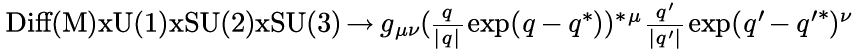  
The group Diff(M) is all diffeomorphisms of a compact smooth manifold. It is
at the heart of general relativity. One can imagine this spacetime filling
sphere on any compact smooth manifold.

What happens if q=q'? That is shown below:

What was  
up/down | What is | What can be  
---|---|---  
  What was  
near/far | What was  
left/right | What can be  
that is  
The standard model is about the group symmetry of the quaternion
multiplication identity in spacetime.

OK, but what does that mean? Here is my take. Observers sit at here-now in
spacetime, or numerically at (0, 0, 0, 0). An observer sees something out
there, and tries to characterize the "thingie". The basic bit of information
it can classify is an event. Whatever set of events is collected, they are all
tied up in describing this one thingie out there. Every event contributes to
the description of the thingie, and so makes a group. The multiplicative
identity of a quaternion, (1, 0, 0, 0) is a way to represent the thingie.
Almost none of the events map to (1, 0, 0, 0). The events are scattered all
around spacetime. U(1)xSU(2)xSU(3) is the way to cow-rope all the events and
bring them home, while remaining part of the same group, the one thing being
observed.

#  Time Reversal Transformations for Intervals

Classical Time Reversal  
Relativistic Time Reversal  
Implications

The following transformation R for quaternions reverses time:

The quaternion R exist because quaternions are a field.  

R will equal  (-t, X )(t, .  The inverse of
quaternion is the transpose over the square of the norm, which is the scalar
term of the transpose of a quaternion times itself.

For any given time, R can be defined based on the above.

##  Classical Time Reversal

Examine the form of the quaternion which reverses time under two conditions.
A interval normalized to the interval takes the form (1, beta), a scalar one
and a 3-vector relativistic velocity beta .  In the classical region,
beta&lt;&lt;&lt;1.  Calculate R in this limit to one order of magnitude in
beta.

  The operator R is almost the negative identity, but the vector is non-zero,
so it would not commute.

##  Relativistic Time Reversal

For a relativistic interval involving one axis, the interval could be
characterized by the following:

Find out what quaternion is required to reverse time for this relativistic
interval to first order in epsilon.

This approaches q[-e/T, 1, 0, 0], almost a pure vector, a result distinct from
the classical case.

##  Implications

In special relativity, the interval between events is considered to be 4
vector are operated on by elements of the Lorentz group.  The element of this
group that reverses time has along its diagonal  
{-1, 1, 1, 1}, zeroes elsewhere.  There is no dependence on relative velocity.
Therefore special relativity predicts the operation of time reversal should be
indistinguishable for classical and relativistic intervals.  Yet classically,
time reversal appears to involve entropy, and relativistically, time reversal
involves antiparticles.

In this notebook, a time reversal quaternion has been derived and shown to
work.  Time reversal for classical and relativistic intervals have distinct
limits, but these transformations have not yet been tied explicitly to the
laws of physics.

#  Buttons

| [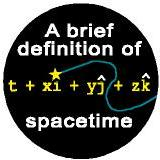](info.html#spacetime) |  |  |
| -- | -- | -- |
|  |  | |

  
Promote the Doing Physics with Quaternions Project, and look cool :-)  
  
These 5 buttons represent a visual presentation of some of the key ideas
behind my efforts to unify gravity and electromagnetism.  
  
 

Fine cuisine depends on starting with the best ingredients. Great physics
depends on using new powerful math.  An event in space-time has one dimension
for time and three dimensions for space, the most powerful tool would be a
generalized number that can be added, subtracted, multiplied and divided, but
has four parts to it. There is one such number called a quaternion, shown here.
Time is t, and x, y, and z are the values the event may have in the three
directions, i, j, and k. Quaternions are the mathematical foundation for all my
efforts in theoretical physics.  

  

A person standing on a scale in a closed box could not tell the difference
between the box sitting on the surface of the Earth or the box accelerating at
the same rate as the Earth's gravity in a rocket ship as depicted here.
Einstein called this the equivalence principle, but it only applied to mass,
not charge. The General Equivalence Principle extends this idea of fooling
observers to cover any measurement. The box mathematically means "all the
changes in time and space." One can ask, what are all the possible changes in
the direction rulers (I) and the potential (A), or Box IA? The usual answer is
the rulers are fixed and it is the potential that changes, I Box A. However,
the answer could also be the potential is the same, but the rulers are
changing, A Box I.  

 

A unified field theory describes light and gravity in the same equation.
Einstein spent the last half of his life looking for one, but did not succeed.
The equation on the right reads in mathlish, "The change in the change in the
potential equals some constants times the source." The stars are involved in
games with plus and minus signs.  It takes work to see that the signs are
correct. A unified field theory must be able to describe all forms of change.
The graphic tries to depict this: changes in a square grid, changes moving
straight out from the center, changes that are circular ripples, and changes
that are spirals. The graphic does not show changes in time or the third
dimension. It is only a graphic after all.  

 

The standard model is used to quantify why there are this many of that kind of
subatomic particle, and that many of those particles. A vast amount of
exquisite detail is explained. No one has justified why the standard model
should be this way.  The standard model is constructed from what are called
symmetry groups which go by the names U(1), SU(2), and SU(3). The quaternion
unified field theory can be written in a way that lines up perfectly with two
of these symmetries.  The connection to the SU(3) symmetry is unclear now,
although technically it has the right number of fingers and toes (eight in this
case).  

 

Newton's law of gravity works to explain the rotation of the Moon around the
Earth. Newton's law of gravity works to explain the velocity of stars near the
center of a galaxy, but fails to explain why stars further from the center
maintain that same velocity. One hypothesis is called dark matter, stuff that
cannot be seen but makes the velocities work out just so. All physics laws must
respect relativity and the rules of calculus. These rules create the second
term which has a constant velocity and accurately describes the distribution of
mass with respect to the radius, no dark matter required.

# PDFs for further reading

## This site

The entire site is available a number of ways.

Avaible for [$10 is a pdf, epub, or mobi file](https://leanpub.com/doingphysicswithquaternions).

Put the site on your own computer.  At the command line, run:

git clone https://github.com/dougsweetser/Q.git

A collection of 6 problem sets solved using only real-valued quaternions is
available for [$1.99 as a pdf, epub, or mobi file](https://leanpub.com/SRQ)

## Bits of this site

1. [Space-times-time invariance as gravity in 2 pages](quaternion_gravity_in_2_pages.pdf) - 2 pages
1. [Where quaternions fit](math_structure.pdf) - 1 page
1. [Space-time equivalence classes](EQ_classes_all_pages.pdf) - 10 pages
1. [Space-time Geometries](Space-time_geometries.pdf) - 1 page
1. [Quaternion space-times-time invariance as gravity](space-times-time_invariance.pdf) - 7 pages
1. [Deriving the Maxwell source equations by hand](Maxwell_by_hand.pdf) - 1 page

## Other people's efforts

1. [Sudbery's first paper, "Quaternion Analysis"](Quaternionic-analysis-memo.pdf), (memo, 1977, 44 pages) on why quaternion analysis is no
good.
1. [Sudbery's second paper, same title](Quaternionic-analysis.pdf), (1979, 28 pages) on the topic. Please look to my work
above on quaternion analysis for a much better alternative!.
1. [C. A. Deavours paper, "The Quaternion Calculus"](deavours.pdf). My critique is that using his
definition of a quaternion derivative, if a function like f=q is analytic in q,
f^2 is not. That indicates a better definition must be found before quaternion
analysis can really begin.
1. [Salamin's paper, "Application of quaternions to computation with rotations"](stanfordaiwp79-salamin.pdf), (1979, 9 pages) on rotations.
Howell and Lafon's paper (1975, 13 pages) on the efficiency of quaternion
multiplication.
1. [Silberstein's paper, "Quaternionic Form of Relativity"](Silberstein-Relativity.pdf), (1912, 20 pages) on using biquaternions for quaternion
special relativity. Biquaternions are NOT a division algebra, and are not used
in any operations on this web site.

## Gimble lock

Resources on gimble lock, a problem that arises from not using quaternions for
3D rotations, links provided by Alex Green:

1. [Apollo](http://www.hq.nasa.gov/alsj/e-1344.htm)
1. [A fourth gimbol for Christmas](http://www.hq.nasa.gov/alsj/gimbals.html)
1. [skylab](http://ntrs.nasa.gov/archive/nasa/casi.ntrs.nasa.gov/19790072987_1979072987.pdf)
1. [Gimble Lock - Explained](http://uk.youtube.com/watch?v=rrUCBOlJdt4). 

Bottom line: always avoid Euler angles.

# Personal Sketch of Doug Sweetser

My father went to Harvard University and Harvard Law School as his father did. He read voraciously. My mother went to Boston University getting a degree in Physical Therapy. They had one poor date in a canoe. While in Europe, my father tracked down my mother, and with nearly all the details lost to me, wooed her accross the pond.

I was born in Bronxville, New York, in 1962. We had both a stay at home mom and live in maid. My father worked at the New York Times a corporate lawyer. When I was five, he got a job at the Minneapolis Star and Tribune. The family moved into a house with almost 10 acres of land. I went to a The Blake School an all boys private school, until it became the plural Blake Schools and coed in seventh grade (great timing). My education continued at M.I.T. where I got degrees in Biology and Chemical engineering. Note: I did not get a degree in either mathematics or physics.

I am a solid core nerd. A hard core nerd has strong opinions about all the versions of Star Trek. A solid core nerd does not watch the show because the science is so impossibly wrong. In Star Trek, space is treated like Manhattan: go to the next stop, and a wonderfully different collection of people are there. One can easy go from Wall Street Suits, to Chinatown, to Uptown, to Harlem, Spanish or otherwise. Space in the Universe is really just space, with distances too far for people to travel.

# Professional sketch of Doug Sweetser

## Education

MIT, 1980-1984 SB: Biology SB: Chemical Engineering GPA: 4.0 (I should point 
out MIT is on a 5.0, so 4.0 sounds great)

MCD Biology - University of Colorado Boulder, 1987-1989 Ph.D. Program Left on 
own accord.

Math Department - University of Indiana, Bloomington, 1990 Graduate level 
courses Left on own accord.

Brandeis, 2000-2002 MS: Computer Software Engineering

## Work Experience

### Biology

My first job was as a lab tech at the newly opened Whitehead Institute for 
Biomedical Research. On the first week on the job, Prof. Rick Young showed me 
how to clone the first genes ever from the Mycobacteria that causes leprosy.  
The work was featured on a NOVA documentary. Twelve technical papers were 
written in a three year paper in the most important journals in biology, 
including Nature, Cell, and the Proceedings of the National Academy of Sciences 
(PNAS).

Worked as a lab tech for Jac Nickoloff at the Harvard School of Public Health 
(8 years). My heart was elsewhere (which caused problems on the job).

### Computers

The first Internet Service Provider (ISP) was started in Brookline, MA in 
1989. They were my first ISP. After leaving the biology business, I worked the 
phones in a support role. I also helped maintain the billing software written 
in Perl. The shifting landscape of ISPs lead then to downsize in 2003.

I was the 9th employee of Black Duck Software. They initially wanted to help 
companies understand the licensing requirements behind open source software. I 
was hired as a "spider", crawling the Internet and harvesting open source 
software for our knowledgebase.

## Physics

### Initial interest

In the Christmas of 1988, both my mother and sister independently bought the 
book: "A Brief History of Time" by Stephen Hawking. I view that as my "born 
again" moment, one based on physics, not the Bible. For a month long period, my 
mind kept rearranging information, sure that everything somehow made sense. I 
was aware I was babbling - saying words that are part of the lexicon of 
physics, but would not make sense to an actual physicist. I decide to keep a 
day job, but work study physics in the background.

Boston was the perfect city in the 1990s to study physics on the side. I took a 
Harvard Extension class on Special Relativity taught by Edwin F. Taylor as he 
was writing the book "Spacetime Physics" with Johnathon Wheeler. Taylor would 
bring in a new chapter from Copy Copy, and we were assigned to critique it.  
Thus became my respectful skeptical analysis of physics. I decide to keep a day 
job, but work study physics in the background.

I was able to show some of my earliest efforts to a famous physicist who worked 
at MIT. He said it was "interesting, but not very interesting". The reason was 
I did not have a theory, a means to make many calculations. At the time, all I 
had were a few math widgets.

### First work on quaternions

In the struggle to find a theory, I held a small contest on a moderated 
newsgroup, sci.physics.research in 1997. I asked readers to provide a brief 
definition of time. It had to be about math or physics, not philosophy, and 
needed to be two sentences or less. In one math book, I recalled some odd sort 
of number that was like a scalar and a vector. The contest motivated me to 
reread that passage, then go to an old-fashion library and read up about 
quaternions. This was the first equation I saw, the squaring of a quaternion:

To this day, this makes me excited because the first term is at the core of 
special relativity as taught to me by Edwin F. Taylor. It is there, for free.  
That cannot be an accident. That observation drove me to purchase the domain 
quaternions.com.

### Major failure at a unified field theory

I struggled to come up with a way to deal with gravity using only quaternions.  
One lesson from general relativity is that a theory of gravity must be a metric 
theory - a theory where the calculation of distance depends on where one 
happens to be in a gravitational field. Measuring distance is a symmetric 
operation, meaning there is no handed to doing the work. Quaternions do have a 
handedness. There is no way around that. So I reinvented hypercomplex numbers.  
Those have all the same multiplication rules as quaternions, but no minus signs 
anywhere. As such, hypercomplex numbers could be used to characterize a metric.

I confess to having pride in the proposal, enough to print up t-shirts. It was 
difficult to find a professional to review the body of work. I began blogging 
on Science20.com. There I found a few technically skilled readers. When I 
finally got to presenting what I called the GEM proposal, several readers 
objected to the work. It took a little over a month for me to really see the 
proposal like they did. The flaw was deadly. A Lagrangian constructed from 
quaternions will not change under a rotation. It will therefore conserve 
angular momentum. A Lagrangian constructed from hypercomplex numbers will 
change under a rotation. It will not conserve angular momentum. Kepler's law of 
equal area in equal time is a statement that gravity conserves angular 
momentum. Thus a proposal for gravity using hypercomplex number in the 
Lagrangian is wrong. End of story.

### Current research

Web sites:

* [Quaternions.com](http://quaternions.com), the mothership of my private
  research project.

* [Numbers 101](http://bit.ly/vp-101), a visual introduction to space-time
  numbers, aka quaternions.

* [Measurement 101](http://bit.ly/vp-QG), a site dedicated to my new proposal 
for quaternion gravity

* [VisualPhysics.org](http://visualphysics.org) has a collection of analytic 
  animations generated with a user-hostile set of tools I wrote.

#### Quaternion space-times-time invariance as gravity

I went back to the equation that sparked my initial interest in quaternions:

The first term is called the interval. But what are the next three called? 
Physics doesn't have a name. That is a problem because the first term is one of 
the most important in physics because it is at the heart of special relativity.  
I came up with a reasonable name for the three amigos: space-times-time. I 
asked a simple question: what if space-times-time was invariant, then what sort 
of physics results? That could be gravity, but a very different theory because 
it is not a field theory. There would be no graviton, nor any quantum gravity 
theory. The idea had enough promise that I submitted an 1500 word paper to the 
2015 Gravitation Research Foundation Essay on Gravity.  We will see if they 
like it.

# Thanks to ...

To be productive in my many endeavors, I've needed plenty of help and
encouragement, so I wish to acknowledge it explicitly.

## The Physics

Prof. Michel Baranger, MIT. It was great fun recreating special relativity
while taking special relativity.

Prof. Eric Carlson, Harvard.

Prof. Mitchell Golden, (formerly of) Harvard. The discussions while you were
in gentle academia instead of the brutal real world of software designed
increased my understanding significantly.

Prof. Alan Guth, MIT. We talked for a total of five minutes on two occasions,
but each time that gave me directions for months.

Prof. Lisa Randall, MIT. Nothing quite as useful as a harsh critic, because
nature is far tougher.

Dr. Vincent Robert, U Chicago. This stuff is still moving forward. I needed
that special French translation, even if the artwork still doesn't make any
sense.

Dr. Paul Romanelli. You tried to listen in the early days, and that mattered a
lot.

Prof. Guido Sandri, BU, RIP. You were always FANTASTIC. Prof. Sandri was an 
Italian antidepressant.

Prof. Edwin F. Taylor, MIT, the world's best teacher of relativity.

## Pop Science

Amanda Annis, clay sculptures. OK, there are no clay sculptures included in
Pop Science, but thinking more that 2D is one of the key themes.

Paul Fata, wandering world artist. I love cheap art! (I also like some of the
expensive stuff to, but I never actually buy it : )

Jennifer Hall, [Do While Studios](http://www.dowhile.org/). I hope to build a
chunk of software using some of the math in here that can live up to the
standard of Do While.

Maureen Metzger, Mass. College of Art. The critiques in "Collage and
Beyond..." helped mature the works presented. True to the title, we did go
beyond...

Meredyth Moses, Clark Gallery. The comments on the portfolio were appreciated.

Mo Ramage, artist to the core.

Joan Shafran, Do While Studios. "Creative Seeing" was the course that got me
seeing creatively as a young adult my key advantage in attacking the tough
issues in physics.

Lynn Tallo. A core supporter of this small project!

John Yager, formerly of Creative Framing of Chestnut Hill. The work looks
professional beyond the skills of its creator. The painting consultations made
all the difference.

## The Bike

Bob Barrett, the big man who inspired the project, and tolerated the design
process as it consumed the dining room.

Bill Darby, Special Purpose Vehicles. Even more important than all the welding
were your comments on what would make a workable machine. And it's still
working today.

Jeffrey Ferris, Ferris Wheels. The class in bike repair got me thinking about
the simple mechanical beauty of the bicycle.

Prof. Harold Washburn, Harvard. Now I think that "market research" is a useful
enterprise. I just wish I had capital (a frequent lament : )

## Lindy Hop

Darra Garrison. Someday, you may get to stomp at the Savoy. That would make a
cool road trip!

Tony and Aurelie Tye, Hop to the Beat Dance Studios. You cats know how to
dance.

## Friends...

Prof. Leonard Burrello. It was a humbling year for me in Indiana, but I kept
my core vision.

Dr. Steve Chervitz, Stanford. The best work should be unrecognizable for a
long time, but hopefully not too long.

Dr. Win Ping Deng. Remember to keep drawing. It can help your science and
soul.

The Guild clan. Let's do the 4th of July together, again!

Dr. Derek Kane. Could you check the math? How about the metaphysics?
?Punctuation?

Doug Kuller. The physics here will NOT help with ping pong. It might have
helped with 8.012, but I doubt it.

Dr. Don Olivier. It is sometimes difficult for someone how is an approximation
to a mathematician to deal with someone who is a mathematician, but that just
makes my approximation better in the long run.

Michael Phillips. Hope I can get some respect for my work like you do at the
Wall Street Journal. Sorry, so far there is no economic angle for my various
projects, otherwise I'd give you the inside scoop. (I hope you have finally
"awakened to the fas cination that is Harvard.")

Dean & Leslie Potashner. We will get on Letterman so day!

Prof. Richard Young, MIT. I've kept the "whatever it takes (spend freely) to
answer the question" attitude with me while doing my own science and art
projects. Peer review the results.

## ...and family*

Darra Garrison.

Arthur, Cindy, Teddy, Grace, Asa (and...?) Sweetser.

Lydia, Billy, Allie, and Nickolaus Gollner.

Adrienne Sweetser.

Grandma may not be surfing to the site soon, but I informed her of the web on
her 94th birthday.

And last, but most, Joan Sweetser.

Love is the creation and reflection of Life. I thank you for all of your love.

