# Overview

## Unifying Two Views of Events

An experimentalist collects events about a physical system. A theorists builds a model to describe what patterns of events within a system might generate the experimentalist's data set. With hard work and luck, the two will agree!

Events are handled mathematically as 4-vectors. They can be added or subtracted
from another, or multiplied by a scalar. Nothing else can be done. A theorist
can import very powerful tools to generate patterns, like metrics and group
theory. Theorists in physics have been able to construct the most accurate
models of nature in all of science.

I hope to bring the full power of mathematics down to the level of the events
themselves. This may be done by representing events as the mathematical field
of quaternions. All the standard tools for creating mathematical patterns -
multiplication, trigonometric functions, transcendental functions, infinite
series, the special functions of physics - should be available for quaternions.
Now a theorist can create patterns of events with events. This may lead to a
better unification between the work of a theorist and the work of an
experimentalist.

## An Overview of Doing Physics with Quaternions

It has been said that one reason physics succeeds is because all the terms in
an equation are tensors of the same rank.  This work challenges that
assumption, proposing instead an integrated set of equations which are all
based on the same 4-dimensional mathematical field of quaternions.  Mostly this
document shows in cookbook style how quaternion equations are equivalent to
approaches already in use.  As Feynman pointed out, "whatever we are allowed to
imagine in science must be consistent with everything else we know."   Fresh
perspectives arise because, in essence, tensors of different rank can mix
within the same equation.  The four Maxwell equations become one nonhomogeneous
quaternion wave equation, and the Klein-Gordon equation is part of a quaternion
simple harmonic oscillator.  There is hope of integrating general relativity
with the rest of physics because the affine parameter naturally arises when
thinking about lengths of intervals where the origin moves.  Since all of the
tools used are woven from the same mathematical fabric, the interrelationships
become more clear to my eye.  Hope you enjoy. 

# A Brief History of Quaternions

Complex numbers were a hot subject for research in the early eighteen hundreds.
An obvious question was that if a rule for multiplying two numbers together was
known, what about multiplying three numbers?  For over a decade, this simple
question had bothered Hamilton, the big mathematician of his day.  The pressure
to find a solution was not merely from within.  Hamilton wrote to his son:

Every morning in the early part of the above-cited month [Oct. 1843] on my
coming down to breakfast, your brother William Edwin and yourself used to ask
me, 'Well, Papa, can you multiply triplets?' Whereto I was always obliged to
reply, with a sad shake of the head, 'No, I can only add and subtract them.'

We can guess how Hollywood would handle the Brougham Bridge scene in Dublin.
Strolling along the Royal Canal with Mrs. H-, he realizes the solution to the
problem, jots it down in a notebook.  So excited, he took out a knife and
carved the answer in the stone of the bridge.

Hamilton had found a long sought-after solution, but it was weird, very weird,
it was 4D.  One of the first things Hamilton did was get rid of the fourth
dimension, setting it equal to zero, and calling the result a "proper
quaternion."  He spent the rest of his life trying to find a use for
quaternions.  By the end of the nineteenth century, quaternions were viewed as
an oversold novelty.

In the early years of this century, Prof. Gibbs of Yale found a use for proper
quaternions by reducing the extra fluid surrounding Hamilton's work and adding
key ingredients from Rodrigues concerning the application to the rotation of
spheres.  He ended up with the vector dot product and cross product we know
today.  This was a useful and potent brew.  Our investment in vectors is
enormous, eclipsing their place of birth (Harvard had >1000 references under
"vector", about 20 under "quaternions", most of those written before the turn
of the century).

In the early years of this century, Albert Einstein found a use for four
dimensions.  In order to make the speed of light constant for all inertial
observers, space and time had to be united.  Here was a topic tailor-made for a
4D tool, but Albert was not a math buff, and built a machine that worked from
locally available parts.  We can say now that Einstein discovered Minkowski
spacetime and the Lorentz transformation, the tools required to solve problems
in special relativity.

Today, quaternions are of interest to historians of mathematics.  Vector
analysis performs the daily mathematical routine that could also be done with
quaternions.  I personally think that there may be 4D roads in physics that can
be efficiently traveled only by quaternions, and that is the path which is laid
out in these web pages.

In a longer history, Gauss would get the credit for seeing quaternions first in
one of his notebooks. Rodrigues developed 3D rotations all on his own also in
the 1840's. The Pauli spin matrices and Penrose's spinors are reinventions of
the wheel that miss out on division. Although I believe that is a major
omission and cause of subtle flaws at the foundations of modern physics, spin
matrices and spinors have many more adherents today than quaternions.

working on this...

#  Multiplying Quaternions the Easy Way

Multiplying two complex numbers a + b I and c + d I is straightforward.

For two quaternions, b I and d I become the 3-vectors B and D, where    B = x
I + y J + z K and similarly for D.  Multiplication of quaternions is like
complex numbers, but with the addition of the cross product.

Note that the last term, the cross product, would change its sign if the order
of multiplication were reversed (unlike all the other terms).  That is why
quaternions in general do not commute.

If a is the operator d/dt, and B is the del operator, or d/dx I + d/dy J \+
d/dz K (all partial derivatives), then these operators act on the scalar
function c and the 3-vector function D in the following manner:

This one quaternion contains the time derivatives of the scalar and 3-vector
functions, along with the divergence, the gradient and the curl.  Dense
notation :-)

#  Inner and Outer Products of Quaternions

A good friend of mine has wondered what is means to multiply two quaternions
together (this question was a hot topic in the nineteenth century).  I care
more about what multiplying two quaternions together can do.  There are two
basic ways to do this: just multiply one quaternion by another, or first take
the transpose of one then multiply it with the other.  Each of these products
can be separated into two parts: a symmetric (inner product) and an
antisymmetric (outer product) components.  The symmetric component will remain
unchanged by exchanging the places of the quaternions, while the antisymmetric
component will change its sign.  Together they add up to the product.  In this
section, both types of inner and outer products will be formed and then
related to physics.

##  The Grassman Inner and Outer Products

There are two basic ways to multiply quaternions together.  There is the
direct approach.

I call this the Grassman product (I don't know if anyone else does, but I need
a label).  The inner product can also be called the symmetric product, because
it does not change signs if the terms are reversed.

I have defined the anticommutator (the bold curly braces) in a non-standard
way, including a factor of two so I do not have to keep remembering to write
it.  The first term would be the Lorentz invariant interval if the two
quaternions represented the same difference between two events in spacetime
(i.e. t1=t2=delta t,...).  The invariant interval plays a central role in
special relativity.  The vector terms are a frame-dependent, symmetric product
of space with time and does not appear on the stage of physics, but is still a
valid measurement.

The Grassman outer product is antisymmetric and is formed with a commutator.

This is the cross product defined for two 3-vectors.  It is unchanged for
quaternions.

##  The Euclidean Inner and Outer Products

Another important way to multiply a pair of quaternions involves first taking
the transpose of one of the quaternions.  For a real-valued matrix
representation, this is equivalent to multiplication by the conjugate which
involves flipping the sign of the 3-vector.

Form the Euclidean inner product.

The first term is the Euclidean norm if the two quaternions are the same (this
was the reason for using the adjective "Euclidean").  The Euclidean inner
product is also the standard definition of a dot product.

Form the Euclidean outer product.

The first term is zero.  The vector terms are an antisymmetric product of
space with time and the negative of the cross product.

##  Implications

When multiplying vectors in physics, one normally only considers the Euclidean
inner product, or dot product, and the Grassman outer product, or cross
product.  Yet, the Grassman inner product, because it naturally generates the
invariant interval, appears to play a role in special relativity.  What is
interesting to speculate about is the role of the Euclidean outer product.  It
is possible that the antisymmetric, vector nature of the space/time product
could be related to spin.  Whatever the interpretation, the Grassman and
Euclidean inner and outer products seem destine to do useful work in physics.

#  Scalars, Vectors, Tensors and All That

According to my math dictionary, a tensor is ...

    An abstract object having a definitely specified system of components in every
    coordinate system under consideration and such that, under transformation of
    coordinates, the components of the object undergoes a transformation of a
    certain nature.

To make this introduction less abstract, I will confine the discussion to the
simplest tensors under rotational transformations.  A rank-0 tensor is known
as a scalar.  It does not change at all under a rotation.  It contains exactly
one number, never more or less.  There is a zero index for a scalar.  A rank-1
tensor is a vector.  A vector does change under rotation.  Vectors have one
index which can run from 1 to the number of dimensions of the field, so there
is no way to know a priori how many numbers (or operators, or ...) are in a
vector.  n-rank tensors have n indices. The number of numbers needed is the
number of dimensions in the vector space raised by the rank.  Symmetry can
often simplify the number of numbers actually needed to describe a tensor.

There are a variety of important spin-offs of a standard vector.  Dual
vectors, when multiplied by its corresponding vector, generate a real number,
by systematically multiplying each component from the dual vector and the
vector together and summing the total.  If the space a vector lives in is
shrunk, a contravariant vector shrinks, but a covariant vector gets larger.  A
tangent vector is, well, tangent to a vector function.

Physics equations involve tensors of the same rank.  There are scalar
equations, polar vector equations, axial vector equations, and equations for
higher rank tensors.  Since the same rank tensors are on both sides, the
identity is preserved under a rotational transformation.  One could decide to
arbitrarily combine tensor equations of different rank, and they would still
be valid under the transformation.

There are ways to switch ranks.  If there are two vectors and one wants a
result that is a scalar, that requires the intervention of a metric to broker
the transaction.  This process in known as an inner tensor product or a
contraction.  The vectors in question must have the same number of dimensions.
The metric defines how to form a scalar as the indices are examined one-by-
one.  Metrics in math can be anything, but nature imposes constraints on which
ones are important in physics.  An aside: mathematicians require the distance
is non-negative, but physicists do not.  I will be using the physics notion of
a metric.  In looking at events in spacetime (a 4-dimensional vector), the
axioms of special relativity require the Minkowski metric, which is a 4x4 real
matrix which has down the diagonal 1, -1, -1, -1 and zeros elsewhere.  Some
people prefer the signs to be flipped, but to be consistent with everything
else on this site, I choose this convention.  Another popular choice is the
Euclidean metric, which is the same as an identity matrix.  The result of
general relativity for a spherically symmetric, non-rotating mass is the
Schwarzschild metric, which has "non-one" terms down the diagonal, zeros
elsewhere, and becomes the Minkowski metric in the limit of the mass going to
zero or the radius going to infinity.

An outer tensor product is a way to increase the rank of tensors.  The tensor
product of two vectors will be a 2-rank tensor.  A vector can be viewed as the
tensor product of a set of basis vectors.

##  What Are Quaternions?

Quaternions could be viewed as the outer tensor product of a scalar and a
3-vector.  Under rotation for an event in spacetime represented by a
quaternion, time is unchanged, but the 3-vector for space would be rotated.
The treatment of scalars is the same as above, but the notion of vectors is
far more restrictive, as restrictive as the notion of scalars. Quaternions can
only handle 3-vectors.  To those familiar to playing with higher dimensions,
this may appear too restrictive to be of interest.  Yet physics on both the
quantum and cosmological scales is confined to 3-spatial dimensions.  Note
that the infinite Hilbert spaces in quantum mechanics a function of the
principle quantum number n, not the spatial dimensions.  An infinite
collection of quaternions of the form (En, Pn) could represent a quantum
state.  The Hilbert space is formed using the Euclidean product (q* q').

A dual quaternion is formed by taking the conjugate, because q* q = (t^2 \+
X.X, 0).  A tangent quaternion is created by having an operator act on a
quaternion-valued function

What would happen to these five terms if space were shrunk?  The 3-vector F
would get shrunk, as would the divisors in the Del operator, making functions
acted on by Del get larger.  The scalar terms are completely unaffected by
shrinking space, because df/dt has nothing to shrink, and the Del and F cancel
each other.  The time derivative of the 3-vector is a contravariant vector,
because F would get smaller.  The gradient of the scalar field is a covariant
vector, because of the work of the Del operator in the divisor makes it
larger.  The curl at first glance might appear as a draw, but it is a
covariant vector capacity because of the right-angle nature of the cross
product.  Note that if time where to shrink exactly as much as space, nothing
in the tangent quaternion would change.

A quaternion equation must generate the same collection of tensors on both
sides.  Consider the product of two events, q and q':

Where is the axial vector for the left hand side?  It is imbedded in the
multiplication operation, honest :-)

The axial vector is the one that flips signs if the order is reversed.

Terms can continue to get more complicated.  In a quaternion triple product,
there will be terms of the form (XxX').X".  This is called a pseudo-scalar,
because it does not change under a rotation, but it will change signs under a
reflection, due to the cross product.  You can convince yourself of this by
noting that the cross product involves the sine of an angle and the dot
product involves the cosine of an angle. Neither of these will change under a
rotation, and an even function times an odd function is odd.  If the order of
quaternion triple product is changed, this scalar will change signs for at
each step in the permutation.

It has been my experience that any tensor in physics can be expressed using
quaternions.  Sometimes it takes a bit of effort, but it can be done.

Individual parts can be isolated if one chooses.  Combinations of conjugation
operators which flip the sign of a vector, and symmetric and antisymmetric
products can isolate any particular term.  Here are all the terms of the
example from above

The metric for quaternions is imbedded in Hamilton's rule for the field.

This looks like a way to generate scalars from vectors, but it is more than
that.  It also says implicitly that i j = k, j k = i, and i, j, k must have
inverses.  This is an important observation, because it means that inner and
outer tensor products can occur in the same operation. When two quaternions
are multiplied together, a new scalar (inner tensor product) and vector (outer
tensor product) are formed.

How can the metric be generalized for arbitrary transformations?  The
traditional approach would involve playing with Hamilton's rules for the
field.  I think that would be a mistake, since that rule involves the
fundamental definition of a quaternion.  Change the rule of what a quaternion
is in one context and it will not be possible to compare it to a quaternion in
another context.  Instead, consider an arbitrary transformation T  which takes
q into q'

T is also a quaternion, in fact it is equal to q' q^-1.  This is guaranteed to
work locally, within neighborhoods of q and q'.  There is no promise that it
will work globally, that one T will work for any q.  Under certain
circumstances, T will work for any q.  The important thing to know is that a
transformation T necessarily exists because quaternions are a field. The two
most important theories in physics, general relativity and the standard model,
involve local transformations (but the technical definition of local
transformation is different than the idea presented here because it involves
groups).

This quaternion definition of a transformation creates an interesting
relationship between the Minkowski and Euclidean metrics.

In order to change from wrist watch time (the interval in spacetime) to the
norm of a Hilbert space does not require any change in the transformation
quaternion, only a change in the multiplication step. Therefore a
transformation which generates the Schwarzschild interval of general
relativity should be easily portable to a Hilbert space, and that might be the
start of a quantum theory of gravity.

##  So What Is the Difference?

I think it is subtle but significant.  It goes back to something I learned in
a graduate level class on the foundations of calculus.  To make calculus
rigorous requires that it is defined over a mathematical field. Physicists do
this be saying that the scalars, vectors and tensors they work with are
defined over the field of real or complex numbers.

What are the numbers used by nature?  There are events, which consist of the
scalar time and the 3-vector of space.  There is mass, which is defined by the
scalar energy and the 3-vector of momentum.  There is the electromagnetic
potential, which has a scalar field phi and a 3-vector potential A.

To do calculus with only information contained in events requires that a
scalar and a 3-vector form a field.  According to a theorem by Frobenius on
finite dimensional fields, the only fields that fit are isomorphic to the
quaternions (isomorphic is a sophisticated notion of equality, whose
subtleties are appreciated only by people with a deep understanding of
mathematics).  To do calculus with a mass or an electromagnetic potential has
an identical requirement and an identical solution.  This is the logical
foundation for doing physics with quaternions.

Can physics be done without quaternions?  Of course it can!  Events can be
defined over the field of real numbers, and then the Minkowski metric and the
Lorentz group can be deployed to get every result ever confirmed by
experiment.  Quantum mechanics can be defined using a Hilbert space defined
over the field of complex numbers and return with every result measured to
date.

Doing physics with quaternions is unnecessary, unless physics runs into a
compatibility issue.  Constraining general relativity and quantum mechanics to
work within the same topological algebraic field may be the way to unite these
two separately successful areas.

#  Quaternion Analysis

Complex numbers are a subfield of quaternions.  My hypothesis is that complex
analysis should be self-evident within the structure of quaternion analysis.

The challenge is to define the derivative in a non-singular way, so that a
left derivative always equals a right derivative.  If quaternions would only
commute...  Well, the scalar part of a quaternion does commute.  If, in the
limit, the differential element converged to a scalar, then it would commute.
This idea can be defined precisely.  All that is required is that the
magnitude of the vector goes to zero faster than the scalar.  This might
initially appears as an unreasonable constraint.  However, there is an
important application in physics.  Consider a set of quaternions that
represent events in spacetime.  If the magnitude of the 3-space vector is less
than the time scalar, events are separated by a timelike interval.  It
requires a speed less than the speed of light to connect the events.  This is
true no matter what coordinate system is chosen.

##  Defining a Quaternion

A quaternion has 4 degrees of freedom, so it needs 4 real-valued variables to
be defined:

Imagine we want to do a simple binary operation such as subtraction, without
having to specify the coordinate system chosen.  Subtraction will only work if
the coordinate systems are the same, whether it is Cartesian, spherical or
otherwise.  Let e0, e1, e2, and e3 be the shared, but unspecified, basis.  Now
we can define the difference between two quaternion q and q' that is
independent of the coordinate system used for the measurement.

What is unusual about this definition are the factors of a third.  They will
be necessary later in order to define a holonomic equation later in this
section.  Hamilton gave each element parity with the others, a very reasonable
approach.  I have found that it is important to give the scalar and the sum of
the 3-vector parity.  Without this "scale" factor on the 3-vector, change in
the scalar is not given its proper weight.

If dq is squared, the scalar part of the resulting quaternion forms a metric.

What should the connection be between the squares of the basis vectors?  The
amount of intrinsic curvature should be equal, so that a transformation
between two basis 3-vectors does not contain a hidden bump.  Should time be
treated exactly like space?  The Schwarzschild metric of general relativity
suggests otherwise.  Let e1, e2, and e3 form an independent, dimensionless,
orthogonal basis for the 3-vector such that:

This unusual relationship between the basis vectors is consistent with
Hamilton's choice of 1, i, j, k if e0^2 = 1.  For that case, calculate the
square of dq:

The scalar part is known in physics as the Minkowski interval between two
events in flat spacetime.  If e0^2 does not equal one, then the metric would
apply to a non-flat spacetime.  A metric that has been measured experimentally
is the Schwarzchild metric of general relativity.  Set e0^2 = (1 - 2 GM/c^2
R), and calculate the square of dq:

This is the Schwarzchild metric of general relativity.  Notice that the
3-vector is unchanged (this may be a defining characteristic).  There are very
few opportunities for freedom in basic mathematical definitions.  I have
chosen this unusual relationships between the squares of the basis vectors to
make a result from physics easy to express.  Physics guides my choices in
mathematical definitions :-)

##  An Automorphic Basis for Quaternion Analysis

A quaternion has 4 degrees of freedom.  To completely specify a quaternion
function, it must also have four degrees of freedom.  Three other linearly-
independent variables involving q can be defined using conjugates combined
with rotations:

The conjugate as it is usually defined (q*) flips the sign of all but the
scalar.  The q*1 flips the signs of all but the e1 term, and q*2 all but the
e2 term.  The set q, q*, q*1, q*2 form the basis for quaternion analysis.  The
conjugate of a conjugate should give back the original quaternion.

Something subtle but perhaps directly related to spin happens looking at how
the conjugates effect products:

The conjugate applied to a product brings the result directly back to the
reverse order of the elements.  The first and second conjugates point things
in exactly the opposite way.  The property of going "half way around" is
reminiscent of spin.  A tighter link will need to be examined.

##  Future Timelike Derivative

Instead of the standard approach to quaternion analysis which focuses on left
versus right derivatives, I concentrate on the ratio of scalars to 3-vectors.
This is natural when thinking about the structure of Minkowski spacetime,
where the ratio of the change in time to the change in 3-space defines five
separate regions: timelike past, timelike future, lightlike past, lightlike
future, and spacelike.  There are no continuous Lorentz transformations to
link these regions.  Each region will require a separate definition of the
derivative, and they will each have distinct properties.  I will start with
the simplest case, and look at a series of examples in detail.

Definition: The future timelike derivative:

Consider a covariant quaternion function f with a domain of H and a range of
H.  A future timelike derivative to be defined, the 3-vector must approach
zero faster than the positive scalar.  If this is not the case, then this
definition cannot be used.  Implementing these requirements involves two limit
processes applied sequentially to a differential quaternion D.  First the
limit of the three vector is taken as it goes to zero, (D - D*)/2 -&gt; 0.
Second, the limit of the scalar is taken, (D + D*)/2 -&gt; +0 (the plus zero
indicates that it must be approached with a time greater than zero, in other
words, from the future).  The net effect of these two limit processes is that
D-&gt;0\.

The definition is invariant under a passive transformation of the basis.

The 4 real variables a0, a1, a2, a3 can be represented by functions using the
conjugates as a basis.

Begin with a simple example:

The definition gives the expected result.

A simple approach to a trickier example:

So far, the fancy double limit process has been irrelevant for these identity
functions, because the differential element has been eliminated.  That changes
with the following example, a tricky approach to the same result.

Because the 3-vector goes to zero faster than the scalar for the differential
element, after the first limit process, the remaining differential is a scalar
so it commutes with any quaternion.  This is what is required to dance around
the e1 and lead to the cancellation.

The initial hypothesis was that complex analysis should be a self-evident
subset of quaternion analysis.  So this quaternion derivative should match up
with the complex case, which is:

These are the same result up to two subedits.  Quaternions have three
imaginary axes, which creates the factor of three.  The conjugate of a complex
number is really doing the work of the first quaternion conjugate q*1 (which
equals -z*), because z* flips the sign of the first 3-vector component, but no
others.

The derivative of a quaternion applies equally well to polynomials.

This is the expected result for this polynomial.  It would be straightforward
to show that all polynomials gave the expected results.

Mathematicians might be concerned by this result, because if the 3-vector D
goes to -D nothing will change about the quaternion derivative.  This is
actually consistent with principles of special relativity.  For timelike
separated events, right and left depend on the inertial reference frame, so a
timelike derivative should not depend on the direction of the 3-vector.

##  Analytic Functions

There are 4 types of quaternion derivatives and 4 component functions.  The
following table describes the 16 derivatives for this set

This table will be used extensively to evaluate if a function is analytic
using the chain rule.  Let's see if the identity function w = q is analytic.

Use the chain rule to calculate the derivative will respect to each term:

Use combinations of these terms to calculate the four quaternion derivatives
using the chain rule.

This has the derivatives expected if w=q is analytic in q.

Another test involves the Cauchy-Riemann equations.  The presence of the three
basis vectors changes things slightly.

This also solves a holonomic equation.

There are no off diagonal terms to compare.

This exercise can be repeated for the other identity functions.  One
noticeable change is that the role that the conjugate must play.  Consider the
identity function w = q*1.  To show that this is analytic in q*1 requires that
one always works with basis vectors of the q*1 variety.

This also solves a first conjugate holonomic equation.

Power functions can be analyzed in exactly the same way:

This time there are cross terms involved.

At first glance, one might think these are incorrect, since the signs of the
derivatives are suppose to be opposite.  Actually they are, but it is hidden
in an accounting trick :-)  For example, the derivative of u with respect to
a1 has a factor of e1^2, which makes it negative.  The derivative of the first
component of V with respect to a0 is positive.  Keeping all the information
about signs in the e's makes things look non-standard, but they are not.  

Note that these are three scalar equalities.  The other Cauchy-Riemann
equations evaluate to a single 3-vector equation.  This represents four
constraints on the four degrees of freedom found in quaternions to find out if
a function happens to be analytic.

This also solves a holonomic equation.

Since power series can be analytic, this should open the door to all forms of
analysis.  (I have done the case for the cube of q, and it too is analytic in
q).

##  4 Other Derivatives

So far, this work has only involved future timelike derivatives.  There are
five other regions of spacetime to cover.  The simplest next case is for past
timelike derivatives.  The only change is in the limit, where the scalar
approaches zero from below.  This will make many derivatives look time
symmetric, which is the case for most laws of physics.

A more complicated case involves spacelike derivatives.  In the spacelike
region, changes in time go to zero faster than the absolute value of the
3-vector.  Therefore the order of the limit processes is reversed.  This time
the scalar approaches zero, then the 3-vector.  This creates a problem,
because after the first limit process, the differential element is (0, D),
which will not commute with most quaternions.  That will lead to the
differential element not cancelling.  The way around this is to take its norm,
which is a scalar.

A spacelike differential element is defined by taking the ratio of a
differential quaternion element D to its 3-vector, D - D_*._  Let the norm of
D approach zero.  To be defined, the three vector must approach zero faster
than its corresponding scalar.  To make the definition non-singular
everywhere, multiply by the conjugate.  In the limit D D*/((D - D*)(D - D*))*
approaches (1, 0), a scalar.

To make this concrete, consider a simple example, f = q^2.  Apply the
definition:

The second and fifth terms are unitary rotations of the 3-vector B.  Since the
differential element D could be pointed anywhere, this is an arbitrary
rotation. Define:

Substitute, and continue:

Look at how wonderfully strange this is!  The arbitrary rotation of the
3-vector B means that this derivative is bound by an inequality.  If D is in
direction of B, then it will be an equality, but D could also be in the
opposite direction, leading to a destruction of a contribution from the
3-vector.  The spacelike derivative can therefore interfere with itself.  This
is quite a natural thing to do in quantum mechanics.  The spacelike derivative
is positive definite, and could be used to define a Banach space.

Defining the lightlike derivative, where the change in time is equal to the
change in space, will require more study.  It may turn out that this
derivative is singular everywhere, but it will require some skill to find a
technically viable compromise between the spacelike and timelike derivative to
synthesis the lightlike derivative.

#  Topological Properties of Quaternions

### I have not taken a topology class, so no doubt this particular section contains errors.

Mathematician are so much more precise than I will ever be.

##  Topological Space

If we choose to work systematically through Wald's "General Relativity", the
starting point is "Appendix A, Topological Spaces".  Roughly, topology is the
structure of relationships that do not change if a space is distorted.   Some
of the results of topology are required to make calculus rigorous.

In this section, I will work consistently with the set of quaternions, H^1, or
just H for short.  The difference between the real numbers R and H is that H
is not a totally ordered set and multiplication is not commutative.  These
differences are not important for basic topological properties, so statements
and proofs involving H are often identical to those for R.

First an open ball of quaternions needs to be defined to set the stage for an
open set.  Define an open ball in H of radius (r, 0) centered around a point
(y, Y) [note: small letters are scalars, capital letters are 3-vectors]
consisting of points (x, X) such that

An open set in H is any set which can be expressed as a union of open balls.  
[p. 423 translated] A quaternion topological space (H,T) consists of the set H
together with a collection T of subsets of H with these properties:

1.The union of an arbitrary collection of subsets, each in T, is in T  
2.The intersection of a finite number of subsets of T is in T  
3.The entire set H and the empty set are in T

T is the topology on H.  The subsets of H in T are open sets.  Quaternions
form a topology because they are what mathematicians call a metric space,
since q* q evaluates to a real positive number or equals zero only if q is
zero.  Note: this is not the meaning of metric used by physicists.  For
example, the Minkowski metric can be negative or zero even if a point is not
zero.  To keep the same word with two meanings distinct, I will refer to one
as the topological metric, the other as an interval metric.  These descriptive
labels are not used  in general since context usually determines which one is
in play.

An important component to standard approaches to general relativity is product
spaces.  This is how a topology for R^n is created.  Events in spacetime
require R^4, one place for time, three for space.  Mathematicians get to make
choices: what would change if work was done in R^2, R^3, or R^5?  The
precision of this notion, together with the freedom to make choices, makes
exploring these decisions fun (for those few who can understand what is going
on :-)

By working with H, product spaces are unnecessary.  Events in spacetime can be
members of an open set in H. Time is the scalar, space the 3-vector.  There is
no choice to be made.

##  Open Sets

The edges of sets will be examined by defining boundaries, open and closed
sets, and the interior and closure of a set.

I am a practical guy who likes pragmatic definitions.  Let the real numbers L
and U represent arbitrary lower and upper bounds respectively such that L &lt;
U. For the quaternion topological space (H, T), consider an arbitrary induced
topology (A, t) where x and a are elements of A. Use inequalities to define:

The union of an arbitrary collection of open sets is open.  
The intersection of a finite number of open sets is open.  
The union of a finite number of closed sets is closed.  
The intersection of an arbitrary number of closed sets is closed.

Clearly there are connections between the above definitions

This creates complementary ideas.  [Wald, p.424]  
The interior of A is the union of all open sets contained within A.  
The interior equals A if and only if A is open.  
The closure of A is the intersection of all closed sets containing A.  
The closure of A equals A if and only if A is closed.

Define a point set as the set where the lower bound equals the upper bound.
The only open set that is a point set is the null set.  The closed point set
is H.  A point set for the real numbers has only one element which is
identical to the boundary.  A point set for quaternions has an infinite number
of elements, one of them identical to the boundary.

What are the implications for physics?

With quaternions, the existence an open set of events has nothing to do with
the causality of that collection of events.

A proper time can have exactly the same absolute value as a pure spacelike
separation, so these two will be included in the same sets, whether open,
closed or on a boundary.

There is no correlation the reverse way either.  Take for example a collection
of lightlike events.  Even though they all share exactly the same interval -
namely zero - their absolute value can vary all over the map, not staying
within limits.

Although independent, these two ideas can be combined synergistically.
Consider an open set S of timelike intervals.

The set S could depict a classical world history since they are causally
linked and have good topological properties.  A closed set of lightlike events
could be a focus of quantum electrodynamics.  Topology plus causality could be
the key for subdividing different regions of physics.

**Hausdorff Topology**

This property is used to analyze compactness, something vital for rigorously
establishing differentiation and integration.

[Wald p424] The quaternion topological space (H, T) is Hausdorff because for
each pair of distinct points a, b E H, a not equal to b, one can find open
sets Oa, Ob E T such that a E Oa, b I Ob and the intersection of Oa and Ob is
the null set.

For example, find the half-way point between a and b.  Let that be the radius
of an open ball around the points a and b:

Neither set quite reaches the other, so their intersection is null.

##  Compact Sets

In this section, I will begin an investigation of compact sets of quaternions.
I hope to share some of my insights into this subtle but significant topic.

First we need the definition of a compact set of quaternions.

[Translation of Wald p. 424] Let A be a subset of the quaternions H. Set A
could be opened, closed or neither.  An open cover of A is the union of open
sets {Oa} that contains A.  A union of open sets is open and could have an
infinite number of members.  A subset of {Oa} that still covers A is called a
subcover.  If the subcover has a finite number of elements it is called a
finite subcover.  The set A subset of H is compact if every open cover of A
has a finite subcover.

Let's find an example of a compact set of quaternions.  Consider a set S
composed of points with a finite number of absolute values:

The set S has an infinite number of members, since for any of the equalities,
specifying the absolute value still leaves three degrees of freedom (if the
domain had been x E R, then S would have had a finite number of elements).
The set S can be covered by an open set {O} which could have an infinite
number of members.  There exists a subset {C} of {O} that is finite and still
covers S.  The subset {C} would have one member for each absolute value.

Every set of quaternions composed of a finite number of absolute values like
the set S is compact.

Notice that the set S is closed because it consists of a boundary without an
interior.  The link between compact, closed and bound set is important, and
will be examined next

A compact set is a statement about the ability to find a finite number of open
sets that cover a set, given any open cover.  A closed set is the interior of
a set plus the boundary of that set.  A set is bound if there exists a real
number M such that the distance between a point and any member of the set is
less than M.

For quaternions with the standard topology, in order to have a finite number
of open sets that cover the set, the set must necessarily include its boundary
and be bound.  In other words, to be compact is to be closed and bound, to be
closed and bound is to be compact.

[Wald p. 425] Theorem 1 (Heine-Borel). A closed interval of quaternions S:

with the standard topology on H is compact.

Wald does not provide a proof since it appears in many books on analysis.
Invariably the Heine-Borel Theorem employs the domain of the real numbers, x E
R.  However, nothing in that proof changes by using quaternions as the domain.

[Wald p. 425] Theorem 2.  Let the topology (H, T) be Hausdorff and let the set
A subset of H be compact.  Then A is closed.

Theorem 3.  Let the topology (H, T) be compact and let the set A subset of H
be closed.  Then A is compact.

Combine these theorems to create a stronger statement on the compactness of
subsets of quaternions H.

Theorem 4.  A subset A of quaternions is compact if and only if it is closed
and bounded.

The property of compactness is easily proved to be preserved under continuous
maps.

Theorem 5.  Let (H, T) and (H', T') be topological spaces.  Suppose (H, T) is
compact and the function f: H -&gt; H' is continuous.  The f[H] = {h' E H' |
h' = f(h)} is compact. This creates a corollary by theorem 4.

Theorem 6.  A continuous function from a compact topological space into H is
bound and its absolute value attains a maximum and minimum values.

[end translation of Wald]

##  R^1 versus R^n

It is important to note that these theorems for quaternions are build directly
on top of theorems for real numbers, R^1.  Only the domain needs to be changed
to H^1.  Wald continues with theorems on product spaces, specifically
Tychonoff's Theorem, so that the above theorems can be extended to R^n.  In
particular, the product space R^4 should have the same topology as the
quaternions.

Hopefully, subtlety matters in the discussion of the logical foundations of
general relativity.  Both R^1 and H^1 have a rule for multiplication, but H^1
has an antisymmetric component.  This is a description of a difference.  R^4
does not come equipped with a rule for multiplication, so it is qualitatively
different, even if topologically similar to the quaternions.

# Where do quaternions fit in with math?

Adapted from a figure by Max Tegmark, 1998.

#  A Quaternion Algebra Tool Set

Here is a compilation of basic algebra for quaternions.  It should look very
similar to complex algebra, since it contains three sets of complex numbers, t
+ x i, t + y j, and t + z k.  To strengthen the link, and keep things looking
simpler, all quaternions have been written as a pair of a scalar t and a
3-vector V, as in (t, V).  All these relations have been tested in a C library
and a Java quaternion calculator.

Technical note: it is vital that every tool in this set can be expressed as
working with a whole quaternion q.  This will make doing quaternion analysis
with automorphic functions fruitful.

##  Parts

##  Simple algebra

##  Multiplication

The Grassman product as defined here uses the same rule Hamilton developed.
The Euclidean product takes the conjugate of the first of the two elements
(following a tradition from quantum mechanics).

##  Trigonometry

Note: since the unit vectors of sine and cosine are the same, these two
commute so the order is irrelevant.

##  Powers

##  Logs

##  Quaternion exponential multiplication

Andrew Millard suggested the result for the Grassman product.

#  Newton's Second Law

The form of Newton's second law for three separate cases will be generated
using quaternion operators acting on position quaternions.  In classical
mechanics, time and space are decoupled.  One way that can be achieved
algebraically is by having a time operator cat only on space, or by space
operator only act on a scalar function.  I call this the "2 zero" rule: if
there are two zeros in the generator of a law in physics, the law is
classical.

##  Newton's 2nd Law for an Inertial Reference Frame in Cartesian
Coordinates

Define a position quaternion as a function of time.

Operate on this once with the differential operator to get the velocity
quaternion.

Operate on the velocity to get the classical inertial acceleration quaternion.

This is the standard form for acceleration in Newton's second law in an
inertial reference frame.  Because the reference frame is inertial, the first
term is zero.

##  Newton's 2nd Law in Polar Coordinates for a Central Force in a Plane

Repeat this process, but this time start with polar coordinates.

The velocity in a plane.

Acceleration in a plane.

Not a pretty sight.  For a central force,  =
![\[Graphics:images/s_gr_10.gif\]](../images/Classical_physics/force/s_gr_10.gif), and
![\[Graphics:images/s_gr_11.gif\]](../images/Classical_physics/force/s_gr_11.gif) = 0.  Make these
substitution and rotate the quaternion to get rid of the theta dependence.

The second term is the acceleration in the radial direction, the third is
acceleration in the theta direction for a central force in polar coordinates.

##  Newton's 2nd Law in a Noninertial, Rotating Frame

Consider the "noninertial" case, with the frame rotating at an angular speed
omega.  The differential time operator is put into the first term of the
quaternion, and the three directions for the angular speed are put in the next
terms.  This quaternion is then multiplied by the position quaternion to get
the velocity in a rotating reference frame. Unlike the previous examples where
t did not interfere with the calculations, this time it must be set explicitly
to zero (I wonder what that means?).

Operate on the velocity quaternion with the same operator.

The first three terms of the 3-vector are the translational, coriolis, and
azimuthal alterations respectively.  The last term of the 3-vector may not
look like the centrifugal force, but using a vector identity it can be
rewritten:

If the angular velocity an the radius are orthogonal, then

The scalar term is not zero.  What this implies is not yet clear, but it may
be related to the fact that the frame is not inertial.

##  Implications

Three forms of Newton's second law were generated by choosing appropriate
operator quaternions acting on position quaternions.  The differential time
operator was decoupled from any differential space operators.  This may be
viewed as an operational definition of "classical" physics.

#  Oscillators and Waves

A professor of mine once said that everything in physics is a simple harmonic
oscillator.  Therefore it is necessary to get a handle on everything.

##  The Simple Harmonic Oscillator (SHO)

The differential equation for a simple harmonic oscillator in one dimension
can be express with quaternion operators.

This equation can be solved directly.

Find the velocity by taking the derivative with respect to time.

##  The Damped Simple Harmonic Oscillator

Generate the differential equation for a damped simple harmonic oscillator as
done above.

Solve the equation.

##  The Wave Equation

Consider a wave traveling along the x direction.  The equation which governs
its motion is given by

The third term is the one dimensional wave equation.  The forth term is the
instantaneous power transmitted by the wave.

##  Implications

Using the appropriate combinations of quaternion operators, the classical
simple harmonic oscillator and wave equation were written out and solved.  The
functional definition of classical physics employed here is that the time
operator is decoupled from any space operator.  There is no reason why a
similar combination of operators cannot be used when time and space operators
are not decoupled.  In fact, the four Maxwell equations appear to be one
nonhomogeneous quaternion wave equation, and the structure of the simple
harmonic oscillator appears in the Klein-Gordon equation.

#  Four Tests for a Conservative Force

There are four well-known, equivalent tests to determine if a force is
conservative:  the curl is zero, a potential function whose gradient is the
force exists, all closed path integrals are zero, and the path integral
between any two points is the same no matter what the path chosen.  In this
notebook, quaternion operators perform these tests on quaternion-valued
forces.

##  1.  The Curl Is Zero

To make the discussion concrete, define a force quaternion F.

The curl is the commutator of the differential operator and the force.  If
this is zero, the force is conservative.

Let the differential operator quaternion act on the force, and test if the
vector components equal zero.

##  2\. There Exists a Potential Function for the Force

Operate on force quaternion using integration.  Take the negative of the
gradient of the first component.  If the field quaternion is the same, the
force is conservative.

This is the same force as we started with, so the scalar inside the integral
is the scalar potential of this vector field.  The vector terms inside the
integral arise as constants of integration.  They are zero if t=z=0.  What
role these vector terms in the potential quaternion may play, if any, is
unknown to me.

##  3\. The Line Integral of Any Closed Loop Is Zero

Use any parameterization in the line integral, making sure it comes back to
go.

##  4\. The Line Integral Along Different Paths Is the Same

Choose any two parameterizations from A to B, and test that they are the same.
These paths are from (0, r, 0, 0) to (0, -r, 2 r, 0).

The same!

##  Implications

The four standard tests for a conservative force can be done with operator
quaternions.  One new avenue opened up is for doing path integrals.  It would
be interesting to attempt four dimensional path integrals to see where that
might lead!

# Problem set answers for MITs 8.033 using real valued quaternions

1. [Problem set 1](problem_set_1.md)
1. [Problem set 2](problem_set_2.md)
1. [Problem set 3](problem_set_3.md)
1. [Problem set 4](problem_set_4.md)
1. [Problem set 5](problem_set_5.md)
1. [Problem set 6](problem_set_6.md)

# 8.033 Problem Set 1, Kinematic Effects of Relativity

##  Preamble: Initiation functions

There are a few tools required to solve problems in special relativity using
quaternions to characterize events in spacetime. The most basic are gamma and
a round value for c.

![\[Graphics:ps1gr1.
gif\]](../images/SR/problem_set_1/ps1gr1.gif)

![\[Graphics:ps1gr3.
gif\]](../images/SR/problem_set_1/ps1gr3.gif)

Define a function for quaternions using its matrix representation.

![\[Graphics:ps1gr4.
gif\]](../images/SR/problem_set_1/ps1gr4.gif)

A quaternion L that perform a transform on a quaternion -  
L q[**x**] = q[**x'**] - identical to how the Lorentz transformation acts on
4-vectors - Lambda **x** = **x'** \- should exist. These are described in
detail in the notebook "A different algebra for boosts." For boosts along the
x axis with y = z = 0, the general function for L is

![\[Graphics:ps1gr5.
gif\]](../images/SR/problem_set_1/ps1gr5.gif)

Most of the problems here involve much simpler cases for L, where t or x is
zero, or t is equal to x.

If t = 0, then

![\[Graphics:ps1gr6.
gif\]](../images/SR/problem_set_1/ps1gr6.gif)

 ![\[Graphics:ps1gr7.gif\]](../images/SR/problem_set_1/ps1gr7.gif)

If x = 0, then

 ![\[Graphics:ps1gr8.gif\]](../images/SR/problem_set_1/ps1gr8.gif)

 ![\[Graphics:ps1gr9.gif\]](../images/SR/problem_set_1/ps1gr9.gif)

If t = x, then

 ![\[Graphics:ps1gr10
.gif\]](../images/SR/problem_set_1/ps1gr10.gif)

    
    
 ![\[Graphics:ps1gr11.gif\]](../images/SR/problem_set_1/ps1gr11.gif)

Note: this is for blueshifts. Redshifts have a plus instead of the minus.

The problems are from "Basic Concepts in Relativity" by Resnick and Halliday,
1992 by Macmillian Publishing, "Special Relativity" by A. P. French, 1966,
1968 by MIT, and Prof. M. Baranger of MIT.

##  R&amp;H 2-9: A moving clock

Q: A clock moves along the x axis at a speed of 0.6c and reads zero as it
passes the origin. What time does it read as it passes the 180 m mark on the x
axis?

A: A clock measures an interval between two events. The first event occurs at
the origin. The second event happens at 180 m in a time of 180 m/v. Calculate
the interval by squaring the difference quaternion and then taking the square
root of the first term.

![\[Graphics:ps1gr12
.gif\]](../images/SR/problem_set_1/ps1gr12.gif)

    
    
    ![\[Graphics:ps1gr13.gif\]](../images/SR/problem_set_1/ps1gr13.gif)

The moving clock reads 8 x
![\[Graphics:ps1gr14.gif\]](../images/SR/problem_set_1/ps1gr14.gif) seconds.

##  R&amp;H 2-10: A moving rocket

Q: A rod lies parallel to the x axis of reference frame S, moving along this
axis at a speed of 0.6c. Its rest length is 1.0 m. What will be its measured
length in frame S?

A: Consider the meter stick at rest in a frame S', one end at the origin, the
other at q[0, 1 m, 0, 0]. We want to boost the stick end quaternion to frame
S. The boost quaternion when t=y=z=0 is
![\[Graphics:ps1gr15.gif\]](../images/SR/problem_set_1/ps1gr15.gif). In frame S',
frame S is moving at -0.6c.

![\[Graphics:ps1gr16
.gif\]](../images/SR/problem_set_1/ps1gr16.gif)

The start of the stick will move for a time equal to the first term of the
boosted quaternion, and moved by a distance x = vt/c.

![\[Graphics:ps1gr17
.gif\]](../images/SR/problem_set_1/ps1gr17.gif)

The meter stick's length in frame S will be the difference at the same instant
in this frame between the boosted stick end and translocated stick start.

![\[Graphics:ps1gr18
.gif\]](../images/SR/problem_set_1/ps1gr18.gif)

    
    
![\[Graphics:ps1gr19.gif\]](../images/SR/problem_set_1/ps1gr19.gif)

The meter stick is length contracted to 0.8 meters in frame S.

##  R&amp;H 2-13: A fast spaceship

Q: The length of a spaceship is measured to be exactly half its rest length.
(a) What is the speed of the spaceship relative to the observer's frame? (b)
By what factor does the spaceship's clocks run slow, compared to clocks in the
observer's frame?

A: (a) Consider the spaceship at rest, one end at the origin, the other at
q[0, d, 0, 0]. We want to boost the ship end quaternion to the observer's
frame. The boost quaternion when t=y=z=0 is
![\[Graphics:ps1gr20.gif\]](../images/SR/problem_set_1/ps1gr20.gif). In the ship's
frame, the observer is moving at -v/c.

![\[Graphics:ps1gr21
.gif\]](../images/SR/problem_set_1/ps1gr21.gif)

The start of the ship will move for a time equal to the first term of the
boosted quaternion, and moved by a distance x = vt/c.

![\[Graphics:ps1gr22
.gif\]](../images/SR/problem_set_1/ps1gr22.gif)

The ship's length in the observer's frame will be the difference at the same
instant in this frame between the boosted ship end and translocated ship
start.

![\[Graphics:ps1gr23
.gif\]](../images/SR/problem_set_1/ps1gr23.gif)

    
    
![\[Graphics:ps1gr24.gif\]](../images/SR/problem_set_1/ps1gr24.gif)

Solve for beta setting this distance to d/2.

![\[Graphics:ps1gr25
.gif\]](../images/SR/problem_set_1/ps1gr25.gif)

    
    
![\[Graphics:ps1gr26.gif\]](../images/SR/problem_set_1/ps1gr26.gif)

Beta is ![\[Graphics:ps1gr27.gif\]](../images/SR/problem_set_1/ps1gr27.gif)/2 =
0.866.  
  
(b) The factor that the clocks appear to run at different rates is gamma.

![\[Graphics:ps1gr28
.gif\]](../images/SR/problem_set_1/ps1gr28.gif)

    
    
![\[Graphics:ps1gr29.gif\]](../images/SR/problem_set_1/ps1gr29.gif)

# 8.033 Problem Set 2, More Kinematic Effects of Relativity

##  French: 4-5

Q: A rocketship of proper length d travels at constant velocity v relative to
a frame S. The nose of the ship (A') passes the point A in S at t = t' = 0,
and at this instant a light signal is sent out from A' to B' (the end of the
ship). (a) When, b y rocketship time (t'), does the signal reach the tail (B')
of the ship? (b) At what time t1, as measured in S, does the signal reach the
tail (B') of the ship?  
(c) At what time t2, as measured in S, does the tail of the ship (B') pass the
point A?

A: (a) In the rocket's frame, the light is emitted a proper length d from the
origin traveling at c, so t' = d/c.

(b) In the rocket's frame, the event of the signal reaching the tail is
represented by the quaternion
![\[Graphics:ps2gr1.gif\]](../images/SR/problem_set_2/ps2gr1.gif). In frame S, the
light is blueshifted because the rocket is approaching at a speed of -beta.

![\[Graphics:ps2gr2.
gif\]](../images/SR/problem_set_2/ps2gr2.gif)

    
    
![\[Graphics:ps2gr4.gif\]](../images/SR/problem_set_2/ps2gr4.gif)

The time the signal arrives in frame S is
![\[Graphics:ps2gr5.gif\]](../images/SR/problem_set_2/ps2gr5.gif).

(c) The length of the ship in frame S must be calculated first. Boost the
ship's end at q[0, d, 0, 0] to frame S. The boost quaternion is
![\[Graphics:ps2gr6.gif\]](../images/SR/problem_set_2/ps2gr6.gif).

![\[Graphics:ps2gr7.
gif\]](../images/SR/problem_set_2/ps2gr7.gif)

The start of the ship will move for a time equal to the first term of the
boosted quaternion, and moved by a distance x = vt/c.

![\[Graphics:ps2gr8.
gif\]](../images/SR/problem_set_2/ps2gr8.gif)

The ship's length in frame S will be the difference at the same instant in
this frame between the boosted ship end and translocated ship start.

![\[Graphics:ps2gr9.
gif\]](../images/SR/problem_set_2/ps2gr9.gif)

    
    
![\[Graphics:ps2gr10.gif\]](../images/SR/problem_set_2/ps2gr10.gif)

![\[Graphics:ps2gr11
.gif\]](../images/SR/problem_set_2/ps2gr11.gif)

    
    
![\[Graphics:ps2gr12.gif\]](../images/SR/problem_set_2/ps2gr12.gif)

The time the rocketship's tail arrives is
![\[Graphics:ps2gr13.gif\]](../images/SR/problem_set_2/ps2gr13.gif) in frame S.

##  French: 4-9

Q: Two spaceships, each measuring 100 m in its own rest frame, pass by each
other traveling in opposite directions. The instruments on spaceship A
determine that the front end of spaceship B requires 5 microseconds to
traverse the full length of A. ( a) What is the relative velocity of the 2
spaceships? (b) A clock in the front end of B reads exactly one o'clock as it
passes by the front end of A. What will the clock read as it passes by the
rear end of A?

A: (a) Given a length and a time, divide one by the other to get the relative
velocity.

![\[Graphics:ps2gr14
.gif\]](../images/SR/problem_set_2/ps2gr14.gif)

    
    
![\[Graphics:ps2gr15.gif\]](../images/SR/problem_set_2/ps2gr15.gif)

The relative velocity is 2 x 10^7 m/s.

(b) The proper time of the clock in rocketship B is the interval, which when
using quaternions is the square root of the first term of the quaternion
squared.

![\[Graphics:ps2gr16
.gif\]](../images/SR/problem_set_2/ps2gr16.gif)

    
    
![\[Graphics:ps2gr17.gif\]](../images/SR/problem_set_2/ps2gr17.gif)

The clock in rocket B reads one o'clock plus 4.99 microseconds.

##  French: 4-12

Q: At noon a rocketship passes the Earth with a velocity 0.8c. Observers on
the ship and on the Earth agree that it is noon.  
(a) At 12:30 P.M. as read by a rocketship clock, the ship passes an
interplanetary navigational station that is fixed rel ative to the Earth and
whose clocks read Earth time. What time is it at the station? (b) How far from
the Earth (in Earth coordinates) is the station?  
(c) At 12:30 P.M. rocketship time the ship reports by radio back to Earth.
When (by Earth time) does the Earth receive the signal?  
(d) The station on Earth replies immediately When (by rocket time) is the
reply received?  
Solve this problem TWICE, once using the Earth as a reference frame and then
using the rocket at the reference frame.

A: (a) From the Earth frame, we are given the proper time on the rocket clock
as 30'. This interval is equal to the one seen by the Earth, which is
calculated by squaring the quaternion and solving for t.

![\[Graphics:ps2gr18
.gif\]](../images/SR/problem_set_2/ps2gr18.gif)

    
    
![\[Graphics:ps2gr19.gif\]](../images/SR/problem_set_2/ps2gr19.gif)

The time on the Earth clock is 50 min.

(b) Multiply the time by the speed and get the units right.

![\[Graphics:ps2gr20
.gif\]](../images/SR/problem_set_2/ps2gr20.gif)

    
    
![\[Graphics:ps2gr21.gif\]](../images/SR/problem_set_2/ps2gr21.gif)

The distance is 7.2 x
![\[Graphics:ps2gr22.gif\]](../images/SR/problem_set_2/ps2gr22.gif) meters.

(c) The time of the rocket emitting the signal, 50', plus its travel time from
that location, 50' v/c = 40, is 90', or 1:30.

![\[Graphics:ps2gr23
.gif\]](../images/SR/problem_set_2/ps2gr23.gif)

    
    
![\[Graphics:ps2gr24.gif\]](../images/SR/problem_set_2/ps2gr24.gif)

(d) Find the intersection of the world line of the rocket, x/c = v t/c, and
the world line of the light emitted from the Earth at 90 min,  
x/c = t - 90'.

![\[Graphics:ps2gr25
.gif\]](../images/SR/problem_set_2/ps2gr25.gif)

    
    
![\[Graphics:ps2gr26.gif\]](../images/SR/problem_set_2/ps2gr26.gif)

The position of the event is 450' v/c = 360'. We need the proper time of this
interval, which will be the time on the rocket clock.

![\[Graphics:ps2gr27
.gif\]](../images/SR/problem_set_2/ps2gr27.gif)

    
    
![\[Graphics:ps2gr28.gif\]](../images/SR/problem_set_2/ps2gr28.gif)

At 4:30 rocket time, the light from the Earth will be received at the rocket.

A': Now from the rocket frame...  
(a') From the rocket frame, we are given t=30', x = 0. We need to boost this
proper time interval to the Earth's frame.

![\[Graphics:ps2gr29
.gif\]](../images/SR/problem_set_2/ps2gr29.gif)

    
    
![\[Graphics:ps2gr30.gif\]](../images/SR/problem_set_2/ps2gr30.gif)

The time in the Earth frame is 50 min.

(b') The distance from the Earth in the Earth's frame is the second term of
the above quaternion. Convert 40 min to meters.

![\[Graphics:ps2gr31
.gif\]](../images/SR/problem_set_2/ps2gr31.gif)

    
    
![\[Graphics:ps2gr32.gif\]](../images/SR/problem_set_2/ps2gr32.gif)

The distance is 7.2 x
![\[Graphics:ps2gr33.gif\]](../images/SR/problem_set_2/ps2gr33.gif) meters.

(c') Find the intersection of the world line of the Earth, x/c = -v t/c, and
the light emitted at 30', x/c = -t + 30.

![\[Graphics:ps2gr34
.gif\]](../images/SR/problem_set_2/ps2gr34.gif)

    
    
![\[Graphics:ps2gr35.gif\]](../images/SR/problem_set_2/ps2gr35.gif)

The position of this event is 150' v/c = 120'. We need the proper time of this
interval, which will be the time on the Earth clock.

![\[Graphics:ps2gr36
.gif\]](../images/SR/problem_set_2/ps2gr36.gif)

    
    
![\[Graphics:ps2gr37.gif\]](../images/SR/problem_set_2/ps2gr37.gif)

At 1:30 Earth time, the light will be received from the rocket.

(d') It is 150' in the rocket frame when the Earth emits the signal. It will
take 120' for the signal to arrive. 150' + 120' = 270' or 4:30.

![\[Graphics:ps2gr38
.gif\]](../images/SR/problem_set_2/ps2gr38.gif)

    
    
![\[Graphics:ps2gr39.gif\]](../images/SR/problem_set_2/ps2gr39.gif)

The same answer again!

##  R &amp; H: 2-14 A slow airplane

Q: An airplane whose rest length is 40.0 m is moving at a uniform velocity
with respect to the Earth at a speed of 630 m/s. (a) By what fraction of its
rest length will it appear to be shortened to an observer on Earth? (b) How
long would it take by Earth clocks for the airplane's clock to fall behind by
1 microsecond, assuming that only special relativity applies?

A: (a) Boost the plane's tail in the plane's frame to the Earth's frame by a
speed of -630 m/s.

![\[Graphics:ps2gr40
.gif\]](../images/SR/problem_set_2/ps2gr40.gif)

    
    
![\[Graphics:ps2gr41.gif\]](../images/SR/problem_set_2/ps2gr41.gif)

![\[Graphics:ps2gr42
.gif\]](../images/SR/problem_set_2/ps2gr42.gif)

Calculate the distance traveled by the nose in this amount of time.

![\[Graphics:ps2gr43
.gif\]](../images/SR/problem_set_2/ps2gr43.gif)

Subtract the distance traveled by the nose from the tail. Take the ratio of
this difference with the rest length.

![\[Graphics:ps2gr44
.gif\]](../images/SR/problem_set_2/ps2gr44.gif)

    
    
![\[Graphics:ps2gr45.gif\]](../images/SR/problem_set_2/ps2gr45.gif)

The ratio of lengths as seen on the Earth is 1 minus this small number.

(b) We want to know the differential time between a boosted clock and one at
rest. This is the first term of the difference between a boosted and unboosted
clock.

![\[Graphics:ps2gr46
.gif\]](../images/SR/problem_set_2/ps2gr46.gif)

    
    
![\[Graphics:ps2gr47.gif\]](../images/SR/problem_set_2/ps2gr47.gif)

Set this equal to 1 microsecond and solve for t.

![\[Graphics:ps2gr48
.gif\]](../images/SR/problem_set_2/ps2gr48.gif)

    
    
![\[Graphics:ps2gr49.gif\]](../images/SR/problem_set_2/ps2gr49.gif)

![\[Graphics:ps2gr50
.gif\]](../images/SR/problem_set_2/ps2gr50.gif)

    
    
![\[Graphics:ps2gr51.gif\]](../images/SR/problem_set_2/ps2gr51.gif)

The plane must travel for 4.53x10^5 s to get out of sync by a microsecond with
the Earth, or 5.25 days.

##  R &amp; H: 2-21 Travel to the galactic center!

Q: (a) Can a person, in principle, travel from Earth to the galactic center
(which is about 28,000 lyr distant) in a normal lifetime? (b) What constant
velocity would be needed to make the trip in 30 years (proper time)?

A: (b) Boost the rocketeer up to the BIG speed B=1-e, set the distance to the
destination d, and solve for e.

![\[Graphics:ps2gr52
.gif\]](../images/SR/problem_set_2/ps2gr52.gif)

    
    
![\[Graphics:ps2gr53.gif\]](../images/SR/problem_set_2/ps2gr53.gif)

Plug in numbers.

![\[Graphics:ps2gr54
.gif\]](../images/SR/problem_set_2/ps2gr54.gif)

    
    
![\[Graphics:ps2gr55.gif\]](../images/SR/problem_set_2/ps2gr55.gif)

The constant speed required to make the trip in 30 years is 1 - 5.7 x 10^-7
less than c. The answer to (a) is that as a purely mathematical exercise, one
could say yes. However, this does not account for the energy required to reach
such a speed. An analysis which investigated the energy requirements would
probably conclude that it cannot be done.

##  R &amp; H: 2-24 Decay in flight (II)

Q: The mean lifetime of muons stopped in a lead block in the laboratory is
measured to be 2.2 microseconds. The mean lifetime of high-speed muons in a
burst of cosmic rays observed from the Earth is measured to be 16
microseconds. Find the speed of these cosmic ray muons.

A: Boost the muon from its rest frame to the lab.

![\[Graphics:ps2gr56
.gif\]](../images/SR/problem_set_2/ps2gr56.gif)

Set the time component of the quaternion equal to 16 microseconds.

![\[Graphics:ps2gr57
.gif\]](../images/SR/problem_set_2/ps2gr57.gif)

    
    
![\[Graphics:ps2gr58.gif\]](../images/SR/problem_set_2/ps2gr58.gif)

The muon is travelling 0.9905 c.

##  R &amp; H: 2-25 Decay in flight (III)

Q: An unstable high-energy particle enters a detector and leaves a track 1.05
mm long before it decays. Its speed relative to the detector was 0.992c. What
is its proper lifetime?

A: Boost the proper path of unknown length L by v/c = 0.992, solve for L given
the lab length L'.

![\[Graphics:ps2gr59
.gif\]](../images/SR/problem_set_2/ps2gr59.gif)

    
    
![\[Graphics:ps2gr60.gif\]](../images/SR/problem_set_2/ps2gr60.gif)

The average lifetime is 4.4 x
![\[Graphics:ps2gr61.gif\]](../images/SR/problem_set_2/ps2gr61.gif) s.

##  R &amp; H: 2-26 Decay in flight (IV)

Q: In the target area of an accelerator laboratory there is a straight
evacuated tube 300 m long. A momentary burst of 1 million radioactive
particles enters at one end of the tube, moving at a speed of 0.80c. Half of
them arrive at the other end wi thout having decayed. (a) How long is the tube
as measured by an observer moving with the particles? (b) What is the half-
life of the particles in this same reference frame? (c) With what speed is the
tube measured to move in this frame?

A: (a) Same as above.

![\[Graphics:ps2gr62
.gif\]](../images/SR/problem_set_2/ps2gr62.gif)

    
    
![\[Graphics:ps2gr63.gif\]](../images/SR/problem_set_2/ps2gr63.gif)

The tube looks 180 m long to the moving particles.

(b) The length of the target is equal to one half life, t = L/v.

![\[Graphics:ps2gr64
.gif\]](../images/SR/problem_set_2/ps2gr64.gif)

    
    
![\[Graphics:ps2gr65.gif\]](../images/SR/problem_set_2/ps2gr65.gif)

The half life is 750 nanoseconds.

(c) By symmetry, v = 0.8c. By calculation.

![\[Graphics:ps2gr66
.gif\]](../images/SR/problem_set_2/ps2gr66.gif)

    
    
![\[Graphics:ps2gr67.gif\]](../images/SR/problem_set_2/ps2gr67.gif)

The tube looks like it is moving 0.8c in the rest frame of the particles.

##  R &amp; H: 2-28 Simultaneous - but to whom?

Q: An experimenter arranges to trigger two flashbulbs simultaneously, a blue
flash located at the origin of his reference frame and a red flash at x = 30
km. A second observer is moving at a speed of 0.25c in the direction of
increasing x, and also v iews these flashes. (a) What time interval between
them does he find?  
(b) Which flash does he say occurs first?

A: (a) For the first observer, the blue flash stays at the origin. The red
flash is boosted to a new location in spacetime.

![\[Graphics:ps2gr68
.gif\]](../images/SR/problem_set_2/ps2gr68.gif)

    
    
![\[Graphics:ps2gr69.gif\]](../images/SR/problem_set_2/ps2gr69.gif)

There will be 26 microseconds between the flashes.

(b) The origin won't change under the boost. From part (a) the flash of red
light event will be changed to -26 microseconds. Therefore the red light
appears first to the rocketeer.

##  R &amp; H: 2-36 What time is it anyway?

Q: Observers S and S' stand at the origins of their respective frames, which
are moving relative to each other with a speed of 0.6c. Each has a standard
clock, which, as usual, they set to zero when the two origins coincide.
Observer S keeps the S' clock visually in sight. (a) What time will the S'
clock record when the S clock records 5 microseconds? (b) What time will
observer S actually read on the S' clock when his own clock reads 5
microseconds?

A: (a) We must determine the proper time for a clock with t = 5 microseconds,
and x = v t, by taking the square root of the first term of the event
quaternion squared.

![\[Graphics:ps2gr70
.gif\]](../images/SR/problem_set_2/ps2gr70.gif)

    
    
![\[Graphics:ps2gr71.gif\]](../images/SR/problem_set_2/ps2gr71.gif)

The S' clock will record 4 microseconds when the clock in S reaches 5
microseconds.

(b) The intersection of the worldline of the rocket, x/c = 0.6 t and a
lightcone passing through t = 5 microseconds, x = 0 can be solved for t.

![\[Graphics:ps2gr72
.gif\]](../images/SR/problem_set_2/ps2gr72.gif)

    
    
![\[Graphics:ps2gr73.gif\]](../images/SR/problem_set_2/ps2gr73.gif)

The S' clock will read the interval of the quaternion at this intersection.
Calculate the interval as in part (a).

![\[Graphics:ps2gr74
.gif\]](../images/SR/problem_set_2/ps2gr74.gif)

    
    
![\[Graphics:ps2gr75.gif\]](../images/SR/problem_set_2/ps2gr75.gif)

At 5 microseconds, the observer in frame S will actually see 2.5 microseconds
on the S' clock.

##  Baranger: The cat's life

Q: A newborn cat is put aboard a ship leaving Earth for Andromeda at speed v =
0.6c. The cat dies on the ship at age 7 years. (a) How far from the Earth in
the Earth's frame is the ship when the cat dies? (b) A radio signal is sent
from the ship wh en the cat dies. When does this signal get to the Earth by
Earth time?  
(c) Bonus: What is the probability amplitude that Schr&ouml;dinger killed the cat?

A: (a) The proper time of the cat's life is 7 years. Boost it to the Earth's
frame.

![\[Graphics:ps2gr76
.gif\]](../images/SR/problem_set_2/ps2gr76.gif)

    
    
![\[Graphics:ps2gr77.gif\]](../images/SR/problem_set_2/ps2gr77.gif)

In the Earth's frame, the cat died after traveling a distance equal to 5.25
years.

(b) It will take 5.25 years for the light to get back from the time when the
cat died (8.75 years), so the signal reaches Earth in  
5.25 + 8.75 = 14 years.

(c) Schr&ouml;dinger posed the question as a joke. He is _definitely_ still
laughing.

##  Baranger: A particle's life

Q: A particle moving with speed v = 0.99c goes on the average a distance 12.5
m before decaying. What is its proper lifetime?

A: Take the lifetime of the particle in its own frame, boost it to the lab's
frame.

![\[Graphics:ps2gr78
.gif\]](../images/SR/problem_set_2/ps2gr78.gif)

In the lab, x = 12 m. Set them equal, solve for the lifetime.

![\[Graphics:ps2gr79
.gif\]](../images/SR/problem_set_2/ps2gr79.gif)

    
    
![\[Graphics:ps2gr80.gif\]](../images/SR/problem_set_2/ps2gr80.gif)

The lifetime is 5.7 ns.

##  Baranger: Trains &amp; clocks

Q: The train is moving with a velocity v. At the head of the train, the
engineer compares her clock C'1 with a stationary clock C1 outside as she
passes it, and finds that both clocks read time zero. At the same moment (for
the train frame) the cond uctor in the caboose compares his clock C'2 (which
therefore also reads zero) with a stationary clock C2 he happens to be
passing. What does C2 read? The distance between the clocks C'1 and C'2
measured by people on the train is L.

A: The interval for both sets of clocks is L/C. For the observer on the
ground, set the time to t, the distance to vt/c. Square this quaternion, set
the first term equal to the square of the interval, and solve for t.

![\[Graphics:ps2gr81
.gif\]](../images/SR/problem_set_2/ps2gr81.gif)

    
    
![\[Graphics:ps2gr82.gif\]](../images/SR/problem_set_2/ps2gr82.gif)

The clock will read
![\[Graphics:ps2gr83.gif\]](../images/SR/problem_set_2/ps2gr83.gif). Note that
_Mathematica_ has erroneously injected a factor of I into the "solution".

##  Baranger: Blow up the Earth

Q: Some inhabitants of the Andromeda nebula are traveling through the Milky
Way in a flying saucer whose constant velocity equals 0.8c. Going by the
Earth, they find out that it is A. D. 1996 here and they synchronize their
clocks with ours. In A. D . 2005, mankind blows up the Earth. At what time, on
their clock, do the travellers in the flying saucer learn of this event,
assuming that they have been watching us all along through a telescope. Try a
few ways of doing this problem.

A: From the frame of the Earth, find the intersection of the world line of the
saucer, x/c = 0.8 t, and the light cone from the explosion of the Earth, x/c =
t + 9 yr.

![\[Graphics:ps2gr84
.gif\]](../images/SR/problem_set_2/ps2gr84.gif)

    
    
![\[Graphics:ps2gr85.gif\]](../images/SR/problem_set_2/ps2gr85.gif)

The saucer has travelled a distance d = v t. Calculate the interval which will
give the saucer's proper time.

![\[Graphics:ps2gr86
.gif\]](../images/SR/problem_set_2/ps2gr86.gif)

    
    
![\[Graphics:ps2gr87.gif\]](../images/SR/problem_set_2/ps2gr87.gif)

In 27 years time, or 2023, the saucer will note the demise of Earth.

A': Repeat the calculation from the saucer frame. We know the interval is 9
years.

![\[Graphics:ps2gr88
.gif\]](../images/SR/problem_set_2/ps2gr88.gif)

    
    
![\[Graphics:ps2gr89.gif\]](../images/SR/problem_set_2/ps2gr89.gif)

The position will be x = v t = 12 years, which will take another twelve years
to return, for a total of 27 years.

##  Initialization functions

There are a few tools required to solve problems in special relativity using
quaternions to characterize events in spacetime. The most basic are a round
value for c and gamma.

![\[Graphics:ps2gr90
.gif\]](../images/SR/problem_set_2/ps2gr90.gif)

![\[Graphics:ps2gr91
.gif\]](../images/SR/problem_set_2/ps2gr91.gif)

Define a function for quaternions using its matrix representation.

![\[Graphics:ps2gr92
.gif\]](../images/SR/problem_set_2/ps2gr92.gif)

A quaternion L that transforms a quaternion (L q[**x**] = q[**x'**]) identical
to how the Lorentz transformation acts on 4-vectors  
(Lambda **x** = **x'**) should exist. These are described in detail in the
notebook "A different al gebra for boosts." For boosts along the x axis with y
= z = 0, the general function for L is

![\[Graphics:ps2gr93
.gif\]](../images/SR/problem_set_2/ps2gr93.gif)

Most of the problems here involve much simpler cases for L, where t or x is
zero, or t is equal to x.

If t = 0, then

![\[Graphics:ps2gr94
.gif\]](../images/SR/problem_set_2/ps2gr94.gif)

    
    
![\[Graphics:ps2gr95.gif\]](../images/SR/problem_set_2/ps2gr95.gif)

If x = 0, then

![\[Graphics:ps2gr96
.gif\]](../images/SR/problem_set_2/ps2gr96.gif)

    
    
![\[Graphics:ps2gr97.gif\]](../images/SR/problem_set_2/ps2gr97.gif)

If t = x, then

![\[Graphics:ps2gr98.gif\]](../images/SR/problem_set_2/ps2gr98.gif)

    
    
![\[Graphics:ps2gr99.gif\]](../images/SR/problem_set_2/ps2gr99.gif)

Note: this is for blueshifts. Redshifts have a plus instead of the minus.

The problems are from "Basic Concepts in Relativity" by Resnick and Halliday,
1992 by Macmillian Publishing, "Special Relativity" by A. P. French, 1966,
1968 by MIT, and Prof. M. Baranger of MIT.

# 8.033 Problem Set 3: The Lorentz transformation and addition of velocities

##  Lorentz transformations

##  Baranger: Inverse of a boost

Q: Start from the 4 Lorentz equations giving the variables T, X, Y, and Z in
terms of t, x, y and z, and solve these equations for t, x, y and z in terms
of T, X, Y, and Z. Make sure the result is what you expected.

A: The problem will be solved for a boost transformation without any angular
momentum (the case for y and z not equal to zero just gets messier, not
deeper).

![\[Graphics:ps3gr1.
gif\]](../images/SR/problem_set_3/ps3gr1.gif)

    
    
![\[Graphics:ps3gr3.gif\]](../images/SR/problem_set_3/ps3gr3.gif)

L q = q', so q = L^-1 q'. L's inverse always exists and is straight forward to
calculate: the inverse is the transpose divided by the square of the norm.

![\[Graphics:ps3gr4.
gif\]](../images/SR/problem_set_3/ps3gr4.gif)

![\[Graphics:ps3gr5.
gif\]](../images/SR/problem_set_3/ps3gr5.gif)

    
    
![\[Graphics:ps3gr6.gif\]](../images/SR/problem_set_3/ps3gr6.gif)

(The inverse was big and ugly, that's why it was hidden from view, but it does
work! The things that change are the sign of the second component and the
normalization factor which is quite bulky).

##  Baranger: Boosting photons

Q: In frame S, a flash of light is emitted at the origin and is absorbed on
the x axis at x = d. Answer the following questions from the point of view of
frame S', moving in the standard way: (a) What is the spatial separation d'
between the point of emission and the point of absorption of the light? (b)
How much time elapses between the emission and the absorption?

A: (a) In frame S, the point of absorption is q[d, d, 0, 0]. Boost this to
frame S', and look at the x component.

![\[Graphics:ps3gr7.
gif\]](../images/SR/problem_set_3/ps3gr7.gif)

    
    
![\[Graphics:ps3gr8.gif\]](../images/SR/problem_set_3/ps3gr8.gif)

The separation is
![\[Graphics:ps3gr9.gif\]](../images/SR/problem_set_3/ps3gr9.gif)presuming frame S'
is moving in the same direction as the light.

(b) The elapsed time is the first component of the transformed quaternion from
above, or ![\[Graphics:ps3gr10.gif\]](../images/SR/problem_set_3/ps3gr10.gif).

##  Baranger: The ladder in the barn

Q: (long) Manuel wants to demonstrate the Lorentz length contraction by
fitting his 10 m ladder inside his 8 m garage. He ties the ladder on top of
his station wagon and asks his friend Linda to drive the wagon into the open
door of the garage. Linda drives it at the speed of 0.8c, than therefore gamma
= 5/3, which makes the ladder only 6 m long. Manuel is standing by the door
and, as soon as the rear end of the ladder has passed, he shuts the door. He
now has the entire ladder inside the 8 m garage, just as he said he would.
However, this garage also has a back door and, since the brakes on the wagon
are a little worn out, Manuel has instructed his other friend Gwen to open the
back door at the precise instant that the front end of the ladder is about to
hit it. It's OK, says Manuel, because the ladder was actually inside the
garage, with both doors shut, for a finite amount of time, and that is all he
wanted to prove. But it turns out that Gwen's cat, CloudNine, was sitting all
the time on the ladder on top of the wagon, and CloudNine disagrees totally.
He says: the ladder was really 10 m, while the garage was Lorentz contracted
and only 8 m x 3/5 = 4.8 m, and obviously that the ladder was never, never
totally inside the garage. CloudNine looks in good health; the ladder is still
in one piece. What's going on? Who is right?  
INSTRUCTIONS: Define 4 separate events. Choose coordinates in two frames.
Elaborate the 2 descriptions of what happened, Manuel's and CloudNine's,
giving precise numbers for all the events. Show that these two descriptions
are actually totally consistent, given the known laws of special relativity.

A. From the viewpoint of the barn, the ladder is contracted. This involves
boosting the end of the ladder, and subtracting where the start of the ladder
has moved to at a simultaneous time.

![\[Graphics:ps3gr11
.gif\]](../images/SR/problem_set_3/ps3gr11.gif)

![\[Graphics:ps3gr12
.gif\]](../images/SR/problem_set_3/ps3gr12.gif)

![\[Graphics:ps3gr13
.gif\]](../images/SR/problem_set_3/ps3gr13.gif)

    
    
![\[Graphics:ps3gr14.gif\]](../images/SR/problem_set_3/ps3gr14.gif)

Manuel observes (correctly) that the ladder appears to be length contracted to
6 m in his reference frame.

Repeat this exercise for the cat frame looking at the length of the barn.

![\[Graphics:ps3gr15
.gif\]](../images/SR/problem_set_3/ps3gr15.gif)

![\[Graphics:ps3gr16
.gif\]](../images/SR/problem_set_3/ps3gr16.gif)

![\[Graphics:ps3gr17
.gif\]](../images/SR/problem_set_3/ps3gr17.gif)

    
    
![\[Graphics:ps3gr18.gif\]](../images/SR/problem_set_3/ps3gr18.gif)

The barn is only 4.8m long from the cat's reference frame.

Manuel and the cat make correct statements about length contraction from their
own reference frames.

What makes this problem confusing to discuss is that the doors of the barn and
the ends of the ladder are spacelike separated, so the order of events in time
can be reversed depending on the reference frame.

The reference event chosen for the following spacetime diagrams (created in
the program Spacetime by Prof. Edwin F. Taylor) is Manuel meeting the start of
the ladder. The end of the barn and the end of the ladder must be located on
invariant hyperbolae 8 and 10 meters long respectively. Gwen must open the
door somewhere on the barn's 8 meter hyperbola. Manuel's dream will only come
true if the reference event and the two ends are not separated by Gwen's
action. This is not the case as seen in the figure below:

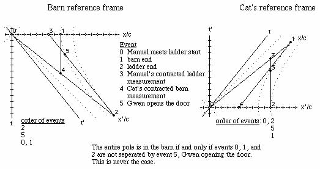

Gwen always opens the far barn door before both ends of the ladder and barn
are together with Manuel and the start of the ladder, averting disaster. The
barn stays in one piece and we have had fun with moving objects with spacelike
separations.

##  R&amp;H: 2-34 2 flashes at different places - or are they?

Q: An observer S sees a flash of red light 1200 m from his position and a
flash of blue light 720 m closer to him and on the same straight line. He
measures the time interval between the occurrences of the flashes to be 5
microseconds, the red flash occurring first. (a) What is the relative velocity
**v** of a second observer S' who would record these flashes as occurring at
the same place? (b) From the point of view of S', which flash occurs first?
(c) What time between them would S' measure?

A: (a) Boost both red and blue lights by beta into frame S'.

![\[Graphics:ps3gr19
.gif\]](../images/SR/problem_set_3/ps3gr19.gif)

![\[Graphics:ps3gr20
.gif\]](../images/SR/problem_set_3/ps3gr20.gif)

Set the distances equal to each other (the second components of the boosted
quaternions) and solve.

![\[Graphics:ps3gr21
.gif\]](../images/SR/problem_set_3/ps3gr21.gif)

    
    
![\[Graphics:ps3gr22.gif\]](../images/SR/problem_set_3/ps3gr22.gif)

The second observer moves toward the first observer at a relative speed of
0.48c.

(b) Substitute the value for v/c into the boosted time for the events.

![\[Graphics:ps3gr23
.gif\]](../images/SR/problem_set_3/ps3gr23.gif)

    
    
![\[Graphics:ps3gr24.gif\]](../images/SR/problem_set_3/ps3gr24.gif)

![\[Graphics:ps3gr25
.gif\]](../images/SR/problem_set_3/ps3gr25.gif)

    
    
![\[Graphics:ps3gr26.gif\]](../images/SR/problem_set_3/ps3gr26.gif)

The red light happens first for observer S'.

(c) Calculate the difference between the first two components of the
quaternions.

![\[Graphics:ps3gr27
.gif\]](../images/SR/problem_set_3/ps3gr27.gif)

    
    
![\[Graphics:ps3gr28.gif\]](../images/SR/problem_set_3/ps3gr28.gif)

The time difference is 4.39 microseconds.

### Addition of velocities

If a quaternion is normalized to its interval, it becomes:

![\[Graphics:ps3gr29
.gif\]](../images/SR/problem_set_3/ps3gr29.gif)

If a quaternion is normalized to its interval and the first term which is
gamma, the result is a quaternion characterizing the velocities:

![\[Graphics:ps3gr30
.gif\]](../images/SR/problem_set_3/ps3gr30.gif)

This quaternion can be formed from any quaternion and boosted accordingly.

For this series of problems, we need a more general boost quaternion, one
where y and z are not zero.

![\[Graphics:ps3gr31
.gif\]](../images/SR/problem_set_3/ps3gr31.gif)

![\[Graphics:ps3gr32
.gif\]](../images/SR/problem_set_3/ps3gr32.gif)

Define the function Lambda to do the general boost along x.

![\[Graphics:ps3gr33
.gif\]](../images/SR/problem_set_3/ps3gr33.gif)

## R&amp;H: 2-59 Watching the decay of a moving nucleus

Q: A radioactive nucleus moves with a uniform velocity of 0.050c along the x
axis of a reference frame S fixed with respect to the laboratory. It decays by
emitting an electron whose speed, measured in a reference frame S' moving with
the nucleus, is 0.80c. Consider first the case in which the emitted electron
travels (a) along the common x-x' axis and (b) along the y' axis and find, for
each case, its velocity as measured in frame S. (c) Suppose, however, that the
emitted electron, viewed now from frame S, travels along the y axis of that
frame with a speed of 0.80c. What is its velocity as measured in frame S'?

A: (a) Boost the velocity quaternion by -0.05c, and keep it as a velocity
quaternion by normalizing it with the resulting gamma.

![\[Graphics:ps3gr34
.gif\]](../images/SR/problem_set_3/ps3gr34.gif)

    
    
![\[Graphics:ps3gr35.gif\]](../images/SR/problem_set_3/ps3gr35.gif)

The relative velocity in frame S is 0.817c along the x axis.

(b) Do that again, with y = 0.8.

![\[Graphics:ps3gr36
.gif\]](../images/SR/problem_set_3/ps3gr36.gif)

    
    
![\[Graphics:ps3gr37.gif\]](../images/SR/problem_set_3/ps3gr37.gif)

The magnitude and angle of the velocity vector can be calculated.

![\[Graphics:ps3gr38
.gif\]](../images/SR/problem_set_3/ps3gr38.gif)

    
    
![\[Graphics:ps3gr39.gif\]](../images/SR/problem_set_3/ps3gr39.gif)

![\[Graphics:ps3gr40
.gif\]](../images/SR/problem_set_3/ps3gr40.gif)

    
    
![\[Graphics:ps3gr41.gif\]](../images/SR/problem_set_3/ps3gr41.gif)

The velocity vector is 0.8005c 3.58 degrees to the right of the y axis.

(c) Repeat the calculation, switching the sign of the boost.

![\[Graphics:ps3gr42
.gif\]](../images/SR/problem_set_3/ps3gr42.gif)

    
    
![\[Graphics:ps3gr43.gif\]](../images/SR/problem_set_3/ps3gr43.gif)

A similar quaternion to b, so the velocity vector is 0.80056c, but 3.57
degrees to the left of the y axis.

##  Baranger: Boosting boosted frames

Q: (a) Frame S' moves with respect to frame S with velocity beta1 in the +x
direction. Frame S'' moves with respect to frame S' with velocity beta2 also
in the + x direction. Frame S" moves with respect to frame S with velocity
Beta, also in the +x direction. Let gamma1, gamma2, and Gamma be the 3 Lorentz
factors corresponding to these 3 velocities, respectively. Prove the formula

![\[Graphics:ps3gr44
.gif\]](../images/SR/problem_set_3/ps3gr44.gif)

(b) 2 identical particles are having a head-on collision. In their center-of-
mass frame, each has a Lorentz factor gamma. Assume gamma &gt;&gt; 1\. Now
look at them in the Lab frame in which one of them is at rest, and call Gamma
the Lorentz factor of the projectile particle. Show that Gamma is
approximately equal to
![\[Graphics:ps3gr45.gif\]](../images/SR/problem_set_3/ps3gr45.gif).

A: (a) From the reference frame of S', beta1 is towards it (so is negative)
and beta2 is away from S' (so it is positive).

![\[Graphics:ps3gr46
.gif\]](../images/SR/problem_set_3/ps3gr46.gif)

    
    
![\[Graphics:ps3gr47.gif\]](../images/SR/problem_set_3/ps3gr47.gif)

![\[Graphics:ps3gr48
.gif\]](../images/SR/problem_set_3/ps3gr48.gif)

    
    
![\[Graphics:ps3gr49.gif\]](../images/SR/problem_set_3/ps3gr49.gif)

The first term is the gamma being sought. Note that the second term divided by
the first term gives the expected addition of relative velocities for frame
S'. The sign is opposite for frame S.

(b) If gamma &gt;&gt; 1, use the approximation for beta of one minus epsilon,
where epsilon is a small number. Plug into the results from part (a).

![\[Graphics:ps3gr50
.gif\]](../images/SR/problem_set_3/ps3gr50.gif)

    
    
![\[Graphics:ps3gr51.gif\]](../images/SR/problem_set_3/ps3gr51.gif)

Square gamma.

![\[Graphics:ps3gr52
.gif\]](../images/SR/problem_set_3/ps3gr52.gif)

    
    
![\[Graphics:ps3gr53.gif\]](../images/SR/problem_set_3/ps3gr53.gif)

Substitute back into Gamma big.

![\[Graphics:ps3gr54
.gif\]](../images/SR/problem_set_3/ps3gr54.gif)

    
    
![\[Graphics:ps3gr55.gif\]](../images/SR/problem_set_3/ps3gr55.gif)

Gamma for the projectile particle is the first term of the above quaternion,
approximately ![\[Graphics:ps3gr56.gif\]](../images/SR/problem_set_3/ps3gr56.gif).

##  French: 5-7 2 ways to double a boost

Q: An inertial system S1 has a constant velocity v1 along the x axis relative
to an inertial system S. Inertial system S2 has a velocity v2 relative to S1.
Two successive Lorentz transformations enable up to go from (t, x, y, z) to
(t1, x1, y1, z1) and then from (t1, x1, y1, z1) to (t2, x2, y2, z2). Show that
this gives the same result as a single Lorentz transformation from (t, x, y,
z) to (t2, x2, y2, z2) provided we take the velocity of S1 relative to S as  
![\[Graphics:ps3gr57.gif\]](../images/SR/problem_set_3/ps3gr57.gif) .

A: Boost once, then again.

![\[Graphics:ps3gr58
.gif\]](../images/SR/problem_set_3/ps3gr58.gif)

    
    
![\[Graphics:ps3gr59.gif\]](../images/SR/problem_set_3/ps3gr59.gif)

![\[Graphics:ps3gr60
.gif\]](../images/SR/problem_set_3/ps3gr60.gif)

    
    
![\[Graphics:ps3gr61.gif\]](../images/SR/problem_set_3/ps3gr61.gif)

Now boost once using the addition of velocities rule.

![\[Graphics:ps3gr62
.gif\]](../images/SR/problem_set_3/ps3gr62.gif)

    
    
![\[Graphics:ps3gr63.gif\]](../images/SR/problem_set_3/ps3gr63.gif)

These two quaternions are identical, as expected.

##  Initialization functions

There are a few tools required to solve problems in special relativity using
quaternions to characterize events in spacetime. The most basic are a round
value for c and gamma.

![\[Graphics:ps3gr64
.gif\]](../images/SR/problem_set_3/ps3gr64.gif)

![\[Graphics:ps3gr65
.gif\]](../images/SR/problem_set_3/ps3gr65.gif)

Define a function for quaternions using its matrix representation.

![\[Graphics:ps3gr66
.gif\]](../images/SR/problem_set_3/ps3gr66.gif)

A quaternion L that transforms a quaternion (L q[**x**] = q[**x'**]) identical
to how the Lorentz transformation acts on 4-vectors  
(Lambda **x** = **x'**) should exist. These are described in detail in the
notebook "A different algebra for boosts." For boosts along the x axis with y
= z = 0, the general function for L is

![\[Graphics:ps3gr67
.gif\]](../images/SR/problem_set_3/ps3gr67.gif)

Most of the problems here involve much simpler cases for L, where t or x is
zero, or t is equal to x.

If t = 0, then

![\[Graphics:ps3gr68
.gif\]](../images/SR/problem_set_3/ps3gr68.gif)

    
    
![\[Graphics:ps3gr69.gif\]](../images/SR/problem_set_3/ps3gr69.gif)

If x = 0, then

![\[Graphics:ps3gr70
.gif\]](../images/SR/problem_set_3/ps3gr70.gif)

    
    
![\[Graphics:ps3gr71.gif\]](../images/SR/problem_set_3/ps3gr71.gif)

If t = x, then

![\[Graphics:ps3gr72
.gif\]](../images/SR/problem_set_3/ps3gr72.gif)

    
    
![\[Graphics:ps3gr73.gif\]](../images/SR/problem_set_3/ps3gr73.gif)

Note: this is for redshifts. Blueshifts have a plus instead of the minus.

The problems are from "Basic Concepts in Relativity" by Resnick and Halliday,
1992 by Macmillian Publishing, "Special Relativity" by A. P. French, 1966,
1968 by MIT, and Prof. M. Baranger of MIT.

# 8.033 Problem Set 4: The Doppler Effect, 4-Vector Invariants &amp; the Twin
Paradox

##  **The Doppler Effect**

##  French: 5-9

Q: Three identical radio transmitters A, B, and C each transmitting at the
frequency ![\[Graphics:ps4gr1.gif\]](../images/SR/problem_set_4/ps4gr1.gif) in its
own rest frame are moving as shown.  
&lt;\---A B C-- -&gt;  
(a) What is the frequency of B's signals as received by C?  
(b) What is the frequency of A's signals as received by C? There are at least
three ways to solve this question. See if you can find two.

A: (a) Let the inverse of the frequency be the time
![\[Graphics:ps4gr2.gif\]](../images/SR/problem_set_4/ps4gr2.gif). Redshift it!

![\[Graphics:ps4gr3.
gif\]](../images/SR/problem_set_4/ps4gr3.gif)

    
    
![\[Graphics:ps4gr5.gif\]](../images/SR/problem_set_4/ps4gr5.gif)

The frequency is the inverse of the time component, or  
![\[Graphics:ps4gr6.gif\]](../images/SR/problem_set_4/ps4gr6.gif)

(b) We need another redshift of exactly the same size.

![\[Graphics:ps4gr7.
gif\]](../images/SR/problem_set_4/ps4gr7.gif)

    
    
![\[Graphics:ps4gr8.gif\]](../images/SR/problem_set_4/ps4gr8.gif)

The frequency it the inverse of the time component, so
![\[Graphics:ps4gr9.gif\]](../images/SR/problem_set_4/ps4gr9.gif).

(b') Another approach is to boost the initial event with a speed equal to the
two boosts, which by the addition of velocity formula is shown below.

![\[Graphics:ps4gr10
.gif\]](../images/SR/problem_set_4/ps4gr10.gif)

Redshift with this velocity and try to simplify.

![\[Graphics:ps4gr11
.gif\]](../images/SR/problem_set_4/ps4gr11.gif)

    
    
![\[Graphics:ps4gr12.gif\]](../images/SR/problem_set_4/ps4gr12.gif)

A step away from the previous result.

##  French: 5-10

Q: A pulsed radar source is at rest at the point x = 0. A large meteorite
moves with constant velocity v toward the source; it is at the point x = -d at
t = 0. A first radar pulse is emitted by the source at t = 0, and a second
pulse at t = to (to &lt;&lt; d/c). The pulses are reflected by the meteorite
and return to the source. (a) Draw in spacetime graph (1) the source, (2) the
meteorite, (3) the two outgoing pulses, (4) the reflected pulses. (b) Evaluate
the time interval between the arrivals at x = 0 of the two reflected pulses.
(c) Evaluate the time interval between the arrivals as the meteorite of the
two outgoing pulses, as measured in the rest frame of the meteorite.  
Answer (b) and (c) first with a well-chosen Lorentz transformation. Then
answer again, this time using the Doppler effect and the results of the above
problem (French 5-9).

A: (a) This spacetime graph of the meteorite was constructed in the program
"Spacetime" by Prof. Edwin F. Taylor.

(b) Chose the frame of the Earth. The world line of the first pulse is  
q[t, -t, 0,0]. The worldline of the meteorite is q[t, v t/c - d,0,0]. Solve
for the time when the distances are the same.

![\[Graphics:ps4gr13
.gif\]](../images/SR/problem_set_4/ps4gr13.gif)

    
    
![\[Graphics:ps4gr14.gif\]](../images/SR/problem_set_4/ps4gr14.gif)

The distance traveled is the same, so it arrives back at the Earth at

![\[Graphics:ps4gr15
.gif\]](../images/SR/problem_set_4/ps4gr15.gif)

Find the time at which the second pulse arrives at the meteorite. The only
change is the departure of the pulse.

![\[Graphics:ps4gr16
.gif\]](../images/SR/problem_set_4/ps4gr16.gif)

    
    
![\[Graphics:ps4gr17.gif\]](../images/SR/problem_set_4/ps4gr17.gif)

Use the time to find pulse 2's position.

![\[Graphics:ps4gr18
.gif\]](../images/SR/problem_set_4/ps4gr18.gif)

    
    
![\[Graphics:ps4gr19.gif\]](../images/SR/problem_set_4/ps4gr19.gif)

Add these together to find the return time.

![\[Graphics:ps4gr20
.gif\]](../images/SR/problem_set_4/ps4gr20.gif)

    
    
![\[Graphics:ps4gr21.gif\]](../images/SR/problem_set_4/ps4gr21.gif)

Examine the interval between the arrival of the two pulses back to the Earth.

![\[Graphics:ps4gr22
.gif\]](../images/SR/problem_set_4/ps4gr22.gif)

    
    
![\[Graphics:ps4gr23.gif\]](../images/SR/problem_set_4/ps4gr23.gif)

The interval between the arrival of the two pulses is shifted by a factor
![\[Graphics:ps4gr24.gif\]](../images/SR/problem_set_4/ps4gr24.gif).

(c) Choose the rest frame of the meteorite. Boost the emission event to this
frame.

![\[Graphics:ps4gr25
.gif\]](../images/SR/problem_set_4/ps4gr25.gif)

Add the time after being boosted together with the position needed to travel
to the meteorite to get the time of pulse 1 at the meteorite.

![\[Graphics:ps4gr26
.gif\]](../images/SR/problem_set_4/ps4gr26.gif)

    
    
![\[Graphics:ps4gr27.gif\]](../images/SR/problem_set_4/ps4gr27.gif)

Repeat this process for pulse 2.

![\[Graphics:ps4gr28
.gif\]](../images/SR/problem_set_4/ps4gr28.gif)

![\[Graphics:ps4gr29
.gif\]](../images/SR/problem_set_4/ps4gr29.gif)

    
    
![\[Graphics:ps4gr30.gif\]](../images/SR/problem_set_4/ps4gr30.gif)

Examine the interval between the arrival of the two pulses at the meteorite.

![\[Graphics:ps4gr31
.gif\]](../images/SR/problem_set_4/ps4gr31.gif)

    
    
![\[Graphics:ps4gr32.gif\]](../images/SR/problem_set_4/ps4gr32.gif)

The interval between the arrival of the two pulses at the meteorite is shifted
by a factor ![\[Graphics:ps4gr33.gif\]](../images/SR/problem_set_4/ps4gr33.gif).

(b') From the reference frame of the meteorite, the pulse of light would be
blueshifted from the source, and blueshifted to the receiver. Use the result
from 5-9 (b).

![\[Graphics:ps4gr34
.gif\]](../images/SR/problem_set_4/ps4gr34.gif)

    
    
![\[Graphics:ps4gr35.gif\]](../images/SR/problem_set_4/ps4gr35.gif)

The time interval between pulses is
![\[Graphics:ps4gr36.gif\]](../images/SR/problem_set_4/ps4gr36.gif).

(c') As stated above, the pulse of light from the source is blueshifted, so
using a modified answer from 5-9 (a).

![\[Graphics:ps4gr37
.gif\]](../images/SR/problem_set_4/ps4gr37.gif)

    
    
![\[Graphics:ps4gr38.gif\]](../images/SR/problem_set_4/ps4gr38.gif)

The time interval between pulse at the meteorite is
![\[Graphics:ps4gr39.gif\]](../images/SR/problem_set_4/ps4gr39.gif).

##  French: 5-11

Q: An astronaut moves radially away from the Earth at a constant acceleration
(as measured in the Earth's reference frame) of 9.8 m/s^2. How long will it be
before the redshift makes the red glare of the neon signs of Earth invisible
to his human eyesight?

A: Solve for the velocity which redshifts the wavelength of neon  
(~600 nm) to invisible (~700 nm).

![\[Graphics:ps4gr40
.gif\]](../images/SR/problem_set_4/ps4gr40.gif)

    
    
![\[Graphics:ps4gr41.gif\]](../images/SR/problem_set_4/ps4gr41.gif)

The time required at a constant acceleration is t = v/a.

![\[Graphics:ps4gr42
.gif\]](../images/SR/problem_set_4/ps4gr42.gif)

    
    
![\[Graphics:ps4gr43.gif\]](../images/SR/problem_set_4/ps4gr43.gif)

After 54 days, the neon lights become invisible to the astronaut's eyes.

##  French: 5-12

Q: There is a spaceship shuttle service from the Earth to Mars. Each spaceship
is equipped with two identical lights, one at the front and one at the rear.
The spaceships normally travel at a speed vo, relative to the Earth, such that
the headlight of a spaceship approaching Earth appears green (500 nm) and the
taillight of a departing spaceship appears red (600 nm). (a) what is the value
of vo/c? (b) One spaceship accelerates to overtake the spaceship ahead of it.
At what speed must the overtaking spaceship travel relative to the Earth so
that the taillight of the Mars-bound spaceship ahead of it looks like a
headlight (500 nm green)?

A: (a) Solve for the velocity that reverses the shifts to the same wavelength
(i.e., redshift the headlight's blueshifted light to the wavelength of the
taillight's blueshifted redshifted light ; )

![\[Graphics:ps4gr44
.gif\]](../images/SR/problem_set_4/ps4gr44.gif)

    
    
![\[Graphics:ps4gr45.gif\]](../images/SR/problem_set_4/ps4gr45.gif)

The spaceships travel at vo/c = 1/11.

(b) Solve for the velocity needed to shift the wavelength from 600 to 500 nm.

![\[Graphics:ps4gr46
.gif\]](../images/SR/problem_set_4/ps4gr46.gif)

    
    
![\[Graphics:ps4gr47.gif\]](../images/SR/problem_set_4/ps4gr47.gif)

The required velocity is v/c = 11/61.

##  R &amp; H: 2-68 A Doppler shift revealed as a color change

Q: A spaceship is receding from the Earth at a speed of 0.20c. A light on the
rear of the ship appears blue (450 nm) to the passengers on the ship. What
color would it appear to an observer on the Earth?

A: Redshift the light at 450 nm by 0.20c.

![\[Graphics:ps4gr48
.gif\]](../images/SR/problem_set_4/ps4gr48.gif)

    
    
![\[Graphics:ps4gr49.gif\]](../images/SR/problem_set_4/ps4gr49.gif)

The light appears at 551 nm, yellow.

##  R &amp; H: 2-71 The Ives-Stillwell experiment

Q: (long) Neutral hydrogen atoms are moving along the axis of an evacuated
tube with a speed of 2.0 x 10^6 m/s. A spectrometer is arranged to receive
light emitted by these atoms in the direction of their forward motion. This
light, if emitted from resting hydrogen atoms, would have a measured (proper)
wavelength of 486.13 nm. (a) Calculate the expected wavelength for light
emitted from the forward-moving (approaching) atoms, using the exact
relativistic formula. (b) By using a mirror this same spectrometer can also
measure the wavelength of light emitted by these moving atoms in the direction
opposite to their motion. What wavelength is expected under this arrangement?
(c) Calculate the difference between the average of the two wavelengths found
in (a) and (b) and the unshifted (proper) wavelength. Find the second order
dependence on beta. By this technique, Ives and Stillwell were able to
distinguish between the predictions of the classical and the relativistic
Doppler formulas.

A: (a) &amp; (b) Red- and blue shift the light at 486 nm +/- the speed of the
moving hydrogen.

![\[Graphics:ps4gr50
.gif\]](../images/SR/problem_set_4/ps4gr50.gif)

    
    
![\[Graphics:ps4gr51.gif\]](../images/SR/problem_set_4/ps4gr51.gif)

![\[Graphics:ps4gr52
.gif\]](../images/SR/problem_set_4/ps4gr52.gif)

    
    
![\[Graphics:ps4gr53.gif\]](../images/SR/problem_set_4/ps4gr53.gif)

![\[Graphics:ps4gr54
.gif\]](../images/SR/problem_set_4/ps4gr54.gif)

    
    
![\[Graphics:ps4gr55.gif\]](../images/SR/problem_set_4/ps4gr55.gif)

The light is redshifted to 489.4 nm and blueshifted to 482.9 nm.

(c) We can measure the average of these two shifted wavelengths, or their
average difference.

![\[Graphics:ps4gr56
.gif\]](../images/SR/problem_set_4/ps4gr56.gif)

    
    
![\[Graphics:ps4gr57.gif\]](../images/SR/problem_set_4/ps4gr57.gif)

![\[Graphics:ps4gr58
.gif\]](../images/SR/problem_set_4/ps4gr58.gif)

    
    
![\[Graphics:ps4gr59.gif\]](../images/SR/problem_set_4/ps4gr59.gif)

According to classical theory, if the observer is fixed, and the source moves,
there is no second order dependence on beta.

![\[Graphics:ps4gr60
.gif\]](../images/SR/problem_set_4/ps4gr60.gif)

If the source is fixed but the observer moves, then

![\[Graphics:ps4gr61
.gif\]](../images/SR/problem_set_4/ps4gr61.gif)

Special relativity predicts a coefficient of +0.5 for the beta squared term,
the one measured in the lab.

##  R&amp;H: 2-83 The headlight effect

Q: A source of light, at rest in the S' frame, emits uniformly in all
directions. The source is viewed from frame S, the relative speed parameter
relating the two frames being beta. (a) Show that at high speeds, the forward-
pointing cone into which the source emits half of its radiation has a half
angle given closely, in radian measure, by

![\[Graphics:ps4gr62
.gif\]](../images/SR/problem_set_4/ps4gr62.gif)

(b) What value of the half angle is predicted for the gamma radiation emitted
by a beam of energetic neutral pions, for which v/c = 0.993? (c) At what speed
would a light source have to move toward an observer to have half of its
radiation concentrated into a narrow forward cone of half angle 5.0 degrees?

A: This problem requires a boost quaternion that works with nonzero values for
t, x, y, and z. See the last problem set in the addition of velocities section
for the derivation of the following boost quaternion, or the notebook on
"Alternative algebra for boosts":

![\[Graphics:ps4gr63
.gif\]](../images/SR/problem_set_4/ps4gr63.gif)

Boost a spherically symmetric velocity quaternion, normalizing to the
resulting gamma so the resulting quaternion still characterizes velocities.

![\[Graphics:ps4gr64
.gif\]](../images/SR/problem_set_4/ps4gr64.gif)

    
    
![\[Graphics:ps4gr65.gif\]](../images/SR/problem_set_4/ps4gr65.gif)

Calculate the angle directly from the ratio of speeds.

![\[Graphics:ps4gr66
.gif\]](../images/SR/problem_set_4/ps4gr66.gif)

    
    
![\[Graphics:ps4gr67.gif\]](../images/SR/problem_set_4/ps4gr67.gif)

As beta approaches 1, this angle approaches
![\[Graphics:ps4gr68.gif\]](../images/SR/problem_set_4/ps4gr68.gif).

(b) Let beta -&gt; 0.993.

![\[Graphics:ps4gr69
.gif\]](../images/SR/problem_set_4/ps4gr69.gif)

    
    
![\[Graphics:ps4gr70.gif\]](../images/SR/problem_set_4/ps4gr70.gif)

The predicted half angle for the gamma rays is 6.79 degrees.

(c) Solve for beta, given the angle.

![\[Graphics:ps4gr71
.gif\]](../images/SR/problem_set_4/ps4gr71.gif)

    
    
![\[Graphics:ps4gr72.gif\]](../images/SR/problem_set_4/ps4gr72.gif)

A light source would have to travel at 0.9962c to concentrate its radiation in
a forward cone of half angle 5 degrees.

##  **Four-Vector Invariants**

##  Baranger: Decay of a particle - timelike or spacelike?

Q: In event 1, an unstable particle is produced in the target of an
accelerator. In event 2, this particle decays 5 meters away. Is the interval
between these two events timelike or spacelike? Why?

A: The speed of the particle must be less than one, or x/t &lt; 1\. If event 1
is at the origin and event 2 has a spatial position of 5m, it must have a time
of 5m + a (a&gt;0). Calculate the square of the interval by squaring the
quaternion.

![\[Graphics:ps4gr73
.gif\]](../images/SR/problem_set_4/ps4gr73.gif)

    
    
![\[Graphics:ps4gr74.gif\]](../images/SR/problem_set_4/ps4gr74.gif)

The square of the interval a^2 + 10a is always positive, so the interval is
timelike in the future.

##  R&amp;H: 2-42 The interval is invariant - check it out

Q: Two events occur on the x axis of reference frame S, their spacetime
coordinates being event1 = q[5 us, 720 m,0,0 ] and event 2 = [2 us, 1200 m,0,0
]. (a) What is the square of the spacetime interval for these two events? (b)
What are the coordinates of these events in a frame S' that moves at speed
0.60c in the direction of increasing x? Calculate the square of the interval
in this frame and compare it to the value calculated for frame S. (c) What are
the coordinates of these events in a frame S" that moves at a speed of 0.95c
in the direction of decreasing x? Again calculate the square of the spacetime
interval and compare it with the values found in (a) and (b). Do your
calculations bear out the invariance of the spacetime interval?

A: (a) The square of the spacetime interval between events 1 and 2 is the
first term of difference between the quaternions squared.

![\[Graphics:ps4gr75
.gif\]](../images/SR/problem_set_4/ps4gr75.gif)

![\[Graphics:ps4gr76
.gif\]](../images/SR/problem_set_4/ps4gr76.gif)

![\[Graphics:ps4gr77
.gif\]](../images/SR/problem_set_4/ps4gr77.gif)

    
    
![\[Graphics:ps4gr78.gif\]](../images/SR/problem_set_4/ps4gr78.gif)

The square of the interval between event 1 and 2 is 5.8 x 10^5 m^2.

(b) Boost the quaternions and then square them.

![\[Graphics:ps4gr79
.gif\]](../images/SR/problem_set_4/ps4gr79.gif)

![\[Graphics:ps4gr80
.gif\]](../images/SR/problem_set_4/ps4gr80.gif)

![\[Graphics:ps4gr81
.gif\]](../images/SR/problem_set_4/ps4gr81.gif)

    
    
![\[Graphics:ps4gr82.gif\]](../images/SR/problem_set_4/ps4gr82.gif)

The square of the interval between the boosted events is the same.

(c) Repeat the exercise with a new value for beta.

![\[Graphics:ps4gr83
.gif\]](../images/SR/problem_set_4/ps4gr83.gif)

![\[Graphics:ps4gr84
.gif\]](../images/SR/problem_set_4/ps4gr84.gif)

![\[Graphics:ps4gr85
.gif\]](../images/SR/problem_set_4/ps4gr85.gif)

    
    
![\[Graphics:ps4gr86.gif\]](../images/SR/problem_set_4/ps4gr86.gif)

Again, the square of the interval between the boosted events is the same. The
first term of the square of a quaternion is identical to the first term of a
square of a boosted quaternion.

##  R&amp;H: 2-43 An event pair - timelike or spacelike?

Q: Two events occur on the x axis of reference frame S, their spacetime
coordinates being event1 = q[5 us, 200 m,0,0] and event 2 = [2 us, 1200
m,0,0]. (a) What is the square of the spacetime interval for these two events?
(b) What is the proper distance interval between them? (c) If two events
possess a (mathematically real) proper distance interval, it should be
possible to find a frame S' in which these events would be seen to occur
simultaneously. Find this frame. (d) Can you calculate a (mathematically real)
proper time interval for this pair of events? (e) Would you describe this pair
of events as timelike? Spacelike? Lightlike?

A: (a) The square of the spacetime interval between events 1 and 2 is the
first term of difference between the quaternions squared.

![\[Graphics:ps4gr87
.gif\]](../images/SR/problem_set_4/ps4gr87.gif)

![\[Graphics:ps4gr88
.gif\]](../images/SR/problem_set_4/ps4gr88.gif)

![\[Graphics:ps4gr89
.gif\]](../images/SR/problem_set_4/ps4gr89.gif)

    
    
![\[Graphics:ps4gr90.gif\]](../images/SR/problem_set_4/ps4gr90.gif)

The square of the interval between event 1 and 2 is -1.9 x 10^5 m^2

(b) The proper distance interval is the square root of the negative of this
number.

![\[Graphics:ps4gr91
.gif\]](../images/SR/problem_set_4/ps4gr91.gif)

    
    
![\[Graphics:ps4gr92.gif\]](../images/SR/problem_set_4/ps4gr92.gif)

The proper distance is 436 m.

(c) Boost both event quaternions by beta, set the time components equal to
each other, and solve for beta.

![\[Graphics:ps4gr93
.gif\]](../images/SR/problem_set_4/ps4gr93.gif)

    
    
![\[Graphics:ps4gr94.gif\]](../images/SR/problem_set_4/ps4gr94.gif)

In frame S', the events will appear simultaneous for v/c = 0.9 in the
direction of decreasing x.

(d) &amp; (e) For events that are spacelike separated, there is no meaningful
measure of proper time.

##  R&amp;H: 2-44 An event pair - spacelike or timelike?

Q: Two events occur on the x axis of reference frame S, their spacetime
coordinates being event1 = q[5 us, 720 m,0,0] and event 2 = [2 us, 1200
m,0,0]. (a) Using the data from problem 2-42 above, calculate the proper time
interval for this pair of events. The proper time interval that you have
calculated should be smaller than any of the actual time intervals in the
three given frames of problem 2-42. Is it? (b) If two events possess a
(mathematically real) proper time interval, it should be possible to find a
frame S' in which these events would be seen to occur at the same place. Find
this frame. (c) Can you calculate a (mathematically real) proper distance
interval for this pair of events? (d) Would you describe this pair of events
as timelike? Spacelike? Lightlike?

A: (a) To make this question more of a challenge, let's define a quaternion
"Ltau" which maps an arbitrary timelike quaternion to its proper time:  
  
Ltau . q[t,x,y,z] = q[tau, 0, 0, 0] .  
  
To find Ltau, multiply the above equation on the right by the inverse of
q[t,x,y,z].

![\[Graphics:ps4gr95
.gif\]](../images/SR/problem_set_4/ps4gr95.gif)

![\[Graphics:ps4gr96
.gif\]](../images/SR/problem_set_4/ps4gr96.gif)

![\[Graphics:ps4gr97
.gif\]](../images/SR/problem_set_4/ps4gr97.gif)

![\[Graphics:ps4gr98
.gif\]](../images/SR/problem_set_4/ps4gr98.gif)

    
    
![\[Graphics:ps4gr99.gif\]](../images/SR/problem_set_4/ps4gr99.gif)

Works to within default accuracy.

Now on to the question. Map the given quaternion to its proper time interval.

![\[Graphics:ps4gr10
0.gif\]](../images/SR/problem_set_4/ps4gr100.gif)

![\[Graphics:ps4gr10
1.gif\]](../images/SR/problem_set_4/ps4gr101.gif)

    
    
![\[Graphics:ps4gr102.gif\]](../images/SR/problem_set_4/ps4gr102.gif)

The proper time is 2.54 microseconds. This is less than the time of 3
microseconds observed in this frame.

Boost the interval up 0.6c, &amp; repeat the cycle.

![\[Graphics:ps4gr10
3.gif\]](../images/SR/problem_set_4/ps4gr103.gif)

![\[Graphics:ps4gr10
4.gif\]](../images/SR/problem_set_4/ps4gr104.gif)

    
    
![\[Graphics:ps4gr105.gif\]](../images/SR/problem_set_4/ps4gr105.gif)

![\[Graphics:ps4gr10
7.gif\]](../images/SR/problem_set_4/ps4gr107.gif)

    
    
![\[Graphics:ps4gr108.gif\]](../images/SR/problem_set_4/ps4gr108.gif)

The interval 2.53 microseconds is the same, less that 4.95 microseconds
observed.

![\[Graphics:ps4gr10
9.gif\]](../images/SR/problem_set_4/ps4gr109.gif)

![\[Graphics:ps4gr11
0.gif\]](../images/SR/problem_set_4/ps4gr110.gif)

    
    
![\[Graphics:ps4gr111.gif\]](../images/SR/problem_set_4/ps4gr111.gif)

![\[Graphics:ps4gr11
2.gif\]](../images/SR/problem_set_4/ps4gr112.gif)

    
    
![\[Graphics:ps4gr113.gif\]](../images/SR/problem_set_4/ps4gr113.gif)

The interval is the same, less that 4.74 microseconds observed.

(b) Boost both event quaternions by beta, set the space components equal to
each other, and solve for beta.

![\[Graphics:ps4gr11
4.gif\]](../images/SR/problem_set_4/ps4gr114.gif)

    
    
![\[Graphics:ps4gr115.gif\]](../images/SR/problem_set_4/ps4gr115.gif)

The frame must move a speed 0.53c in the direction of decreasing x.

(c) &amp; (d) The interval is timelike. It is not meaningful to search for a
proper distance between these two events.

##  **The Twin Paradox**

##  The tortoise &amp; the hare

Q: The tortoise challenges the hare to a race in the woods. The hare laughs
hysterically saying "Surely, M'am, you are not serious?" But the tortoise is
serious; she gets on the course and starts running(?) right away. The course
is a closed loop beginning and ending at the same tree. While the tortoise is
running, the hare continues telling jokes with his friends. But when he sees
that she has almost gotten back to the finish, he decides that it is time to
teach her a lesson, and he dashes on the course as quick as he can to catch up
with her. Alas, he miscalculated slightly and he returns to the tree just
barely behind her!  
QUESTION: Assuming that the two animals were of the same age before the race,
which one is older at the end of it? Justify your answer with quantitative
arguments!

A: Let the hare run the fraction f of the tortoise's proper time t. Calculate
the tortoise's squared interval in terms of this fraction.

![\[Graphics:ps4gr11
6.gif\]](../images/SR/problem_set_4/ps4gr116.gif)

    
    
![\[Graphics:ps4gr117.gif\]](../images/SR/problem_set_4/ps4gr117.gif)

In the tortoise's reference frame, the hare initially travels away from the
tortoise at the slow Btort speed for time t. Then the hare starts traveling
toward the tortoise at Bhare speed for a time (1-f) t. Calculate the hare's
squared interval.

![\[Graphics:ps4gr11
8.gif\]](../images/SR/problem_set_4/ps4gr118.gif)

    
    
![\[Graphics:ps4gr119.gif\]](../images/SR/problem_set_4/ps4gr119.gif)

Look at the difference.

![\[Graphics:ps4gr12
0.gif\]](../images/SR/problem_set_4/ps4gr120.gif)

    
    
![\[Graphics:ps4gr121.gif\]](../images/SR/problem_set_4/ps4gr121.gif)

Since this term is always negative, the hare is necessarily younger than the
tortoise.

##  R&amp;H: B2-2 Einstein and the clock "paradox"

Q: Einstein, in his first paper on the special theory of relativity, wrote the
following: "If one of the two synchronous clocks at A is moved in a closed
curve with constant velocity until it returns to A, the journey lasting t
seconds, then by the clock that has remained at rest the travelled clock on
its arrival at A will be t v^2/2 c^2 seconds slow." Prove this statement.
(Note: Elsewhere in his paper Einstein indicated that this result is an
approximation, valid only for v &lt;&lt; c.)

A: Compare the intervals of the two clocks, one that has move, the other that
has remained.

![\[Graphics:ps4gr12
2.gif\]](../images/SR/problem_set_4/ps4gr122.gif)

    
    
![\[Graphics:ps4gr123.gif\]](../images/SR/problem_set_4/ps4gr123.gif)

If beta &lt;&lt; 1, calculate the series expansion.

![\[Graphics:ps4gr12
4.gif\]](../images/SR/problem_set_4/ps4gr124.gif)

    
    
![\[Graphics:ps4gr125.gif\]](../images/SR/problem_set_4/ps4gr125.gif)

The moving clock is t v^2/2 c^2 slower than the one at rest.

##  R&amp;H B2-12: Getting Younger

Q: Can you think of any way to use space travel to reverse the aging process,
that is, to get younger? Could you send your parents out on a long space
voyage and have them be younger than you are when they get back?

A: There are actually two questions here. Starting with the last question
first, with a HUGE investment of energy for the parents, time will appear to
run at a slower rate than the clocks back at home. The energy investment is
the critical parameter to determine if the clocks will run at different enough
rates to have the parents return younger than their children.

The second question concerns reversing the aging process. The aging process
will appear to procede in the same manor for both parent and child. Why is
this not reversable? Find the quaternion that reverses time.  
  
LTimeRev q[t, x, y, z] = q[-t, x, y, z]  
  
Compute LTimeRev by multiplying on the right by the inverse of q[t,x,y,z].

![\[Graphics:ps4gr12
6.gif\]](../images/SR/problem_set_4/ps4gr126.gif)

![\[Graphics:ps4gr12
7.gif\]](../images/SR/problem_set_4/ps4gr127.gif)

Aboard the spaceship, or on the Earth, t &gt;&gt;&gt; x, y and z, so the time
reversal quaternion is approximately

![\[Graphics:ps4gr12
8.gif\]](../images/SR/problem_set_4/ps4gr128.gif)

Test that this works for someone moving a meter per second in the x direction,
0.5 m/s in the y.

![\[Graphics:ps4gr12
9.gif\]](../images/SR/problem_set_4/ps4gr129.gif)

    
    
![\[Graphics:ps4gr130.gif\]](../images/SR/problem_set_4/ps4gr130.gif)

The proposed quaternion does reverse time in the classical regime. Note that
it is predominantly a scalar, almost q[-1,0,0,0] However, it is not _exactly_
the identity. If we think about time reversal for two nearby worldlines, they
will not commute by the small factor found in the second through fourth terms.
This observation may lead to a new justification of the second law of
thermodynamics.

##  French: 5-20 Signals from twins

Q: A and B are twins. A goes on a trip to Alpha Centauri (4 light- years away)
and back again. He travels at speed 0.6c with respect to the Earth both ways,
and transmits a radio signal every 0.01 year in his frame. His twin B
similarly sends a signal every 0.01 years in his own rest frame. (a) how many
signals emitted by A before he turns around does B receive? (b) How many
signals does A receive before he turns around? (c) What is the total number of
signals each twin receives from the other? (d) Who is younger at the end of
the trip, and by how much? Show that the twins both agree on this result.

A: Start out by drawing the signals sent and received from B's frame of
reference.

(a) The signals from A out are redshifted and received at B for a time of ...

![\[Graphics:ps4gr13
1.gif\]](../images/SR/problem_set_4/ps4gr131.gif)

    
    
![\[Graphics:ps4gr132.gif\]](../images/SR/problem_set_4/ps4gr132.gif)

The signals are sent at a rate of 100/year as viewed by the sender. This rate
is lowered by the redshifting, so the total number of signals is the lower
rate times the amount of time the signals are received.

![\[Graphics:ps4gr13
3.gif\]](../images/SR/problem_set_4/ps4gr133.gif)

    
    
![\[Graphics:ps4gr134.gif\]](../images/SR/problem_set_4/ps4gr134.gif)

B receives 533 redshifted signals from A.

(b) The signals from B are not shifted in B's frame, but are received at A for
a time of...

![\[Graphics:ps4gr13
5.gif\]](../images/SR/problem_set_4/ps4gr135.gif)

    
    
![\[Graphics:ps4gr136.gif\]](../images/SR/problem_set_4/ps4gr136.gif)

![\[Graphics:ps4gr13
7.gif\]](../images/SR/problem_set_4/ps4gr137.gif)

    
    
![\[Graphics:ps4gr138.gif\]](../images/SR/problem_set_4/ps4gr138.gif)

A receives 266 signals from B during A's trip to Alpha Centauri.

(c) It is easiest to calculate the number of signals received by A since the
rate with B as a reference frame is constant.

![\[Graphics:ps4gr13
9.gif\]](../images/SR/problem_set_4/ps4gr139.gif)

    
    
![\[Graphics:ps4gr140.gif\]](../images/SR/problem_set_4/ps4gr140.gif)

A receives a total of 1333 signals from B.

B gets blueshifted signals for a short time. The rate of signals goes way up.

![\[Graphics:ps4gr14
1.gif\]](../images/SR/problem_set_4/ps4gr141.gif)

    
    
![\[Graphics:ps4gr142.gif\]](../images/SR/problem_set_4/ps4gr142.gif)

![\[Graphics:ps4gr14
3.gif\]](../images/SR/problem_set_4/ps4gr143.gif)

    
    
![\[Graphics:ps4gr144.gif\]](../images/SR/problem_set_4/ps4gr144.gif)

![\[Graphics:ps4gr14
5.gif\]](../images/SR/problem_set_4/ps4gr145.gif)

    
    
![\[Graphics:ps4gr146.gif\]](../images/SR/problem_set_4/ps4gr146.gif)

B receives a total of 1066 signals from A.

(d) B has sent out 1333 signals, but has only received 1066 from A, so he has
experienced more ticks of the clock. The difference is due to the
instantaneous change of reference frame experienced by A.

##  Initialization functions

There are a few tools required to solve problems in special relativity using
quaternions to characterize events in spacetime. The most basic are a round
value for c and gamma.

![\[Graphics:ps4gr14
7.gif\]](../images/SR/problem_set_4/ps4gr147.gif)

![\[Graphics:ps4gr14
8.gif\]](../images/SR/problem_set_4/ps4gr148.gif)

Define a function for quaternions using its matrix representation.

![\[Graphics:ps4gr14
9.gif\]](../images/SR/problem_set_4/ps4gr149.gif)

A quaternion L that transforms a quaternion (L q[**x**] = q[**x'**]) identical
to how the Lorentz transformation acts on 4- vectors  
(Lambda **x** = **x'**) should exist. These are described in detail in the
notebook "A different algebra for boosts." For boosts along the x axis with y
= z = 0, the general function for L is

![\[Graphics:ps4gr15
0.gif\]](../images/SR/problem_set_4/ps4gr150.gif)

Most of the problems here involve much simpler cases for L, where t or x is
zero, or t is equal to x.

If t = 0, then

![\[Graphics:ps4gr15
1.gif\]](../images/SR/problem_set_4/ps4gr151.gif)

    
    
![\[Graphics:ps4gr152.gif\]](../images/SR/problem_set_4/ps4gr152.gif)

If x = 0, then

![\[Graphics:ps4gr15
3.gif\]](../images/SR/problem_set_4/ps4gr153.gif)

    
    
![\[Graphics:ps4gr154.gif\]](../images/SR/problem_set_4/ps4gr154.gif)

If t = x, then

![\[Graphics:ps4gr15
5.gif\]](../images/SR/problem_set_4/ps4gr155.gif)

    
    
![\[Graphics:ps4gr156.gif\]](../images/SR/problem_set_4/ps4gr156.gif)

Note: this is for blueshifts. Redshifts have a plus instead of the minus.

The problems are from "Basic Concepts in Relativity" by Resnick and Halliday,
1992 by Macmillian Publishing, "Special Relativity" by A. P. French, 1966,
1968 by MIT, and Prof. M. Baranger of MIT.

# 8.033 Problem Set 5: Energy, Momentum and Mass

##  French: 6-3

Q: A particle of rest mass m and kinetic energy 2 m c^2 strikes and sticks to
a stationary particle of rest mass 2m. Find the rest mass M of the composite
particle.

A: Calculate the square of the mass of the system by squaring the quaternion
and looking at the first term.

![\[Graphics:ps5gr1.
gif\]](../images/SR/problem_set_5/ps5gr1.gif)

    
    
![\[Graphics:ps5gr3.gif\]](../images/SR/problem_set_5/ps5gr3.gif)

The mass of the composite particle is
![\[Graphics:ps5gr4.gif\]](../images/SR/problem_set_5/ps5gr4.gif).

##  French: 6-4

Q: (a) A photon of energy E collides with a stationary particle of rest mass m
and is absorbed. What is the velocity of the resulting composite particle? (b)
A particle of rest mass mo moving at a speed of 4/5c collides with a similar
particle at rest and forms a composite particle. What is the rest mass of the
composite particle and what is its speed?

A: (a) The speed can be calculated from the ratio of the momentum to the
energy. Define the before and after quaternions, set these ratios equal to
each other and solve.

![\[Graphics:ps5gr5.
gif\]](../images/SR/problem_set_5/ps5gr5.gif)

![\[Graphics:ps5gr6.
gif\]](../images/SR/problem_set_5/ps5gr6.gif)

![\[Graphics:ps5gr7.
gif\]](../images/SR/problem_set_5/ps5gr7.gif)

    
    
![\[Graphics:ps5gr8.gif\]](../images/SR/problem_set_5/ps5gr8.gif)

The velocity of the composite particle is
![\[Graphics:ps5gr9.gif\]](../images/SR/problem_set_5/ps5gr9.gif).

(b) The problem is the same, only the numbers have been changed to protect the
writer.

![\[Graphics:ps5gr10
.gif\]](../images/SR/problem_set_5/ps5gr10.gif)

![\[Graphics:ps5gr11
.gif\]](../images/SR/problem_set_5/ps5gr11.gif)

    
    
![\[Graphics:ps5gr12.gif\]](../images/SR/problem_set_5/ps5gr12.gif)

Because mass is conserved, the mass of the composite equals the mass of the
system before the collision.

![\[Graphics:ps5gr13
.gif\]](../images/SR/problem_set_5/ps5gr13.gif)

    
    
![\[Graphics:ps5gr14.gif\]](../images/SR/problem_set_5/ps5gr14.gif)

The composite travels at 0.5c with a mass of
![\[Graphics:ps5gr15.gif\]](../images/SR/problem_set_5/ps5gr15.gif).

##  Baranger: The projectile

Q: A projectile of rest mass M1, energy E1, and momentum p1, is directed at a
stationary target of mass m2. Find a simple expression for the velocity of the
center of mass frame.

A: Define the before and after quaternions (a boost to the center of mass
frame - not a collision!).

![\[Graphics:ps5gr16
.gif\]](../images/SR/problem_set_5/ps5gr16.gif)

![\[Graphics:ps5gr17
.gif\]](../images/SR/problem_set_5/ps5gr17.gif)

We need to find a boost that will transform between the two. The boost
quaternion is simple for the center of mass frame where x=y=z=0.

![\[Graphics:ps5gr18
.gif\]](../images/SR/problem_set_5/ps5gr18.gif)

The ratio of the second component to the first one is p/E or v/c, exactly what
we are looking for.

![\[Graphics:ps5gr19
.gif\]](../images/SR/problem_set_5/ps5gr19.gif)

    
    
![\[Graphics:ps5gr20.gif\]](../images/SR/problem_set_5/ps5gr20.gif)

The velocity of the center of mass frame is
![\[Graphics:ps5gr21.gif\]](../images/SR/problem_set_5/ps5gr21.gif).

##  French: 6-11

Q: The neutral pi meson decays into two gamma rays (and nothing else). If the
pion (whose rest mass is 135 MeV) is moving with a kinetic energy of 1 GeV:
(a) What are the energies of the gamma rays if the decay process causes them
to be emitted in opposite directions along the pion's original line of motion?
(b) What angle is formed between the two gamma rays if they are emitted at
equal angles to the direction of the pion's motion?

A: (a) Define the before and after quaternions.

![\[Graphics:ps5gr22
.gif\]](../images/SR/problem_set_5/ps5gr22.gif)

![\[Graphics:ps5gr23
.gif\]](../images/SR/problem_set_5/ps5gr23.gif)

Solve for E2 using energy conservation, then E1 using momentum conservation.

![\[Graphics:ps5gr24
.gif\]](../images/SR/problem_set_5/ps5gr24.gif)

    
    
![\[Graphics:ps5gr25.gif\]](../images/SR/problem_set_5/ps5gr25.gif)

One gamma is 1131 MeV, the other is 4 MeV.

(b) The after quaternion has been changed. Solve first for the energy, then
the angle.

![\[Graphics:ps5gr26
.gif\]](../images/SR/problem_set_5/ps5gr26.gif)

![\[Graphics:ps5gr27
.gif\]](../images/SR/problem_set_5/ps5gr27.gif)

    
    
![\[Graphics:ps5gr28.gif\]](../images/SR/problem_set_5/ps5gr28.gif)

Theta is the half angle in radians.

![\[Graphics:ps5gr29
.gif\]](../images/SR/problem_set_5/ps5gr29.gif)

    
    
![\[Graphics:ps5gr30.gif\]](../images/SR/problem_set_5/ps5gr30.gif)

There is 13.6 degrees between the two gamma rays.

##  French: 6-14

Q: Show that the following processes are dynamically impossible: (a) A single
photon strikes a stationary electron and gives up all its energy to the
electron. (b) A single photon in empty space is transformed into an electron
and a positron. (c) A fast positron and a stationary electron annihilate,
producing only one photon.

A: (a) By inspection, momentum is conserved only if E = 0.

![\[Graphics:ps5gr31
.gif\]](../images/SR/problem_set_5/ps5gr31.gif)

![\[Graphics:ps5gr32
.gif\]](../images/SR/problem_set_5/ps5gr32.gif)

![\[Graphics:ps5gr33
.gif\]](../images/SR/problem_set_5/ps5gr33.gif)

    
    
![\[Graphics:ps5gr34.gif\]](../images/SR/problem_set_5/ps5gr34.gif)

A photon with no momentum is no photon at all.

(b) The square of the mass of the photon is zero. Examine the same for the
electron and positron.

![\[Graphics:ps5gr35
.gif\]](../images/SR/problem_set_5/ps5gr35.gif)

![\[Graphics:ps5gr36
.gif\]](../images/SR/problem_set_5/ps5gr36.gif)

    
    
![\[Graphics:ps5gr37.gif\]](../images/SR/problem_set_5/ps5gr37.gif)

The mass in never less than 2 m, so this transition violates conservation of
mass.

(c) The mass of the photon is zero. Find out the mass of the electron and
positron..

![\[Graphics:ps5gr38
.gif\]](../images/SR/problem_set_5/ps5gr38.gif)

![\[Graphics:ps5gr39
.gif\]](../images/SR/problem_set_5/ps5gr39.gif)

    
    
![\[Graphics:ps5gr40.gif\]](../images/SR/problem_set_5/ps5gr40.gif)

There is no choice of theta that makes the mass zero, so the transformation is
not possible without a violation of conservation of mass.

##  French: 7-1

Q: A K meson traveling through the laboratory breaks up into two pi mesons.
One of the pi mesons is left at rest. What was the energy of the K? What is
the energy of the remaining pi meson? (Rest mass of K meson = 494 MeV; rest
mass of pi meson ~137 MeV).

A: Define the quaternions for the before and after states.

![\[Graphics:ps5gr41
.gif\]](../images/SR/problem_set_5/ps5gr41.gif)

![\[Graphics:ps5gr42
.gif\]](../images/SR/problem_set_5/ps5gr42.gif)

![\[Graphics:ps5gr43
.gif\]](../images/SR/problem_set_5/ps5gr43.gif)

    
    
![\[Graphics:ps5gr44.gif\]](../images/SR/problem_set_5/ps5gr44.gif)

The kinetic energy will be E - M = gamma M - M.

![\[Graphics:ps5gr45
.gif\]](../images/SR/problem_set_5/ps5gr45.gif)

    
    
![\[Graphics:ps5gr46.gif\]](../images/SR/problem_set_5/ps5gr46.gif)

The pion has 616.6 MeV of kinetic energy.

Use the fact that energy is conserved to calculate the kinetic energy of the K
meson.

![\[Graphics:ps5gr47
.gif\]](../images/SR/problem_set_5/ps5gr47.gif)

    
    
![\[Graphics:ps5gr48.gif\]](../images/SR/problem_set_5/ps5gr48.gif)

The K meson has 396.6 MeV of kinetic energy.

##  Baranger: Protons to K's

Q: Consider the annihilation of an antiproton with a proton, both particles
being at rest, according to the reaction

![\[Graphics:ps5gr49
.gif\]](../images/SR/problem_set_5/ps5gr49.gif)

mass p = 940 MeV/c^2, mass kaon = 500 MeV/c^2. (a) Find the kinetic energies
and momenta of the created kaon particles. (b) If the proper lifetime of the
kaon's is 10^-10 s, find their actual lifetime in the lab frame and the
distance they travel.

A: (a) The mass of the system is 1880 MeV. After the creation of the kaon's,
the total momentum is still zero.

![\[Graphics:ps5gr55
.gif\]](../images/SR/problem_set_5/ps5gr55.gif)

![\[Graphics:ps5gr56
.gif\]](../images/SR/problem_set_5/ps5gr56.gif)

![\[Graphics:ps5gr57
.gif\]](../images/SR/problem_set_5/ps5gr57.gif)

    
    
![\[Graphics:ps5gr58.gif\]](../images/SR/problem_set_5/ps5gr58.gif)

![\[Graphics:ps5gr59
.gif\]](../images/SR/problem_set_5/ps5gr59.gif)

    
    
![\[Graphics:ps5gr60.gif\]](../images/SR/problem_set_5/ps5gr60.gif)

![\[Graphics:ps5gr61
.gif\]](../images/SR/problem_set_5/ps5gr61.gif)

    
    
![\[Graphics:ps5gr62.gif\]](../images/SR/problem_set_5/ps5gr62.gif)

Each kaon has 440 MeV of kinetic energy and a momentum of 796 Mev.

(b) t' = gamma t and d' = beta c t'. Simple stuff.

![\[Graphics:ps5gr64
.gif\]](../images/SR/problem_set_5/ps5gr64.gif)

    
    
![\[Graphics:ps5gr65.gif\]](../images/SR/problem_set_5/ps5gr65.gif)

![\[Graphics:ps5gr66
.gif\]](../images/SR/problem_set_5/ps5gr66.gif)

    
    
![\[Graphics:ps5gr67.gif\]](../images/SR/problem_set_5/ps5gr67.gif)

In 0.188 nanoseconds, the kaon's travel 4.77 cm.

##  Baranger: A photon collision

Q: A photon of energy E = 600 MeV, traveling in the +x direction, hits a
stationary particle of rest energy M c^2 = 1000 MeV. After the collision,
these two particles are replaced by two new particles of masses m1 and m2
respectively. The total energy (including rest energy) of particle 1 is E1 =
700 MeV and its momentum is p1x = 400 MeV, p1y = 300 MeV. (a) Draw a "before
and after" picture. (b) Find the energy and the momentum of particle 2. (c)
Find the masses m1 and m2.

A: (b) Lots of data is given to define the quaternions.

![\[Graphics:ps5gr69
.gif\]](../images/SR/problem_set_5/ps5gr69.gif)

![\[Graphics:ps5gr70
.gif\]](../images/SR/problem_set_5/ps5gr70.gif)

![\[Graphics:ps5gr71
.gif\]](../images/SR/problem_set_5/ps5gr71.gif)

![\[Graphics:ps5gr72
.gif\]](../images/SR/problem_set_5/ps5gr72.gif)

Because energy and mass are conserved, we know by inspection that for particle
2, E2 = 900 MeV, p2x c = 200 MeV, p2y c = -300 MeV.

![\[Graphics:ps5gr73
.gif\]](../images/SR/problem_set_5/ps5gr73.gif)

    
    
![\[Graphics:ps5gr74.gif\]](../images/SR/problem_set_5/ps5gr74.gif)

(c) Calculate the masses by squaring the quaternions.

![\[Graphics:ps5gr75
.gif\]](../images/SR/problem_set_5/ps5gr75.gif)

    
    
![\[Graphics:ps5gr76.gif\]](../images/SR/problem_set_5/ps5gr76.gif)

![\[Graphics:ps5gr77
.gif\]](../images/SR/problem_set_5/ps5gr77.gif)

    
    
![\[Graphics:ps5gr78.gif\]](../images/SR/problem_set_5/ps5gr78.gif)

The masses are m1 = 490 MeV and m2 = 825 Mev.

##  Baranger: Multiplying 4 vectors

Q: Let the energy-momentum 4-vector be

![\[Graphics:ps5gr79
.gif\]](../images/SR/problem_set_5/ps5gr79.gif)

Let the 4-velocity be the 4-vector

![\[Graphics:ps5gr80
.gif\]](../images/SR/problem_set_5/ps5gr80.gif)

Prove (carefully, rigorously!) that, if a particle of 4 momentum p is observed
by an observer of 4-velocity u, then the energy of the particle in the frame
of the observer is

![\[Graphics:ps5gr81
.gif\]](../images/SR/problem_set_5/ps5gr81.gif)

HINT: Choose special, convenient coordinate axes for the space components (and
say what these axes are).

A: Choose to define the velocity vector in terms of the momentum vectors.
Define the two quaternions.

![\[Graphics:ps5gr82
.gif\]](../images/SR/problem_set_5/ps5gr82.gif)

![\[Graphics:ps5gr83
.gif\]](../images/SR/problem_set_5/ps5gr83.gif)

![\[Graphics:ps5gr84
.gif\]](../images/SR/problem_set_5/ps5gr84.gif)

Calculate their product, looking at the first term which has units of energy.

![\[Graphics:ps5gr85
.gif\]](../images/SR/problem_set_5/ps5gr85.gif)

![\[Graphics:ps5gr86
.gif\]](../images/SR/problem_set_5/ps5gr86.gif)

The result can be written as
![\[Graphics:ps5gr87.gif\]](../images/SR/problem_set_5/ps5gr87.gif).

There is an even easier way to express this product.

![\[Graphics:ps5gr88
.gif\]](../images/SR/problem_set_5/ps5gr88.gif)

    
    
![\[Graphics:ps5gr89.gif\]](../images/SR/problem_set_5/ps5gr89.gif)

This is M/E or 1/gamma. This result was due to the unusual choice of the
velocity vector. Look at the other terms.

![\[Graphics:ps5gr90
.gif\]](../images/SR/problem_set_5/ps5gr90.gif)

    
    
![\[Graphics:ps5gr91.gif\]](../images/SR/problem_set_5/ps5gr91.gif)

The entire quaternion product is

![\[Graphics:ps5gr92
.gif\]](../images/SR/problem_set_5/ps5gr92.gif)

##  Baranger: An inelastic collision

Q: Consider the following inelastic collision:

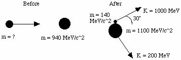

Find the mass of the incoming projectile.

A: Determine the gammas from the kinetic energy and masses given.

![\[Graphics:ps5gr93
.gif\]](../images/SR/problem_set_5/ps5gr93.gif)

    
    
![\[Graphics:ps5gr94.gif\]](../images/SR/problem_set_5/ps5gr94.gif)

![\[Graphics:ps5gr95
.gif\]](../images/SR/problem_set_5/ps5gr95.gif)

    
    
![\[Graphics:ps5gr96.gif\]](../images/SR/problem_set_5/ps5gr96.gif)

We can calculate the py momentum for the m140 particle.

![\[Graphics:ps5gr97
.gif\]](../images/SR/problem_set_5/ps5gr97.gif)

    
    
![\[Graphics:ps5gr98.gif\]](../images/SR/problem_set_5/ps5gr98.gif)

The py momentum for the m1100 must be equal and opposite, which allows a
calculation of the angle.

![\[Graphics:ps5gr99
.gif\]](../images/SR/problem_set_5/ps5gr99.gif)

    
    
![\[Graphics:ps5gr100.gif\]](../images/SR/problem_set_5/ps5gr100.gif)

Calculate the amount of momentum in the x direction.

![\[Graphics:ps5gr10
1.gif\]](../images/SR/problem_set_5/ps5gr101.gif)

    
    
![\[Graphics:ps5gr102.gif\]](../images/SR/problem_set_5/ps5gr102.gif)

![\[Graphics:ps5gr10
3.gif\]](../images/SR/problem_set_5/ps5gr103.gif)

    
    
![\[Graphics:ps5gr104.gif\]](../images/SR/problem_set_5/ps5gr104.gif)

![\[Graphics:ps5gr10
5.gif\]](../images/SR/problem_set_5/ps5gr105.gif)

    
    
![\[Graphics:ps5gr106.gif\]](../images/SR/problem_set_5/ps5gr106.gif)

All of this momentum is from the incoming projectile.

Calculate the total energy after minus m940 to get the energy of the incoming
projectile.

![\[Graphics:ps5gr10
7.gif\]](../images/SR/problem_set_5/ps5gr107.gif)

    
    
![\[Graphics:ps5gr108.gif\]](../images/SR/problem_set_5/ps5gr108.gif)

Calculate the mass of incoming projectile the usual way by looking at the
first term of the square root of the squared quaternion.

![\[Graphics:ps5gr10
9.gif\]](../images/SR/problem_set_5/ps5gr109.gif)

    
    
![\[Graphics:ps5gr110.gif\]](../images/SR/problem_set_5/ps5gr110.gif)

The mass of the incoming projectile is 588 MeV.

##  Initialization functions

There are a few tools required to solve problems in special relativity using
quaternions to characterize events in spacetime. The most basic are a round
value for c and gamma.

![\[Graphics:ps5gr11
1.gif\]](../images/SR/problem_set_5/ps5gr111.gif)

![\[Graphics:ps5gr11
2.gif\]](../images/SR/problem_set_5/ps5gr112.gif)

Define a function for quaternions using its matrix representation.

![\[Graphics:ps5gr11
3.gif\]](../images/SR/problem_set_5/ps5gr113.gif)

A quaternion L that transforms a quaternion (L q[**x**] = q[**x'**]) identical
to how the Lorentz transformation acts on 4- vectors  
(Lambda **x** = **x'**) should exist. These are described in detail in the
notebook "A different algebra for boosts." For boosts along the x axis with y
= z = 0, the general function for L is

![\[Graphics:ps5gr11
4.gif\]](../images/SR/problem_set_5/ps5gr114.gif)

Most of the problems here involve much simpler cases for L, where t or x is
zero, or t is equal to x.

If t = 0, then

![\[Graphics:ps5gr11
5.gif\]](../images/SR/problem_set_5/ps5gr115.gif)

    
    
![\[Graphics:ps5gr116.gif\]](../images/SR/problem_set_5/ps5gr116.gif)

If x = 0, then

![\[Graphics:ps5gr11
7.gif\]](../images/SR/problem_set_5/ps5gr117.gif)

    
    
![\[Graphics:ps5gr118.gif\]](../images/SR/problem_set_5/ps5gr118.gif)

If t = x, then

![\[Graphics:ps5gr11
9.gif\]](../images/SR/problem_set_5/ps5gr119.gif)

    
    
![\[Graphics:ps5gr120.gif\]](../images/SR/problem_set_5/ps5gr120.gif)

Note: this is for blueshifts. Redshifts have a plus instead of the minus.

The problems are from "Basic Concepts in Relativity" by Resnick and Halliday,
1992 by Macmillian Publishing, "Special Relativity" by A. P. French, 1966,
1968 by MIT, and Prof. M. Baranger of MIT.

#  8.033 Problem Set 6:  The Compton Effect and Threshold Collision Problems

##  French:  6-16 The Compton effect

Q:  The usual theory of the Compton effect considers a stationary free
electron being struck by a photon, resulting in a scattered photon of lower
energy.  Suppose that a photon (of energy E) has a head-on collision with a
_moving_ electron (of rest mass mo)  What initial velocity does the electron
have if the collision results in a photon recoiling straight backward with the
same energy E as the incident photon?

A:  There are the same number of particles before and after, traveling in
opposite directions with the same energy.  Define the before and after
quaternions.

Conserve momentum and solve for the speed.

The initial velocity of the electron is
`****`.

##  French:  6-17

Q:  A stream of very high energy photons (&gt;&gt;10 MeV) is fired at a block
of matter.   Show that the energy E of the photons scattered directly backward
is essentially independent of the energy of the incident photons.  What is the
value of E backward?

A:  Define the relevant quaternions.

Solve for the energy forward using energy conservation.

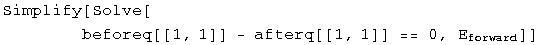

Solve for the energy back using momentum conservation and the previous result.

As beta approaches one, the value of E backward approaches 1/2 mc^2.  The
photons are most likely to collide with electrons of mass 511 MeV, so E
backward is approximately 255 MeV.

##  French:  6-18

Q:  (a) A photon of energy hv collides elastically with an electron at rest.
After the collision the energy of the photon is hv/2, and it travels in a
direction making an angle of 60 degrees with its original direction.  What is
the value of the frequency?  What sort of photon is it?  (b) A photon of
energy hv  collides with an excited atom at rest.  After the collision the
photon still has energy hv, but its direction has changed by 180 degrees.nbsp;
If the atom is in its ground state after the collision, what was its initial
excitation energy?

A:  (a) Define the before and after quaternions.

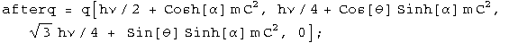

By conservation of energy and momentum, the beforeq minus the afterq should be
zero.

There are 3 equations (each term is equal to zero) and three unknowns (hv,
alpha, and theta).  Eliminate theta using a trig identity, then eliminate
alpha using a hyperbolic trig identity.  (It's not easy, but it does work).

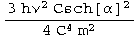

This identity equals 1, so it can be solved for hv.

Find the frequency by putting in the appropriate constants.

The frequency of the photon is 2.5 10^20 s^-1, a gamma ray.

(b) Define the before and after quaternions.

Solve for beta in terms of the ground state using momentum conservation.

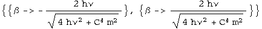

Solve for the excited state using energy conservation.

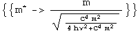

The excitation energy will be .

##  French:  6-19

Q:  A high-energy photon strikes and is scattered by a proton that is
initially stationary and completely free to recoil.  The proton is observed to
recoil at a 30 degree angle with a kinetic energy of 100 MeV.  (a) What was
the energy of the incident photon?  (b) What are the direction and energy of
the scattered photon?

A:  (a) Define the before and after quaternions.

By conservation of energy and momentum, the beforeq minus the afterq should be
zero.

There are 2 equations (each term is equal to zero) and 2 unknowns (E and
theta).  Eliminate the angle using a trig identity.

This identity equals 1, so it can be solved for hv.

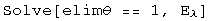

The incident photon is E + 100 MeV, or 329 MeV.

(b)  The energy of the scattered photon was calculated above at 229 MeV.  The
momentum in the conservation quaternion can be solved for theta.

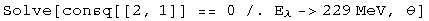

The photon scatters at an angle of 104
degrees

##  French: 7-2

Q:  An electron-positron pair can be produced by a gamma ray striking a
stationary electron:

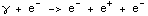

What is the minimum gamma ray energy that will make this process go?

A:  Define the before and after quaternions.

Set the square of the masses equal to each other and solve for E.

The minimum energy of the gamma ray is 2044 MeV.

##  Baranger:  Threshold KE

Q:  What is the threshold kinetic energy, in the Lab system, for the reaction:

The protons have mass M, the pions have mass m.  Set c = 1.

A:  K = E - M.  gamma = E/M = K/M + 1.  These relations can be used to define
the before and after quaternions.

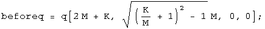

Set the masses equal to each other and solve for K.

The minimum kinetic energy required is K = (2m^2 + 4m M)/M.

##  French:  7-3

Q:  Suppose that a certain accelerator can give protons a kinetic energy of
200 GeV.  The rest mass mo of a proton is 0.938 GeV.  Calculate the largest
possible rest mass Mo of a particle X that could be produced by the impact of
one of these high-energy protons on a stationary proton in the following
process:

A:  K = E - M.  gamma = E/M = K/M + 1.  These relations can be used to define
the before and after quaternions.

Set the square of the masses equal to each other and solve for X.

The largest possible rest mass is 17.6 GeV for this accelerator.

##  Baranger:  Another threshold

Consider the reaction:

The target proton is at rest.  The rest mass of the proton is 940 MeV and the
pion is 140 MeV.  (a) Calculate the threshold kinetic energy of the incident
pion for this reaction.  (b) At threshold, calculate the velocities and
momenta of the final-state proton and the pions in the lab system.

A:  (a) Define the before and after quaternions.

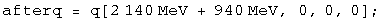

Set the square of the masses equal to each other and solve for K.

The threshold kinetic energy of the pion is 171 MeV.

(b) In the center-of-mass frame, all three particles are at rest.  In the Lab
frame, all three particles have the same velocity, but different momenta.
Calculate the energy before.

The gamma after is this energy divided by the mass.

Knowing gamma, both velocity and momenta can be calculated.

The particles have a relativistic velocity of 0.22, the pions have a momentum
pc = 31.7 MeV, and the protons have a momentum of pc= 213 MeV.

##  French: 7-6

Q:  The kinetic energy K of a system in the lab frame is related to the
kinetic energy K* in the center of mass frame in the nonrelativistic case by
the expression K = K* + MV^2/2, where M is the total mass of the system and V
is the velocity of the center of mass.  What is the analogous expression for
the relativistic case?  Show that it reduces to the above result if all speeds
are much less than c.

A:  Boost the quaternion for the center-of-mass frame to the lab, where Mo is
the sum of the rest masses of the particles in the system.

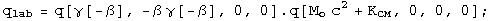

Energy is conserved, so `****`.

The kinetic energy in the lab frame is
.

Look at the nonrelativistic limit.

    

Note that  (K + Mo c^2) is the total mass of the system.  In the
nonrelativistic limit, the lab kinetic energy equals the kinetic energy within
the center of mass frame plus the kinetic energy of all the individual masses
in the center of mass frame.

##  Post ramble:  Initialization functions

There are a few tools required to solve problems in special relativity  using
quaternions to characterize events in spacetime.  The most basic are a round
value for c and gamma.

Define a function for quaternions using its matrix representation.

A quaternion L that transforms a quaternion (L q[**x**] = q[**x'**]) identical
to how the Lorentz transformation acts on 4-vectors  
(Lambda **x** = **x'**) should exist.  These are described in detail in the
notebook "A different algebra for boosts."  For boosts along the x axis with y
= z = 0, the general function for L is

Most of the problems here involve much simpler cases for L, where t or x is
zero, or t is equal to x.

If t = 0, then

If x = 0, then

If t = x, then

Note: this is for blueshifts.  Redshifts have a plus instead of the minus.

The problems are from "Basic Concepts in Relativity" by Resnick and Halliday,
1992 by Macmillian Publishing, "Special Relativity" by A. P. French, 1966,
1968 by MIT, and Prof. M. Baranger of MIT.

# Measure the difference between space-time events

Two stars go supernova while four kids watch.

There is a difference in time (dt).

There is a difference in space (dR).

Together they make a difference in space-time.

Each kid measures a different values for time and space.

Yet the walkers agree on something they can calculate called the interval.
This is the standard physics of Special Relativity, the physics of moving.

This site promotes a new proposal for gravity called Quaternion Gravity where
the kids above or below agree on a different value they calculate, 
space-times-time.  In this standard approach to gravity known as General 
Relativity, this is almost, but not quite true.

# SR + QG - *S*pecial *R*elativity and *Q*uaternion *G*ravity

This graphic says most of it...

[printable pdf](../pdfs/sr_and_qg.all.pdf) or [editable svg](../images/Gravity/sr_and_qg.all.svg)

# Quaternion gravity

Looking down or looking from below changes time and space measurements in opposite ways.

If one kid is at a different height in a gravity field to another, then
time measurements get smaller while spatial ones get bigger.  That is standard 
physics (general relativity, GR).

The Quaternion Gravity (QG) proposal says the space-times-time values are 
precisely the same.  With general relativity, this space-times-time is not 
mentioned, but it is almost - but not quite - the same.

Note: the numbers are **far too big** (off by 16 orders of magnitude, I just
didn't want to write _lots_ of zeros).

# Special relativity

Walking changes how one measures deadly supernovae.

As long as the kids move at a constant rate, special relativity comes into play.

Relativity is not an arbitrary change, but increadibly precise change.

And there is that interval that is *exactly* the same size.

Note: the numbers are **far too big** (off by 16 orders of magnitude, I just
didn't want to write _lots_ of zeros).

# Quaternion space-times-time invariance as gravity

[The linked essay](../Stuff/pdfs/space-times-time-invariance.pdf) was submitted to the 
_2015 Essays on Gravitation_ contest run by the [Gravity Research 
Foundation](http://www.gravityresearchfoundation.org/index.html).

By comparison with typical technical physics papers, an effort was made to
make the math simpler and have less jargon. It is seven pages long. It has five
equations in the body of the paper, and five more in the appendix.  There are
eleven references.  

The results are in... The winner was an essay by Gerard 't Hooft, a Nobel Prize
winner and all around smart guy.  My essay did not win second, or third, or
forth, or fifth, or honerable mention.  The contest gets plenty of submissions
from fringe physicists.  I suspect the word "quaternion" in the title and my
non-academic address meant the paper was quickly dismissed.

## Hard core stuff

I did learn something about my own efforts from reading the paper.  His paper
was about conformal symmetry breaking.  Roughly speaking, that has to do with
the scale of measurements in time and space.  Maxwell's theory for how light
works has conformal symmetry.  If we use light to measure things, then the
absolute size of _anything_ cannot be known.  Cool.  We can figure out relative
sizes and times.

This cannot be the entire story since we can figure out the the absolute sizes
of things.  He writes that something about quantum gravity is going to break 
conformal symmetry.  You would have to read the paper to struggle to see his 
point.

In my own effort, there are two numbers that enter in to make measurements 
different.  One is the relativistic velocity of an observer.  That is plain old 
special relativity.  The other is the dimensionless gravitational length of a 
graviational source.  It would be this value that breaks conformal symmetry in 
quaternion gravity.

#  Classical Electrodynamics

Maxwell speculated that someday quaternions would be useful in the analysis of
electromagnetism.  Hopefully after a 130 year wait, in this notebook we can
begin that process.  This approach relies on a judicious use of commutators
and anticommutators.

##  The Maxwell Equations

The Maxwell equations are formed from a combinations of commutators and
anticommutators of the differential operator and the electric and magnetic
fields E and B respectively (for isolated charges in a vacuum.

The first quaternion equation embodies the homogeneous Maxwell equations.  The
scalar term says that there are no magnetic monopoles.  The vector term is
Faraday's law.  The second quaternion equation is the source term.  The scalar
equation is Gauss' law.  The vector term is Ampere's law, with Maxwell's
correction.

##  The 4-Potential A

The electric and magnetic fields are often viewed as arising from the same
4-potential A.  These can also be expressed easily using quaternions.

The electric field E is the vector part of the anticommutator of the
conjugates of the differential operator and the 4-potential.  The magnetic
field B involves the commutator.

These forms can be directly placed into the Maxwell equations.

The homogeneous terms are formed from the sum of both orders of the commutator
and anticommutator.  The source terms arise from the difference of two
commutators and two anticommutators.

##  The Lorentz Force

The Lorentz force is generated similarly to the source term of the Maxwell
equations, but there a small game required to get the signs correct for the
4-force.

This is the covariant form of the Lorentz force.  The additional minus sign
required may be a convention handed down through the ages.

##  Conservation Laws

The continuity equation--conservation of charge--is formed by applying the
conjugate of the differential operator to the source terms of the Maxwell
equations.

The upper is zero, so the dot product of the E field and the current density
plus the rate of change of the charge density must equal zero.  That means
that charge is conserved.

Poynting's theorem for energy conservation is formed in a very similar way,
except that the conjugate of electric field is used instead of the conjugate
of the differential operator.

Additional vector identities are required before the final form is reached.

Use these equations to simplify to the following.

This is Poynting's equation.

##  Implications

The foundations of classical electrodynamics are the Maxwell equations, the
Lorentz force, and the conservation laws.  In this notebook, these basic
elements have been written as quaternion equations, exploiting the actions of
commutators and anticommutators.  There is an interesting link between the E
field and a differential operator for generating conservation laws.  More
importantly, the means to generate these equations using quaternion operators
has been displayed.  This approach looks independent from the usual method
which relies on an antisymmetric 2-rank field tensor and a U(1) connection.

#  Electromagnetic field gauges

A gauge is a measure of distance.  Gauges are often chosen to make solving a
particular problem easier.  A few are well known: the Coulomb gauge for
classical electromagnetism, the Lorenz gauge which makes electromagnetism look
like a simple harmonic oscillator, and the gauge invariant form which is used
in the Maxwell equations.  In all these cases, the E and B field is the same,
only the way it is measured is different.  In this notebook, these are all
generated using a differential quaternion operator and a quaternion
electromagnetic potential.

##  The Field Tensor F in Different Gauges

The anti-symmetric 2-rank electromagnetic field tensor F has 3 properties: its
trace is zero, it is antisymmetric, and it contains all the components of the
E and B fields.  The field used in deriving the Maxwell equations had the same
information written as a quaternion:

What makes this form gauge-invariant, so no matter what the choice of gauge
(involving dphi/dt and Del.A), the resulting equation is identical?  It is the
work of the zero!  Whatever the scalar field is in the first term of the
generator gets subtracted away in the second term.  

A mathematical aside: a friend of mine calls this a "conjugator".  The well-
known commutator involves commuting two terms and then subtracting them from
the starting terms.  In this case, the two terms were conjugated and then
subtracted from the original.  Any quaternion expression that gets acted on by
a conjugator results in a 0 scalar and a 3-vector.  An anti-conjugator does
the opposite task.  By adding together something with its conjugate, only the
scalar remains.  The conjugator will be used often here.

Generating the field tensor F in the Lorenz gauge starting from the gauge-
invariant from involves swapping the fields in the following way:

This looks more complicated than it is.  The first term of the generator
involves the scalar field only, (phi, 0), and the second term involves the
3-vector field only, (0, A).

The field tensor F in the Coulomb gauge is generated by subtracting away the
divergence of A, which explains why the second and third terms involve only A,
even though Del.A is zero :-)

The field tensor F in the temporal gauge is quite similar to the Coulomb
gauge, but some of the signs have changed to target the dphi/dt term.

What is the simplest expression that all of these generator share?  I call it
the field tensor F in the light gauge:

The light gauge is one sign different from the Lorenz gauge, but its generator
is a simple as it gets.

##  Implications

In the quaternion representation, the gauge is a scalar generated in such a
way as to not alter the 3-vector.  In a lists of gauges in graduate-level
quantum field theory written by Kaku, the light gauge did not make the list of
the top 6 gauges.  There is a reason for this.  Gauges are presented as a
choice for a physicist to make.  The most interesting gauges have to do with a
long-running popularity contest.  The relationship between gauges is guessed,
not written explicitly as was done here.  The term that did not make the cut
stands out.  Perhaps some of the technical issues in quantum field theory
might be tackled in this gauge using quaternions.

#  The Lorentz Force

The Lorentz force acts on a moving charge.  The covariant form of this law is,
where W is work and P is momentum:

In the classical case for a point charge, beta is zero and the E = k e/r^2, so
the Lorentz force simplifies to Coulomb's law.  Rewrite this in terms of the
potentials phi and A.

In this notebook, I will look for a quaternion equation that can generate this
covariant form of the Lorentz force in the Lorenz gauge.  By using potentials
and operators, it may be possible to create other laws like the Lorentz force,
in particular, one for gravity.

##  A Quaternion Equation for the Lorentz Force

The Lorentz force is composed of two parts.  First, there is the E and B
fields.  Generate those just as was done for the Maxwell equations

Another component is the 4-velocity

Multiplying these two terms together creates thirteen terms, only 5 of whom
belong to the Lorentz force.  That should not be surprising since a bit of
algebra was needed to select only the covariant terms that appear in the
Maxwell equations.  After some searching, I found the combination of terms
required to generate the Lorentz force.

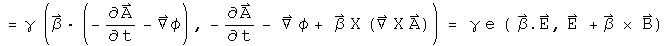

This combination of differential quaternion operator, quaternion potential and
quaternion 4-velocity generates the covariant form of the Lorentz operator in
the Lorenz gauge, minus a factor of the charge e which operates as a scalar
multiplier.

##  Implications

By writing the covariant form of the Lorentz force as an operator acting on a
potential, it may be possible to create other laws like the Lorentz force.
For point sources in the classical limit, these new laws must have the form of
Coulomb's law, F = k e e'/r^2.  An obvious candidate is Newton's law of
gravity, F = - G m m'/r^2.  This would require a different type of scalar
potential, one that always had the same sign.

#  The Maxwell Equations in the Light Gauge: QED?

What makes a theory non-classical?  Use an operational definition: a classical
approach neatly separates the scalar and vector terms of a quaternion.  Recall
how the electric field was defined (where {A, B} is the even or symmetric
product over 2, and [A, B] is the odd, antisymmetric product over two or cross
product).

The scalar information is explicitly discarded from the E field quaternion.
In this notebook, the scalar field that arises will be examined and shown to
be the field which gives rise to gauge symmetry.  The commutators and
anticommutators of this scalar and vector field do not alter the homogeneous
terms of the Maxwell equations, but may explain why light is a quantized,
transverse wave.

##  The E and B Fields, and the Gauge with No Name

In the previous notebook, the electric field was generated differently from
the magnetic field, since the scalar field was discard.  This time that will
not be done.

What is the name of the scalar field, d phi/dt - Del.A which looks like some
sort of gauge?  It is not the Lorenz or Landau gauge which has a plus sign
between the two.  It is none of the popular gauges: Coulomb (Del.A = 0), axial
(Az = 0), temporal (phi = 0), Feynman, unitary...

[special note: I am now testing the interpretation that this gauge constitutes
the gravitational field.  See the section on Einstein's Vision]  

The standard definition of a gauge starts with an arbitrary scalar function
psi.  The following substitutions do not effect the resulting equations.

This can be written as one quaternion transformation.

The goal here is to find an arbitrary scalar and a 3-vector that does the same
work as the scalar function psi.  Let

Look at how the gauge symmetry changes by taking its derivative.

This is the gauge with no name!  Call it the "light gauge".  That name was
chosen because if the rate of change in the scalar potential phi is equal to
the spatial change of the 3-vector potential A as should be the case for a
photon, the distance is zero.

##  The Maxwell Equations in the Light Gauge

The homogeneous terms of the Maxwell equations are formed from the sum of both
orders of the commutator and anticommutator.

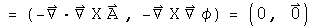

The source terms arise from of two commutators and two anticommutators.  In
the classical case discussed in the previous notebook, this involved a
difference.  Here a sum will be used because it generates a simpler
differential equation.

Notice how the scalar and vector parts have neatly partitioned themselves.
This is a wave equation, except that a sign is flipped.  Here is the equation
for a longitudinal wave like sound.

The second time derivative of w must be the same as Del^2 w.  This has a
solution which depends on sines and cosines (for simplicity, the details of
initial and boundary conditions are skipped, and the infinite sum has been
made finite).

Hit w with two time derivatives, and out comes -n^2 pi^2 w.  Take Del^2, and
that creates the same results.  Thus every value of n will satisfy the
longitudinal wave equation.

Now to find the solution for the sum of the second time derivative and Del^2.
One of the signs must be switched by doing some operation twice.  Sounds like
a job for i!  With quaternions, the square of a  normalized 3-vector equals
(-1, 0), and it is i if y = z = 0 .  The solution to Maxwell's equations in
the light gauge is

Hit this two time derivatives yields -n^2 pi^2 w.  Del^2 w has all of this and
the normalized phase factor V^2 = (-1, 0).  V acts like an imaginary phase
factor that rotates the spatial component.  The sum for any n is zero (the
details of the solution depend on the initial and boundary conditions).

##  Implications

The solution to the Maxwell equations in the light gauge is a superposition of
waves--each with a separate value of n--where the spatial part gets rotated by
the 3D analogue of i.  That is a quantized, transverse wave.  That's
fortunate, because light is a quantized transverse wave.  The equations were
generated by taking the classical Maxwell equations, and making them simpler.

#  The Stress Tensor of the Electromagnetic Field

I will outline a way to generate the terms of the symmetric 2-rank stress-
momentum tensor of an electromagnetic field using quaternions.  This method
may provide some insight into what information the stress tensor contains.

Any equation written with 4-vectors can be rewritten with quaternions.  A
straight translation of terms could probably be automated with a computer
program.  What is more interesting is when an equation is generated by the
product of operators acting on quaternion fields.  I have found that generator
equations often yield useful insights.

A tensor is a bookkeeping device designed to keep together elements that
transform in a similar way.  People can choose alternative bookkeeping
systems, so long as the tensor behaves the same way under transformations.
Using the terms as defined in "The classical theory of fields" by Landau and
Lifshitz, the antisymmetric 2-rank field tensor F is used to generate the
stress tensor T

I have a practical sense of an E field (the stuff that makes my hair stand on
end) and a B field (the invisible hand directing a compass), but have little
sense of the field tensor F, a particular combination of the other two.
Therefore, express the stress tensor T in terms of the E and B fields only:

Together, the energy density(W), Poynting's vector (Sa) and the Maxwell stress
tensor (m_ab) are all the components of the stress tensor of the
electromagnetic field.

##  Generating a Symmetric 2-Tensor Using Quaternions

How should one rationally go about to find a generator equation that creates
these terms instead of using the month-long hunt-and-peck technique actually
used?  Everything is symmetric, so use the symmetric product:

The fields E and B are kept separate except for the cross product in the
Poynting vector.  Individual directions of a field can be selected by using a
unit vector Ua:

The following double sum generates all the terms of the stress tensor:

The first line generates the energy density W, and part of the +0.5 delta(a,
b)(E^2 + B^2) term of the Maxwell stress tensor.  The rest of that tensor is
generated by the second line.  The third line creates the Poynting vector.
Using quaternions, the net sum of these terms ends up in the scalar.

Does the generator equation have the correct properties?  Switching the order
of Ua and Ub leaves T unchanged, so it is symmetric.  Check the trace, when Ua
= Ub

The trace equals zero, as it should.

The generator is composed of three parts that have different dependencies on
the unit vectors: those terms that involve Ua and Ub, those that involve Ua or
Ub, and those that involve neither.  These are the Maxwell stress tensor, the
Poynting vector and the energy density respectively.  Changing the basis
vectors Ua and Ub will effect these three components differently.

##  Implications

So what does the stress tensor represent?  It looks like every combination of
the 3-vectors E and B that avoids quadratics (like Ex^2) and over-counting
cross terms.  I like what I will call the "net" stress quaternion:

This has the same properties as an stress tensor.  Since the vector is zero,
it commutes with any other quaternion (this may be a reason it is so useful).
Switching x terms for y terms would flip the signs of the terms produced by
the Poynting vector as required, but not the others.  There are no terms of
the form Ex^2, which is equivalent to the statement that the trace of the
tensor is zero.

On a personal note, I never thought I would understand what a symmetric 2-rank
tensor was, even though I listen in on a discussion of the topic.  Yes, I
could nod along with the algebra, but without any sense of F, it felt hollow.
Now that I have a generator and a net quaternion expression, it looks quite
elegant and straightforward to me.

#  A Complete Inner Product Space with Dirac's Bracket Notation

A mathematical connection between the bracket notation of quantum mechanics
and quaternions is detailed.  It will be argued that quaternions have the
properties of a complete inner-product space (a Banach space for the field of
quaternions).  A central issue is the definition of the square of the norm.
In quantum mechanics:

In this notebook, the following assertion will be examined (* is the
conjugate, so the vector flips signs):

The inner-product of two quaternions is defined here as the transpose (or
conjugate) of the first quaternion multiplied by the second.  The inner
product of a function with itself is the norm.

##  The Positive Definite Norm of a Quaternion

The square of the norm of a quaternion can only be zero if every element is
zero, otherwise it must have a positive value.

This is the standard Euclidean norm for a real 4-dimensional vector space.

The Euclidean inner-product of two quaternions can take on any value, as is
the case in quantum mechanics for &lt;phi|theta&gt;.  The adjective
"Euclidean" is used to distinguish this product from the Grassman inner-
product which plays a central role in special relativity (see alternative
algebra for boosts).

##  Completeness

With the topology of a Euclidean norm for a real 4-dimensional vector space,
quaternions are complete.

Quaternions are complete in a manner required to form a Banach space if there
exists a neighborhood of any quaternion x such that there is a set of
quaternions y

for some fixed value of epsilon.

Construct such a neighborhood.

An infinite number of quaternions exist in the neighborhood.

Any polynomial equation with quaternion coefficients has a quaternion solution
in x (a proof done by Eilenberg and Niven in 1944, cited in Birkhoff and Mac
Lane's "A Survey of Modern Algebra.")

##  Identities and Inequalities

The following identities and inequalities emanate from the properties of a
Euclidean norm.  They are worked out for quaternions here in detail to
solidify the connection between the machinery of quantum mechanics and
quaternions.

The conjugate of the square of the norm equals the square of the norm of the
two terms reversed.

For quaternions,

These are identical, because the terms involving the cross produce will flip
signs when their order changes.

For products of squares of norms in quantum mechanics,

This is also the case for quaternions.

The triangle inequality in quantum mechanics:

For quaternions,

If the signs of each pair of component are the same, the two sides will be
equal.  If the signs are different (a t and a -t for example), then the cross
terms will cancel on the left hand side of the inequality, making it smaller
than the right hand side where terms never cancel because there are only
squared terms.

The Schwarz inequality in quantum mechanics is analogous to dot products and
cosines in Euclidean space.

Let a third wave function, chi, be the sum of these two with an arbitrary
parameter lambda.

The norm of chi will necessarily be greater than zero.

Choose the value for lambda that helps combine all the terms containing
lambda.

Multiply through by the denominator, separate the two resulting terms and do
some minor rearranging.

This is now the Schwarz inequality.

Another inequality:

Examine the square of the norm of the difference between two quaternions which
is necessarily equal to or greater than zero.

The cross terms can be put on the other side of inequality, changing the sign,
and leaving the sum of two norms behind.

The inequality holds.

The parallelogram law:

Test the quaternion norm

This is twice the square of the norms of the two separate components.

##  Implications

In the case for special relativity, it was noticed that by simply squaring a
quaternion, the resulting first term was the Lorentz invariant interval.  From
that solitary observation, the power of a mathematical field was harnessed to
solve a wide range of problems in special relativity.

In a similar fashion, it is hoped that because the product of a transpose of a
quaternion with a quaternion has the properties of a complete inner product
space, the power of the mathematical field of quaternions can be used to solve
a wide range of problems in quantum mechanics.  This is an important area for
further research.

Note: this goal is different from the one Stephen Adler sets out in
"Quaternionic Quantum Mechanics and Quantum Fields."  He tries to substitute
quaternions in the place of complex numbers in the standard Hilbert space
formulation of quantum mechanics.  The analytical properties of quaternions do
not play a critical role.  It is the properties of the Hilbert space over the
field of quaternions that is harnessed to solve problems.  It is my opinion
that since the product of a transpose of a quaternion with a quaternion
already has the properties of a norm in a Hilbert space, there is no need to
imbed quaternions again within another Hilbert space.  I like a close shave
with Occam's razor.

#  Multiplying Quaternions in Polar Coordinate Form

Any quaternion can be written in polar coordinate form, which involves a
scalar magnitude and angle, and a 3-vector I (which in some cases can be the
more familiar i).  

This representation can be useful due to the properties of the exponential
function, cosines and sines.

The absolute value of a quaternion is the square root of the norm, which is
the transpose of a quaternion multiplied by itself.

The angle is the arccosine of the ratio of the first component of a quaternion
over the norm.

The vector component is generated by normalizing the pure quaternion (the
final three terms) to the norm of the pure quaternion.

I^2 equals -1 just like i^2.  Let (0, V) = (q - q*)/2.

It should be possible to do Fourier analysis with quaternions, and to form a
Dirac delta function (or distribution).  That is a project for the future.
Those tools are necessary for solving problems in quantum mechanics.

##  New method for multiplying quaternion exponentials

Multiplying two exponentials is at the heart of modern analysis, whether one
works with Fourier transforms or Lie groups.  Given a Lie algebra of a Lie
group in a sufficiently small area the identity, the product of two
exponentials can be defined using the Campbell-Hausdorff formula:

This formula is not easy to use, and is only applicable in a small area around
unity. Quaternion analysis that relies on this formula would be very limited.

I have developed (perhaps for the first time) a simpler and general way to
express the product of two quaternion exponentials as the sum of two
components.  The product of two quaternions splits into a commuting and an
anti-commuting part.  The rules for multiplying commuting quaternions are
identical to those for complex numbers.  The anticommuting part needs to be
purely imaginary.  The Grassman product (q q') of two quaternion exponentials
and the Euclidean product (q* q') should both have these properties.  Together
these define the needs for the product of two quaternion exponentials.

I call these operators "conjugators" because they involve taking the conjugate
of the two elements.  Andrew Millard made the suggestion for the Grassman
product that unifies these approaches nicely.  What is happening here is that
both commuting and anticommuting parts scale themselves appropriately.  By
using an exponential that has pi/2 multiplied by a normalized quaternion, this
always has a zero scalar, as it must to accurately represent an anticommuting
part.

#  Commutators and the Uncertainty Principle

Commutators and the uncertainty principle are central to quantum mechanics.
Using quaternions in these roles has already been established by others
(Horwitz and Biedenharn, Annals of Physics, 157:432, 1984).  The first proof
of the uncertainty principle I saw relied solely on the properties of complex
numbers, not on physics!  In this notebook I will repeat that analysis,
showing how commutators and an uncertainty principle arise from the properties
of quaternions (or their subfield the complex numbers).

##  Commutators

Any quaternion can be written in a polar form.

This is identical to Euler's formula except that the imaginary unit vector i
is replaced by the normalized 3-vector.  The two are equivalent if j = k = 0.
Any quaternion could be the limit of the sum of an infinite number of other
quaternions expressed in a polar form.  I hope to show that such a quaternion
mathematically behaves like the wave function of quantum mechanics, even if
the notation is different.

To simplify things, use a normalized quaternion, so that q* q = 1.  Collect
the normalized 3-vector together with I = V/(V* V)^.5.

The angle s/(q* q)^.5 is a real number.  Any real number can be viewed as the
product of two other real numbers.  This seemingly irrelevant observation
lends much of the flexibility seen in quantum mechanics :-)  Here is the
rewrite of q.

The unit vector I could also be viewed as the product of two quaternions.For
classical quantum mechanics, this additional complication is unnecessary.  It
may be required for relativistic quantum mechanics, so this should be kept in
mind.

A point of clarification on notation:the same letter will be used 4 distinct
ways.There are operators, A hat, which act on a quaternion wave function by
multiplying by a quaternion, capital A.  If the operator A hat is an
observable, then it generates a real number, (a, 0), which commutes with all
quaternions, whatever their form. There is also a variable with respect to a
component of a quaternion, a_i, that can be used to form a differential
operator.

Define a linear operator A hat that multiplies q by the quaternion A.

If the operator A hat is an observable, then the quaternion  A is a real
number, (a, 0).  This will commute with any quaternion.  This equation is
functionally equivalent to an eigenvalue equation, with A hat as an
eigenvector of q and (a, 0) as the eigenvalue.  However, all of the components
of this equation are quaternions, not separate structures such as an operator
belonging to a group and a vector.  This might make a subtle but significant
difference for the mathematical structure of the theory, a point that will not
be investigated here.

Define a linear operator B hat that multiplies q by the quaternion B.  If B
hat is an observable,  then this operator can be defined in terms of the
scalar variable a.

Operators A and B are linear.

Calculate the commutator [A, B], which involves the scalar a and the
derivative with respect to a.

The commutator acting on a quaternion is equivalent to multiplying that
quaternion by the normalized 3-vector I.

##  The Uncertainty Principle

Use these operators to construct things that behave like averages (expectation
values) and standard deviations.

The scalar a--generated by the observable operator A hat acting on the
normalized q--can be calculated using the Euclidean product.

It is hard to shuffle quaternions or their operators around.  Real scalars
commute with any quaternion and are their own conjugates.  Operators that
generate such scalars can move around.  Look at ways to express the
expectation value of A.

Define a new operator A' based on A whose expectation value is always zero.

Define the square of the operator in a way designed to link up with the
standard deviation.

An identical set of tools can be defined for B.

In the section on bracket notation, the Schwarz inequality for quaternions was
shown.

The Schwarz inequality applies to quaternions, not quaternion operators.  If
the operators A' and B' are surrounded on both sides by q and q*, then they
will behave like scalars.

The left-hand side of the Schwarz inequality can be rearranged to form a
commutator.

The right-hand side of the Schwarz inequality can be rearranged to form the
square of the standard deviation operators.

Plug both of these back into the Schwarz inequality, stripping the primes and
the q's which appear on both sides along the way.

This is the uncertainty principle for complementary observable operators.

##  Connections to Standard Notation

This quaternion exercise can be mapped to the standard notation used in
physics

![commutator: \[A, B\] maps to \[A,
B\]](../images/QM/uncertainty_principle/s_gr_25.gif)

One subtlety to note is that a quaternion operator is anti-Hermitian only if
the scalar is zero.  This is probably the case for classical quantum
mechanics, but quantum field theory may require full quaternion operators.
The proof of the uncertainty principle shown here is independent of this
issue.  I do not yet understand the consequence of this point.

To get to the position-momentum uncertainty equation, make these specific maps

The product of the squares of the standard deviation for position and momentum
in the x-direction has a lower bound equal to half the expectation value of
the commutator of those operators.  The proof is in the structure of
quaternions.

##  Implications

There are many interpretations of the uncertainty principle.  I come away with
two strange observations.  First, the uncertainty principle is about
quaternions of the form q = Exp[a b I].  With this insight, one can see by
inspection that a plane wave Exp[((Et - P.X)/hbar I], or wave packets that are
superpositions of plane waves, will have four uncertainty relations, one for
the scalar Et and another three for the three-part scalar P.X.  This
perspective should be easy to generalize.

Second, the uncertainty principle and gravity are related to the same
mathematical properties.  This proof of the uncertainty relation involved the
Schwarz inequality.  It is fairly straightforward to convert that inequality
to the triangle inequality.  Finding geodesics with quaternions involves the
triangle inequality.  If a complete theory of gravity can be built from these
geodesics (it hasn't yet been done :-) then the inequalities may open
connections where none appeared before.

#  Unifying the Representation of Spin and Angular Momentum

I will show how to represent both integral and half-integral spin within the
same quaternion algebraic field.  This involves using quaternion
automorphisms.  First a sketch of why this might work will be provided.
Second, small rotations in a plane around two axes will be used to show how
the resulting vector points in an opposite way, depending on which involution
is used to construct the infinitesimal rotation.  Finally, a general identity
will be used to look at what happens under exchange of two quaternions in a
commutator.

##  Automorphism, Rotations, and Commutators

Quaternions are formed from the direct product of a scalar and a 3-vector.
Rotational operators that act on each of the 3 components of the 3-vector act
like integral angular momentum.  I will show that a rotation operator that
acts differently on two of the three components of the 3-vector acts like
half-integral spin.  What happens with the scalar is irrelevant to this
dimensional counting.  The same rotation matrix acting on the same quaternion
behaves differently depending directly on what involutions are involved.

Quaternions have 4 degrees of freedom.  If we want to represent quaternions
with automorphisms, 4 are required:  They are the identity automorphism, the
conjugate anti-automorphism, the first conjugate anti-automorphism, and the
second conjugate anti-automorphism:

where

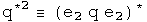

e1, e2, e3 are orthogonal basis vectors

The most important automorphism is the identity.  Life is stable around small
permutations of the identity:-) The conjugate flips the signs of the each
component in the 3-vector.  These two automorphisms, the identity and the
conjugate, treat the 3-vector as a unit.  The first and second conjugate flip
the signs of all terms but the first and second terms, respectively.
Therefore these operators act on only the two of the three components in the
3-vector.  By acting on only two of three components, a commutator will behave
differently.  This small difference in behavior inside a commutator is what
creates the ability to represent integral and half-integral spins.

##  Small Rotations

Small rotations about the origin will now be calculated.  These will then be
expressed in terms of the four automorphisms discussed above.

I will be following the approach used in J. J. Sakurai's book "Modern Quantum
Mechanics", chapter 3, making modifications necessary to accommodate
quaternions.  First, consider rotations about the origin in the z axis.
Define:

Two technical points.  First, Sakurai considered rotations around any point
along the z axis.  This analysis is confined to the z axis at the origin, a
significant but not unreasonable constraint.  Second, these rotations are
written with generalized coordinates instead of the very familiar and
comfortable x, y, z.  This extra effort will be useful when considering how
rotations are effected by curved spacetime.  This machinery is also necessary
to do quaternion analysis (please see that section, it's great :-)

There are similar rotations around the first and second axes at the origin;

Consider an infinitesimal rotation for these three rotation operators.  To
second order in theta,

Calculate the commutator of the first two infinitesimal rotation operators to
second order in theta:

To second order, the commutator of infinitesimal rotations of rotations about
the first two axes equals twice one rotation about the third axis given the
squared angle minus a zero rotation about an arbitrary axis (a fancy way to
say the identity). Now I want to write this result using anti-automorphic
involutions for the small rotation operators.

Nothing has changed.  Repeat this exercise one last time for the first
conjugate:

This points exactly the opposite way,even for an infinitesimal angle!

This is the kernel required to form a unified representation of integral and
half integral spin. Imagine adding up a series of these small rotations, say 2
pi of these.  No doubt the identity and conjugates will bring you back exactly
where you started.  The first and second conjugates in the commutator will
point in the opposite direction.  To get back on course will require another 2
pi, because the minus of a minus will generate a plus.

##  Automorphic Commutator Identities

This is a very specific example.  Is there a general identity behind this
work?  Here it is:

It is usually a good sign if a proposal gets more subtle by generalization :-)
In this case, the negative sign seen on the z axis for the first conjugate
commutator is due to the action of an additional first conjugate.  For the
first conjugate, the first term will have the correct sign after a 2 pi
journey, but the scalar, third and forth terms will point the opposite way.  A
similar, but not identical story applies for the second conjugate.

With the identity, we can see exactly what happens if q changes places with q'
with a commutator.  Notice, I stopped right at the commutator (not including
any additional conjugator).  In that case:

Under an exchange, the identity and conjugate commutators form a distinct
group from the commutators formed with the first and second conjugates.  The
behavior in a commutator under exchange of the identity automorphism and the
anti-automorphic conjugate are identical.  The first and second conjugates are
similar, but not identical.

There are also corresponding identities for the anti-commutator:

At this point, I don't know how to use them, but again, the identity and first
conjugates appear to behave differently that the first and second conjugates.

##  Implications

This is not a super-symmetric proposal.  For that work, there is a super-
partner particle for every currently detected particle.  At this time, not one
of those particles has been detected, a serious omission.

Three different operators had to be blended together to perform this feat:
commutators, conjugates and rotations.  These involve issue of even/oddness,
mirrors, and rotations.  In a commutator under exchange of two quaternions,
the identity and the conjugate behave in a united way, while the first and
second conjugates form a similar, but not identical set.  Because this is a
general quaternion identity of automorphisms, this should be very widely
applicable.

#  Deriving A Quaternion Analog to the Schr&ouml;dinger Equation

The Schr&ouml;dinger equation gives the kinetic energy plus the potential (a sum
also known as the Hamiltonian H) of the wave function psi, which contains all
the dynamical information about a system.  Psi is a scalar function with
complex values.

For the time-independent case, energy is written at the operator -i hbar d/dt,
and kinetic energy as the square of the momentum operator, i hbar Del, over
2m.  Given the potential V(0, X) and suitable boundary conditions, solving
this differential equation generates a wave function psi which contains all
the properties of the system.

In this section, the quaternion analog to the Schr&ouml;dinger equation will be
derived from first principles.  What is interesting are the constraint that
are required for the quaternion analog.  For example, there is a factor which
might serve to damp runaway terms.

##  The Quaternion Wave Function

The derivation starts from a curious place :-)  Write out classical angular
momentum with quaternions.

What makes this "classical" are the zeroes in the scalars.  Make these into
complete quaternions by bringing in time to go along with the space 3-vector
R, and E with the 3-vector P.

Define a dimensionless quaternion psi that is this product over h bar.

The scalar part of psi is also seen in plane wave solutions of quantum
mechanics.  The complicated 3-vector is a new animal, but notice it is
composed of all the parts seen in the scalar, just different permutations that
evaluate to 3-vectors.  One might argue that for completeness, all
combinations of E, t, R and P should be involved in psi, as is the case here.

Any quaternion can be expressed in polar form:

Express psi in polar form.  To make things simpler, assume that psi is
normalized, so |psi| = 1.  The 3-vector of psi is quite complicated, so define
one symbol to capture it:

Now rewrite psi in polar form with these simplifications:

This is what I call the quaternion wave function.  Unlike previous work with
quaternionic quantum mechanics (see S. Adler's book "Quaternionic Quantum
Mechanics"), I see no need to define a vector space with right-hand operator
multiplication.  As was shown in the section on bracket notation, the
Euclidean product of psi (psi* psi) will have all the properties required to
form a Hilbert space.  The advantage of keeping both operators and the wave
function as quaternions is that it will make sense to form an interacting
field directly using a product such as psi psi'.  That will not be done here.
Another advantage is that all the equations will necessarily be invertible.

##  Changes in the Quaternion Wave Function

We cannot derive the Schr&ouml;dinger equation per se, since that involves
Hermitian operators that acting on a complex vector space.  Instead, the
operators here will be anti-Hermitian quaternions acting on quaternions.
Still it will look very similar, down to the last h bar :-)  All that needs to
be done is to study how the quaternion wave function psi changes.  Make the
following assumptions.

1\. Energy and Momentum are conserved.

2.  Energy is evenly distributed in space 

3\. The system is isolated

4\. The position 3-vector X is in the same direction as the momentum 3-vector
P

The implications of this last assumption are not obvious but can be computed
directly by taking the appropriate derivative.  Here is a verbal explanation.
If energy and momentum are conserved, they will not change in time.  If the
position 3-vector which does change is always in the same direction as the
momentum 3-vector, then I will remain constant in time.  Since I is in the
direction of X, its curl will be zero.

This last constraint may initially appear too confining.  Contrast this with
the typical classical quantum mechanics.  In that case, there is an imaginary
factor i which contains no information about the system.  It is a mathematical
tool tossed in so that the equation has the correct properties.  With
quaternions, I is determined directly from E, t, P and X.  It must be richer
in information content.  This particular constraint is a reflection of that.

Now take the time derivative of psi.

The denominator must be at least 1, and can be greater that that.  It can
serve as a damper, a good thing to tame runaway terms.  Unfortunately, it also
makes solving explicitly for energy impossible unless Et - P.X equals zero.
Since the goal is to make a direct connection to the Schr&ouml;dinger equation,
make one final assumption:

5\. Et - R.P = 0

There are several important cases when this will be true.  In a vacuum, E and
P are zero.  If this is used to study photons, then t = |R| and E = |P|.  If
this number happens to be constant in time, then this equation will apply to
the wave front.

Now with these 5 assumptions in hand, energy can be defined with an operator.

The equivalence of the energy E and this operator is called the first
quantization.

Take the spatial derivative of psi using the under the same assumptions:

Square this operator.

The Hamiltonian equals the kinetic energy plus the potential energy.

Typographically, this looks very similar to the Schr&ouml;dinger equation.  Capital
I is a normalized 3-vector, and a very complicated one at that if you review
the assumptions that got us here.  phi is not a vector, but is a quaternion.
This give the equation more, not less, analytical power.  With all of the
constraints in place, I expect that this equation will behave exactly like the
Schr&ouml;dinger equation.  As the constraints are removed, this proposal becomes
richer.  There is a damper to quench runaway terms.  The 3-vector I becomes
quite the nightmare to deal with, but it should be possible, given we are
dealing with a topological algebraic field.

##  Implications

Any attempt to shift the meaning of an equation as central to modern physics
had first be able to regenerate all of its results.  I believe that the
quaternion analog to Schr&ouml;dinger equation under the listed constraints will do
the task.  These is an immense amount of work needed to see as the constraints
are relaxed, whether the quaternion differential equations will behave better.
My sense at this time is that first quaternion analysis as discussed earlier
must be made as mathematically solid as complex analysis.  At that point, it
will be worth pushing the envelope with this quaternion equation.  If it
stands on a foundation as robust as complex analysis, the profound problems
seen in quantum field theory stand a chance of fading away into the
background.

#  Introduction to Relativistic Quantum Mechanics

The relativistic quantum mechanic equation for a free particle is the Klein-
Gordon equation (h=c=1)

The Schr&ouml;dinger equation results from the non-relativistic limit of this
equation. In this section, the machinery of the Klein-Gordon equation will be
ported to quaternions.

##  The Wave Function

The wave function is the superposition of all possible states of a system. The
product of the conjugate of a wave function with another wave function forms a
complete inner product space. In the energy/momentum representation, this
would involve all possible energy levels and momenta.

This infinite sum of quaternions should contain all the information about a
system.  The quaternion wave function can be normalized.

The first quaternion is the conjugate or transpose of the second.  Since the
transpose of a quaternion wave function times a wave function creates a
Euclidean norm, this representation of wave functions as an infinite sum of
quaternions can form a complete, normed product space.

##  The Klein-Gordon Equation

The Klein-Gordon equation can be divided into two operators that act on the
wave function:  the D'Alembertian and the scalar m^2.  The quaternion operator
required to create the D'Alembertian, along with vector identities, has
already been worked out for the Maxwell equations in the Lorenz gauge.

The first term of the scalar, and the second term of the vector, are both
equal to zero.  What is left is the D'Alembertian operator acting on the
quaternion wave function.

To generate the scalar multiplier m^2, substitute En and Pn for the operators
d/dt and del respectively, and repeat.  Since the structure of the operator is
identical to the previous one, instead of the D'Alembertian times the wave
function, there is En^2-Pn^2.  The sum of all these terms becomes m^2.

Set the sum of these two operators equal to zero to form the Klein-Gordon
equation.

It takes some skilled staring to assure that this equation contains the Klein-
Gordon equation along with vector identities.

##  Connection to the Maxwell Equations

If m=0, the quaternion operators of the Klein-Gordon equation simplifies to
the operators used to generate the Maxwell equations in the Lorenz gauge.  In
the homogeneous case, the same operator acting on two different quaternions
equals the same result.  This implies that

Under this interpretation, a nonzero mass changes the wave equation into a
simple harmonic oscillator.  The simple relationship between the quaternion
potential and the wave function may hold for the nonhomogeneous case as well.

##  Implications

The Klein-Gordon equation is customarily viewed as a scalar equation (due to
the scalar D'Alembertian operator) and the Maxwell equations are a vector
equation (due to the potential four vector).  In this notebook, the quaternion
operator that generated the Maxwell equations was used to generate the Klein-
Gordon equation.  This also created several vector identities which are
usually not mentioned in this context.  A quaternion differential equation is
needed to perform the work of the Dirac equation, but since quaternion
operators are a field, an operator that does the task must exist.

# An Introduction to the Standard Model

The Standard Model of physics was developed in the 1970's to explain the ~270
different types of particles seen in colliders (a general introduction is
available on [wikipedia](http://en.wikipedia.org/wiki/Standard_Model), and a
one page [cheat
sheet](http://en.wikipedia.org/wiki/Image:Particle_chart.jpg)). The part we
need to understand is the groups that describe the symmetry of the standard
model.

What is a group? A group has an identity, an inverse, and a binary operation
(multiplication). One member of the group times another member of the group
generates yet another member of the same group. This is a case where the math
name is accurate: once in a group, you are always in a group.

The standard model has three continuous groups that characterize three of the
four known fundamental forces of nature. The simplest group is known as U(1)
and governs electromagnetism via the photon. The reason there is one photon is
that the Lie algebra u(1) - note that was a small u! - has one degree of
freedom. This group is called the [ unary
group](http://en.wikipedia.org/wiki/Unitary_group), complex numbers with a
norm of 1. The members of this group commute, so it does not matter the order
things are written in. Quaternions have this property only when all point in
the same or opposite directions, which is the case for when using one
quaternion times itself.

The continuous group SU(2) rules the weak force, the stuff driving radioactive
decay. Mathematically this is call unitary quaternions, quaternions with a
norm of 1. The Lie algebra used to generate this group has three degrees of
freedom. That is why the weak force is mediated by three particles, the W+,
W-, and the Z.

The group SU(3) is for the strong force whose residual interactions keep
nuclei together. Its Lie algebra has eight members, and there are eight
gluons.

## Animations of Groups

Start with a simple picture, layer pictures together, and we will be able to
see what the standard model of particle physics looks like.

## S0 - So simple!

This is the symmetry of +/-R, one number.  What was  
up/down | What is | What can be  
---|---|---  
 |
 |
  
 |
 |
  
What was  
near/far | What was  
left/right | What can be  
that is  
This is (-1, 0, 0, 0) and (+1, 0, 0, 0). It sits in the center, as quaternions
of the form (n, 0, 0, 0) like to do.

## [S1 - The Circle](http://www.theworld.com/%7Esweetser/quaternions/quantum
/standard_model/S1)

Now we let the sum of squares of 2 numbers equal 1. This creates a circle.
What was  
up/down | What is | What can be  
---|---|---  
 |
 |
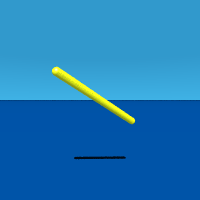  
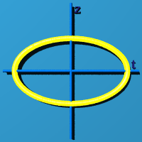 |
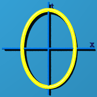 |
  
What was  
near/far | What was  
left/right | What can be  
that is  
The circle could have any orientation in 3D space. The program choose one at
random.

## S2 - Slice of an Expanding/Contracting Sphere

The sum of squares of 3 numbers equal 1. A quaternion has four numbers. One
approach to representing S2 is to set t=0. You get the standard sphere, but
only at the instant of t=0. Blink!  What was  
up/down | What is | What can be  
---|---|---  
 |
 |
  
 |
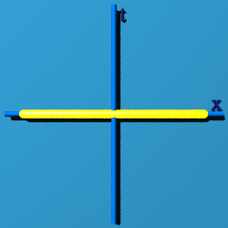 |
  
What was  
near/far | What was  
left/right | What can be  
that is  
That looks like a typical sphere, except it doesn't last long. Three straight
lines appear in the "what was" graph because time is fixed.

Another way to represent S2 is to set x=0. Then you have an edge view of an
expanding circle.

What was  
up/down | What is | What can be  
---|---|---  
 |
 |
  
 |
 |
  
What was  
near/far | What was  
left/right | What can be  
that is  
Only the "what was left/right" graph has a fixed, straight line graph, because
x=0.

If z=0, at least you can see the "circleness"

What was  
up/down | What is | What can be  
---|---|---  
 |
 |
  
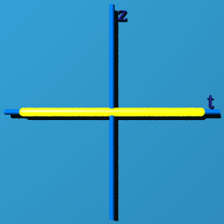 |
 |
  
What was  
near/far | What was  
left/right | What can be  
that is  
In the "what was" graphs, it is easy to spot which dimension is set to zero:
it is the straight line.

## S3 - A Quaternion Sphere

Now use all 4 terms, and fill in the sphere in both time and space!  What was  
up/down | What is | What can be  
---|---|---  
 |
 |
  
 |
 |
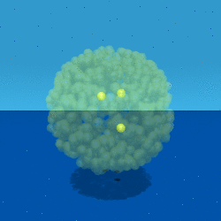  
What was  
near/far | What was  
left/right | What can be  
that is  
  
## SU(2) - Like S2, the Partial Sphere

The graphs of S2 were all paper thin or fleeting. They do not "fill up"
spacetime. The next graph, generated by putting random quaternions into the
expression exp(q-q*), fills up spacetime.  What was  
up/down | What is | What can be  
---|---|---  
 |
 |
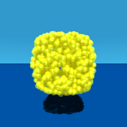  
 |
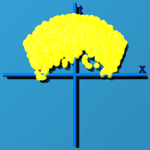 |
  
What was  
near/far | What was  
left/right | What can be  
that is  
  
Although more of spacetime appears filled, only places were time is greater
than zero have a chance to have an event.

## U(1)xSU(2) - Like the Complete Quaternion Sphere S3

SU(2) has only three of the four degrees of freedom available to a quaternion.
There is no way to fill up all of spacetime with just SU(2). Now fill
spacetime in by multiplying by itself, or q/|q| exp(q-q*)  What was  
up/down | What is | What can be  
---|---|---  
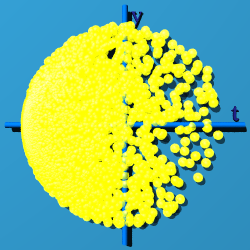 |
 |
  
 |
 |
  
What was  
near/far | What was  
left/right | What can be  
that is  
  
Most of the points cluster on the negative side of the time line.

## U(1)xSU(2)xSU(3) - The Standard Model

The question is how to generate SU(3)? It has a Lie algebra su(3) that has
eight elements. Based on work done on quaternion quantum mechanics, it is
clear I need to work with the conjugate of one quaternion times another, what
I call the Euclidean product, because q* q generates the norm of a quaternion
q, (t2 \+ x2 \+ y2 \+ z2, 0, 0, 0). If we have 2 different quaternions, q and
q', we can write them as q* q' as U(1)xSU(2): (q/|q| exp(q-q*))* (q'/|q'|
exp(q'-q'*)). Here is its animation:  What was  
up/down | What is | What can be  
---|---|---  
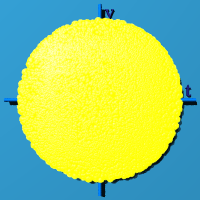 |
 |
  
 |
 |
  
What was  
near/far | What was  
left/right | What can be  
that is  
  
Notice how all of spacetime is filled evenly with events. A product of two
quaternions that uses a conjugate different from a standard product because
multiplication is no longer associative ((a b)*c does not equal a* (b c)). The
norms are preserved, so the norm will remain 1. Eight independent number are
used to make something with a norm of one. The identity is 1, and all elements
have an inverse under what I call "Euclidean multiplication", q* q'. Based on
the animation, the group is compact and simply connected. All of this traits
contribute to the conclusion that the symmetry of the standard model can be
represented by quaternions in this way.

It would be great to include gravity, which is all about how measurements
change as one moves around a differentiable 4D manifold. Include the metric as
part of the calculation of a quaternion product.

  
The group Diff(M) is all diffeomorphisms of a compact smooth manifold. It is
at the heart of general relativity. One can imagine this spacetime filling
sphere on any compact smooth manifold.

What happens if q=q'? That is shown below:

What was  
up/down | What is | What can be  
---|---|---  
 |
 |
  
 |
 |
  
What was  
near/far | What was  
left/right | What can be  
that is  
The standard model is about the group symmetry of the quaternion
multiplication identity in spacetime.

OK, but what does that mean? Here is my take. Observers sit at here-now in
spacetime, or numerically at (0, 0, 0, 0). An observer sees something out
there, and tries to characterize the "thingie". The basic bit of information
it can classify is an event. Whatever set of events is collected, they are all
tied up in describing this one thingie out there. Every event contributes to
the description of the thingie, and so makes a group. The multiplicative
identity of a quaternion, (1, 0, 0, 0) is a way to represent the thingie.
Almost none of the events map to (1, 0, 0, 0). The events are scattered all
around spacetime. U(1)xSU(2)xSU(3) is the way to cow-rope all the events and
bring them home, while remaining part of the same group, the one thing being
observed.

#  Time Reversal Transformations for Intervals

Classical Time Reversal  
Relativistic Time Reversal  
Implications

The following transformation R for quaternions reverses time:

The quaternion R exist because quaternions are a field.  

R will equal  (-t, X )(t, .  The inverse of
quaternion is the transpose over the square of the norm, which is the scalar
term of the transpose of a quaternion times itself.

For any given time, R can be defined based on the above.

##  Classical Time Reversal

Examine the form of the quaternion which reverses time under two conditions.
A interval normalized to the interval takes the form (1, beta), a scalar one
and a 3-vector relativistic velocity beta .  In the classical region,
beta&lt;&lt;&lt;1.  Calculate R in this limit to one order of magnitude in
beta.

  The operator R is almost the negative identity, but the vector is non-zero,
so it would not commute.

##  Relativistic Time Reversal

For a relativistic interval involving one axis, the interval could be
characterized by the following:

Find out what quaternion is required to reverse time for this relativistic
interval to first order in epsilon.

This approaches q[-e/T, 1, 0, 0], almost a pure vector, a result distinct from
the classical case.

##  Implications

In special relativity, the interval between events is considered to be 4
vector are operated on by elements of the Lorentz group.  The element of this
group that reverses time has along its diagonal  
{-1, 1, 1, 1}, zeroes elsewhere.  There is no dependence on relative velocity.
Therefore special relativity predicts the operation of time reversal should be
indistinguishable for classical and relativistic intervals.  Yet classically,
time reversal appears to involve entropy, and relativistically, time reversal
involves antiparticles.

In this notebook, a time reversal quaternion has been derived and shown to
work.  Time reversal for classical and relativistic intervals have distinct
limits, but these transformations have not yet been tied explicitly to the
laws of physics.

#  Buttons
Buttons...

|  |  |  |
| -- | -- | -- |
| [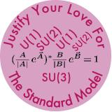](info.html#justify) |  | |

  
Promote the Doing Physics with Quaternions Project, and look cool :-)  
  
These 5 buttons represent a visual presentation of some of the key ideas
behind my efforts to unify gravity and electromagnetism.  
  
 Fine cuisine depends on starting
with the best ingredients. Great physics depends on using new powerful math.
An event in spacetime has one dimension for time and three dimensions for
space, the most powerful tool would be a generalized number that can be added,
subtracted, multiplied and divided, but has four parts to it. There is one
such number called a quaternion, shown here. Time is t, and x, y, and z are the values the event may have in the three directions, i, j, and k. Quaternions are the mathematical foundation for all my efforts in theoretical physics.  

  A person standing on a
scale in a closed box could not tell the difference between the box sitting on
the surface of the Earth or the box accelerating at the same rate as the
Earth's gravity in a rocket ship as depicted here. Einstein called this the
equivalence principle, but it only applied to mass, not charge. The General
Equivalence Principle extends this idea of fooling observers to cover any
measurement. The box mathematically means "all the changes in time and space."
One can ask, what are all the possible changes in the direction rulers (I) and
the potential (A), or Box IA? The usual answer is the rulers are fixed and it
is the potential that changes, I Box A. However, the answer could also be the
potential is the same, but the rulers are changing, A Box I.  

 A unified field theory describes light
and gravity in the same equation. Einstein spent the last half of his life
looking for one, but did not succeed. The equation on the right reads in
mathlish, "The change in the change in the potential equals some constants
times the source." The stars are involved in games with plus and minus signs.
It takes work to see that the signs are correct. A unified field theory must
be able to describe all forms of change. The graphic tries to depict this:
changes in a square grid, changes moving straight out from the center, changes
that are circular ripples, and changes that are spirals. The graphic does not
show changes in time or the third dimension. It is only a graphic after all.  

 The standard model
is used to quantify why there are this many of that kind of subatomic
particle, and that many of those particles. A vast amount of exquisite detail
is explained. No one has justified why the standard model should be this way.
The standard model is constructed from what are called symmetry groups which
go by the names U(1), SU(2), and SU(3). The quaternion unified field theory
can be written in a way that lines up perfectly with two of these symmetries.
The connection to the SU(3) symmetry is unclear now, although technically it
has the right number of fingers and toes (eight in this case).  

 Newton's law of gravity works to explain
the rotation of the Moon around the Earth. Newton's law of gravity works to
explain the velocity of stars near the center of a galaxy, but fails to
explain why stars further from the center maintain that same velocity. One
hypothesis is called dark matter, stuff that cannot be seen but makes the
velocities work out just so. All physics laws must respect relativity and the
rules of calculus. These rules create the second term which has a constant
velocity and accurately describes the distribution of mass with respect to the
radius, no dark matter required.

 

# The Frame for the Future  
  
  
  
  * Wheel base 40"
  * Seat height 25"
  * Crank height 21"
  * Front wheel 16"
  * Rear Wheel 26"
  * Weight 30 lb.
  
This machine has over two thousand Boston city miles on it (and a few on the coast : ) Designed by Doug and constructed by Bill Darby. Not yet available in stores.  
  
## Long term goals

  * Target people at health clubs who already expressed a preference for the Comfort Cruiser riding position.
  * License patent to a large scale bicycle manufacturer, becoming the first entry into the national retail bicycle market (12 million units per year).
  * Continue research in making bicycles a viable choice in personal transpiration. 

 

# Lindy Hop

A joyous partner dance developed in New York City in the 1930's  
  
|  |  | 
| -- | -- |
|  | [Tony &amp; Aurelie Tye](http://www.HopToTheBeat.com/) |  

  
Darra, my extra-special dance partner, strutting, as she does so well!
  
Tony and Aurelie Tye, my dance teachers/cool friends.  

## Swing dancing theory

I have been doing swing dancing, or more specifically, the Lindy Hop, since the
mid-1990s.  I like to say there are three kinds of dancing.  The Lindy Hop is
playful sexuality.  West Coast Swing is propositional sexuality.  Salsa they
just do it on the floor.  Here is a video I made, titled "Swing Dancing Theory"
(24 minutes).

<iframe width="420" height="315"
src="https://www.youtube.com/embed/fQRLYfI1CDM" frameborder="0"
allowfullscreen></iframe>
  
  
  

# Personal Sketch of Doug Sweetser

My father went to Harvard University and Harvard Law School as his father did. He read voraciously. My mother went to Boston University getting a degree in Physical Therapy. They had one poor date in a canoe. While in Europe, my father tracked down my mother, and with nearly all the details lost to me, wooed her accross the pond.

I was born in Bronxville, New York, in 1962. We had both a stay at home mom and live in maid. My father worked at the New York Times a corporate lawyer. When I was five, he got a job at the Minneapolis Star and Tribune. The family moved into a house with almost 10 acres of land. I went to a The Blake School an all boys private school, until it became the plural Blake Schools and coed in seventh grade (great timing). My education continued at M.I.T. where I got degrees in Biology and Chemical engineering. Note: I did not get a degree in either mathematics or physics.

I am a solid core nerd. A hard core nerd has strong opinions about all the versions of Star Trek. A solid core nerd does not watch the show because the science is so impossibly wrong. In Star Trek, space is treated like Manhattan: go to the next stop, and a wonderfully different collection of people are there. One can easy go from Wall Street Suits, to Chinatown, to Uptown, to Harlem, Spanish or otherwise. Space in the Universe is really just space, with distances too far for people to travel.

# Professional sketch of Doug Sweetser

## Education
MIT, 1980-1984 SB: Biology SB: Chemical Engineering GPA: 4.0 (I should point 
out MIT is on a 5.0, so 4.0 sounds great)

MCD Biology - University of Colorado Boulder, 1987-1989 Ph.D. Program Left on 
own accord.

Math Department - University of Indiana, Bloomington, 1990 Graduate level 
courses Left on own accord.

Brandeis, 2000-2002 MS: Computer Software Engineering

##Work Experience

### Biology

My first job was as a lab tech at the newly opened Whitehead Institute for 
Biomedical Research. On the first week on the job, Prof. Rick Young showed me 
how to clone the first genes ever from the Mycobacteria that causes leprosy.  
The work was featured on a NOVA documentary. Twelve technical papers were 
written in a three year paper in the most important journals in biology, 
including Nature, Cell, and the Proceedings of the National Academy of Sciences 
(PNAS).

Worked as a lab tech for Jac Nickoloff at the Harvard School of Public Health 
(8 years). My heart was elsewhere (which caused problems on the job).

### Computers

The first Internet Service Provider (ISP) was started in Brookline, MA in 
1989. They were my first ISP. After leaving the biology business, I worked the 
phones in a support role. I also helped maintain the billing software written 
in Perl. The shifting landscape of ISPs lead then to downsize in 2003.

I was the 9th employee of Black Duck Software. They initially wanted to help 
companies understand the licensing requirements behind open source software. I 
was hired as a "spider", crawling the Internet and harvesting open source 
software for our knowledgebase.

## Physics

### Initial interest

In the Christmas of 1988, both my mother and sister independently bought the 
book: "A Brief History of Time" by Stephen Hawking. I view that as my "born 
again" moment, one based on physics, not the Bible. For a month long period, my 
mind kept rearranging information, sure that everything somehow made sense. I 
was aware I was babbling - saying words that are part of the lexicon of 
physics, but would not make sense to an actual physicist. I decide to keep a 
day job, but work study physics in the background.

Boston was the perfect city in the 1990s to study physics on the side. I took a 
Harvard Extension class on Special Relativity taught by Edwin F. Taylor as he 
was writing the book "Spacetime Physics" with Johnathon Wheeler. Taylor would 
bring in a new chapter from Copy Copy, and we were assigned to critique it.  
Thus became my respectful skeptical analysis of physics. I decide to keep a day 
job, but work study physics in the background.

I was able to show some of my earliest efforts to a famous physicist who worked 
at MIT. He said it was "interesting, but not very interesting". The reason was 
I did not have a theory, a means to make many calculations. At the time, all I 
had were a few math widgets.

### First work on quaternions

In the struggle to find a theory, I held a small contest on a moderated 
newsgroup, sci.physics.research in 1997. I asked readers to provide a brief 
definition of time. It had to be about math or physics, not philosophy, and 
needed to be two sentences or less. In one math book, I recalled some odd sort 
of number that was like a scalar and a vector. The contest motivated me to 
reread that passage, then go to an old-fashion library and read up about 
quaternions. This was the first equation I saw, the squaring of a quaternion:

To this day, this makes me excited because the first term is at the core of 
special relativity as taught to me by Edwin F. Taylor. It is there, for free.  
That cannot be an accident. That observation drove me to purchase the domain 
quaternions.com.

### Major failure at a unified field theory

I struggled to come up with a way to deal with gravity using only quaternions.  
One lesson from general relativity is that a theory of gravity must be a metric 
theory - a theory where the calculation of distance depends on where one 
happens to be in a gravitational field. Measuring distance is a symmetric 
operation, meaning there is no handed to doing the work. Quaternions do have a 
handedness. There is no way around that. So I reinvented hypercomplex numbers.  
Those have all the same multiplication rules as quaternions, but no minus signs 
anywhere. As such, hypercomplex numbers could be used to characterize a metric.

I confess to having pride in the proposal, enough to print up t-shirts. It was 
difficult to find a professional to review the body of work. I began blogging 
on Science20.com. There I found a few technically skilled readers. When I 
finally got to presenting what I called the GEM proposal, several readers 
objected to the work. It took a little over a month for me to really see the 
proposal like they did. The flaw was deadly. A Lagrangian constructed from 
quaternions will not change under a rotation. It will therefore conserve 
angular momentum. A Lagrangian constructed from hypercomplex numbers will 
change under a rotation. It will not conserve angular momentum. Kepler's law of 
equal area in equal time is a statement that gravity conserves angular 
momentum. Thus a proposal for gravity using hypercomplex number in the 
Lagrangian is wrong. End of story.

### Current research

Web sites:

* [Quaternions.com](http://quaternions.com), the mothership of my private
  research project.

* [Numbers 101](http://bit.ly/vp-101), a visual introduction to space-time
  numbers, aka quaternions.

* [Measurement 101](http://bit.ly/vp-QG), a site dedicated to my new proposal 
for quaternion gravity

* [VisualPhysics.org](http://visualphysics.org) has a collection of analytic 
  animations generated with a user-hostile set of tools I wrote.

#### Quaternion space-times-time invariance as gravity

I went back to the equation that sparked my initial interest in quaternions:

The first term is called the interval. But what are the next three called? 
Physics doesn't have a name. That is a problem because the first term is one of 
the most important in physics because it is at the heart of special relativity.  
I came up with a reasonable name for the three amigos: space-times-time. I 
asked a simple question: what if space-times-time was invariant, then what sort 
of physics results? That could be gravity, but a very different theory because 
it is not a field theory. There would be no graviton, nor any quantum gravity 
theory. The idea had enough promise that I submitted an 1500 word paper to the 
2015 Gravitation Research Foundation Essay on Gravity.  We will see if they 
like it.

# Thanks to ...

To be productive in my many endeavors, I've needed plenty of help and
encouragement, so I wish to acknowledge it explicitly.

## The Physics

Prof. Michel Baranger, MIT. It was great fun recreating special relativity
while taking special relativity.

Prof. Eric Carlson, Harvard.

Prof. Mitchell Golden, (formerly of) Harvard. The discussions while you were
in gentle academia instead of the brutal real world of software designed
increased my understanding significantly.

Prof. Alan Guth, MIT. We talked for a total of five minutes on two occasions,
but each time that gave me directions for months.

Prof. Lisa Randall, MIT. Nothing quite as useful as a harsh critic, because
nature is far tougher.

Dr. Vincent Robert, U Chicago. This stuff is still moving forward. I needed
that special French translation, even if the artwork still doesn't make any
sense.

Dr. Paul Romanelli. You tried to listen in the early days, and that mattered a
lot.

Prof. Guido Sandri, BU. I hope you find this page to be FANTASTIC. Prof.
Sandri is an Italian antidepressant.

Prof. Edwin F. Taylor, MIT, the world's best teacher of relativity.

## Pop Science

Amanda Annis, clay sculptures. OK, there are no clay sculptures included in
Pop Science, but thinking more that 2D is one of the key themes.

Paul Fata, wandering world artist. I love cheap art! (I also like some of the
expensive stuff to, but I never actually buy it : )

Jennifer Hall, [Do While Studios](http://www.dowhile.org/). I hope to build a
chunk of software using some of the math in here that can live up to the
standard of Do While.

Maureen Metzger, Mass. College of Art. The critiques in "Collage and
Beyond..." helped mature the works presented. True to the title, we did go
beyond...

Meredyth Moses, Clark Gallery. The comments on the portfolio were appreciated.

Mo Ramage, artist to the core.

Joan Shafran, Do While Studios. "Creative Seeing" was the course that got me
seeing creatively as a young adult my key advantage in attacking the tough
issues in physics.

Lynn Tallo. A core supporter of this small project!

John Yager, formerly of Creative Framing of Chestnut Hill. The work looks
professional beyond the skills of its creator. The painting consultations made
all the difference.

## The Bike

Bob Barrett, the big man who inspired the project, and tolerated the design
process as it consumed the dining room.

Bill Darby, Special Purpose Vehicles. Even more important than all the welding
were your comments on what would make a workable machine. And it's still
working today.

Jeffrey Ferris, Ferris Wheels. The class in bike repair got me thinking about
the simple mechanical beauty of the bicycle.

Prof. Harold Washburn, Harvard. Now I think that "market research" is a useful
enterprise. I just wish I had capital (a frequent lament : )

## Lindy Hop

Darra Garrison. Someday, you may get to stomp at the Savoy. That would make a
cool road trip!

Tony and Aurelie Tye, Hop to the Beat Dance Studios. You cats know how to
dance.

## Friends...

Prof. Leonard Burrello. It was a humbling year for me in Indiana, but I kept
my core vision.

Dr. Steve Chervitz, Stanford. The best work should be unrecognizable for a
long time, but hopefully not too long.

Dr. Win Ping Deng. Remember to keep drawing. It can help your science and
soul.

The Guild clan. Let's do the 4th of July together, again!

Dr. Derek Kane. Could you check the math? How about the metaphysics?
?Punctuation?

Doug Kuller. The physics here will NOT help with ping pong. It might have
helped with 8.012, but I doubt it.

Dr. Don Olivier. It is sometimes difficult for someone how is an approximation
to a mathematician to deal with someone who is a mathematician, but that just
makes my approximation better in the long run.

Michael Phillips. Hope I can get some respect for my work like you do at the
Wall Street Journal. Sorry, so far there is no economic angle for my various
projects, otherwise I'd give you the inside scoop. (I hope you have finally
"awakened to the fas cination that is Harvard.")

Dean & Leslie Potashner. We will get on Letterman so day!

Prof. Richard Young, MIT. I've kept the "whatever it takes (spend freely) to
answer the question" attitude with me while doing my own science and art
projects. Peer review the results.

## ...and family*

Darra Garrison.

Arthur, Cindy, Teddy, Grace, Asa (and...?) Sweetser.

Lydia, Billy, Allie, and Nickolaus Gollner.

Adrienne Sweetser.

Grandma may not be surfing to the site soon, but I informed her of the web on
her 94th birthday.

And last, but most, Joan Sweetser.

Love is the creation and reflection of Life. I thank you for all of your love.

## Web sites

* [Quaternions.com](http://quaternions.com), the mothership of my private
  research project.

* [Numbers 101](http://bit.ly/vp-101), a visual introduction to space-time
  numbers, aka quaternions.

* [Measurement 101](http://bit.ly/vp-QG), a site dedicated to my new proposal
for quaternion gravity

* [VisualPhysics.org](http://visualphysics.org) has a collection of analytic
  animations generated with a user-hostile set of tools I wrote.

# Contact and tip info

Doug Sweetser
email: sweetser@alum.mit.edu
twitter: visualphysics

If it is really important to you, a google hangout can be arranged.

{! /Users/doug/world.std.com/docs/About/web_sites.md !}

$E = mc^2$

## Tip Jar

This is a part-time job for me that eats real money (~$60k over 2 decades).

