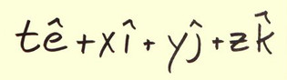
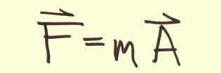
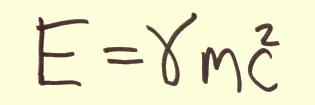
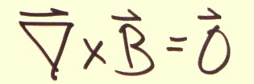

 

| [    Math ](Math/math.md) | [    Classical Physics ](Classical_physics/classical_physics.md) | 
| :---:   | :--:      | 
| [   **Special Relativity**](SR/special_relativity.md) | [    **Quaternion Gravity!** ](Gravity/gravity.md) | 
| [   **EM**](EM/em.md) | [   **Quantum**](QM/qm.md)|

